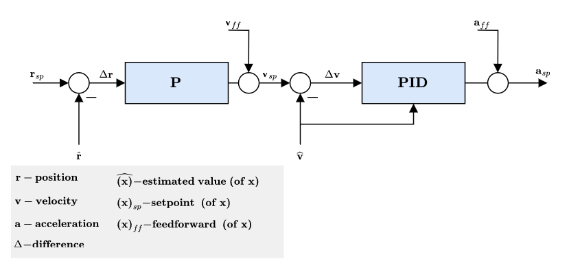

# Controller Diagrams

This section contains diagrams for the main PX4 controllers.

The diagrams use the standard [PX4 notation](../contribute/notation.md) (and each have an annotated legend).

<!--    The diagrams were created with LaTeX / TikZ.
        The code can be found in assets/diagrams/mc_control_arch_tikz.tex.
        The easiest way to generate the diagrams and edit them is to copy the code and paste it an Overleaf (www.overleaf.com/) document to see the output.
-->

## Multicopter Control Architecture

* This is a standard cascaded control architecture.
* The controllers are a mix of P and PID controllers.
* Estimates come from [EKF2](../advanced_config/tuning_the_ecl_ekf.md).
* Depending on the mode, the outer (position) loop is bypassed (shown as a multiplexer after the outer loop).
  The position loop is only used when holding position or when the requested velocity in an axis is null.

### Multicopter Angular Rate Controller

* K-PID controller. See [Rate Controller](../config_mc/pid_tuning_guide_multicopter.md#rate-controller) for more information.
* The integral authority is limited to prevent wind up.
* The outputs are limited (in the control allocation module), usually at -1 and 1.
* A Low Pass Filter (LPF) is used on the derivative path to reduce noise (the gyro driver provides a filtered derivative to the controller).

  ::: info
  The IMU pipeline is:
  gyro data > apply calibration parameters > remove estimated bias > notch filter (`IMU_GYRO_NF0_BW` and `IMU_GYRO_NF0_FRQ`) > low-pass filter (`IMU_GYRO_CUTOFF`) > vehicle_angular_velocity (*filtered angular rate used by the P and I controllers*) > derivative -> low-pass filter (`IMU_DGYRO_CUTOFF`) > vehicle_angular_acceleration (*filtered angular acceleration used by the D controller*)

  
  :::

  <!-- source for image is https://github.com/PX4/PX4-Autopilot/blob/850d0bc588af79186286652af4c8293daafd2c4c/src/lib/mixer/MultirotorMixer/MultirotorMixer.cpp#L323-L326 -->

### Multicopter Attitude Controller

* The attitude controller makes use of [quaternions](https://en.wikipedia.org/wiki/Quaternion).
* The controller is implemented from this [article](https://www.research-collection.ethz.ch/bitstream/handle/20.500.11850/154099/eth-7387-01.pdf).
* When tuning this controller, the only parameter of concern is the P gain.
* The rate command is saturated.

### Multicopter Acceleration to Thrust and Attitude Setpoint Conversion

* The acceleration setpoints generated by the velocity controller will be converted to thrust and attitude setpoints.
* Converted acceleration setpoints will be saturated and prioritized in vertical and horizontal thrust. 
* Thrust saturation is done after computing the corresponding thrust:
   1. Compute required vertical thrust (`thrust_z`)
   1. Saturate `thrust_z` with `MPC_THR_MAX`
   1. Saturate `thrust_xy` with `(MPC_THR_MAX^2 - thrust_z^2)^0.5`
   
Implementation details can be found in `PositionControl.cpp` and `ControlMath.cpp`.   

### Multicopter Velocity Controller

* PID controller to stabilise velocity. Commands an acceleration.
* The integrator includes an anti-reset windup (ARW) using a clamping method.
* The commanded acceleration is NOT saturated - a saturation will be applied to the converted thrust setpoints in combination with the maximum tilt angle. 
* Horizontal gains set via parameter `MPC_XY_VEL_P_ACC`, `MPC_XY_VEL_I_ACC` and `MPC_XY_VEL_D_ACC`.
* Vertical gains set via parameter `MPC_Z_VEL_P_ACC`, `MPC_Z_VEL_I_ACC` and `MPC_Z_VEL_D_ACC`.

### Multicopter Position Controller

* Simple P controller that commands a velocity. 
* The commanded velocity is saturated to keep the velocity in certain limits. See parameter `MPC_XY_VEL_MAX`. This parameter sets the maximum possible horizontal velocity. This differs from the maximum **desired** speed `MPC_XY_CRUISE` (autonomous modes) and `MPC_VEL_MANUAL` (manual position control mode).
* Horizontal P gain set via parameter `MPC_XY_P`.
* Vertical P gain set via parameter `MPC_Z_P`.
  

#### Combined Position and Velocity Controller Diagram

* Mode dependent feedforwards (ff) - e.g. Mission mode trajectory generator (jerk-limited trajectory) computes position, velocity and acceleration setpoints.
* Acceleration setpoints (inertial frame) will be transformed (with yaw setpoint) into attitude setpoints (quaternion) and collective thrust setpoint.

<!-- The drawing is on draw.io: https://drive.google.com/open?id=13Mzjks1KqBiZZQs15nDN0r0Y9gM_EjtX
Request access from dev team. -->
## Fixed-Wing Position Controller

### Total Energy Control System (TECS)

The PX4 implementation of the Total Energy Control System (TECS) enables simultaneous control of true airspeed and altitude of a fixed-wing aircraft.
The code is implemented as a library which is used in the fixed-wing position control module.

As seen in the diagram above, TECS receives as inputs airspeed and altitude setpoints and outputs a throttle and pitch angle setpoint.
These two outputs are sent to the fixed-wing attitude controller which implements the attitude control solution. However, the throttle setpoint is passed through if it is finite and if no engine failure was detected.
It's therefore important to understand that the performance of TECS is directly affected by the performance of the pitch control loop.
A poor tracking of airspeed and altitude is often caused by a poor tracking of the aircraft pitch angle.

::: info
Make sure to tune the attitude controller before attempting to tune TECS.
:::

Simultaneous control of true airspeed and height is not a trivial task.
Increasing aircraft pitch angle will cause an increase in height but also a decrease in airspeed.
Increasing the throttle will increase airspeed but also height will increase due to the increase in lift.
Therefore, we have two inputs (pitch angle and throttle) which both affect the two outputs (airspeed and altitude) which makes the control problem challenging.

TECS offers a solution by respresenting the problem in terms of energies rather than the original setpoints.
The total energy of an aircraft is the sum of kinetic and potential energy. Thrust (via throttle control) increases the total energy state of the aircraft. A given total energy state can be achieved by arbitrary combinations of potential and kinetic energies.
In other words, flying at a high altitude but at a slow speed can be equivalent to flying at a low altitude but at a faster airspeed in a total energy sense. We refer to this as the specific energy balance and it is calculated from the current altitude and true airspeed setpoint.
The specific energy balance is controlled via the aircraft pitch angle.
An increase in pitch angle transfers kinetic to potential energy and a negative pitch angle vice versa.
The control problem was therefore decoupled by transforming the initial setpoints into energy quantities which can be controlled independently.
We use thrust to regulate the specific total energy of the vehicle and pitch maintain a specific balance between potential (height) and kinetic (speed) energy.

#### Total energy control loop

<!-- https://drive.google.com/file/d/1q12b6ASbQRkFWqLMXm92cryOI-cZnrKv/view?usp=sharing -->

#### Total energy balance control loop

<!-- The drawing is on draw.io: https://drive.google.com/file/d/1bZtFULYmys-_EQNhC9MNcKLFauc7OYJZ/view -->

The total energy of an aircraft is the sum of kinetic and potential energy:

$$E_T = \frac{1}{2} m V_T^2 + m g h$$

Taking the derivative with respect to time leads to the total energy rate:

$$\dot{E_T} = m V_T \dot{V_T} + m g \dot{h}$$

From this, the specific energy rate can be formed as:

$$\dot{E} = \frac{\dot{E_T}}{mgV_T}  = \frac{\dot{V_T}}{g} + \frac{\dot{h}}{V_T} = \frac{\dot{V_T}}{g} + sin(\gamma)$$

where $\gamma{}$ is the flight plan angle.
For small $\gamma{}$ we can approximate this as:

$$\dot{E} \approx  \frac{\dot{V_T}}{g} + \gamma$$

From the dynamic equations of an aircraft we get the following relation:

$$T - D = mg(\frac{\dot{V_T}}{g} + sin(\gamma)) \approx mg(\frac{\dot{V_T}}{g} + \gamma)$$

where T and D are the thrust and drag forces.
In level flight, initial thrust is trimmed against the drag and a change in thrust results thus in:

$$\Delta T = mg(\frac{\dot{V_T}}{g} + \gamma)$$

As can be seen, $\Delta T{}$ is proportional to $\dot{E}{}$, and thus the thrust setpoint should be used for total energy control.

Elevator control on the other hand is energy conservative, and is thus used for exchanging potentional energy for kinetic energy and vice versa. To this end, a specific energy balance rate is defined as:

$$\dot{B} = \gamma - \frac{\dot{V_T}}{g}$$

## Fixed-Wing Attitude Controller

<!-- The drawing is on draw.io: https://drive.google.com/file/d/1ibxekmtc6Ljq60DvNMplgnnU-JOvKYLQ/view?usp=sharing
Request access from dev team. -->

The attitude controller works using a cascaded loop method.
The outer loop computes the error between the attitude setpoint and the estimated attitude that, multiplied by a gain (P controller), generates a rate setpoint.
The inner loop then computes the error in rates and uses a PI (proportional + integral) controller to generate the desired angular acceleration.

The angular position of the control effectors (ailerons, elevators, rudders, ...) is then computed using this desired angular acceleration and a priori knowledge of the system through control allocation (also known as mixing).
Furthermore, since the control surfaces are more effective at high speed and less effective at low speed, the controller - tuned for cruise speed - is scaled using the airspeed measurements (if such a sensor is used).

::: info
If no airspeed sensor is used then gain scheduling for the FW attitude controller is  disabled (it's open loop); no correction is/can be made in TECS using airspeed feedback.
:::

The feedforward gain is used to compensate for aerodynamic damping.
Basically, the two main components of body-axis moments on an aircraft are produced by the control surfaces (ailerons, elevators, rudders, - producing the motion) and the aerodynamic damping (proportional to the body rates - counteracting the motion).
In order to keep a constant rate, this damping can be compensated using feedforward in the rate loop.

### Turn coordination

The roll and pitch controllers have the same structure and the longitudinal and lateral dynamics are assumed to be uncoupled enough to work independently.
The yaw controller, however, generates its yaw rate setpoint using the turn coordination constraint in order to minimize lateral acceleration, generated when the aircraft is slipping.  The turn coordination algorithm is based solely on coordinated turn geometry calculation.

$$\dot{\Psi}_{sp} = \frac{g}{V_T} \tan{\phi_{sp}} \cos{\theta_{sp}}$$

The yaw rate controller also helps to counteract [adverse yaw effects](https://youtu.be/sNV_SDDxuWk) and to damp the [Dutch roll mode](https://en.wikipedia.org/wiki/Dutch_roll) by providing extra directional damping.

## VTOL Flight Controller

<!-- The drawing is on draw.io: https://drive.google.com/file/d/1tVpmFhLosYjAtVI46lfZkxBz_vTNi8VH/view?usp=sharing
Request access from dev team. -->

This section gives a short overview on the control structure of Vertical Take-off and Landing (VTOL) aircraft.
The VTOL flight controller consists of both the multicopter and fixed-wing controllers, either running separately in the corresponding VTOL modes, or together during transitions.
The diagram above presents a simplified control diagram.
Note the VTOL attitude controller block, which mainly facilitates the necessary switching and blending logic for the different VTOL modes, as well as VTOL-type-specific control actions during transitions (e.g. ramping up the pusher motor of a standard VTOL during forward transition).
The inputs into this block are called "virtual" as, depending on the current VTOL mode, some are ignored by the controller.

For a standard and tilt-rotor VTOL, during transition the fixed-wing attitude controller produces the rate setpoints, which are then fed into the separate rate controllers, resulting in torque commands for the multicopter and fixed-wing actuators.
For tailsitters, during transition the multicopter attitude controller is running.

The outputs of the VTOL attitude block are separate torque and force commands for the multicopter and fixed-wing actuators (two instances for `vehicle_torque_setpoint` and `vehicle_thrust_setpoint`). 
These are handled in an airframe-specific control allocation class.

For more information on the tuning of the transition logic inside the VTOL block, see [VTOL Configuration](../config_vtol/index.md).

### Airspeed Scaling

The objective of this section is to explain with the help of equations why and how the output of the rate PI and feedforward (FF) controllers can be scaled with airspeed to improve the control performance.
We will first present the simplified linear dimensional moment equation on the roll axis, then show the influence of airspeed on the direct moment generation and finally, the influence of airspeed during a constant roll.

As shown in the fixed-wing attitude controller above, the rate controllers produce angular acceleration setpoints for the control allocator (here named "mixer").
In order to generate these desired angular accelerations, the mixer produces torques using available aerodynamic control surfaces (e.g.: a standard airplane typically has two ailerons, two elevators and a rudder).
The torques generated by those control surfaces is highly influenced by the relative airspeed and the air density, or more precisely, by the dynamic pressure.
If no airspeed scaling is made, a controller tightly tuned for a certain cruise airspeed will make the aircraft oscillate at higher airspeed or will give bad tracking performance at low airspeed.

The reader should be aware of the difference between the [true airspeed (TAS)](https://en.wikipedia.org/wiki/True_airspeed) and the [indicated airspeed (IAS)](https://en.wikipedia.org/wiki/Indicated_airspeed) as their values are significantly different when not flying at sea level.

The definition of the dynamic pressure is

$$\bar{q} = \frac{1}{2} \rho V_T^2$$

where $\rho{}$ is the air density and $V_T{}$ the true airspeed (TAS).

Taking the roll axis for the rest of this section as an example, the dimensional roll moment can be written

$$\ell = \frac{1}{2}\rho V_T^2 S b C_\ell = \bar{q} S b C_\ell$$

where $\ell{}$ is the roll moment, $b{}$ the wing span and $S{}$ the reference surface.

The nondimensional roll moment derivative $C_\ell{}$ can be modeled using the aileron effectiveness derivative $C_{\ell_{\delta_a}}{}$, the roll damping derivative $C_{\ell_p}{}$ and the dihedral derivative $C_{\ell_\beta}{}$

$$C_\ell = C_{\ell_0} + C_{\ell_\beta}\:\beta + C_{\ell_p}\:\frac{b}{2V_T}\:p + C_{\ell_{\delta_a}} \:\delta_a$$

where $\beta{}$ is the sideslip angle, $p{}$ the body roll rate and $\delta_a{}$ the aileron deflection.

Assuming a symmetric ($C_{\ell_0} = 0{}$) and coordinated ($\beta = 0{}$) aircraft, the equation can be simplified using only the rollrate damping and the roll moment produced by the ailerons

$$\ell = \frac{1}{2}\rho V_T^2 S b \left [C_{\ell_{\delta_a}} \:\delta_a + C_{\ell_p}\:\frac{b}{2V_T} \: p \right ]$$

This final equation is then taken as a baseline for the two next subsections to determine the airspeed scaling expression required for the PI and the FF controllers.

#### Static torque (PI) scaling

At a zero rates condition ($p = 0{}$), the damping term vanishes and a constant - instantaneous - torque can be generated using:

$$\ell = \frac{1}{2}\rho V_T^2 S b \: C_{\ell_{\delta_a}} \:\delta_a = \bar{q} S b \: C_{\ell_{\delta_a}} \:\delta_a$$

Extracting $\delta_a{}$ gives

$$\delta_a = \frac{2bS}{C_{\ell_{\delta_a}}} \frac{1}{\rho V_T^2} \ell = \frac{bS}{C_{\ell_{\delta_a}}} \frac{1}{\bar{q}} \ell$$

where the first fraction is constant and the second one depends on the air density and the true airspeed squared.

Furthermore, instead of scaling with the air density and the TAS, it can be shown that the indicated airspeed (IAS, $V_I{}$) is inherently adjusted by the air density since at low altitude and speed, IAS can be converted to TAS using a simple density error factor

$$V_T = V_I \sqrt{\frac{\rho_0}{\rho}}$$

, where $\rho_o{}$ is the air density as sea level, 15°C.

Squaring, rearranging and adding a 1/2 factor to both sides makes the dynamic pressure $\bar{q}{}$ expression appear

$$\bar{q} = \frac{1}{2} \rho V_T^2 = \frac{1}{2} V_I^2 \rho_0$$

We can now easily see that the dynamic pressure is proportional to the IAS squared:

$$\bar{q} \propto V_I^2$$

The scaler previously containing TAS and the air density can finally be written using IAS only

$$\delta_a = \frac{2bS}{C_{\ell_{\delta_a}}\rho_0} \frac{1}{V_I^2} \ell$$

#### Rate (FF) scaling

The main use of the feedforward of the rate controller is to compensate for the natural rate damping.
Starting again from the baseline dimensional equation but this time, during a roll at constant speed, the torque produced by the ailerons should exactly compensate for the damping such as

$$- C_{\ell_{\delta_a}} \:\delta_a = C_{\ell_p} \frac{b}{2 V_T} \: p$$

Rearranging to extract the ideal ailerons deflection gives

$$\delta_a = -\frac{b \: C_{\ell_p}}{2 \: C_{\ell_{\delta_a}}} \frac{1}{V_T} \: p$$

The first fraction gives the value of the ideal feedforward and we can see that the scaling is linear to the TAS.
Note that the negative sign is then absorbed by the roll damping derivative which is also negative.

#### Conclusion

The output of the rate PI controller has to be scaled with the indicated airspeed (IAS) squared and the output of the rate feedforward (FF) has to be scaled with the true airspeed (TAS)

$$\delta_{a} = \frac{V_{I_0}^2}{V_I^2} \delta_{a_{PI}} + \frac{V_{T_0}}{V_T} \delta_{a_{FF}}$$

where $V_{I_0}{}$ and $V_{T_0}{}$ are the IAS and TAS at trim conditions.

Finally, since the actuator outputs are normalized and that the mixer and the servo blocks are assumed to be linear, we can rewrite this last equation as follows:

$$\dot{\mathbf{\omega}}_{sp}^b = \frac{V_{I_0}^2}{V_I^2} \dot{\mathbf{\omega}}_{sp_{PI}}^b + \frac{V_{T_0}}{V_T} \dot{\mathbf{\omega}}_{sp_{FF}}^b$$

and implement it directly in the rollrate, pitchrate and yawrate controllers.

In the case of airframes with controls performance that is not dependent directly on airspeed e.g. a rotorcraft like [autogyro](../frames_autogyro/index.md). There is possibility to disable airspeed scaling feature by [FW_ARSP_SCALE_EN](../advanced_config/parameter_reference.md#FW_ARSP_SCALE_EN) parameter.

#### Tuning recommendations

The beauty of this airspeed scaling algorithm is that it does not require any specific tuning.
However, the quality of the airspeed measurements directly influences its performance.

Furthermore, to get the largest stable flight envelope, one should tune the attitude controllers at an airspeed value centered between the stall speed and the maximum airspeed of the vehicle (e.g.: an airplane that can fly between 15 and 25m/s should be tuned at 20m/s).
This "tuning" airspeed should be set in the [FW_AIRSPD_TRIM](../advanced_config/parameter_reference.md#FW_AIRSPD_TRIM) parameter.
