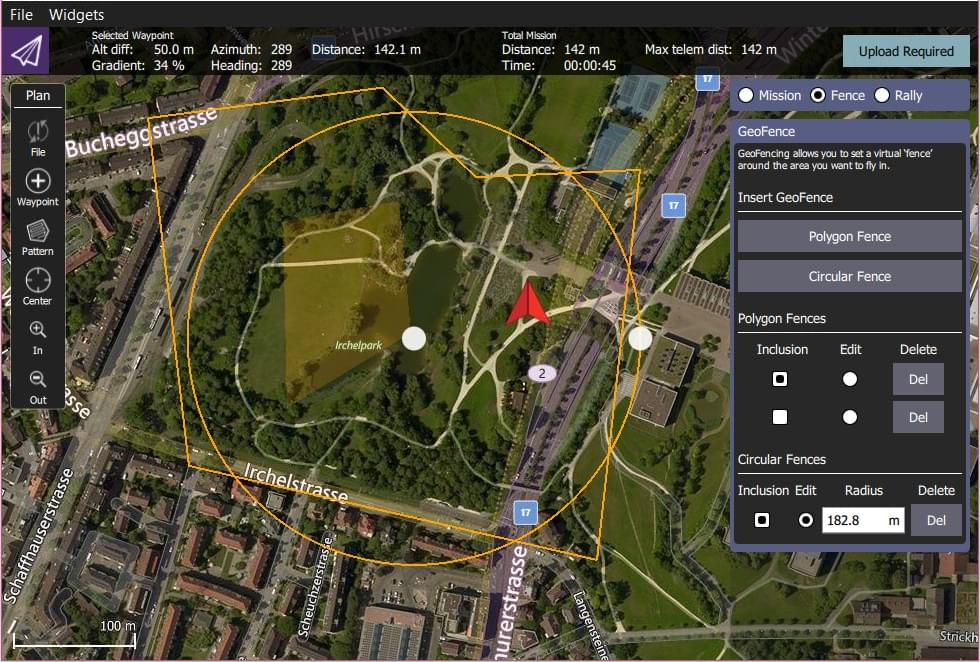

# Geofence

A Geofence is a virtual boundary that defines where a vehicle can travel.
GeoFences can be used to prevent a vehicle flying out of range of the RC controller, or into unsafe or restricted airspace.

PX4 provides two independent mechanisms for specify a geofence:

- A basic "failsafe" geofence that defines a simple cylinder.
- More complicated geometries can be defined using a Geofence Plan (_QGroundControl_).

::: info
GeoFences apply in all modes, including both missions and manual flight.
:::

## Failsafe Geofence

The [Geofence Failsafe](../config/safety.md#geofence-failsafe) defines a cylinder centered on the home position, with a specified maximum radius and altitude.

The settings also include a "failsafe action" in the event that the fence is breached.
This may simply be a warning notification, but more commonly a vehicle will immediately [Return](../flight_modes/return.md) to a safe location.

For more information see: [Safety > Geofence Failsafe](../config/safety.md#geofence-failsafe).

## Geofence Plan

PX4 supports complex Geofence boundaries made up of multiple circular and polygonal regions, which may be defined as either inclusion (fly within) or exclusion (fly outside) areas.

The Geofence is planned in _QGroundControl_ alongside the mission and rally points.

Geofence planning is fully documented in [Plan View > GeoFence](https://docs.qgroundcontrol.com/master/en/qgc-user-guide/plan_view/plan_geofence.html) (QGroundControl User Guide).

In summary:

1. Open _QGroundControl > Plan View_.
1. Select the _Plan Type_ radio button: **Fence**.
   This will display the _GeoFence Editor_.
   
1. Select the **Polygon Fence** or **Circular Fence** button to add a _basic_ fence of the desired type to the map.
   This also adds an entry for the type of fence in the editor.
1. Use the map to configure the shape and position of the fence.
   - The fence center marker can be used to move the fence to the correct position.
   - The marker on the border of a circular fence can be used to change the radius.
   - The markers on corners (vertices) can be used to change the geometry of a polygon.
     Additional vertices are created by clicking halfway along the lines between existing markers.
1. Use the _Geofence Editor_ to set a fence as an inclusion or exclusion, and to select a fence to edit (**Edit** radio button) or Delete (**Del** button).
1. Add as many fences as you like.
1. Once finished, click on the **Upload** button (top right) to send the fence (along with rally points and mission) to the vehicle.
1. Set the breach action in the [Geofence Failsafe](../config/safety.md#geofence-failsafe).

::: info
Any geofence that does not include the Home position will be rejected by the flight controller and not uploaded.
If the vehicle is flying, also any geofence that would immediately get breached after the upload is rejected.
:::

::: info
PX4 implements the MAVLink [Mission microservice](https://mavlink.io/en/services/mission.html), which includes support for GeoFences.
:::
