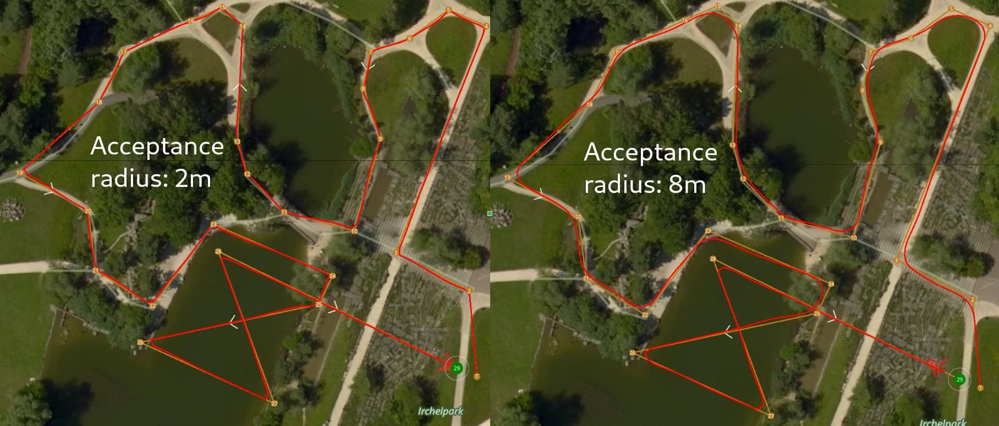
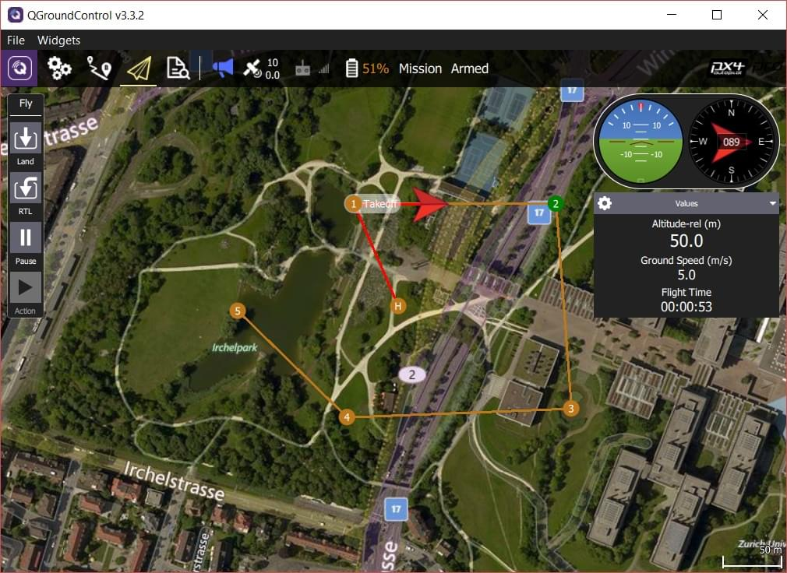

# Missions

A mission is a predefined flight plan, which can be planned in QGroundControl and uploaded to the flight controller, and then executed autonomously in [Mission mode](../flight_modes_mc/mission.md).

Missions typically include items for controlling taking off, flying a sequence of waypoints, capturing images and/or video, deploying cargo, and landing.
QGroundControl allows you to plan missions using a fully manual approach, or you can use its more advanced features to plan ground area surveys, corridor surveys, or structure surveys.

This topic provides an overview of how to plan and fly missions. 

## Planning Missions

Manually planning missions is straightforward:

- Switch to the mission view
- Select the **Add Waypoint** ("plus") icon in the top left.
- Click on the map to add waypoints.
- Use the waypoint list on the right to modify the waypoint parameters/type
  The altitude indicator on the bottom provides a sense of the relative altitude of each waypoint.
- Once finished, click on the **Upload** button (top right) to send the mission to the vehicle.

You can also use the _Pattern_ tool to automate creation of survey grids.

:::tip
For more information see the [QGroundControl User Guide](https://docs.qgroundcontrol.com/master/en/qgc-user-guide/plan_view/plan_view.html).
:::

### Mission Feasibility Checks

PX4 runs some basic sanity checks to determine if a mission is feasible.
For example, whether the mission is close enough to the vehicle, if the mission will conflict with a geofence, or if a mission landing pattern is required but is not present.

The checks are run when the mission is uploaded and immediately before it is run.
If any of the checks fail, the user is notified and it is not possible to start the mission.

For more detail on the checks and possible actions, see: [Mission Mode (FW) > Mission Feasibility Checks](../flight_modes_fw/mission.md#mission-feasibility-checks) and [Mission Mode (MC) > Mission Feasibility Checks](../flight_modes_mc/mission.md#mission-feasibility-checks).

### Setting Vehicle Yaw

If set, a multi-rotor vehicle will yaw to face the **Heading** value specified in the target waypoint (corresponding to [MAV_CMD_NAV_WAYPOINT.param4](https://mavlink.io/en/messages/common.html#MAV_CMD_NAV_WAYPOINT)).

If **Heading** has not been explicitly set for the target waypoint (`param4=NaN`) then the vehicle will yaw towards a location specified in the parameter [MPC_YAW_MODE](../advanced_config/parameter_reference.md#MPC_YAW_MODE).
By default this is the next waypoint.

Vehicle types that cannot independently control yaw and direction of travel will ignore yaw settings (e.g. Fixed-wing).

### Setting Acceptance/Turning Radius

The _acceptance radius_ defines the circle around a waypoint within which a vehicle considers it has reached the waypoint, and will immediately switch to (and start turning towards) the next waypoint.

For a multi-rotor drones, the acceptance radius is tuned using the parameter [NAV_ACC_RAD](../advanced_config/parameter_reference.md#NAV_ACC_RAD).
By default, the radius is small to ensure that multirotors pass above the waypoints, but it can be increased to create a smoother path such that the drone starts to turn before reaching the waypoint.

The image below shows the same mission flown with different acceptance radius parameters:

The speed in the turn is automatically computed based on the acceptance radius (= turning radius) and the maximum allowed acceleration and jerk (see [Jerk-limited Type Trajectory for Multicopters](../config_mc/mc_jerk_limited_type_trajectory.md#auto-mode)).

:::tip
For more information about the impact of the acceptance radius around the waypoint see: [Mission Mode > Inter-waypoint Trajectory](../flight_modes_fw/mission.md#rounded-turns-inter-waypoint-trajectory).
:::

### Package Delivery (Cargo) Missions

PX4 supports cargo delivery in missions using a gripper.

This kind of mission is planned in much the same as any other [waypoint mission](../flying/missions.md), with mission start, takeoff waypoint, various path waypoints, and possibly a return waypoint.
The only difference is that a package delivery mission must include a mission items to indicate how the package is released and the deployment mechanism.
For more information see: [Package Delivery Mission](../flying/package_delivery_mission.md).

## Flying Missions

Once the mission is uploaded, switch to the flight view.
The mission is displayed in a way that makes it easy to track progress (it cannot be modified in this view).

