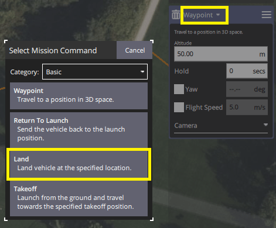
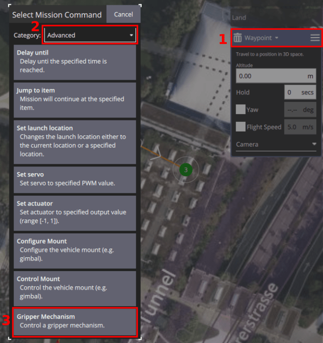
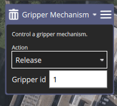
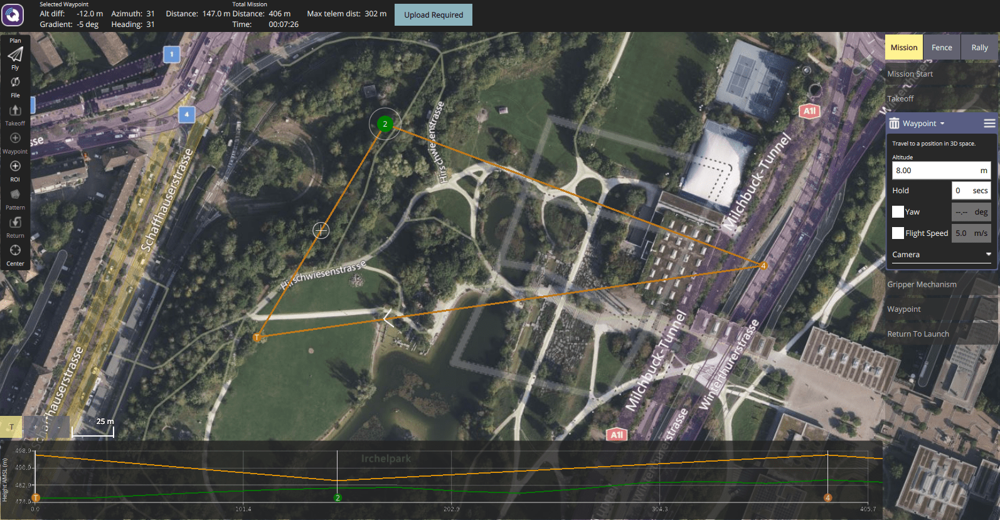
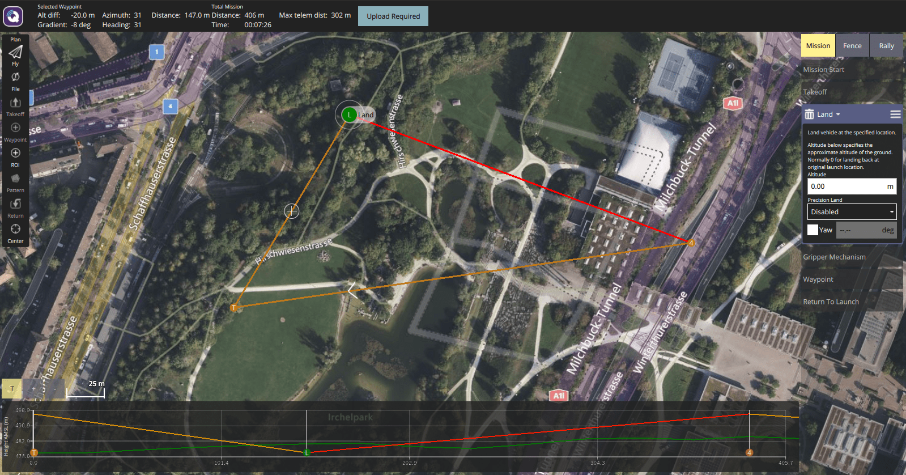

# Package Delivery Missions

A package delivery mission allows users to plan and execute cargo delivery using a [gripper](../peripherals/gripper.md).

::: info
This feature was added in PX4 v1.14 with support for Gripper (only).
Package delivery missions will be extended to support other cargo release hardware in future, including winches.
:::

## Delivery Mechanism Configuration

Package delivery missions require some configuration, which must be done before a mission can be planned and executed.

The configuration is largely hardware-specific, and is hence covered in the setup page for each type of package delivery hardware:

- [Gripper > Package Delivery Configuration](../peripherals/gripper.md#package-delivery-configuration)

## Mission Planning

A package delivery mission is planned in much the same as any other [waypoint mission](../flying/missions.md), with mission start, takeoff waypoint, various path waypoints, and possibly a return waypoint.
The only difference is that a package delivery mission must include a mission item that indicates whether the package should be released on the ground (`Land`) or in-air (`Waypoint`), followed by another mission item to deploy the package (`Gripper Mechanism`).

Whether or not you `Land` depends on whether the package can safely be deployed while flying, and if the vehicle is capable of landing at the deployment location.
Since a gripper cannot lower packages safely, multicopter and VTOL vehicles will often land to deploy packages when using a gripper.

After the deployment device [indicates completion](#package-release-feedback), the vehicle will proceed to the next waypoint.
Note that if landed, the next mission item after deployment should be another `Waypoint` or a `Takeoff` mission item ([it must not be a `RETURN`](#rtl-waypoint-for-package-delivery-with-landing).)

## Creating a Package Delivery Mission

To create a package delivery mission (with a Gripper):

1. Create a normal mission with a `Takeoff` mission item, and additional waypoints for your required flight path.
1. Add a waypoint on the map for where you'd like to release the package.

   - To drop the package while flying set an appropriate altitude for the waypoint (and ensure the waypoint is at a safe location to drop the package).

   - If you'd like to land the vehicle to make the delivery you will need to change the `Waypoint` to a `Land` mission item.
     Do this by selecting the mission item heading, then selecting `Land` in the popup dialog.

     

1. Add a waypoint on the map (anywhere) for the gripper release.
   To change this to a `Gripper Mechanism` select the "Waypoint" heading, and in the popup changing the group to "Advanced", then selecting `Gripper Mechanism`.

   

1. Configure the action for the gripper in the editor.

   

   - Set it to "Release" in order to release the package.
   - The gripper ID does not need to be set for now.

1. Add additional waypoints for the remainder of the path.
   If you landed, then remember that you must include a waypoint after the `Gripper Mechanism` before adding a `Return` mission item.

### Example Plans

#### Package Drop Mission

This shows a mission plan where the vehicle drops the package while flying.
The initial mission item is a waypoint and the action is a `Gripper Release` (shown in mission item list)

Note how the altitude graph shows the pre-waypoint as an in-air waypoint, also on the right panel.

#### Land and Release Mission

This shows a mission plan that where the vehicle lands to deliver the package.

Note how the altitude graph shows the `Land` item.

### Notes

#### RTL Waypoint for Package Delivery with Landing

Do not plan a mission with a delivery like this: `LAND` > `GRIPPER` > `RETURN TO LAUNCH`.

For safety reasons "Return To Launch" is disabled when vehicle is landed ([related issue](https://github.com/PX4/PX4-Autopilot/pull/20044)).
So if you land, release the cargo, then have an RTL waypoint, the vehicle will idle at the landing coordinate.

#### Manual Control of Gripper in Missions

A gripper can be [manually controlled using a joystick button](../peripherals/gripper.md#qgc-joystick-configuration) (if configured) in any mode, including during a mission.

Note however that if you manually command the gripper to close while a package delivery mission is opening the gripper, the gripper won't be able to finish the open action.
The mission will resume after the mission command timeout ([MIS_COMMAND_TOUT](../advanced_config/parameter_reference.md#MIS_COMMAND_TOUT)) expires, even if it has not released the package.

#### Auto-disarming is Disabled in Missions

Auto disarming is disabled by default when in mission.
This means that while landed for package delivery the vehicle will still be armed (and potentially dangerous!)

#### Package Release Feedback

The mission will proceed after a "package release" mission item (e.g. `GRIPPER`) completes.

Grippers and other delivery devices either use sensor feedback or a configurable timeout to indicate completion.
