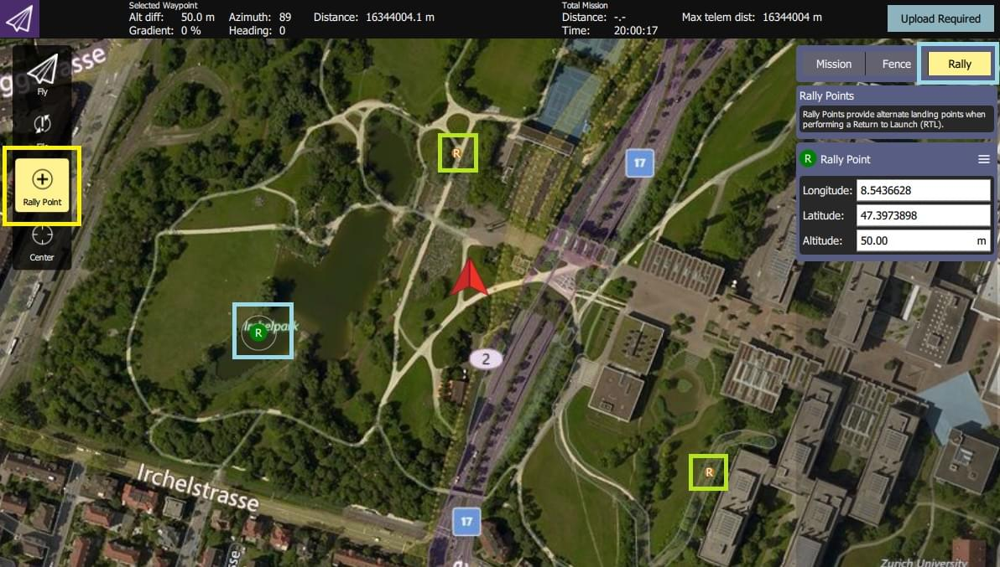

# Safety Points (Rally Points)

Safety points are alternative [Return Mode](../flight_modes/return.md) destinations/landing points.
When enabled, the vehicle will choose the _closest return destination_ of: home location, mission landing pattern or a _safety point_.

## Creating/Defining Safety Points

Safety points are created in _QGroundControl_ (which calls them "Rally Points").

At high level:

1. Open **QGroundControl > Plan View**
1. Select the **Rally** tab/button on the _Plan Editor_ (right of screen).
1. Select the **Rally Point** button on the toolbar (left of screen).
1. Click anywhere on the map to add a rally/safety point.
   - The _Plan Editor_ displays and lets you edit the current rally point (shown as a green **R** on the map).
   - You can select another rally point (shown as a more orange/yellow **R** on the map) to edit it instead.
1. Select the **Upload Required** button to upload the rally points (along with any [mission](../flying/missions.md) and [geofence](../flying/geofence.md)) to the vehicle.

:::tip
More complete documentation can be found in the _QGroundControl User Guide_: [Plan View - Rally Points](https://docs.qgroundcontrol.com/master/en/qgc-user-guide/plan_view/plan_rally_points.html).
:::

## Using Safety Points

Safety points are not enabled by default (there are a number of different [Return Mode Types](../flight_modes/return.md#return_types)).

To enable safety points, choose the return behaviour that matches your use case:

1. [Use the QGroundControl Parameter Editor](../advanced_config/parameters.md) to set [RTL_TYPE](../advanced_config/parameter_reference.md#RTL_TYPE).
1. Select the value that matches the desired behaviour:
   - `3`: Direct return to the closest destination among home, mission landing start, or safe point.
   - `5`: Direct return to a safe point only.
   - `6`: [Route Safe Point Return](../flight_modes/route_safe_point_return.md), which rejoins the uploaded mission route, follows it to the best projected safe-point branch-off, and only then leaves the route to land. If no safe point is usable, it falls back to the closer mission endpoint while staying in the route-based return logic.
