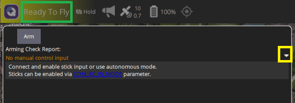

# QGroundControl Flight-Readiness Status

PX4 performs a number of preflight sensor quality and estimator checks to determine if, for example, there is a good enough position estimate to fly the vehicle in the current mode, and will block arming if the vehicle is not ready.

QGroundControl can be used to determine whether the vehicle is ready to fly, and more importantly what checks are failing.

::: tip
You can also get readiness notifications from the [vehicle status LEDs](../getting_started/led_meanings.md) and [warning tunes](../getting_started/tunes.md).
However QGC is the only way to determine the precise reasons why PX4 will not arm.
:::

## Flight Readiness Status

The overall "readiness to fly" is displayed in QGroundControl in the top left corner near the **Q** menu icon, as shown below:

The three states are:

- "Ready to Fly" (Green background): The vehicle is ready to fly in all modes, and can be armed.
- "Ready to Fly" (Amber background): The vehicle is ready to fly in the current mode and can be armed, but some check is failing that means it will not be able to switch to some other mode.
- "Not Ready" (Amber background): The vehicle is not ready to fly in the current mode, and cannot be armed.

## QGC Arming Check Report

<Badge type="tip" text="PX4 v1.14" /> <Badge type="tip" text="QGC v4.2.0" />

You can find out what prearming checks are failing using the QGroundControl [Arming Check Report](https://docs.qgroundcontrol.com/master/en/qgc-user-guide/fly_view/fly_view.html#arm) in _Fly View_.
To access this UI select the [Flight Readiness Status](#flight-readiness-status) indicator in the top left corner of QGroundControl's Fly View.

The Arming Check Report will then pop up and list all current warnings, with a toggle on the right of each warning that expands each entry with additional information and possible solutions.

Once each issue is resolved it will disappear from the UI. When all issues blocking arming have been removed you can use the arm button to display the arming confirmation slider, and arm the vehicle (or you can just take off).

::: tip
The QGC Arming Checks UI is available in the QGC Daily Build (QGC v4.2.0 and later), and works with PX4 v1.14 and later.
:::

## Flight Logs

Preflight errors are also reported in _QGroundControl_ as `PREFLIGHT FAIL` messages.
The `estimator_status.gps_check_fail_flags` message [in the logs](../getting_started/flight_reporting.md) shows which GPS quality checks are failing.

Note that the [Arming Check Report](#qgc-arming-check-report) is a much easier way to determine reasons for failure, but the logs may be useful in versions prior to PX4 v1.14.

## EKF Preflight Checks/Errors

This sections lists errors, with associated checks and parameters, that are reported by [EKF2](../advanced_config/tuning_the_ecl_ekf.md) (and propagate to _QGroundControl_).
These are provided for information only (the QGC Arming Checks UI is the best way to get error and solution information).

#### PREFLIGHT FAIL: EKF HIGH IMU ACCEL BIAS

<!-- https://github.com/PX4/PX4-Autopilot/blob/main/src/modules/commander/Arming/PreFlightCheck/checks/ekf2Check.cpp#L267 -->
<!-- Useful primer on biases: https://www.vectornav.com/resources/inertial-navigation-primer/specifications--and--error-budgets/specs-imuspecs -->
<!-- Mathieu Bresciani is expert -->

The EKF IMU acceleration bias is the difference between the measured acceleration reported by the IMU sensor and the expected acceleration reported by the EKF2 estimator (which fuses position and/or velocity data from a number of sources, including the IMU, GNSS, flow sensors etc.).
This bias may change when the sensor is turned on ("turn-on bias") and over time due to noise and temperature differences ("in-run bias").
The number should generally be very small (near zero), indicating that measurements from different sources all agree on the acceleration.

The warning indicates that the bias is higher than some arbitrary threshold (the vehicle will not be allowed to take off).
It is most likely a sign that accelerometer or thermal calibration are required:

- If you _sometimes_ get the warning: [re-calibrate the accelerometer](../config/accelerometer.md).
- If you get _regularly_ get the warning: Perform a [thermal calibration](../advanced_config/sensor_thermal_calibration.md).
- If you still get the warning after thermal calibration (or you can't perform thermal calibration):
  - Verify that the issues do not come from the sensor or autopilot hardware:
    - The easiest way to do this is to test the same frame/sensors with another autopilot.
    - Alternatively, [log and compare](../dev_log/logging.md#configuration) all accelerometers across a number of bench test runs with `6: Sensor comparison` enabled in [SDLOG_PROFILE](../advanced_config/parameter_reference.md#SDLOG_PROFILE).
  - Attempt to change the accelerometer bias learning tuning parameters.

Increasing the parameters will make the autopilot less likely to detect an anomaly and can modify the stability of the estimator.
However it may be required if there are problems with the sensor that cannot be fixed by other means (i.e you can tune the EKF for better performance, but there is no way you can calibrate the accelerometer "better").

:::warning
Tuning these parameters is a last resort.
It should only be attempted if you have data showing it will improve the performance of the estimator.
:::

| Parameter                                                                                                   | Description                                                                                                                                                                                                                                                                                                                                                                                                                                                                                                        |
| ----------------------------------------------------------------------------------------------------------- | ------------------------------------------------------------------------------------------------------------------------------------------------------------------------------------------------------------------------------------------------------------------------------------------------------------------------------------------------------------------------------------------------------------------------------------------------------------------------------------------------------------------ |
| [EKF2_ABL_LIM](../advanced_config/parameter_reference.md#EKF2_ABL_LIM)             | The maximum bias value that the EKF is allowed to estimate (above this value the bias will be clipped and EKF will attempt to reset itself, possibly even switching to a more healthy EKF with a working IMU in a multi-EKF system). The autopilot will report a "high accel bias" if the estimated bias exceeds 75% of this parameter during a preflight check and prevent takeoff. The current value of 0.4m/s2 is already quite high and increasing it would make the autopilot less likely to detect an issue. |
| [EKF2_ABIAS_INIT](../advanced_config/parameter_reference.md#EKF2_ABIAS_INIT)    | Initial bias uncertainty (if perfectly calibrated, this is related to the "turn-on bias" of the sensor). Some users might want to reduce that value if they know that the sensor is well calibrated and that the turn-on bias is small.                                                                                                                                                                                                                                                                            |
| [EKF2_ACC_B_NOISE](../advanced_config/parameter_reference.md#EKF2_ACC_B_NOISE) | The expected "in-run bias" of the accelerometer or "how fast do we expect the bias to change per second". By default, this value is large enough to include the drift due to a temperature change. If the IMU is temperature calibrated, the user might want to reduce this parameter.                                                                                                                                                                                                                             |
| [EKF2_ABL_ACCLIM](../advanced_config/parameter_reference.md#EKF2_ABL_ACCLIM)    | The maximum acceleration at which the estimator will try to learn an acceleration bias. This is to prevent the estimator from learning a bias due to non-linearity and scale factor errors. (Almost no user should need to change that parameter except if they really know what they are doing).                                                                                                                                                                                                                  |

#### PREFLIGHT FAIL: EKF HIGH IMU GYRO BIAS

- This error is produced when the IMU gyro bias estimated by the EKF is excessive.
- Excessive in this case means that the bias estimate exceeds 10deg/s (half the configured limit, which is hardcoded to 20deg/s).

#### PREFLIGHT FAIL: ACCEL SENSORS INCONSISTENT - CHECK CALIBRATION

- This error message is produced when the acceleration measurements from different IMU units are inconsistent.
- This check only applies to boards with more than one IMU.
- The check is controlled by the [COM_ARM_IMU_ACC](../advanced_config/parameter_reference.md#COM_ARM_IMU_ACC) parameter.

#### PREFLIGHT FAIL: GYRO SENSORS INCONSISTENT - CHECK CALIBRATION

- This error message is produced when the angular rate measurements from different IMU units are inconsistent.
- This check only applies to boards with more than one IMU.
- The check is controlled by the [COM_ARM_IMU_GYR](../advanced_config/parameter_reference.md#COM_ARM_IMU_GYR) parameter.

#### PREFLIGHT FAIL: COMPASS SENSORS INCONSISTENT - CHECK CALIBRATION

- This error message is produced when the difference in measurements from different compass sensors is too great.
- It indicates bad calibration, orientation or magnetic interference.
- This check only applies to when more than one compass/magnetometer is connected.
- The check is controlled by the [COM_ARM_MAG_ANG](../advanced_config/parameter_reference.md#COM_ARM_MAG_ANG) parameter.

#### PREFLIGHT FAIL: EKF INTERNAL CHECKS

- This error message is generated if the innovation magnitudes of either the horizontal GPS velocity, magnetic yaw, vertical GPS velocity or vertical position sensor (Baro by default but could be range finder or GPS if non-standard parameters are being used) are excessive. Innovations are the difference between the value predicted by the inertial navigation calculation and measured by the sensor.
- Users should check the innovation levels in the log file to determine the cause. These can be found under the `ekf2_innovations` message.
  Common problems/solutions include:
  - IMU drift on warmup. May be resolved by restarting the autopilot. May require an IMU accel and gyro calibration.
  - Adjacent magnetic interference combined with vehicle movement. Resolve my moving vehicle and waiting or re-powering.
  - Bad magnetometer calibration combined with vehicle movement. Resolve by recalibrating.
  - Initial shock or rapid movement on startup that caused a bad inertial nav solution. Resolve by restarting the vehicle and minimising movement for the first 5 seconds.

## Other Parameters

The following parameters also affect preflight checks.

#### COM_ARM_WO_GPS

The [COM_ARM_WO_GPS](../advanced_config/parameter_reference.md#COM_ARM_WO_GPS) parameter controls whether or not arming is allowed without a global position estimate.

- `1` (default): Arming _is_ allowed without a position estimate for flight modes that do not require position information (only).
- `0`: Arming is allowed only if EKF is providing a global position estimate and EFK GPS quality checks are passing
