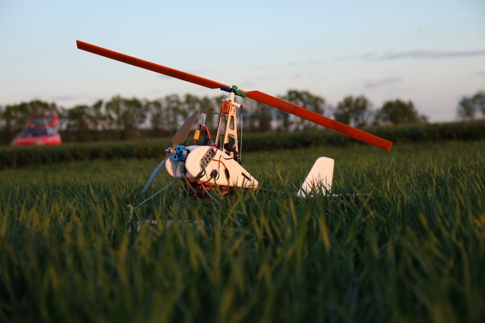
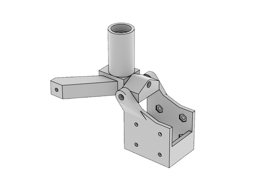
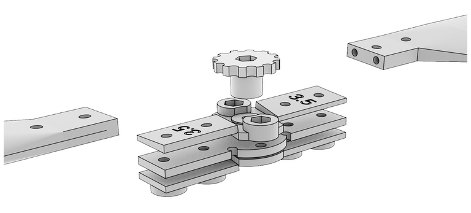
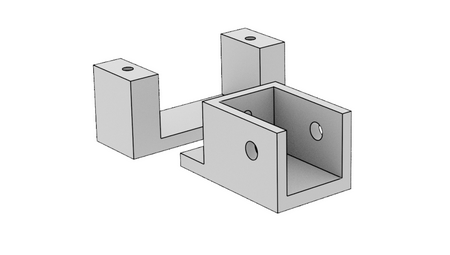
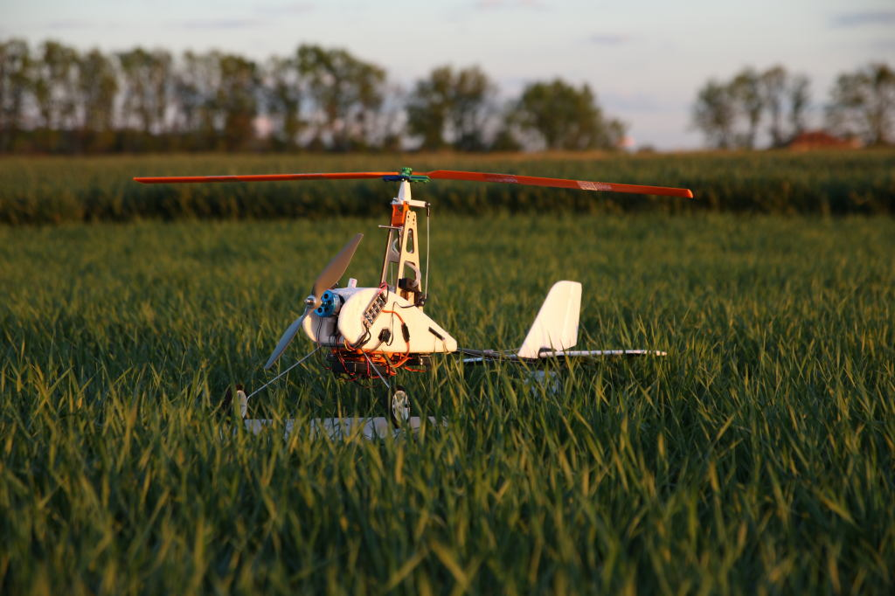
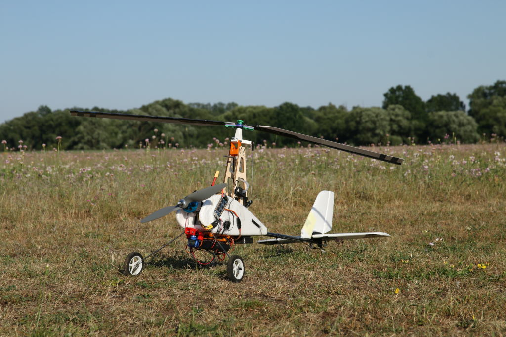
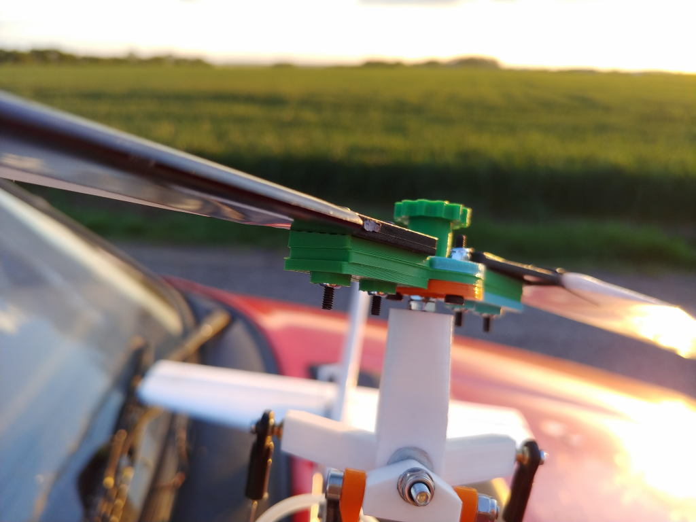
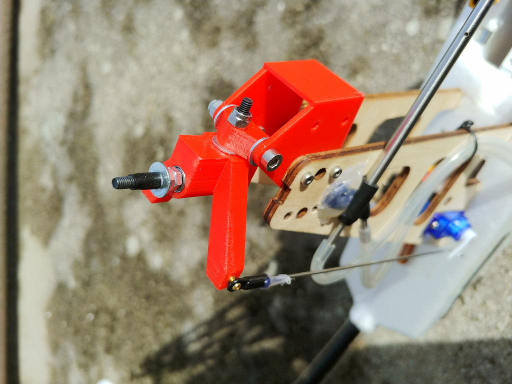

# ThunderFly Auto-G2 Autogyro

The *ThunderFly Auto-G2* is an autopilot-controlled autogyro based on the [
Durafly™ Auto-G2 Gyrocopter](https://hobbyking.com/en_us/duraflytm-auto-g2-gyrocopter-w-auto-start-system-821mm-pnf.html) RC model, with several parts of the original model substituted for 3D printable ones.

::: info
Auto-G2 autogyro’s airframe is developed and maintained by ThuderFly s.r.o. company.
:::

All the added parts are available on [GitHub](https://github.com/ThunderFly-aerospace/TF-G2/) as an open-source project.
Printed parts are designed in [OpenSCAD](https://www.openscad.org/).

## Modifications

Durafly Auto-G2, in its original design, has a three-blade rotor with 400 mm long blades with a CLARK-Y profile.
Rotor head allows tilting in the ROLL axis only.
Autogyro is controlled by a rudder and an elevator.
Durafly Auto-G2 autogyro box contains the autogyro polystyrene body, ESC, motor (probably 800kV), 4 servos, tail airfoils, 3 blades with rotor center parts, wire chassis and a prerotator.

Modification of the Durafly model are as follows:
* Addition of an autopilot
* Rotor head with two axes of freedom (pitch, roll)
* Two blade rotor with safely breakable rotor plate
* Larger landing gears

### Autopilot

The aircraft with all of the modifications is already quite heavy.
Therefore a low-weight flight controller is recommended (e.g. [Holybro pix32](../flight_controller/holybro_pix32.md) or [CUAV nano](../flight_controller/cuav_v5_nano.md)).

The autopilot should be mounted on the bottom side of the autogyro on a 3D printed damping pad.
We have used the damping platform found on [thingiverse](https://www.thingiverse.com/thing:160655)

### Rotor-head

The rotor head is (compared to the original autogyro) modified so it allows a motion in both roll and pitch axes.
Thanks to this, the rotor can control turning as well climbing of the autogyro.
Directional control of autogyro by rotor is possible even in case of low airspeed compared to the original rudder and elevator control.

The printed rotor head consists of three parts.
The bottom part is screwed using an M2.5 screw to the original plywood pylon.
An M3x35 screw found between the first and the second part creates the pitch axis freedom and the connection between the second and the third part the roll axis freedom.
The latter axis is made of an M3x30 screw with a screwed self-locking nut.
From the rotor side, the screw head has a large area washer.

Rotor axis, made of M3x50 high tensile strength screw, goes through the third part.
Bearings used are 623 2Z C3 SKF.
At the end of this part, there are ball rods attached via M2.5 screws to servos positioned in the bottom part of the pylon.
It is preferable to exchange these original servos for better quality ones as they are weak and in the original construction they help each other.

### Two-blade rotor

The original Durafly Auto-G2 autogyro has a three-blade rotor, which as been modified in this built to use a two-blade rotor.
The reasons are reduced vibration and easier construction.
Printed central parts are designed to be used both with Chinese Durafly blades or 3D printed blades.

The rotor's central part consists of several components which have following roles:
* They enable blade flapping.
* They have deformation zones that break upon impact with ground.
  Thanks to this, the rotor can usually be repaired quickly by replacing only one component.    
* Easy setup of blades angle-of-attack.

#### HobbyKing rotor blades

It is possible to use a printed central part of the rotor with the original blades.
These blades can be bought on [HobbyKing](https://hobbyking.com/en_us/duraflytm-auto-g-gyrocopter-821mm-replacement-main-blade-1pcs-bag.html).
Hobbyking blades differ in the position of center of gravity and it is therefore necessary to balance them properly.

#### 3D printed rotor blades

It is also possible to print rotor blades.

The printed rotor blads are still under development, but preliminary tests show they are of better quality mostly thanks to their precise shape and absence of longitudinal grooves.
However, some of the production processes still need to be tuned.

#### Balancing

Proper blades balance is very important to minimize vibrations.
Blades have to be balanced in such a way, that the center of gravity is located in the middle of the rotor axis.

Printed blades are balanced in the production process and there is no need to further balance them.

### Release device

If you want to launch an autogyro using a winch or if you want to launch it by towing you need to print a release device.
It is a small box equipped with servo which pulls out the pin and releases the rope.

The whole part is glued, using a hot-melt adhesive, under the engine on the bottom part of an autogyro’s body.
If an autogyro is towed by a rope its engine must not be turned on.
It can be handled, for example, by nulling the engine’s output in the transmitter if the release device switch is closed.

## Parts List

### Electronic

* Autopilot ([Holybro pix32](../flight_controller/holybro_pix32.md), [CUAV nano](../flight_controller/cuav_v5_nano.md))
* GPS (GPS Module NEO-6M, with patch antenna)
* Airspeed sensor ([SDP3x](https://www.sensirion.com/en/flow-sensors/differential-pressure-sensors/worlds-smallest-differential-pressure-sensor/))
* Stronger servos as a substitution for the original ones (optional), ([BlueBird BMS-125WV](https://www.blue-bird-model.com/products_detail/411.htm))
* Additional servo for release device (optional)

### Mechanical parts

* Rotor head Bearing (623 2Z C3)
* Propeller ([APC 10x7](https://www.apcprop.com/product/10x7e/))
* [Prop adapter](https://mpjet.com/shop/gb/prop-adapters/184-collet-prop-adapter-19-mm-4-mm-shaft-m629-standard.html)

### Printable parts

* Rotor head:
  * [Pylon end](https://github.com/ThunderFly-aerospace/Auto-G2/blob/master/CAD/stl/111_1001.stl)
  * [Pitch part](https://github.com/ThunderFly-aerospace/Auto-G2/blob/master/CAD/stl/111_1002.stl)
  * [Roll part](https://github.com/ThunderFly-aerospace/Auto-G2/blob/master/CAD/stl/111_1003.stl)

* Rotor:
  * [center part washer top](https://github.com/ThunderFly-aerospace/Auto-G2/blob/master/CAD/stl/111_1008.stl)
  * [center part washer bottom](https://github.com/ThunderFly-aerospace/Auto-G2/blob/master/CAD/stl/111_1004.stl)
  * [center plate with deformation zones](https://github.com/ThunderFly-aerospace/Auto-G2/blob/master/CAD/stl/888_1001.stl)
  * [washers for setting AoA of blades](https://github.com/ThunderFly-aerospace/Auto-G2/blob/master/CAD/stl/111_1005.stl)
  * [Rotor nut](https://github.com/ThunderFly-aerospace/Auto-G2/blob/master/CAD/stl/888_1002.stl)

* Rotor blades (optional)
* Autopilot holder
* [Release device](https://github.com/ThunderFly-aerospace/Auto-G2/blob/master/CAD/stl/888_1010.stl)
* [Front wheels](https://github.com/ThunderFly-aerospace/Auto-G2/blob/master/CAD/stl/888_1011.stl)

### Recommended spare parts

* Servos with improved quality (recommended [BlueBird BMS-125WV](https://www.blue-bird-model.com/products_detail/411.htm), original servos are not very durable))
* Propeller ([APC 10x7](https://www.apcprop.com/product/10x7e/))
* Rotor centre plate with deformation zones (3D printed)
* Rotor blades ([HobbyKing](https://hobbyking.com/en_us/duraflytm-auto-g-gyrocopter-821mm-replacement-main-blade-1pcs-bag.html) or 3D printed)

## Video

<lite-youtube videoid="YhXXSWz5wWs" title="[ThunderFly] 3D printed autogyro rotor"/>

## Photo gallery of changes

