# Holybro S500 V2 + Pixhawk 4 Build

This topic provides full instructions for building the kit and configuring PX4 using *QGroundControl*.

::: info
Holybro initially supplied this kit with a [Holybro Pixhawk 4](../flight_controller/pixhawk4.md), but at time of writing this has been upgraded to a more recent Pixhawk (6C).
This build log is still relevant as the kit assembly is virtually the same, and likely to remain so as the flight controller is upgraded.
:::

## Key information

- **Frame:** Holybro S500
- **Flight controller:** [Pixhawk 4](../flight_controller/pixhawk4.md)
- **Assembly time (approx.):** 90 minutes (45 minutes for frame, 45 minutes for autopilot installation/configuration)

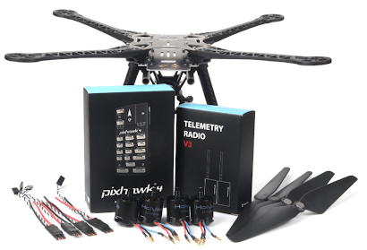

## Bill of materials

The Holybro [S500 V2 Kit](https://holybro.com/collections/s500/products/s500-v2-development-kit) includes almost all the required components:

* A recent Pixhawk autopilot
  - For this log it was Pixhawk 4 but far more recent versions are now included.
* Power Management PM02（Assembled）
* ARM adopts high strength plastics
* Motors - 2216 KV880（ V2 Update）
* Propeller 1045（ V2 Update）
* Pixhawk4 GPS
* Fully assembled Power Management Board with ESCs
* 433 MHz / 915 MHz [Holybro Telemetry Radio](../telemetry/holybro_sik_radio.md)
* Power and Radio Cables
* Battery Straps
* Dimensions:383*385*240mm
* Wheelbase:480mm

::: info
No LiPo battery is included. 
In addition, we use a FrSky Taranis controller.
:::

## Hardware

Item Description | Quantity
---|---
Wheelbase: 480mm              |   1
Arms                         |   4
Set of Landing Gear          |   2
M3*8 screws                  |   18
M2 5*6 screws                |   24
Battery Straps               |   1
Propeller 1045 (V2 Update)   |   1

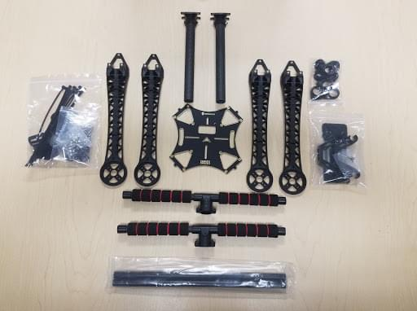

## Package
Items | Package
---|---
Pixhawk 4                           |  1
Pixhawk4 GPS MODULE                 |  1
I2C splitter Board                  |  2
6 to 6 pin cable (power)            |  3
4 to 4 pin cable (CAN)              |  2
6 to 4 pin cable (Data)             |  1
10 to 10 pin cable (PWM)            |  2
8 to 8 pin cable(AUX)               |  1
7 to 7 pin cable(SPI)               |  1
6 to 6 pin cable(Debug)             |  1
PPM/SBUS out cable                  |  1
XSR receiver cable                  |  1
DSMX receiver cable                 |  1
SBUS receiver cable                 |  1
USB cable                           |  1
'X'type folding pedestal mount      |  1
70mm & 140mm carbon rod standoff    |  2
6*3 2.54mm pitch Horizontal Pin     |  1
8*3 2.54mm pitch Horizontal Pin     |  2
Foam Set                            |  1
Pixhawk4 Quick Start Guide          |  1
Pixhawk4 Pinouts                    |  1
GPS Quick Start Guide               |  1

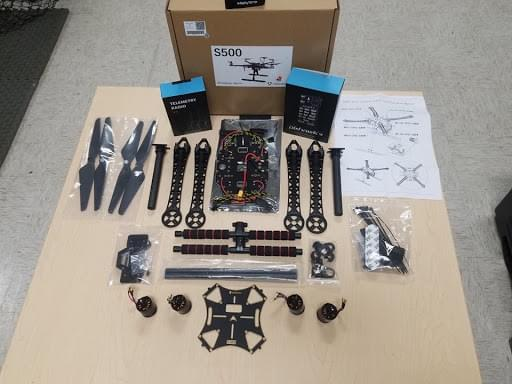

### Electronics
Item Description | Quantity
--- | --- 
Pixhawk 4 autopilot (PM06 not included)            |  1
Power Management PM02 (Assembled)                  |  1
Motors - 2216 KV880 (V2 Update)                    |  4
Pixhawk 4 GPS                                      |  1
Fully assembled Power Management Board with ESCs   |  1
433MHz Telemetry Radio / 915MHz Telemetry Radio    |  1

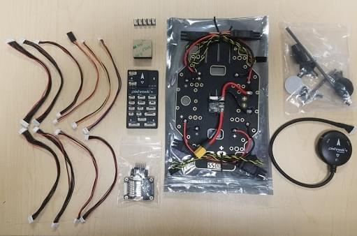

### Tools needed

The following tools are used in this assembly:

- 1.5 mm Hex screwdriver
- 2.0 mm Hex screwdriver
- 2.5 mm Hex screwdriver
- 3mm Phillips screwdriver
- Wire cutters
- Precision tweezers

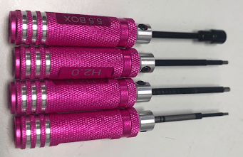

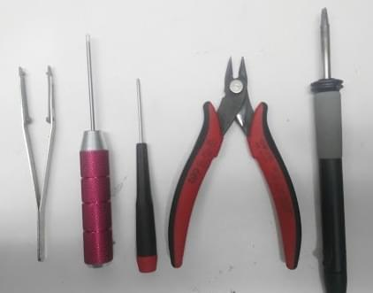

## Assembly

Estimate time to assemble is 90 minutes, about 45 minutes for frame assembly and 45 minutes installing and configuring the autopilot in QGroundControl.

1. Assembling the Landing Gear.
   We are going to start by assembling the landing gear to the vertical pole. Unscrew the landing gear screws and insert the vertical pole as shown below.

   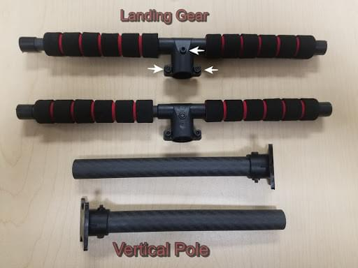

   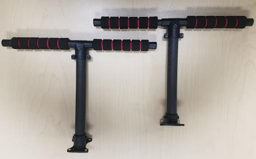

1. Assemble the Power Management Board to the landing gear. Screw the landing gear with a vertical pole to the Fully assembled Power Management Board.

  The Board has 4 holes (see arrows below).

  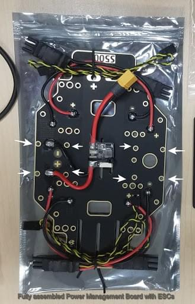

  Connect with the M3X8 screws, a total of 8 pieces, 4 on each side.
  
  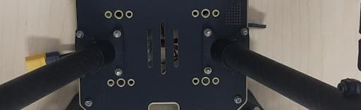

1. Assemble the arms to the Power Management Board.
   Attach the arm to the Power Management Board.

   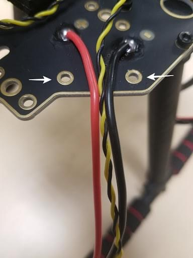

   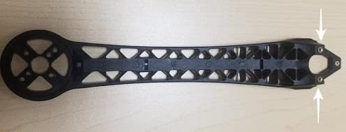

   Use M2 5X6 screws a total of 2 in each arm.
   Insert the screws from the bottom of the plate.

   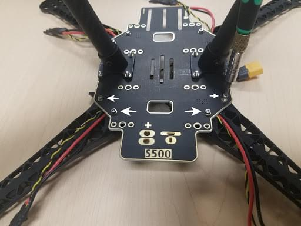

   Make sure the ESC cables run through the middle of the arm.

   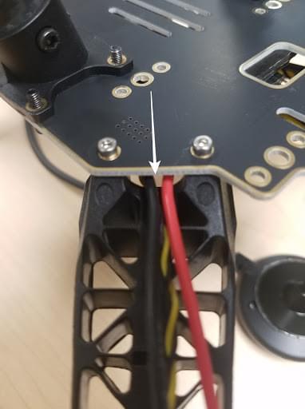

1. Assemble the 8*3 2.54mm pitch Horizontal Pin to the 10 to 10 pin cable (PWM) to the Power Management Board.
   Connect the 10 to 10 pin cable (PWM) to the 8*3 2.54mm pitch Horizontal Pin.

   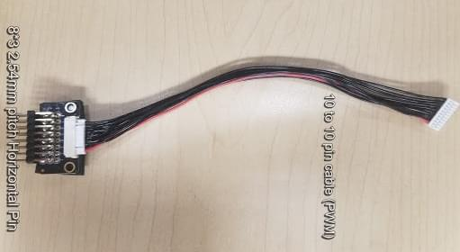

   Cut a piece of 3M Tape and attach to the bottom of the Horizontal Pin:

   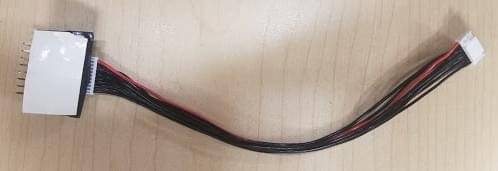

   Stick the Horizontal Pin to the Power Management Board:

   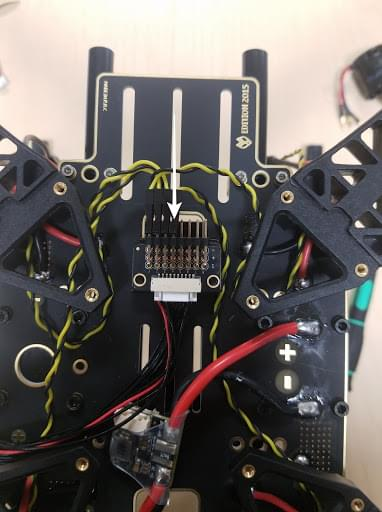

   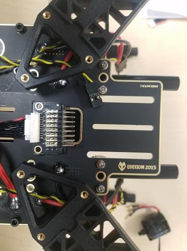

1. Assemble the motors to the arms. For this, we will need the 16 screws M3X7, 4 motors, and the 4 arms.

   Mount the motors in each arm put the screw through the bottom of the arm:

   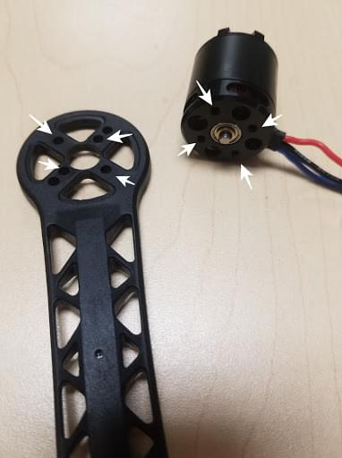

   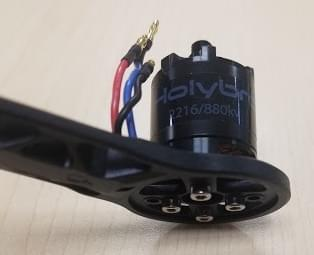

   After the 4 motors are mounted on the arm grab the cables(red, blue, black) and put them through the arm thread.
   The 3 cables that are color-coded go connected to the ESC. 

   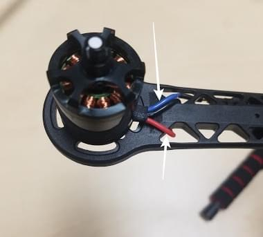

   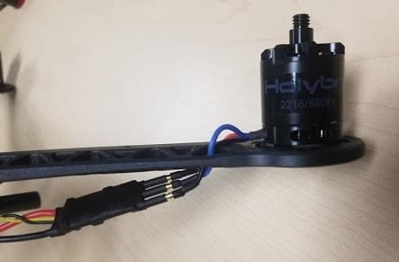

1. Mounting the GPS on the frame.
   For this, we will need the Pixhawk 4 GPS and the mounting plate.

   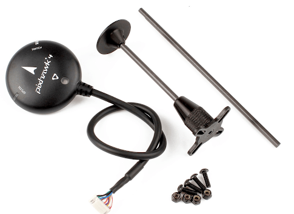

   Mount the GPS mast to the back of the Board, use the 4 screws:

   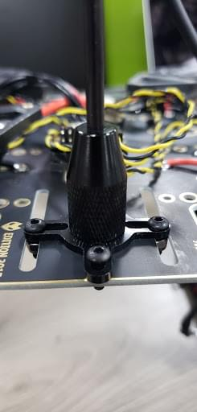

   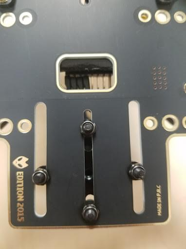

   Use the tape and stick the GPS to the top of the GPS mast:

   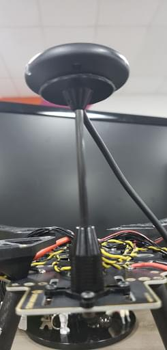

1. Paste the FrSky to the Board. Paste FrSky with double-sided tape (3M) to the bottom board.
   Attach the FrSky to the frame:

   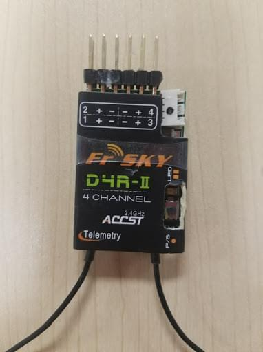

   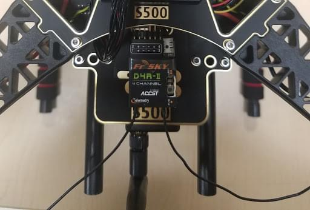

1. Attach the Telemetry to the frame.
   The next step is to take the Holybro telemetry radio and attach it onto the frame, use 3M tape.

   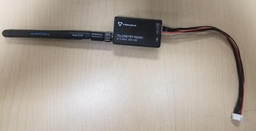

   

   This assembly attached it inside the frame facing outwards to the front of the vehicle.
   A picture is shown below of the radio sitting inside the bottom of the frame.

   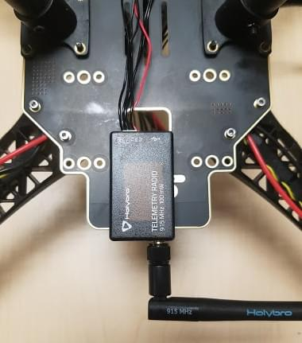

1. Mounting the Pixhawk 4 to the plate.
   Use double-sided tape to attach the Pixhawk 4 to the center plate:

   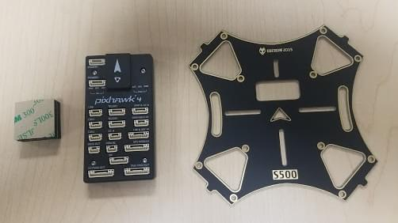

   

   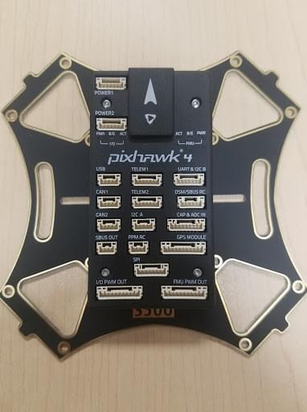

   The next step is to mount the Pixhawk 4 with the plate to the frame.
   For this, we will need the M2 5X6 screws.
   Align the plate to the frame and insert the screws.
   Before you mount the plate we recommend putting tape on the Power Module (that way it's tight).
   
   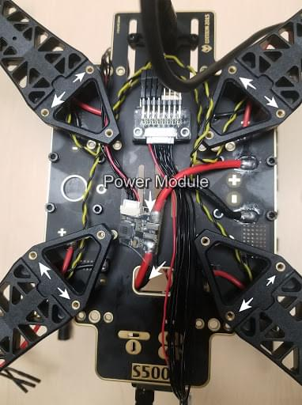

   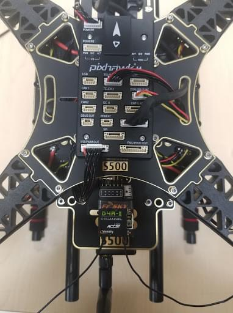

1. Assembling the Battery Mount to the frame.
   For this we will need the M2 5X6 screws and the battery mount:

   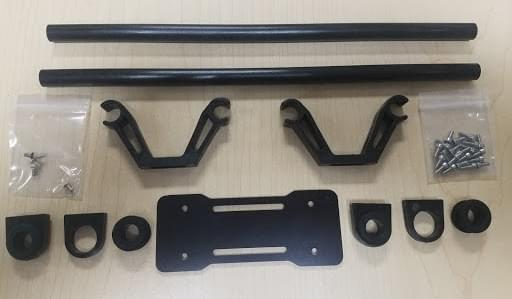

   Insert the long rods to the small rings:

   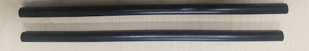

   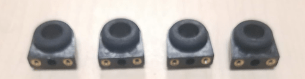

   Attach that to the frame, make sure all four sides are aligned to insert the screws:

   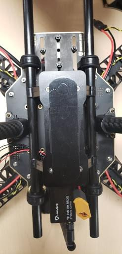

   Assemble the small plate to the legs and screw on all four sides.

   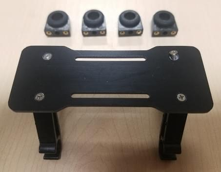

   The final step is to attach the plate:

   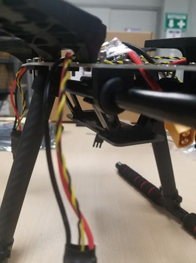

1. Pixhawk 4 wiring. The Pixhawk 4, which has several different wires and connections with it.
   Included below is a picture of every wire needed with the Pixhawk and how it looks when connected.

1. Plugin Telemetry and GPS module to the flight controller as seen in Figure 37; plug in the RC receiver, all 4 ESCs to the flight controller as well as the power module.

   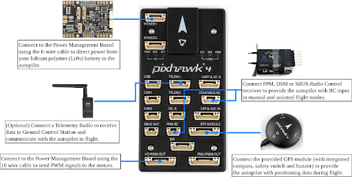

Fully assembled, the kit looks as shown below:

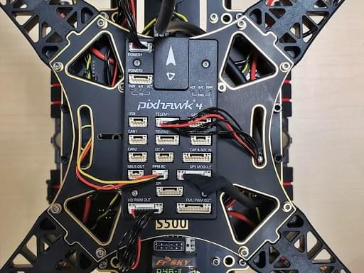

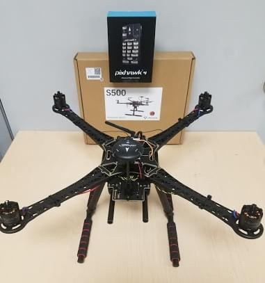

## PX4 Configuration

*QGroundControl* is used to install the PX4 autopilot and configure/tune it for the QAV250 frame.
[Download and install](http://qgroundcontrol.com/downloads/) *QGroundControl* for your platform.

:::tip
Full instructions for installing and configuring PX4 can be found in [Basic Configuration](../config/index.md).
:::

First update the firmware and airframe:

* [Firmware](../config/firmware.md)
* [Airframe](../config/airframe.md)

  You will need to select the *Holybro S500* airframe (**Quadrotor x > Holybro S500**).

  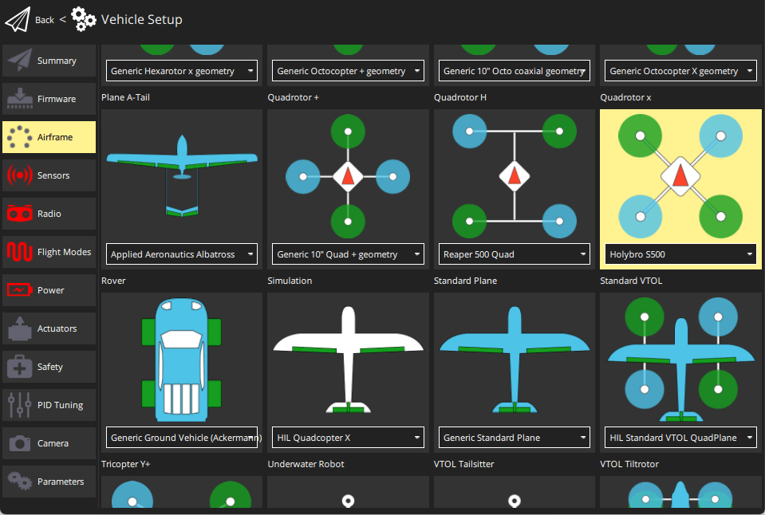

Then set the actuator outputs:

- [Actuators](../config/actuators.md)
  - You should not need to update the vehicle geometry (as this is a preconfigured airframe).
  - Assign actuator functions to outputs to match your wiring.
  - Test the configuration using the sliders.

Then perform the mandatory setup/calibration:

* [Sensor Orientation](../config/flight_controller_orientation.md)
* [Compass](../config/compass.md)
* [Accelerometer](../config/accelerometer.md)
* [Level Horizon Calibration](../config/level_horizon_calibration.md)
* [Radio Setup](../config/radio.md)
* [Flight Modes](../config/flight_mode.md)

Ideally you should also do:

* [ESC Calibration](../advanced_config/esc_calibration.md)
* [Battery Estimation Tuning](../config/battery.md)
* [Safety](../config/safety.md)

## Tuning

Airframe selection sets *default* autopilot parameters for the frame.
These are good enough to fly with, but it is a good idea to tune the parameters for a specific frame build.

For instructions on how, start from [Autotune](../config/autotune_mc.md).

## Acknowledgements

This build log was provided by the Dronecode Test Flight Team.
