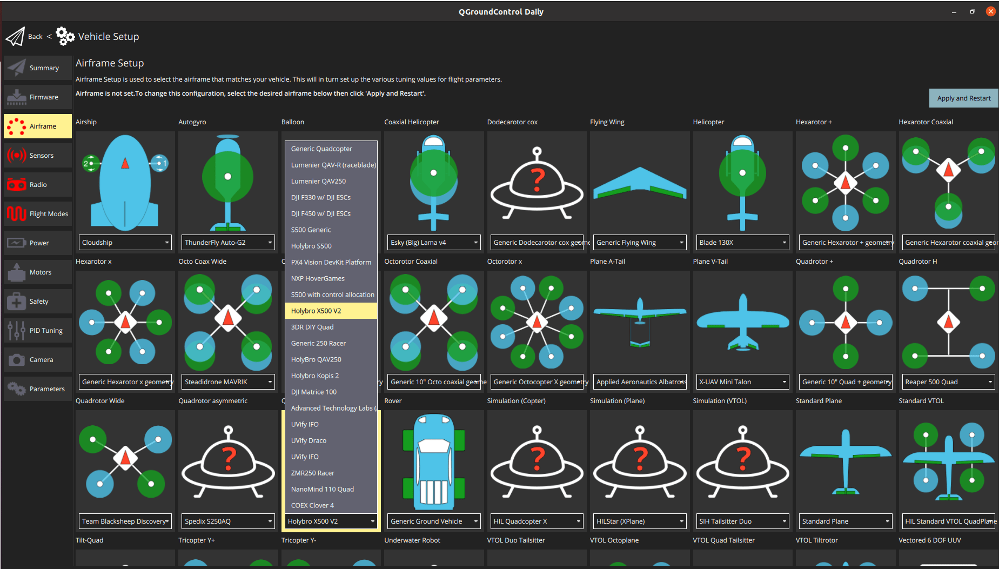

# Holybro X500 V2 + Pixhawk 6C (PX4 Dev Kit)

This topic provides full instructions for building the [Holybro X500 V2 ARF Kit](https://holybro.com/collections/x500-kits), also known as the Holybro PX4 Dev Kit.

## Assembly

::: info
- The images in this document can be selected to see a youtube video of the step.
- Each section lists any required screws at the top.
:::

### Payload and Battery Holder

**Screw**-  Sunk Screw M2.5*6 12pcs

1. Insert the hanger rubber ring gasket in each of their respective hangers.
   Do not use sharp objects to press the rubbers inside.

   

1. Take the battery mounting board and screw it with the slide bar clip using the Sunk Screw M2.5*6.

   

1. Screw 4 hangers to the Platform Board using Sunk Screw M2.5*6.

   )

1. Take the slide bar and insert 4 hangers to screw to the bottom plate later.

   )

1. Now insert the battery holder and payload holders assembled in step 2 & 3

### Power Module

**Screw**- Socket Cap Screw M2.5*6 8pcs | Locknut M3 4pcs |Nylon Standoff M3*5 4pcs | Screw M3*14 4pcs

   )

1. Take the bottom plate and insert 4 M3*14 screws and fasten the nylon standoffs on the same.

   

1. Place the Power distribution board and use the locknuts to assemble them. The power module PM02 (for Pixhawk 6C) would power this board

   

1. Use Socket Cap Screws M2.5*6 and screw the bottom plate on the 4 hangers (that we inserted in the 2 bars on the 3rd step of the payload holder assembly)

### Landing Gear

1. To assemble the landing gear, loosen the pre-assembled screws of the Landing Gear-Cross Bar and insert the Landing Gear-Vertical Pole and fasten the same.

   
   
   

1. Use the Socket Cap Screw M3*8 to screw the landing gears to the bottom plate

   

   

Because it’s cumbersome to insert the wires once the top plate is assembled, do the wiring beforehand.
Although the design is well built such that you can do this later as well.

### Power

The Pixhawk 6C gets powered by a power module PM02 (in this case).
This power module is supplied by a battery (4S 16.8V 5200 mAh)

The motors are powered through the power distribution board, as shown in the diagram below.

Note that the ESC connectors are color-coded and must be inserted in the PWM out such that the white cable faces up.

### Arms

**Screw-** Socket Cap Screw M3*38 16pcs | Flange Locknut M3 16pcs

1. Putting the arms is quite simple as the motors come pre-assembled.
   - Ensure that you have the right numbered arm with its motor on the respective side.

   

   :::tip
   Use your allen keys/ any elongated item and insert it on the opposite side of the bolt that you're trying to fasten.
   :::

1. Take one arm and insert the rectangle extrusion inside the rectangular hollow on the bottom plate.

   

1. While inserting the top plate on top of this the 3 piece assembly (bottom plate, top plate & arms) have to screwed using Socket Cap Screw M3*38 and Flange Locknut M3. 
1. Hold one side using the mini cross wrench provided in the developer kit.

   

1. Do not fasten any screws before all 3 motors are in place as this might make it difficult while you’re assembling the 3rd and 4th motor.

   

### Propellers

- The bottom plate indicates the direction of the motor.
- The propellers that have a white/silver coating go on that respective motor with the similar coat.
- The unlocking and locking of the propeller is indicated on the propeller itself.
- Use the 4 propellers and insert them on the motors keeping the above 3 points in mind.

The following parts can be placed as per usual.

### GPS

**Screw-** Locknut M3 4 pcs | Screw M3*10 4pcs

1. Assemble the GPS by following the video.

   
  
   This guide uses the GPS mount location suggested in Holybro’s guide.
1. Screw the GPS mount’s bottom end on the payload holder side using Locknut M3 & Screw M3*10

   

### Pixhawk 6C

- The wire from the PM02 goes to POWER1 in Pixhawk
- The telemetry goes to TELEM1
- The GPS to GPS1

### Companion Computer (Optional)

**Screw-** Socket Cap Screw M2.5*12 4pcs | Nylon Standoff M2.5*5 4pcs Locknut M2.5 4pcs

The X500 kit is provides space for a companion computer, such as Raspberry Pi or Jetson nano can be placed here [TBD].
- Insert 4 Socket Cap Screw M2.5*12 and put the standoffs on the same.
- Now place the companion computer and assemble it using Locknut M2.5

### Camera

- Cameras such as Intel Realsense depth/ tracking camera or Structure Core can be mounted using the Depth Camera Mount
- Simply insert the mount inside the 2 bars and use the screws according to the camera you’re using.

## Install/Configure PX4

:::tip
Full instructions for installing and configuring PX4 can be found in [Basic Configuration](../config/index.md).
:::

*QGroundControl* is used to install the PX4 autopilot and configure/tune it for the X500 frame.
[Download and install](http://qgroundcontrol.com/downloads/) *QGroundControl* for your platform.

First update the firmware, airframe, and actuator mappings:

- [Firmware](../config/firmware.md)
- [Airframe](../config/airframe.md)

  You will need to select the *Holybro X500 V2* airframe (**Quadrotor x > Holybro 500 V2**)

  

- [Actuators](../config/actuators.md)
  - You should not need to update the vehicle geometry (as this is a preconfigured airframe).
  - Assign actuator functions to outputs to match your wiring.
    The airframe is preconfigured with the motors on the **FMU PWM Out**.
  - Test the configuration using the sliders.

Then perform the mandatory setup/calibration:

- [Sensor Orientation](../config/flight_controller_orientation.md)
- [Compass](../config/compass.md)
- [Accelerometer](../config/accelerometer.md)
- [Level Horizon Calibration](../config/level_horizon_calibration.md)
- [Radio Setup](../config/radio.md)
- [Flight Modes](../config/flight_mode.md)

Ideally you should also do:

- [ESC Calibration](../advanced_config/esc_calibration.md)
- [Battery Estimation Tuning](../config/battery.md)
- [Safety](../config/safety.md)

## Tuning

Airframe selection sets *default* autopilot parameters for the frame.
These are good enough to fly with, but it is a good idea to tune the parameters for a specific frame build.

For instructions on how, start from [Auto-tune](../config/autotune_mc.md).

## Acknowledgements

This build log was contributed by Akshata and Hamish Willee with many thanks to Holybro and Dronecode for Hardware and technical support.