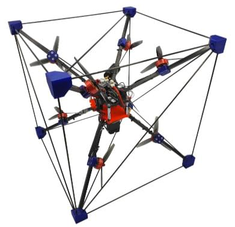
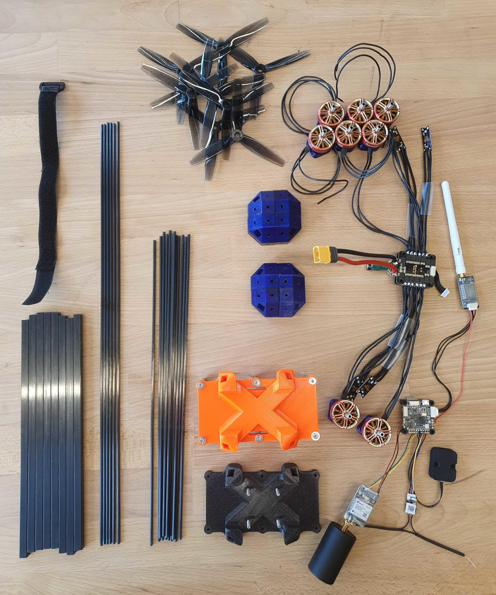
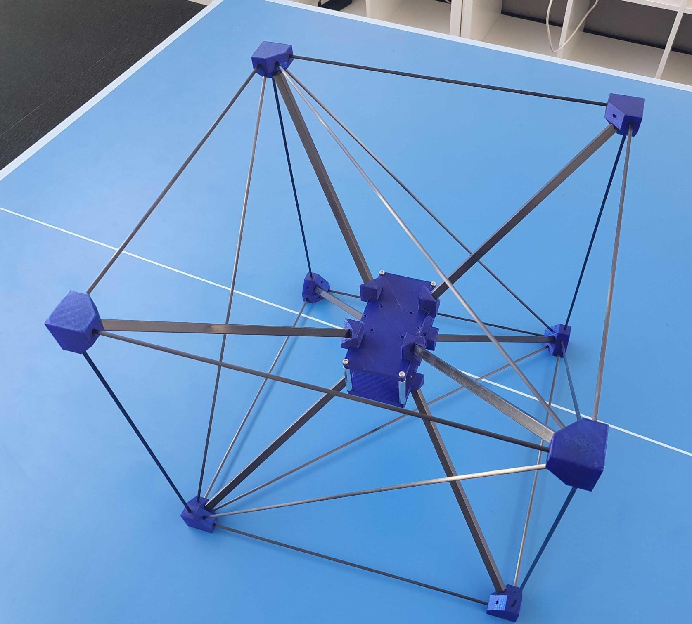
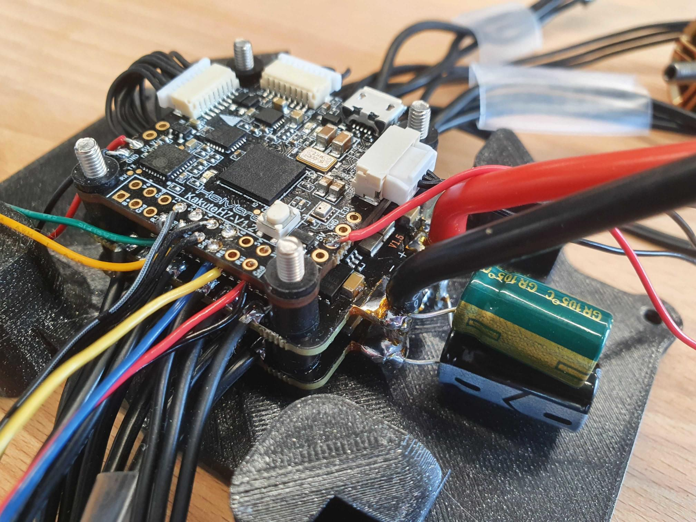
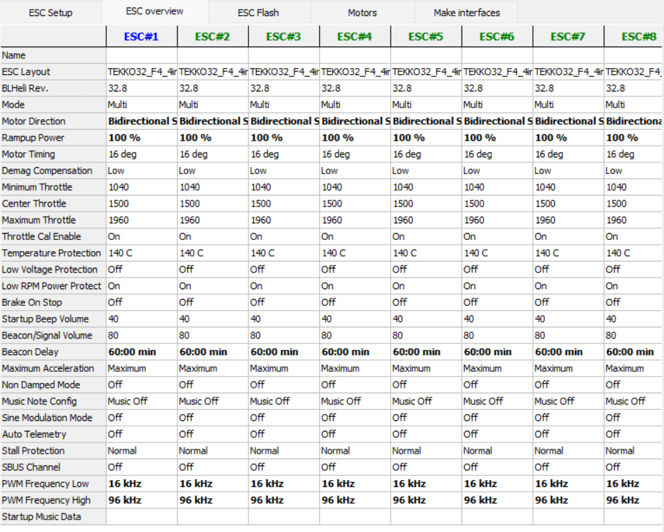
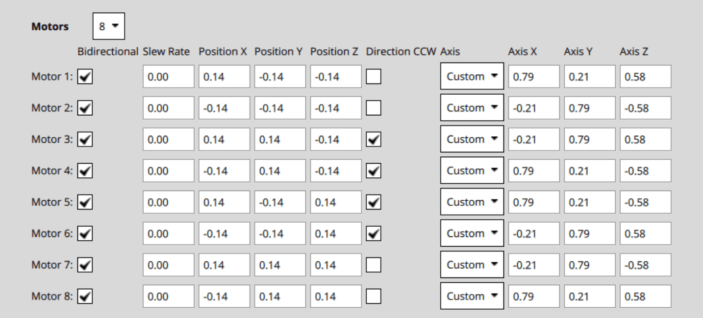
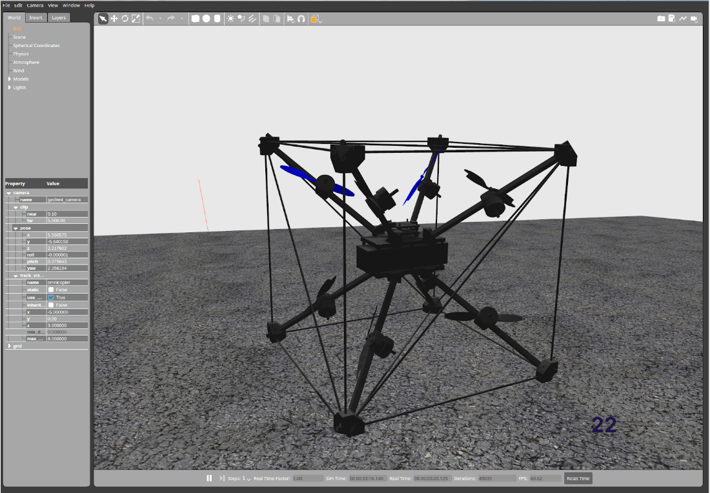

# Omnicopter

An Omnicopter is a multicopter that can provide thrust in all directions (6 degrees of freedom).
This allows it to move in any direction without having to tilt, and it can hover at an arbitrary tilt angle.
All of this is achieved by arranging the motor positions and thrust axis in specific ways:



This build follows the original design from [Brescianini, Dario, and Raffaello D'Andrea](https://www.youtube.com/watch?v=sIi80LMLJSY).

## Bill of Materials

The components needed for this build are:

- Electronics:
  - Flight controller: [Holybro KakuteH7](../flight_controller/kakuteh7.md)
  - Coupled with 2x [Tekko32 F4 4in1 ESCs](https://holybro.com/products/tekko32-f4-4in1-50a-esc)
   ::: info
   You can select your own flight controller of choice, it just needs to support 8 DShot outputs.
   :::
  - GPS: [ZED-F9P](https://www.gnss.store/gnss-gps-modules/105-ublox-zed-f9p-rtk-gnss-receiver-board-with-sma-base-or-rover.html?search_query=ZED-F9P&results=11)
  - [GPS helix antenna](https://www.gnss.store/rf-gps-antennas/28-high-performance-multi-band-gnss-active-quad-helix-antenna-for-rtk.html)
   ::: info
   Any other GPS may work as well, however a helix antenna is expected to perform better for inverted flights.
   :::
  - Any RC receiver
  - An external Magnetometer. We used the [RM-3100](https://store-drotek.com/893-professional-grade-magnetometer-rm3100.html).
  - Telemetry link, e.g. [WiFi](../telemetry/telemetry_wifi.md)
- Propulsion:
  - Motors: 8x [BrotherHobby LPD 2306.5 2000KV/2450KV/2650KV](https://www.getfpv.com/brotherhobby-lpd-2306-5-2000kv-2450kv-2650kv-motor.html)
  - 3D Propellers: 2x [HQProp 3D 5X3.5X3 3-Blade Propeller (Set of 4)](https://www.getfpv.com/hqprop-3d-5x3-5x3-3-blade-propeller-set-of-4.html) or 2x [Gemfan 513D 3-Blade 3D Propeller (Set of 4)](https://www.getfpv.com/gemfan-513d-durable-3-blade-propeller-set-of-4.html)
  - Battery: we used a 6S 3300mAh LiPo. Make sure to check the dimensions so it fits the frame.
  - Battery strap
- Frame:
  - Carbon square tube R 8mm X 7mm X 1000mm, e.g. [here](https://shop.swiss-composite.ch/pi/Halbfabrikate/Rohre/Vierkant-Rohre/CFK-Vierkantrohr-8x8-7x7mm.html)
  - Carbon Rods R 3mm X 2mm X 1000mm, e.g. [here](https://shop.swiss-composite.ch/pi/Halbfabrikate/Rohre/CFK-Rohre-pultrudiert-pullwinding/Carbon-Microtubes-100cm-x-20-3mm.html)
  - Required lengths:
    - square tube: 8 pieces with length of 248mm
    - rods: 12x328mm, 6x465mm
  - Screws:
    - Motors and standoffs: 40x M3x12mm
	- FC mount: 4x M3x35mm, 4x M3 nuts
  - Standoffs: 4x 40mm
- [3D model](https://cad.onshape.com/documents/eaff30985f1298dc6ce8ce13/w/2f662e604240c4082682e5e3/e/ad2b2245b73393cf369132f7)



## Assembly

### Frame

- Print the 3D parts
  ::: info
  The orientation of the corner pieces matters.
  You will notice if it's wrong when the angles of the rods are not correct.
  :::
- Cut the rods
- Test that it all works by connecting the frame pieces together:

  
- Place the motors as far out as possible, without the propellers touching the rods.

### Electronics

Solder the peripherals to the flight controller. We used the following assignments:
- ESCs: the 2 ESCs can be connected directly to the two connectors of the KakuteH7.
  To avoid conflicts we removed the power pin (right-most pin) from one of the connectors.
- Telemetry to UART1
- GPS to UART4
- RC to UART6


Remarks:

- Make sure the magnetometer is placed away from power.
  We ended up placing it to the bottom of the center-piece with a 4cm padding styrofoam.
- Put some tape on the barometer (without taping the opening!) to avoid any influence from light.
- We did not glue the frame.
  It is certainly advisible to do so after initial test flights, but it might work without.


## Software Configuration

### ESC

First, configure the ESCs to 3D mode (bidirectional).
We had issues with the stock ESC settings in 3D mode: when trying to switch direction, a motor sometimes did not start anymore until the ESC was rebooted.
So we had to change ESC settings.

To do so, you can use Betaflight on the flight controller and then use pass-through mode and the BL Heli suite (make sure there is an airframe with 8 motors configured in Betaflight).
These are the settings:



In particular:
- set the Motor Direction to **Bidirectional Soft**
- increase the Rampup Power to **100%** (this is conservative and might reduce efficiency)

::: info
Make sure the motors do not overheat with the changed settings.
:::

### PX4

- Select a generic multicopter airframe
- Use an [arming switch](../advanced_config/prearm_arm_disarm.md#arming-button-switch), do not use stick arming
- [Select DShot](../config/actuators.md) as output protocol on all eight outputs
- Configure the motors according to this:
  
  We used the following convention: the motors are facing the direction of where the axis points to.
  The spinning direction matches the direction of positive thrust (moving the motor slider up).
  Make sure to use the right props, as there is a CCW and a CW version.
- Parameters:
  - Change the desaturation logic for better attitude tracking: set [CA_METHOD](../advanced_config/parameter_reference.md#CA_METHOD) to 0.
  - Disable failure detection: set [FD_FAIL_P](../advanced_config/parameter_reference.md#FD_FAIL_P) and [FD_FAIL_R](../advanced_config/parameter_reference.md#FD_FAIL_R) to 0.
- [This file](https://github.com/PX4/PX4-user_guide/raw/main/assets/airframes/multicopter/omnicopter/omnicopter.params) contains all the relevant parameters.

## Video

<lite-youtube videoid="nsPkQYugfzs" title="PX4 Based Omnicopter Using the New Dynamic Control Allocation in v1.13"/>

## Simulation

There is an omnicopter simulation target in Gazebo Classic:

```sh
make px4_sitl gazebo-classic_omnicopter
```


## Remarks

Some general remarks:

- The hover throttle is about 30%.
- The flight time is around 4-5min. This could probably be improved a bit by using larger propellers.
