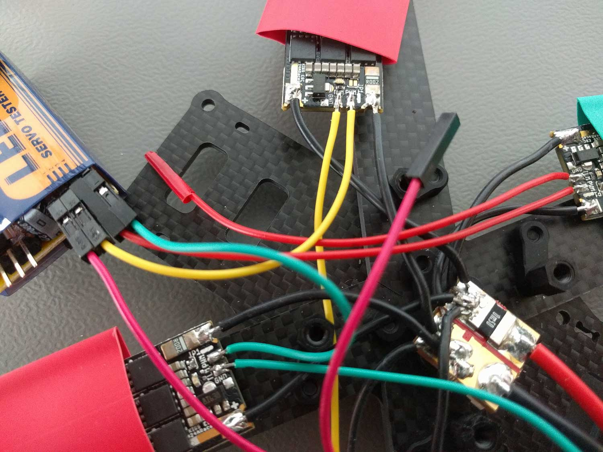
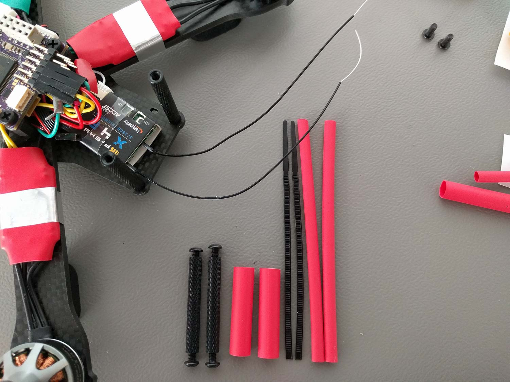
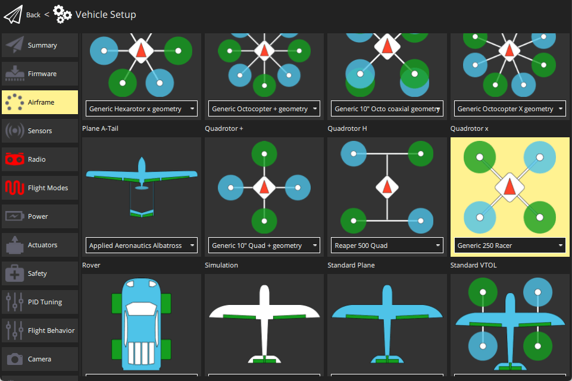

# Lumenier QAV-R 5" Racer (Pixracer)

The Lumenier QAV-R 5" FPV Racing Quadcopter is a rigid, light, and fast FPV racer with removable arms.
This topic provides full build and configuration instructions for using the frame with the *Pixracer* flight controller and *KISS 24A Race Edition* ESCs.
It also provides information on the (optional) FPV setup.

Key information:

- **Frame:** [Lumenier QAV-R 5"](http://www.getfpv.com/qav-r-fpv-racing-quadcopter-5.html)
- **Flight controller:** [Pixracer](../flight_controller/pixracer.md)

<lite-youtube videoid="wMYgqvsNEwQ" title="QAV-R 5 PX4 FPV Racequad"/>

## Parts List

### Vehicle (needed for flying)

* Autopilot: [Pixracer](../flight_controller/pixracer.md) from [AUAV](https://store.mrobotics.io/mRo-PixRacer-R14-Official-p/auav-pxrcr-r14-mr.htm) including ESP8266  WiFi- and [ACSP5](https://store.mrobotics.io/product-p/auav-acsp5-mr.htm)  power-module
* Frame:  [Lumenier QAV-R 5"](http://www.getfpv.com/qav-r-fpv-racing-quadcopter-5.html)
* Motors:  [Lumenier RX2206-11 2350KV](http://www.getfpv.com/lumenier-rx2206-11-2350kv-motor.html)
* ESCs:  [KISS 24A Race Edition](http://www.getfpv.com/kiss-24a-esc-race-edition-32bit-brushless-motor-ctrl.html)
* Props: HQProp 5x4.5x3 [CW](http://www.getfpv.com/hqprop-5x4-5x3rg-cw-propeller-3-blade-2-pack-green-nylon-glass-fiber.html) [CCW](http://www.getfpv.com/hqprop-5x4-5x3g-ccw-propeller-3-blade-2-pack-green-nylon-glass-fiber.html)
* GPS / Ext. Mag.: M8N taken from a [Pixhawk Mini (Discontinued)](../flight_controller/pixhawk_mini.md) set and rewired
* Battery: [TATTU 1800mAh 4s 75c Lipo](http://www.getfpv.com/tattu-1800mah-4s-75c-lipo-battery.html)
* RC Receiver: [FrSky X4R-SB](http://www.getfpv.com/frsky-x4r-sb-3-16-channel-receiver-w-sbus.html)
* RC Transmitter: [FrSky Taranis](http://www.getfpv.com/frsky-taranis-x9d-plus-2-4ghz-accst-radio-w-soft-case-mode-2.html)
* FC dampening: [O-Rings](http://www.getfpv.com/multipurpose-o-ring-set-of-8.html)
* GPS Mount: [GPS mast](http://www.getfpv.com/folding-aluminum-gps-mast-for-dji.html)

### FPV (optional)

* Camera: [RunCam Swift RR Edition](https://www.getfpv.com/runcam-swift-rotor-riot-special-edition-ir-block-black.html) **includes must-have high quality wide angle lens from GoPro!**
* Video Tx: [ImmersionRC Tramp HV 5.8GHz 600mW](https://www.getfpv.com/immersionrc-tramp-hv-5-8ghz-video-tx-us-version.html) (Discontinued).
* Video Antennas: [TBS Triumph 5.8GHz CP](http://www.getfpv.com/fpv/antennas/tbs-triumph-5-8ghz-cp-fpv-antenna-3275.html) (SMA port fits ImmercionRC Tx)
* FPV voltage source plug: [Male JST Battery Pigtail](http://www.getfpv.com/male-jst-battery-pigtail-10cm-10pcs-bag.html)

::: info
These parts cover the sending side for standard FPV 5.8GHz analog FM video. You need to have a compatible receiver and display device to actually consume the live video stream.
:::

## Assembling the Basic Frame

I assembled the basic center plate and the arms like shown in this video between 09:25 and 13:26:

<lite-youtube videoid="7SIpJccXZjM" title="How to Build a Lumenier QAV-R"/>

I mounted the four motors to the frame with the cables coming out towards the center of the frame.
I used two of the longer motor screws that come with the frame for each motor and put them in the two holes which are further apart.

## Building the Power Train

The KISS ESCs are known for their good performance but they also come with two disadvantages:

- The software they use is not open source (unlike BLHeli)
- There is no hardware package with pre-soldered wires and/or plugs (to my knowledge)

This means we need to solder at least 6 joints on every ESC but it's still totally worth it.

:::tip
Always tin both sides you want to connect with solder before actually soldering them together.
This will make it a lot easier and it will be less likely to have cold soldering joints.
:::

:::tip
Make sure that you use an appropriate cable gauge for the power connections that transport the high current all the way from the battery to the motors.
All signal cables can be very thin in comparison.
:::

:::tip
Put heat shrink on the cables before you start soldering!
Heatshrinking the ESCs, the power module and the free floating uninsulated wire soldering joints after a successful function test will protect them from dirt, moisture and physical damage.
:::

### Motors

First I cut all three motor cables to directly fit when the ESCs are mounted on the arms shifted towards the center but still let enough slack to allow easy placement of the parts and not produce any tension on the cables.
Then I soldered them in the order they come out of the motor to the output contacts of the ESCs which are oriented with the switching MOS-FETs facing upwards to get good air cooling during flight.
Choosing this cable order resulted in all the motors spinning counter-clockwise in my tests and I switched where necessary the direction of rotation by bridging the dedicated [JP1 solder jumper](https://1.bp.blogspot.com/-JZoWC1LjLis/VtMP6XdU9AI/AAAAAAAAAiU/4dygNp0hpwc/s640/KISS-ESC-2-5S-24A-race-edition-32bit-brushless-motor-ctrl.jpg) to conform the [Quadrotor x configuration](../airframes/airframe_reference.md#quadrotor-x).

### Power Module

First I soldered the XT60 connector which comes with the frame to the labeled battery side of the *ACSP5 power module* that was shipped with the Pixracer and added the elco capacitor delivered with the power module with the correct polarity to the same side.

Now comes the tricky part. I soldered all four ESC voltage source + and - ports to the corresponding pad on the labeled ESC output side of the power module.
Make sure to not have any cold solder joint here because the quad will not end up well with a loose connection in flight.
Using the additional power distribution board of the frame would make the job a lot easier but also takes too much space on such a small frame...

:::tip
If you are also including the FPV parts don't forget to also solder your JST male power plug to the output side of the power module. 
You'll need it for your [FPV setup](#fpv-setup) later on.
:::

### Signal Cables

I used thin cables with a standardized pin header connector which were cut in half for the ESC signal because this will allow easy plugging on the Pixracer pins later on.
Only the labeled `PWM` port on the [KISS ESCs](https://1.bp.blogspot.com/-0huvLXoOygM/VtMNAOGkE5I/AAAAAAAAAiA/eNNuuySFeRY/s640/KISS-ESC-2-5S-24A-race-edition-32bit-brushless-motor-ctrl.jpg) is necessary for flying.
They will be connected to the correct motor signal output of the pixracer.
The `TLM` port is for ESC telemetry and I soldered them on for future use as the needed protocol is not currently supported by PX4.

I tested all ESC motor pairs and their rotation directions using a cheap PWM servo tester before proceeding further.

## Connecting & Mounting Electronics

:::tip
Double check the pin assignment of every component you connect.
Sadly not every hardware component out there is plug and play even if it may look like this at first glance.
:::

You'll need the [hardware documentation of the Pixracer](../flight_controller/pixracer.md) for this step to find all needed connectors.
I tried to route all the cables under the Pixracer board to have a clean build and save space for FPV camera and transmitter in the future.

I mounted the Pixracer using the nylon spacers and screws that get shipped with the QAV-R frame but **put some small O-rings** between the board and the spacers to add a bit of vibration dampening.
Make sure to **not tighten the screws too much or little**, do it such that the board clearly touches both sides but is not clamped with any tension.
The board should not dangle in any way but be slightly movable if you apply force to it with your fingers.

:::warning
This can heavily influence the vibration noise level your gyroscope and accelerometer sensors measure during flight.
:::

### RC Receiver

I hooked up the FrSky S-BUS receiver using the cable shipped with the Pixracer but cut away the unnecessary cable branch.

For the smart telemetry port I used the cable shipping with the receiver.
I removed all unnecessary pins from the connector using tweezers and switched the white loose end cable to the correct pin of the connector to have the "smart" signal connected.
I then soldered the loose end to a cable fitting the FrSky port following this schematic:

I also skipped the ground (GND) pin because like the voltage supply positive pin it is already connected through the RCin S-BUS cable.

### RC Antenna Mount

To have a good RC link while not risking to have the antenna in the props I employed a rugged mount method using heat shrinks and zip ties.

For this method you cut the big end with the hole off the zip tie, put the rest together with the antenna cable through a long heat shrink and mount this to your frame spacers using a bigger but shorter heat shrink.

### ESC Signal

For the ESC signals I followed the [hardware documentation of the Pixracer](../flight_controller/pixracer.md) and the [Quadrotor x configuration](../airframes/airframe_reference.md#quadrotor-x) motor numbering scheme.
As we have no ground or positive BEC voltage connections we connect our `PWM` ESC signal cables each to its topmost pins of the corresponding output connector.

### GPS / External Magnetometer

I took the GPS cable which fits the connector of the used GPS and came with the Pixracer set.
Sadly the pin assignment was completely wrong and I rewired the connector again using tweezers according to the [3DR Pixhawk Mini user manual](../flight_controller/pixhawk_mini.md#connector-pin-assignments-pin-outs) GPS port.

#### Pixracer GPS/I2C Port

| Pin  | Assignment |
| ---- | ---------- |
| 1    | GND        |
| 2    | SDA        |
| 3    | SCL        |
| 4    | RX         |
| 5    | TX         |
| 6    | +5V        |

#### M8N 3DR Pixhawk mini GPS Connector

| Pin     | Assignment | Connect to Pixracer Pin |
| ------- | ---------- | ----------------------- |
| 1 (red) | SCL        | 3                       |
| 2       | SDA        | 2                       |
| 3       | VCC 5V     | 6                       |
| 4       | RX         | 5                       |
| 5       | TX         | 4                       |
| 6       | GND        | 1                       |

I mounted the GPS module using the listed generic multicopter GPS mast because mounting it any closer to the main body made the magnetometer readings totally unusable.
An experiment mounting the module directly to the far back of the top of the frame showed 6 times magnetometer magnitude noise most likely caused by the magnetic field of the ESC currents.
Note that I shortened the mast by ~2cm to make it better fit the cable length and the frame dimensions. The GPS module is sticked with double sided tape to top plate of the mast.

## FPV Setup

This are instruction for the optional 5.8GHz FPV live video transmission.
You'll need the additional FPV parts listed at the beginning.
The FPV transmission described here is electronically independent of the flight controller, it only takes the battery voltage after the power module.

I first did a bench test to make sure everything is working correctly.
For this connect the video signal cable that comes with your transmitter and plug it to the back of your FPV camera and to the matching plug of the transmitter. Screw the  Then connect the JST power plug to your draft vehicle or to some other voltage source.
The transmitter LED should light up.
Use your 5.8GHz receiver device tuned in to the correct channel to check for the video.
To configure the transmitter to an other channel and adjust the transmission power please refer to the [Tramp HV User Manual](https://www.immersionrc.com/?download=5016).

Like you can see I mounted the transmitter from the inside to the "roof" of the frame using a ziptie.
Always put a self sticking piece of foam in between when mounting electronics like this to avoid physical damage during flight.
Make sure to place the transmitter such that the antenna connector fits to the dedicated hole of the frame.

The magnificent FPV camera set in the part list comes not only with the best FPV lens I've seen so far but also includes multiple camera mounts one of which is very flexible for adjusting the camera angle and nicely fits into the QAV-R frame.
I mounted it like you can see in the next picture. The two screws and nuts to lock the camera mount to the frame were taken from the spare ones remaining from the frame set.

## PX4 Configuration

*QGroundControl* is used to install the PX4 autopilot and configure/tune it for the frame.
[Download and install](http://qgroundcontrol.com/downloads/) *QGroundControl* for your platform.

:::tip
Full instructions for installing and configuring PX4 can be found in [Basic Configuration](../config/index.md).
:::

:::warning
Always make sure to have either battery or propellers physically removed from your vehicle during any initial configuration.
Better safe than sorry!
:::

First update the firmware, airframe, and actuator mappings:

- [Firmware](../config/firmware.md)
- [Airframe](../config/airframe.md)

  You will need to select the *Generic 250 Racer* airframe (**Quadrotor x > Generic 250 Racer**).

  

- [Actuators](../config/actuators.md)
  - You should not need to update the vehicle geometry.
  - Assign actuator functions to outputs to match your wiring.
  - Test the configuration using the sliders.

Then perform the mandatory setup/calibration:

* [Sensor Orientation](../config/flight_controller_orientation.md)
* [Compass](../config/compass.md)
* [Accelerometer](../config/accelerometer.md)
* [Level Horizon Calibration](../config/level_horizon_calibration.md)
* [Radio Setup](../config/radio.md)
* [Flight Modes](../config/flight_mode.md)

Ideally you should also do:

- [ESC Calibration](../advanced_config/esc_calibration.md)
- [Battery Estimation Tuning](../config/battery.md)
  - 4S (4 cell LiPo) with charged cell voltage 4.15V and empty cell voltage 3.5V (or appropriate values for your battery).
- [Safety](../config/safety.md)

### Tuning

Airframe selection sets *default* autopilot parameters for the frame.
These are good enough to fly with, but it is a good idea to tune the parameters for a specific frame build.

For instructions on how, start from [Autotune](../config/autotune_mc.md).
