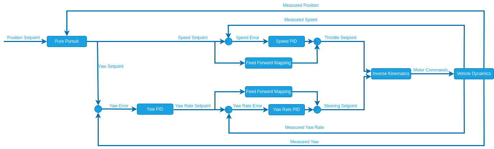
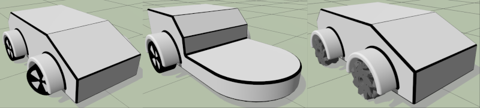

# Developer Guide

This developer guide aims to provide information on the structure and design philosophy of the rover modules to kick-start your development.
The guide is structured into the following sections:
- [Developer Guide](#developer-guide)
	- [Module Structure](#module-structure)
		- [Control Structure](#control-structure)
		- [High Level Structure](#high-level-structure)
		- [Code Structure](#code-structure)
	- [Testing in Simulation](#testing-in-simulation)
	- [Contributing](#contributing)

## Module Structure
The rover modules are structured with a focus on modularity and clearly defined interfaces. This allows a developer to work on a specific area or add a new feature without having to worry about the rest of the codebase.
In the following we will elaborate on this structure on different levels:

### Control Structure
The rover modules use a hierarchical structure in which sepoints can be injected at various level through rover specific uORB messages:

The individual controllers (indicated with green boxes) will subscribe to the setpoint coming from the controller one level above and publish a setpoint to the lower level (setpoints indicated with blue boxes).
The strucutre leads to a cascaded PID controller:

This cascaded structure is highly modular, we only run the loops that are required to control the highest level setpoint that is provided.

### High Level Structure
Putting the control structure into context of the setpoint generation gives us the full picture of the rover module including its external interfaces:

Important to note, is that the highest setpoint that is provided to the control structure will cause the lower setpoints to be overriden by the controllers.
The highest level setpoint is either provided by PX4 if the vehicle is in a PX4 internal drive mode or injected through the API (DDS Bridge).

### Code Structure

The bulk of the rover related code is located in [src/modules](https://github.com/PX4/PX4-Autopilot/tree/main/src/modules). Each rover type has its own subfolder i.e. [src/modules/rover_ackermann](https://github.com/PX4/PX4-Autopilot/tree/main/src/modules/rover_ackermann).
Inside the subfolder you will find the following structure exemplified with the ackermann rover module (some files are excluded here):

| Folder or File Names   | Purpose                                                                                                                                                                               |
| ---------------------- | ------------------------------------------------------------------------------------------------------------------------------------------------------------------------------------- |
| RoverAckermann.hpp/cpp | Entry Point for the rover module. Responsible for configuring the module, generating Setpoints if the vehicle is in a PX4 internal drive mode and calling the individual controllers. |
| module.yaml            | Definition of parameters specific to the rover type.                                                                                                                                  |
| AckermannDriveModes    | Contains implementations of the PX4 internal drive modes.                                                                                                                             |
| AckermannPosControl    | Position Controller: Turns position setpoints into speed and attitude setpoints.                                                                                                      |
| AckermannSpeedControl  | Speed Controller: Turns speed sepoints into throttle setpoints.                                                                                                                       |
| AckermannAttControl    | Attitude Controller: Turns attitude setpoints into rate setpoints.                                                                                                                    |
| AckermannRateControl   | Rate Controller: Turns rate setpoints into normalized steering setpoints.                                                                                                             |
| AckermannActControl    | Actuator Controller: Turns normalized steering/throttle setpoints into actuator setpoints.                                                                                            |

Additionally, there is a [src/lib/rover_control](https://github.com/PX4/PX4-Autopilot/tree/main/src/lib/rover_control) library that includes functions and parameter definitions that are shared among the rover modules.

## Testing in Simulation

PX4 provides synthetic simulation models for [Gazebo](../sim_gazebo_gz/index.md) of all three rover types to test the software and validate changes and new features:

- [Ackermann rover](../sim_gazebo_gz/vehicles.md#ackermann-rover)
- [Differential rover](../sim_gazebo_gz/vehicles.md#differential-rover)
- [Mecanum rover](../sim_gazebo_gz/vehicles.md#mecanum-rover)

## Contributing
When adding new features it is important to maintain the interfaces of the [High Level Structure](#high-level-structure).
Before opening a PR test your features/improvements in simulation and ideally also on hardware.
In your PR you should include a concise description of your changes and ideally provide logs, screenshots or videos of your code in action.

