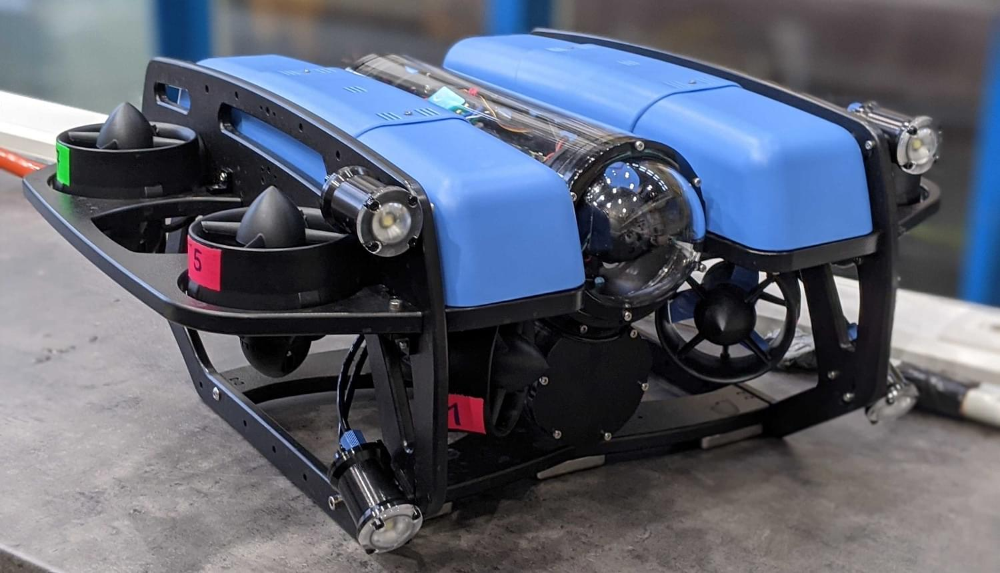
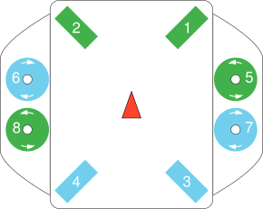
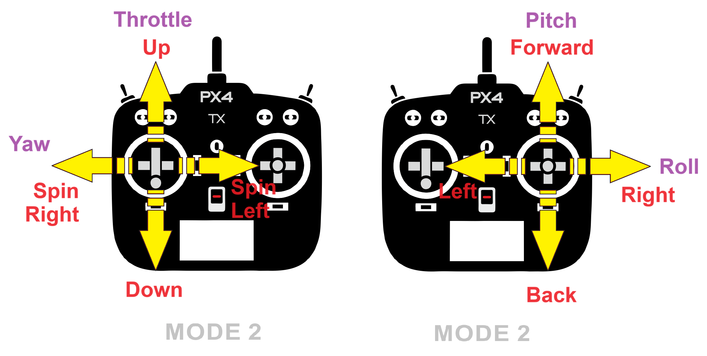
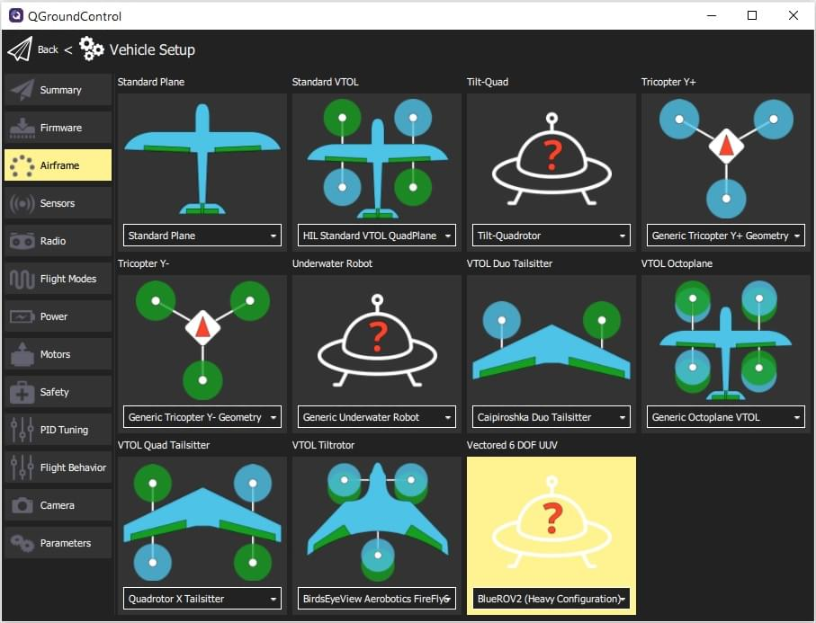

# BlueROV2 (UUV)

<Badge type="tip" text="PX4 v1.12" />

The [BlueROV2](https://bluerobotics.com/store/rov/bluerov2/) is an
affordable high-performance underwater vehicle that is perfect for inspections, research, and adventuring.

PX4 provides [experimental support](index.md) for an 8-thrust vectored configuration, known as the _BlueROV2 Heavy
Configuration_.

## Where to Buy

[BlueROV2](https://bluerobotics.com/store/rov/bluerov2/) + [BlueROV2 Heavy Configuration Retrofit Kit](https://bluerobotics.com/store/rov/bluerov2-accessories/brov2-heavy-kit/)

### Motor Mapping/Wiring

The motors must be wired to the flight controller following the standard instructions supplied by BlueRobotics for this
vehicle .

The vehicle will then match the configuration documented in
the [Airframe Reference](../airframes/airframe_reference.md#vectored-6-dof-uuv):

- **MAIN1:** motor 1 CCW, bow starboard horizontal, , propeller CCW
- **MAIN2:** motor 2 CCW, bow port horizontal, propeller CCW
- **MAIN3:** motor 3 CCW, stern starboard horizontal, propeller CW
- **MAIN4:** motor 4 CCW, stern port horizontal, propeller CW
- **MAIN5:** motor 5 CCW, bow starboard vertical, propeller CCW
- **MAIN6:** motor 6 CCW, bow port vertical, propeller CW
- **MAIN7:** motor 7 CCW, stern starboard vertical, propeller CW
- **MAIN8:** motor 8 CCW, stern port vertical, propeller CCW

## Basic Control Axes

For underwater vehicles, motion is defined in terms of body axes:

- **Surge:** forward/back motion - translation along the body X axis.
- **Sway:** left/right motion - translation along the body Y axis.
- **Heave:** up/down motion - translation along the body Z axis.
- **Yaw:** rotation about the (vertical) body Z axis.

### Stick Mapping (Mode 2)

The mapping below illustrates the default joystick behavior:

- **Pitch stick (forward/back):** surge
- **Roll stick (left/right):** sway
- **Throttle stick (up/down):** heave
- **Yaw stick (left/right):** yaw

## Manual Modes

The following manual and assisted modes are currently supported on BlueROV2 Heavy:

| Mode       | Description                                                                                                                 |
| ---------- | --------------------------------------------------------------------------------------------------------------------------- |
| Manual     | Direct manual control of thrust and yaw.                                                                                    |
| Stabilized | Manual control of thurst and yaw with roll/pitch stabilization.                                                             |
| Acro       | Manual control of yaw-rate and direct thrust commands with roll/pitch stabilization.                                        |
| Altitude   | Manual control of x/y thrust and yaw. Control of height with PID, manually controlled by user. Keeps roll/pitch stabilized. |
| Position   | Controls x, y, z and yaw with position hold when sticks are released. Keeps roll/pitch stabilized.                          |

## Joystick Stick Mode

BlueROV2 supports two joystick mappings for manual control, selected using the
[UUV_STICK_MODE](../advanced_config/parameter_reference.md#UUV_STICK_MODE) parameter.

By default, `UUV_STICK_MODE` is set to `0`, which enables the UUV stick mapping intended for vectored underwater vehicles.

### UUV_STICK_MODE = 0 (default)

This mode is intended for normal BlueROV2 operation.
In `Manual`, `Stabilized`, and `Acro` modes, the sticks command:

- **Pitch stick:** surge - moving stick up -> moving forward, +X translation in body frame.
- **Roll stick:** sway - moving stick right -> moving sideways right, +Y translation in body frame.
- **Throttle stick:** heave - moving stick up -> moving upwards, -Z translation in body frame (note the Z axis points Down of the vehicle in PX4).
- **Yaw stick:** yaw - moving stick right -> yawing to the right, +Z rotation in body frame.

In this mode, roll and pitch are kept level rather than commanded directly.

### UUV_STICK_MODE = 1

This mode enables the legacy multicopter-style stick mapping for `Manual`, `Stabilized`, and `Acro` modes:

- **Throttle stick:** surge - moving stick up -> moving forward, +X translation in body frame.
- **Roll stick:** roll - moving stick right -> rolling to the right side, +X rotation in body frame.
- **Pitch stick:** pitch - moving stick up -> pitching down, -X translation in body frame (note signs are switched to follow PX4 standard).
- **Yaw stick:** yaw - moving stick right -> yawing to the right, +Z rotation in body frame.

This mode is mainly provided for compatibility with older setups and user preference.

## Airframe Configuration

BlueROV2 does not come with PX4 installed.
You will need to:

1. [Install PX4 Firmware](../config/firmware.md#installing-px4-main-beta-or-custom-firmware)
2. [Set the Airframe](../config/airframe.md).
   You will need to select the "BlueROV2 Heavy Configuration" as shown:
   

<!-- what other tuning/testing/ etc? -->

## Video

<lite-youtube videoid="1sUaURmlmT8" title="PX4 on BlueRov Demo"/>

<!-- @DanielDuecker on github is good person to ask about this frame -->
