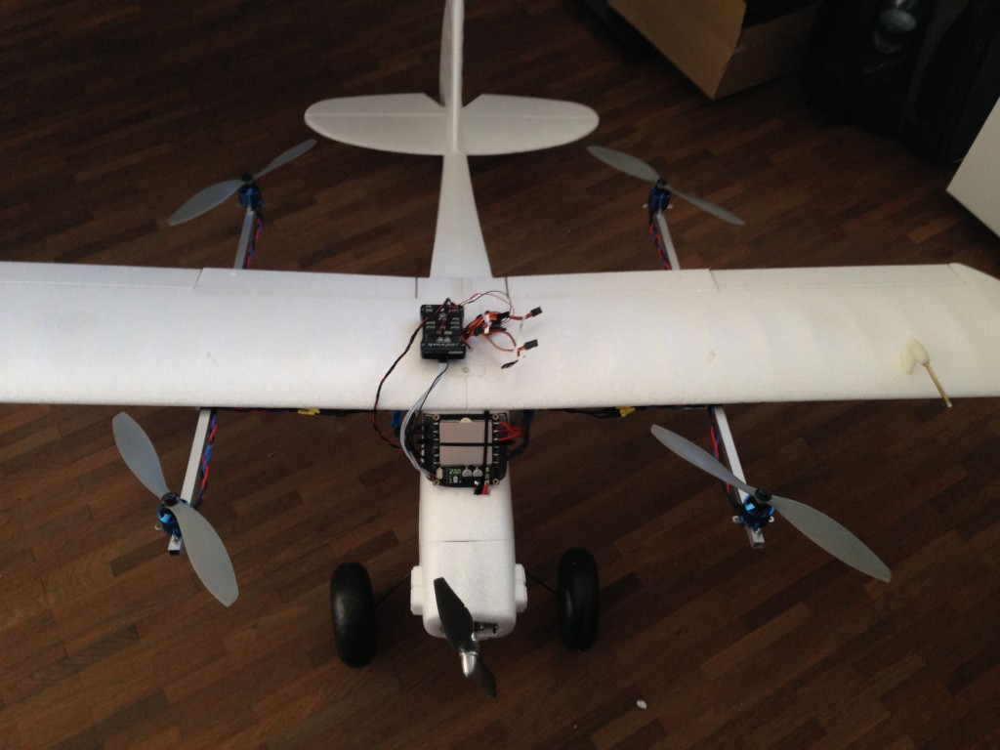
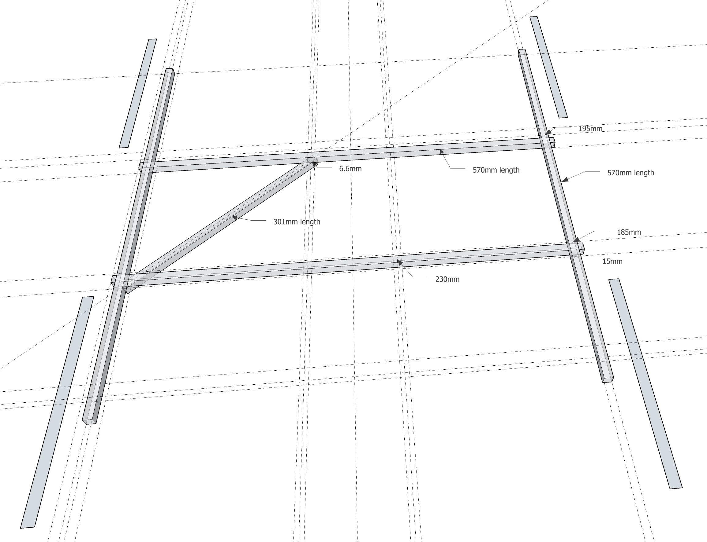
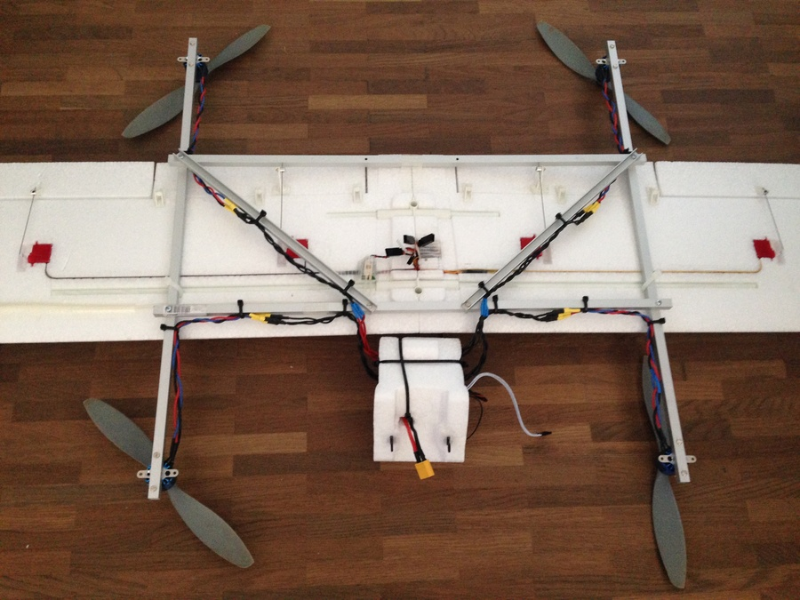
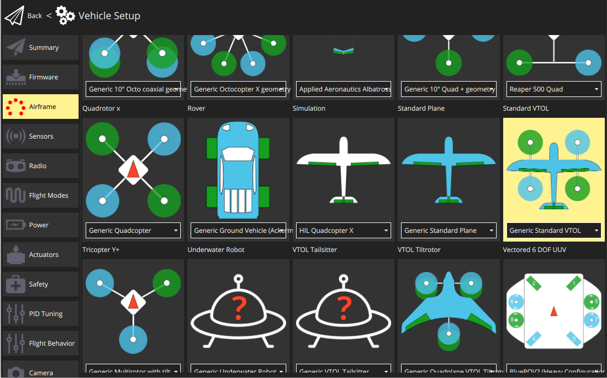

# FunCub QuadPlane (Pixhawk)

The Fun Cub QuadPlane VTOL is a standard tailplane aircraft (the Multiplex FunCub) that has been retrofitted with a QuadCopter system.

Key information:

- **Frame:** Multiplex FunCub
- **Flight controller:** Pixhawk

Unmodified, the Fun Cub is a relatively affordable plane and relatively easy to fly.
After the conversion the plane is significantly heavier and less aerodynamic.
It still flies quite well but needs around 75% throttle in forward flight.

## Bill of Materials

The actual plane looks roughly like as shown in the image above (other similar models will work
just fine - this is a Multiplex Fun Cub).

The minimal equipment required is:

- Multiplex FunCub (or similar)
- Pixhawk or compatible
- Digital airspeed sensor
- 900 kV motors (e.g. Iris propulsion set - motors and ESC)
- 10" props for quad motors (10x45 or 10x47)
- 10" prop for fixed-wing motor (10×7)
- GPS module
- 4S battery
- Aluminum frame for mounting the quad motors (10x10mm square tube, 1mm wall thickness)
- TOW is ~2.3kg with a 4200mAh 4S battery

## Structure

The structure is made out of aluminum booms as shown below.

## Wiring

Motor and servo wiring is nearly entirely up to you, but should match the [Generic Standard VTOL](../airframes/airframe_reference.md#vtol_standard_vtol_generic_standard_vtol) configuration, as shown in the airframe reference.
The geometry and output assignment can be configured in the [Actuators Configuration](../config/actuators.md#actuator-outputs)

For example, you might wire it up like this example (orientation as if "sitting in the plane"):

Port | Connection
--- | --- 
MAIN 1 | Front right motor (CCW)
MAIN 2 | Back left motor (CCW)
MAIN 3 | Front left motor (CW)
MAIN 4 | Back right motor (CW)
AUX 1  | Left aileron TODO
AUX 2  | Right aileron
AUX 3  | Elevator
AUX 4  | Rudder
AUX 5  | Throttle

For further instructions on wiring and configurations please see: 
[Standard VTOL Wiring and Configuration](../config_vtol/vtol_quad_configuration.md). <!-- replace with Pixhawk Wiring Quickstart -->

## Airframe Configuration

1. For [Airframe](../config/airframe.md) select the vehicle group/type as *Standard VTOL* and the specific vehicle as [Generic Standard VTOL](../airframes/airframe_reference.md#vtol_standard_vtol_generic_standard_vtol) as shown below (do not forget to click **Apply and Restart** in the top).

   

1. Configure the outputs and geometry following the instructions in [Actuators Configuration](../config/actuators.md)
1. The default parameters are often sufficient for stable flight. For more detailed tuning information see [Standard VTOL Wiring and Configuration](../config_vtol/vtol_quad_configuration.md).

After you finish calibration the VTOL is ready to fly. 

## Video

<lite-youtube videoid="4K8yaa6A0ks" title="Fun Cub PX4 VTOL Maiden"/>

## Support

If you have any questions regarding your VTOL conversion or configuration please visit <https://discuss.px4.io/c/px4/vtol>.

