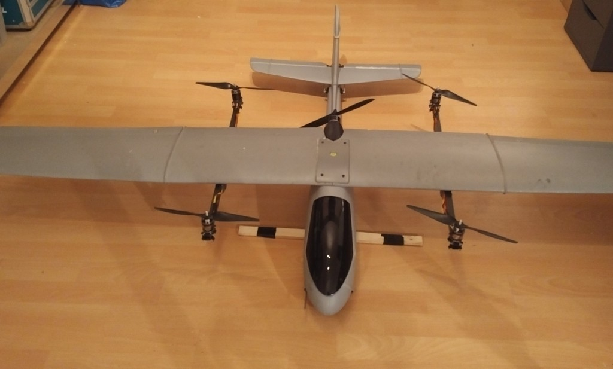
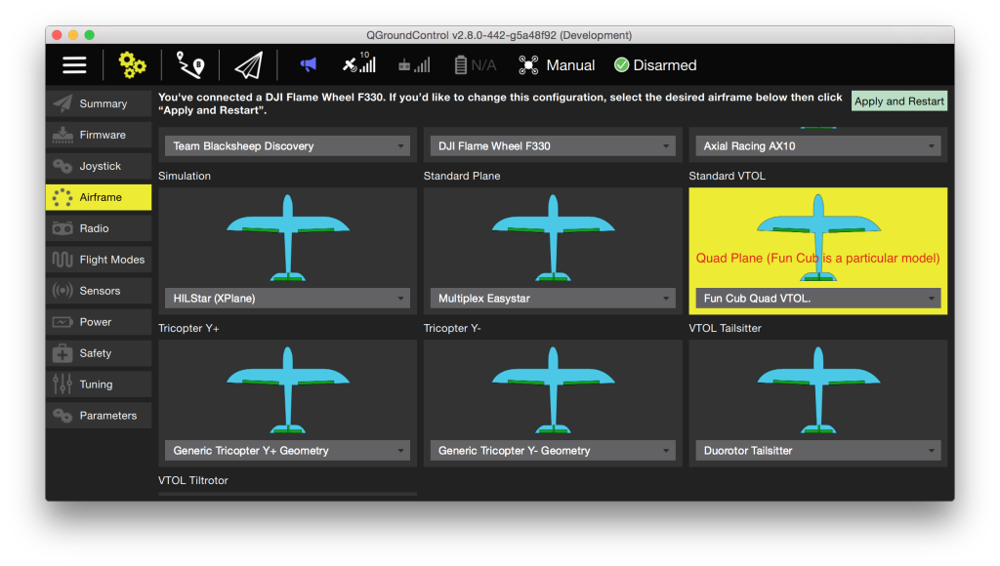

# Volantex Ranger-Ex QuadPlane VTOL (Pixhawk)

The QuadRanger VTOL is a standard tailplane aircraft based on the Volantex Ranger-Ex that has been retrofitted with a QuadCopter system.
The Ranger-Ex is an easy to fly FPV platform that is widely available.
It is also available from HobbyKing where it is rebranded as the Quanum Observer.
The plasic fuselage and 2 meter EPO wing makes it a rugged airframe with a lot of payload capacity.

Key information:

- **Frame:** Volantex Ranger-Ex or *Quanum Observer*
- **Flight controller:** Pixhawk

The VTOL conversion makes the plane a bit heavier (around 3.5kg including LiPo).
With this conversion the plane will cruise at approximately 65% throttle.
The suggested quad setup provides a thrust of 7.5kg and the airframe can fly with a total weight of around 4.5kg.
This leaves enough payload capacity for payloads like FPV gear and cameras.

The conversion is designed to minimize impact on the aerodynamics and provide additional strength minimize wing flexing.

## Bill of Materials

- Volantex Ranger-Ex or Quanum Observer
- 1200KV 530W motors
- 30A Speed Controllers
- 4s battery
- APC Electric 11x5 propellers

## Conversion kit

-   The basic parts required are;
-   Pixhawk or compatible
-   Digital airspeed sensor
-   3DR Power module or compatible
-   GPS

For a full parts list with links to Hobbyking EU and International warehouse see:
[QuadRanger-VTOL-partslist](https://px4.io/wp-content/uploads/2016/01/QuadRanger-VTOL-partslist-1.xlsx)

The image below depicts the parts required for one wing.

 
The tools required for the conversion are;

-   A Dremel or similar rotary tool
-   A hobby knife
-   UHU POR glue
-   CA glue
-   Tape-line
-   Tape

## Wing conversion

::: info
Please note that the conversion in this build log is performed on a wing that shows damage from a previous conversion. 
:::

Cut both 800mm square carbon tubes to a length of 570mm and 230mm.

Making a slot in the Styrofoam wing 1.5cm deep using a rotary tool with some form of guidance to keep a fixed depth.
The slot should be the length, depth and width of one 230mm square carbon tube.
It should be located as indicated below.

Glue the 300x150x1.5mm carbon sheet to the 230mm carbon tube using CA glue and create an opening to run wires through.
Insert the wires for power and signal to the ESC's.
Using UHU POR glue the sheet and carbon tube to the Styrofoam wing as indicated below.

Using CA glue, glue the 570mm square carbon tube to the carbon sheet.
It should be located 285mm from where the wings join.
The tube should be centred relative to the vertical area of the wing.
It should extend exactly 165mm on both sides.

Attach the motor mount to the motor.
With another motor mount plate and 4 M3x25mm screws clamp the motor on the end of the square carbon tube as indicated below.
Attach the ESC's with tie wraps to the carbon tube.
When using the Afro ESC be sure to connect at least signal and ground wire.

## Wiring 

The outputs of Pixhawk should be wired like this (orientation as seen
like "sitting in the plane").

Port | Connection
--- | ---
MAIN 1   | Front right motor, CCW
MAIN 2   | Back left motor, CCW
MAIN 3   | Front left motor, CW
MAIN 4   | Back right motor, CW
AUX  1   | Left aileron
AUX  2   | Right aileron 
AUX  3   | Elevator
AUX  4   | Rudder
AUX  5   | Throttle

::: info
The servo direction can be reversed using the PWM\_REV parameters in the PWM\_OUTPUT group of QGroundControl (cogwheel tab, last item in the left menu)
:::
  
For further instructions on wiring and configurations please see: [Standard VTOL Wiring and Configuration](../config_vtol/vtol_quad_configuration.md)

## Configuration

Configure the frame as shown in QGroundControl below (do not forget to click **Apply and Restart** in the top).

## Support

If you have any questions regarding your VTOL conversion or configuration please visit <https://discuss.px4.io/c/px4/vtol>.

