# OMP Hobby ZMO FPV

The OMP Hobby ZMO is a small [tiltrotor VTOL](../frames_vtol/tiltrotor.md) that is available in an RTF kit.
This build guide shows add a flight controller system (using [Auterion Skynode evaluation kit](../companion_computer/auterion_skynode.md), [Pixhawk 6C](../flight_controller/pixhawk6c.md) or [Pixhawk 6C mini](../flight_controller/pixhawk6c_mini.md)) and setup PX4.

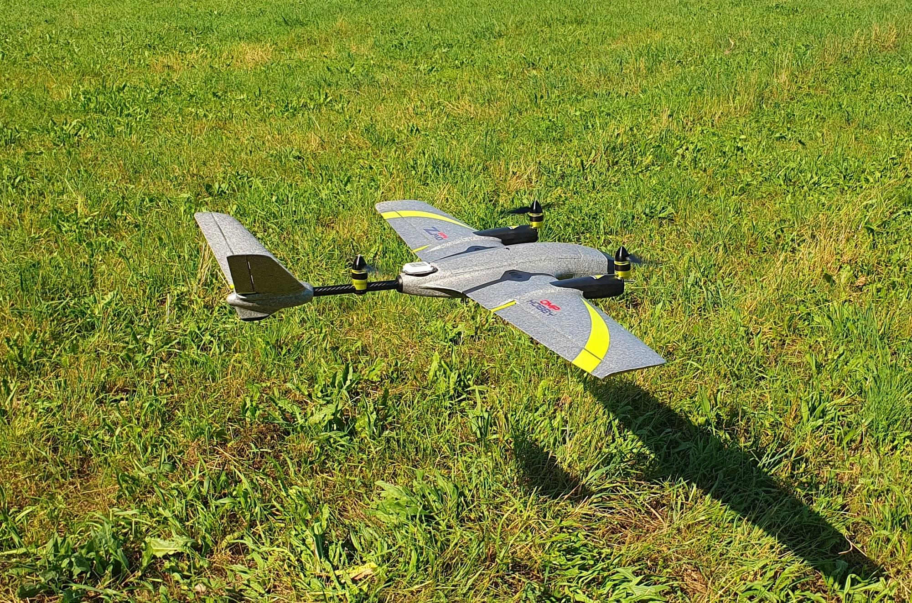

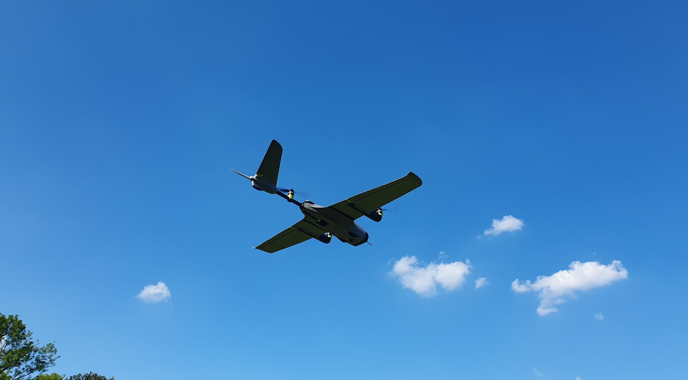

## Overview

Key airframe features:

- Compact and easy to transport
- Pre installed actuators
- Quick release wing connecting system
- Transport case in kit included
- ~35 minute long flight times (depending on takeoff weight)
- VTOL enables flying in locations where a fixed wing couldn't fly
- Battery and charger included in the kit
- Easy overall build
- Space to mount FPV and/or action camera in the front

Depending on the final takeoff weight the hover time might be limited (there is not a lot of air circulation inside the fuselage when the vehicle is hovering so the ESCs might overheat).

## Where to Buy

- [OMP-Hobby](https://www.omphobby.com/OMPHOBBY-ZMO-VTOL-FPV-Aircraft-With-DJI-Goggles-And-Remote-Controller-p3069854.html)
- [GetFPV](https://www.getfpv.com/omphobby-zmo-z3-vtol-fpv-1200mm-arf-plane-kit-no-fpv-system.html)
- [FoxtechFPV](https://www.foxtechfpv.com/zmo-pro-fpv-vtol.html)

## Flight Controller

The following options have been tested:

- [Auterion Skynode evaluation kit](../companion_computer/auterion_skynode.md)
- [Pixhawk 6C](../flight_controller/pixhawk6c.md) with [PM02 V3](../power_module/holybro_pm02.md)
- [Pixhawk 6C mini](../flight_controller/pixhawk6c_mini.md) with [PM02 V3](../power_module/holybro_pm02.md)

The approximate maximum size of the FC is: 50x110x22mm

## Additional Accessories

- [GPS F9P (included in Skynode eval. kit)](../gps_compass/rtk_gps_holybro_h-rtk-f9p.md)
- [GPS M9N (cheaper alternative to F9P)](../gps_compass/rtk_gps_holybro_h-rtk-m8p.md)
- [Airspeed sensor (included in Skynode eval. kit)](https://www.dualrc.com/parts/airspeed-sensor-sdp33) — recommended for improved safety and performance
- [Airspeed sensor (cheaper alternative)](https://holybro.com/products/digital-air-speed-sensor?pr_prod_strat=use_description&pr_rec_id=236dfda00&pr_rec_pid=7150470561981&pr_ref_pid=7150472462525&pr_seq=uniform)
- [Lidar Lightware lw20-c (included in Skynode eval. kit)](../sensor/sfxx_lidar.md) (Optional)
- [Lidar Seeed Studio PSK-CM8JL65-CC5 (cheaper alternative)](https://www.seeedstudio.com/PSK-CM8JL65-CC5-Infrared-Distance-Measuring-Sensor-p-4028.html) (Optional)
- [5V BEC](http://www.mateksys.com/?portfolio=bec12s-pro)
- [Radio (RC) System](../getting_started/rc_transmitter_receiver.md) of your preference
- [Servo cable extension cable male 30cm 10 pcs](https://www.getfpv.com/male-to-male-servo-extension-cable-twisted-22awg-jr-style-5-pcs.html)
- [USB-C extension cable](https://www.digitec.ch/en/s1/product/powerguard-usb-c-usb-c-025-m-usb-cables-22529949?dbq=1&gclid=Cj0KCQjw2cWgBhDYARIsALggUhrh-z-7DSU0wKfLBVa8filkXLQaxUpi7pC0ffQyRzLng8Ph01h2R1gaAp0mEALw_wcB&gclsrc=aw.ds)
- [3M VHB tape](https://www.amazon.in/3M-VHB-Tape-4910-Length/dp/B00GTABM3Y)
- [3D-Printed mounts](https://github.com/PX4/PX4-user_guide/raw/main/assets/airframes/vtol/omp_hobby_zmo_fpv/omp_hobby_zmo_3d_prints.zip)
  - 2x wing connector mount
  - 1x Airspeed sensor mount
  - 1x GPS-Mount
  - 1x Lidar-Mount
  - 1x Skynode mount
- [USB camera (included in Skynode dev kit)](https://www.amazon.com/ELP-megapixel-surveillance-machine-monitor/dp/B015FIKTZC)
- Screws, inserts, heat shrink, etc.

## Tools

The following tools were used for this build.

- Hex driver set
- Wrench set
- Soldering station
- Glue: Hot glue, 5 min Epoxy
- Tape
- 3M Double sided tape ([3M VHB tape](https://www.amazon.in/3M-VHB-Tape-4910-Length/dp/B00GTABM3Y))
- Sandpaper
- 3D-Printer

## Hardware Integration

### Preparations

Remove the original flight controller, ESC and wing connector cables.
Also remove the the propellers.
This will help you with the handling of the vehicle and will reduce the risk of an injury due to an unintentional motor startup.

ZMO FPV in it's original state.

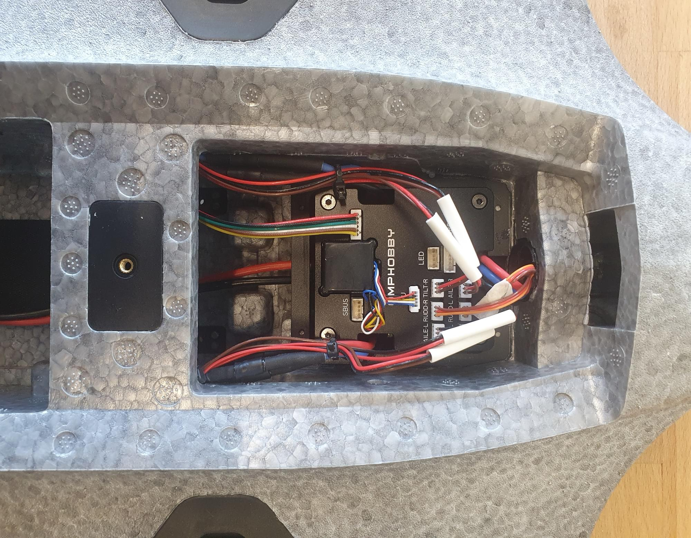

Flight controller and wing connectors removed from the vehicle.

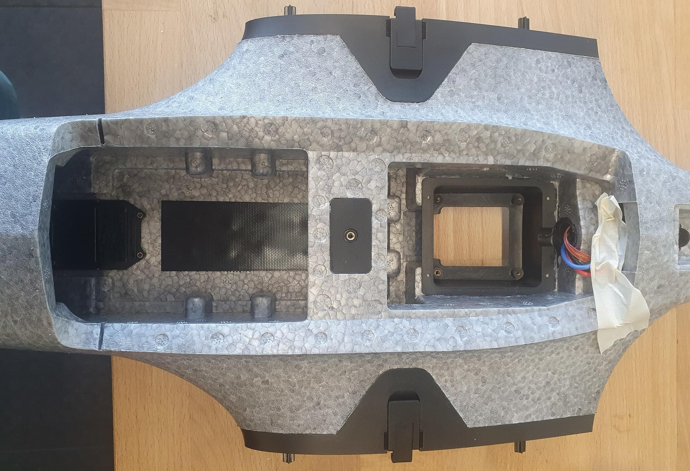

### ESCs

1. Unsolder the ESC PWM-signal and ground pins and solder some servo extension wire to the pins.
   The cable should be long enough to connect the wire to the FMU pins of the flight controller.
1. Unsolder the 3 female banana plug connectors of the rear motor (might not be necessary for the Pixhawk 6 integration).
1. Screw the ESC back in place with 4 M2.5 x 12 screws.
1. Shorten the rear motor wires and solder them as shown in the picture into place.
1. Solder signal and GND wires to the PWM input ot the ESC.

   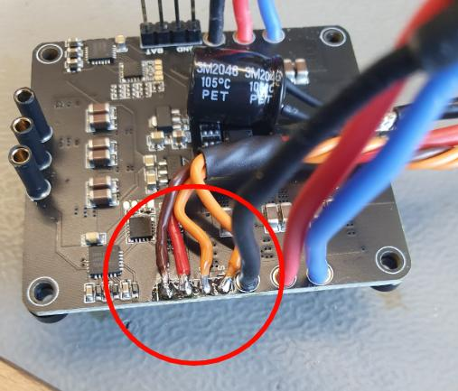

1. Remove the female banana plug on the ESC.
   This will give you more space to install the flight controller.

   

1. Solder the rear motor wires to the ESC.
   Make sure to connect such that the motor spins in the correct direction.

   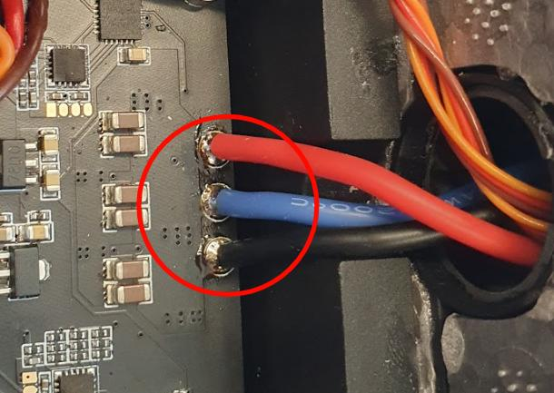

### Wing Connector

To directly connect the wing connector when the wing gets attached, some 3D-printed mounts are needed to center the connector.
This step is not essential, but makes the handling much easier and there is one step less you need to worry about when you mount the plane in the field.

1. Glue the wing connectors into the 3D-Printed part with hot-glue or 5 min epoxy.
1. Glue the 3D-printed part with the connector in to the fuselage.
   Make sure to properly align the connector while the glue cures.

   The easiest way to align the connector is to mount the wing while the glue is curing, but make sure that no glue is between the fuselage and the wing, otherwise the wing might get stuck.

The connector glued into the 3D-Printed part

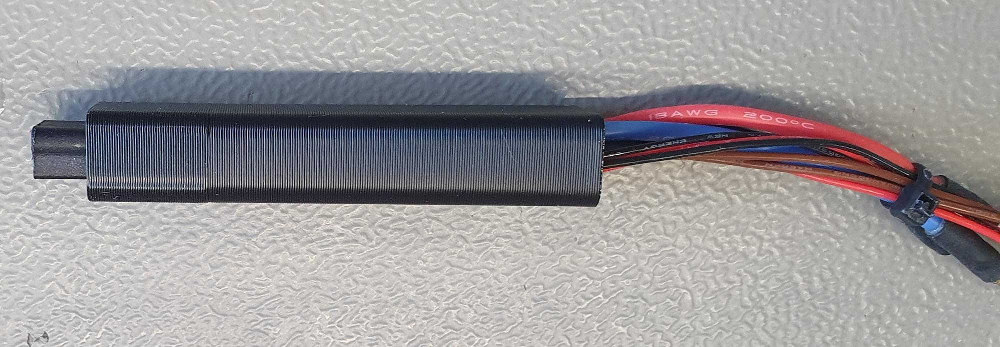

The connector glued into the fuselage. Make sure to properly align the connector.

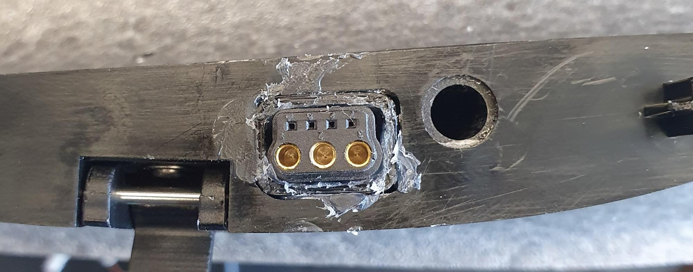

### Pixhawk Adapter Boards and BEC

1. Cut the foam as shown in the pictures to create space to mount the Pixhawk adapter boards and BEC with double sided tape.
   The FMU board is placed on the left side (in flight direction) of the fuselage.
   Solder a servo connector and a cable for the battery voltage to the BEC.

   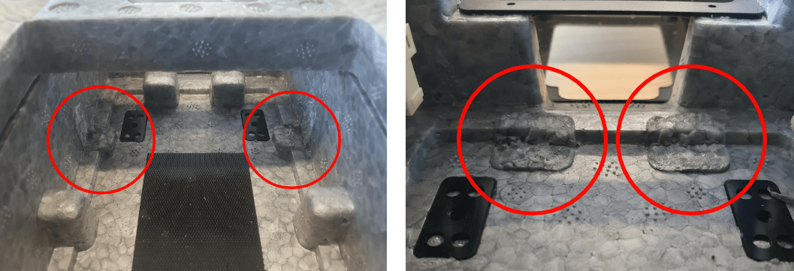
   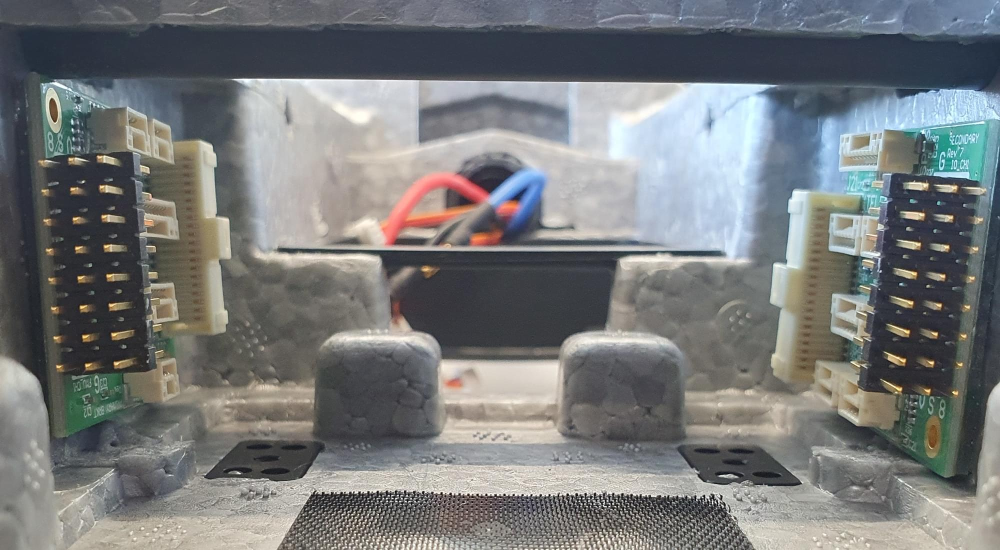

1. Prepare the BEC to connect to the IO board and to the battery.
   The BEC can also be soldered directly to the battery pads of the ESC.

   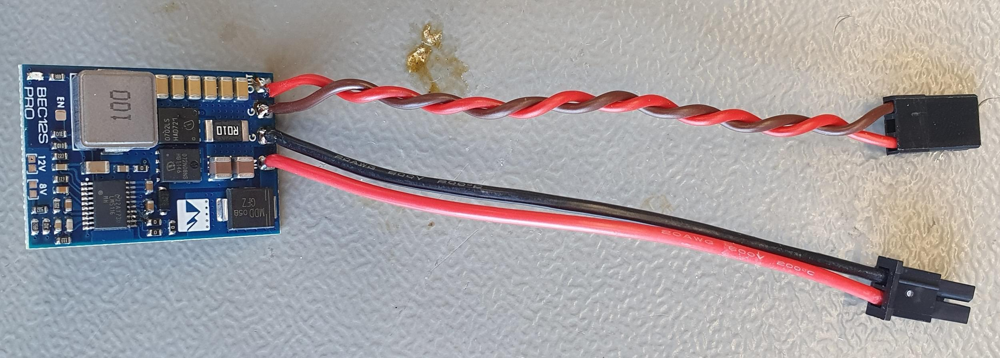

1. Mount the BEC with double sided tape.

   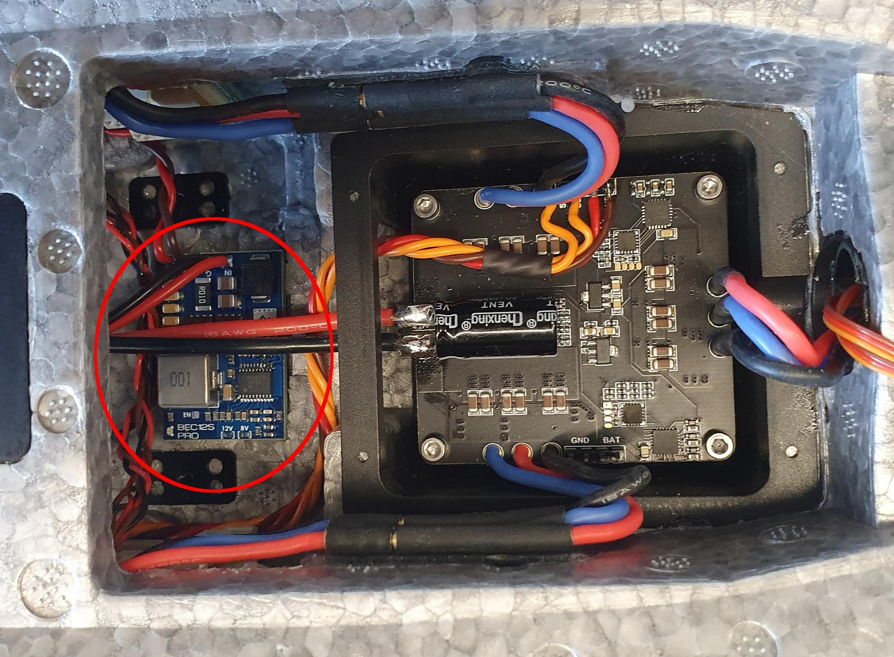

### Cables

1. Cut the connectors off the servos and solder the servo extension cables to the cables.
   Make sure that the cables are long enough to reach the Pixhawk adapter board.
   If you own a crimp tool, then you can also directly add the connectors without soldering.

1. Plug the servo cables into the adapter IO board in the following order:

   - 1 - Aileron left
   - 2 - Aileron right
   - 3 - V-Tail left
   - 4 - V-Tail right
   - 5 - Tilt left
   - 6 - Tilt right

1. Plug in the motor signal cables into the FMU adapter board in the following order:

   - 1 - Front left
   - 2 - Front right
   - 3 - Rear

### Sensors

#### Pitot Tube

1. First check if the pitot tube fits into the 3D-Printed mount.
   If this is the case, glue the pitot tube mount into place.

   To align the tube feed it through the second hole from the right of the FPV front plate.
   The mount will enable you to push the tube back into the fuselage to protect it during transportation and handling.
   The sensor unit can be mounted on top of the 3D-Printed mount with double sided tape.

1. Glue the 3D-Printed mount into place.

   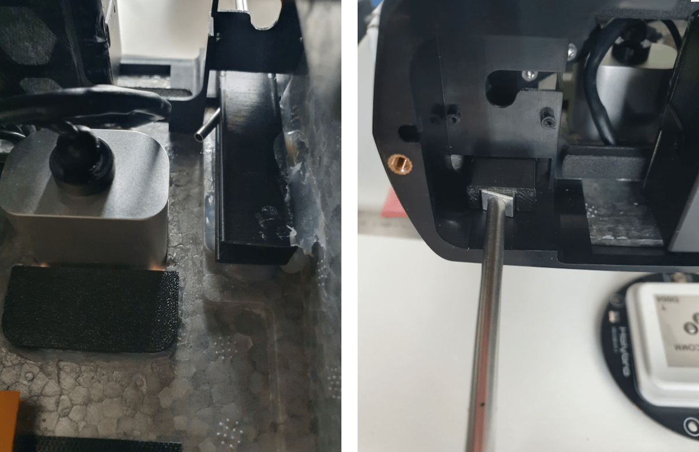

1. The sensor can be mounted on top of the 3D-Printed mount.

   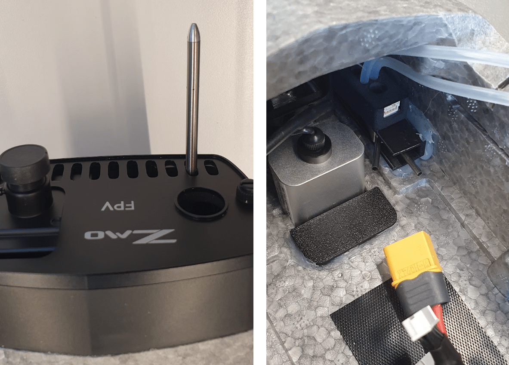

#### Lidar

If needed a lidar can be installed in the front of the fuselage.

To install the Lidar:

1. Remove the heat sink
1. Glue the lidar + 3D-Printed lidar mount into place.

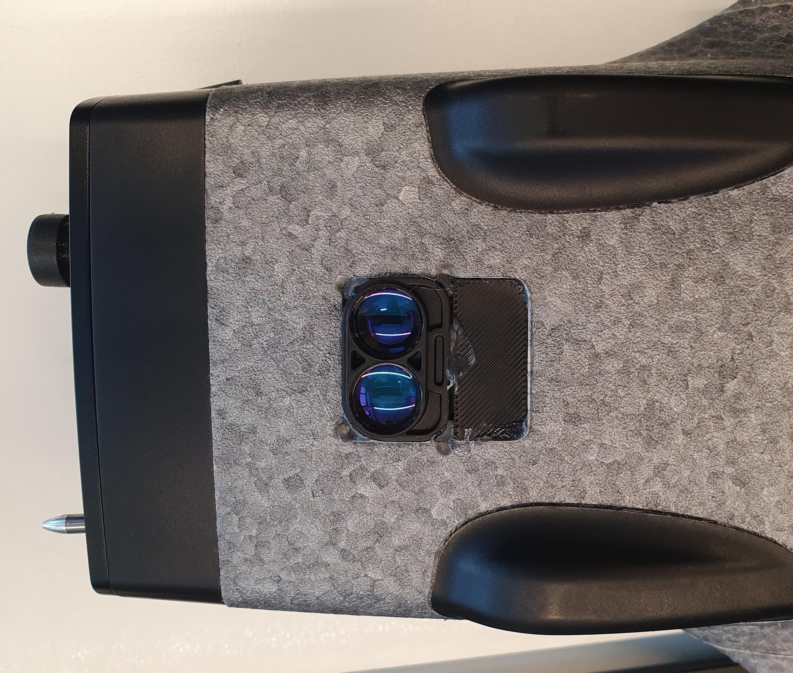

#### GPS/Compass

To mount the GPS:

1. Screw the two 3D-Printed parts with 3x M3x10 screws together.
1. Take the GPS out of the plastic case and unplug the connector.
1. Feed the cable through the carbon spar.
1. Glue the 3D-Printed part with 5 min epoxy in place.
   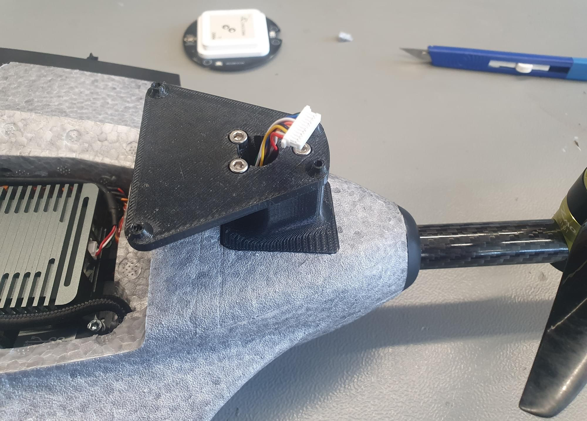
1. After the glue has cured, screw the GPS with 4x M2.5x10 screws to the plate.
   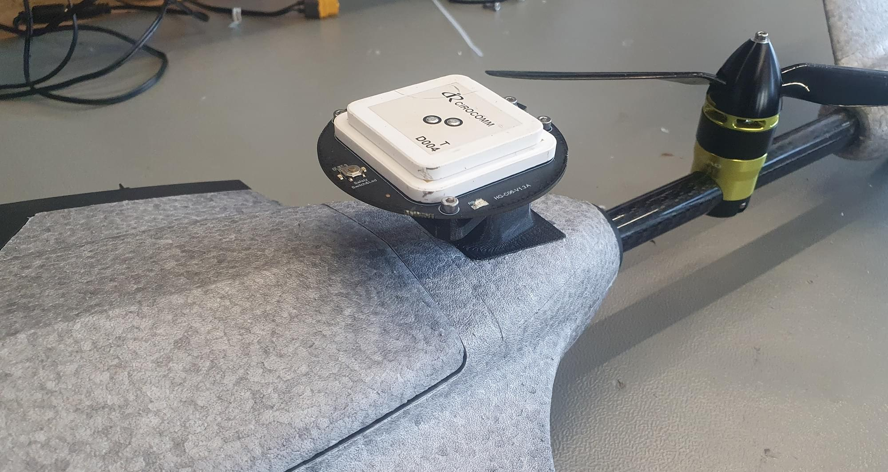

#### USB Camera

1. Cut the USB cable of the camera so that the length is 15 cm.
1. Cut the USB-Adapter cable to be 25 cm and solder the two cables together.
1. To install the camera you need to cut a hole into the foam of the wall.

   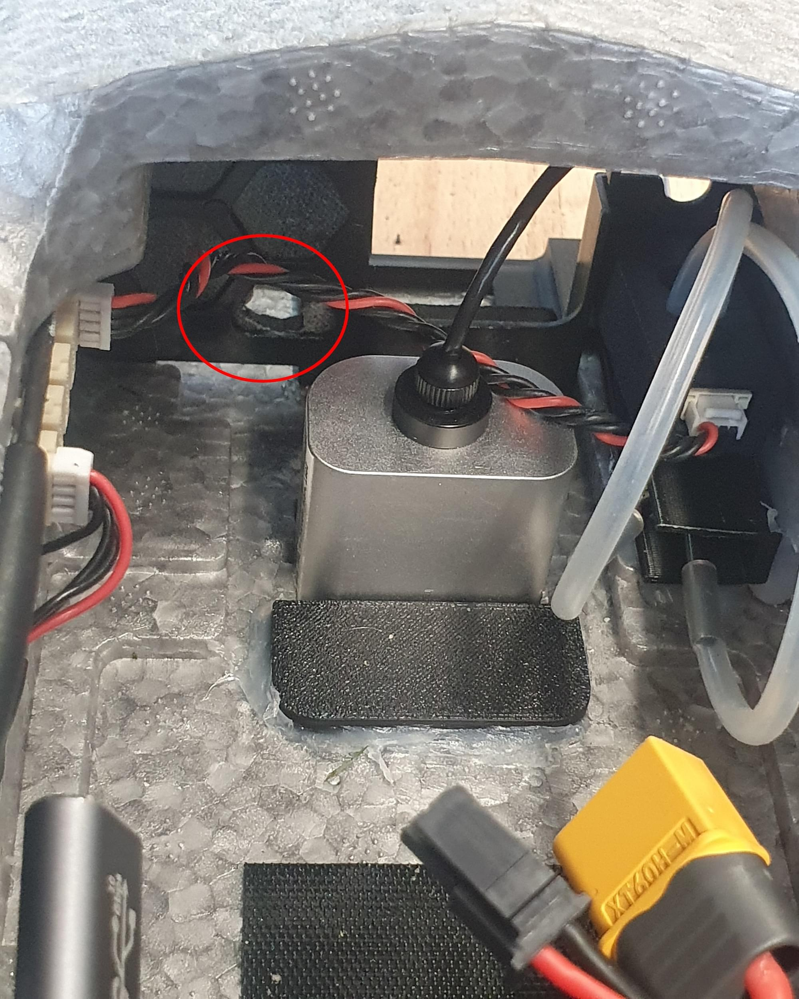

   Then you can mount the camera with double sided tape to the wall.

### Flight Controller

The Flight Controller can be installed above the ESC.

#### Pixhawk 6c/6c mini

If a Pixhawk 6c or 6c mini is used, simply stick the flight controller with double sided tape into place.

#### Skynode

If a Skynode is used:

1. Place it at the on top of the ESCs and mark the 2 rear mounting locations on the injection molded plastic part of the ZMO.
1. Remove the Skynode from the vehicle and drill 2 holes with a 2.8 mm drill bit into the plastic part.
   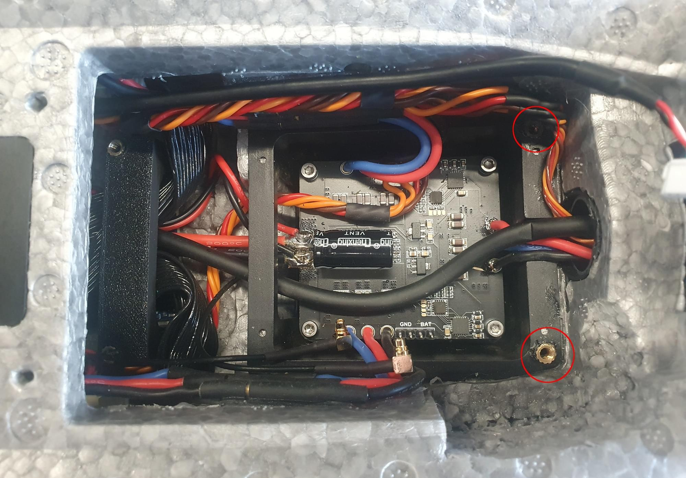
1. Put the Skynode back into place and screw it down with 2x M3x10 screws.

Another option is to add some threaded inserts into the holes.
Since the injection molded part of the ZMO is very thin, they need to be glued in place.

1. Screw the front Skynode mount with 2x M3x10 screws at the Skynode.
1. Then add some 5 min epoxy at the bottom of the mount and put a weight on top of the Skynode until the glue is cured.
   To access the 2 mounting screws at the front, poke 2 holes from the top through the foam.

   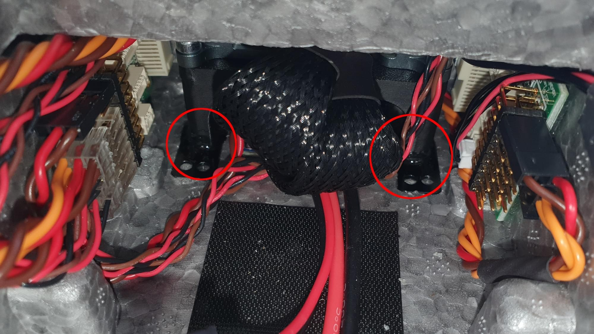

### Antennas and RC Receiver

::: info
If a Skynode is installed the LTE can be used as telemetry and video link.
If a Pixhawk is used a different [telemetry link](../telemetry/index.md) will be needed.
An inexpensive example would be a [SiK Telemetry Radio](../telemetry/sik_radio.md).
:::

1. One LTE antenna can be installed on the bottom of the vehicle.
   For that you can feed the antenna wire through the opening for the ESC heat-sink.

   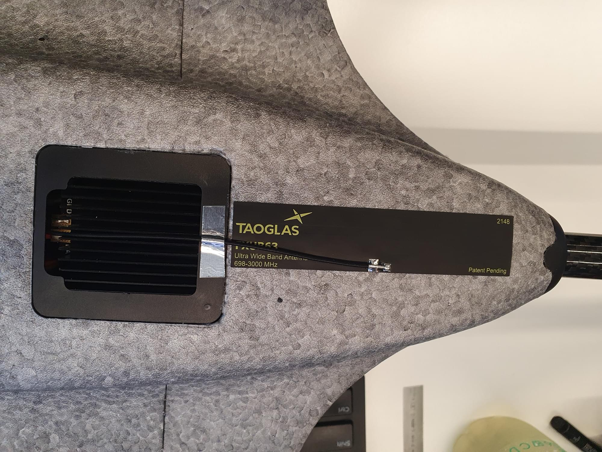

1. The second antenna can be installed on the inside of the vehicle on the left side of the battery compartment.
   The RC receiver can also be placed at the left side of the battery compartment.

   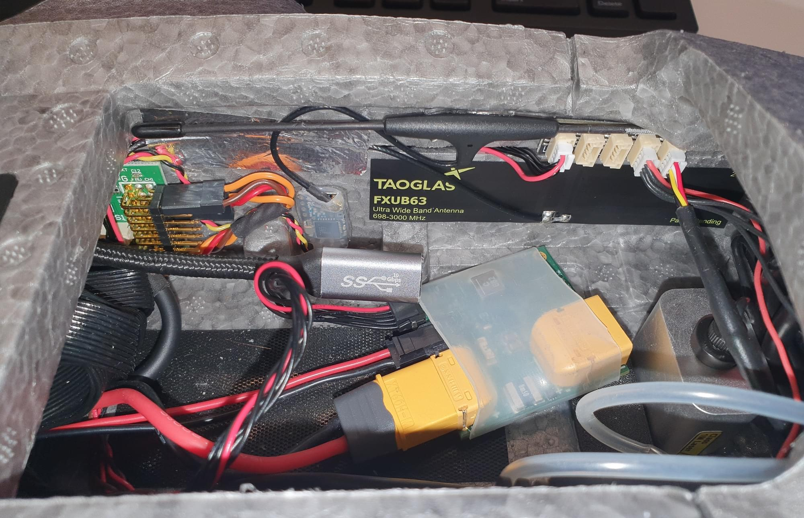

## Software Setup

### Select Airframe

1. Open QGC, select the **Q** icon, and then select **Vehicle Setup**.
1. Select the [Airframe](../config/airframe.md) tab

1. Select [Generic Tiltrotor VTOL](../airframes/airframe_reference.md#vtol_vtol_tiltrotor_generic_tiltrotor_vtol) from the _VTOL Tiltrotor_ group, and then and click **Apply and Restart**.

### Load Parameters File

Next we load a [parameter file](https://github.com/PX4/PX4-user_guide/raw/main/assets/airframes/vtol/omp_hobby_zmo_fpv/omp_hobby_zmo.params) that contains parameters that define the frame geometry, output mappings, and tuning values — so you don't have to!
If you have followed the wiring instructions for the motors you probably won't need to do much further configuration other than sensor calibration and fixing the trims.

To load the file:

1. Download the [parameter file](https://github.com/PX4/PX4-user_guide/raw/main/assets/airframes/vtol/omp_hobby_zmo_fpv/omp_hobby_zmo.params).
1. Select the [Parameters](../advanced_config/parameters.md#finding-updating-parameters) tab and then click on **Tools** in the top right corner.
1. Select **Load from file** and then choose the `omp_hobby_zmo.params` file you just downloaded.
1. Reboot the vehicle.

### Sensor Selection

The airspeed sensor can be enabled in the [Parameters](../advanced_config/parameters.md#finding-updating-parameters) tab.

- If the [recommended airspeed sensor (SDP33)](https://www.dualrc.com/parts/airspeed-sensor-sdp33) is used, `SENS_EN_SDP3X` needs to be enabled.
- If the [Lidar Lightware lw20-c (included in Skynode eval. kit)](../sensor/sfxx_lidar.md) is used, `SENS_EN_SF1XX` needs to be set to 6 (SF/LW/20c).

### Sensor Calibration

First make sure to set the [correct orientation of the flight controller](../config/flight_controller_orientation.md).
This should be the default (`ROTATION_NONE`).

Then calibrate the main sensors:

- [Compass](../config/compass.md)
- [Gyroscope](../config/gyroscope.md)
- [Accelerometer](../config/accelerometer.md)
- [Airspeed](../config/airspeed.md)

### RC-Setup

[Calibrate your RC Controller](../config/radio.md) and setup the [flight mode switches](../config/flight_mode.md).

We recommend you assign RC switches for the set of modes defined in [Flight Mode Configuration > What Flight Modes and Switches Should I Set?](../config/flight_mode.md#what-flight-modes-and-switches-should-i-set).
In particular you should assign a _VTOL Transition Switch_, _Kill Switch_, and a switch to select [Stabilized mode](../flight_modes_fw/stabilized.md) and [Position mode](../flight_modes_fw/position.md).

### Actuator Setup

:::warning
Make sure the props are removed!
The motors are easy to start in the actuators tab by accident.
:::

Motors, control surfaces, and other actuators are configured in the QGroundControl [Actuator Configuration & Testing](../config/actuators.md).

The [parameter file](#load-parameters-file) loaded previously means that this screen should already be correctly setup: you just need to adjust the trims for your particular vehicle.
If motors/servos were connected to different outputs than suggested, you will need to change the output to function mappings in the actuator output section.

#### Tilt Servos

1. Switch the vehicle into manual mode (either via the flight mode switch or type `commander mode manual` into the MAVLink shell).
1. Check if the motors point upwards.
   If the motors point forwards then their associated Tilt servos need to be reversed (selecting the checkbox next to each servo).

   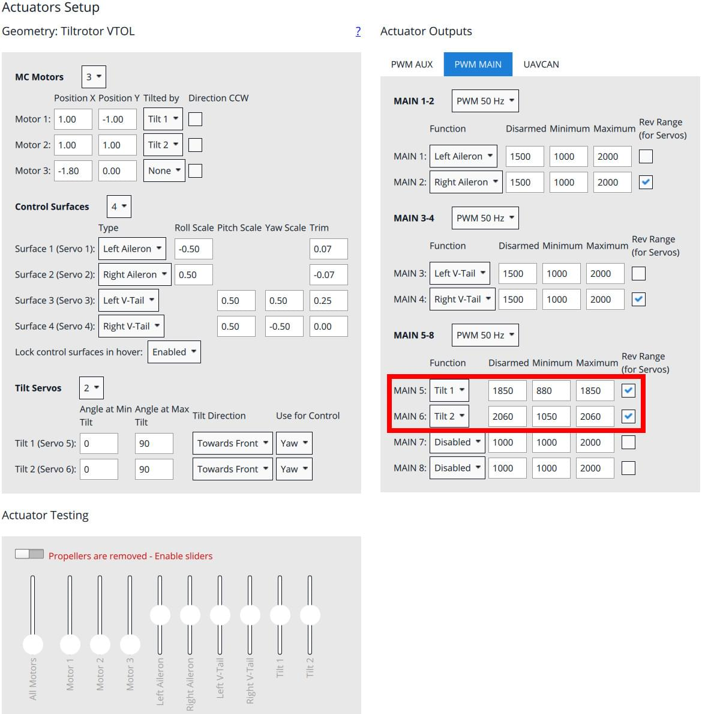

1. Adjust the minimum or maximum value that the servo is pointing vertical up.
1. Then type `commander transition` into the MAVLink shell to adjust the horizontal position.

#### Control Surfaces

Check if the actuators need to be reversed using the RC-Controller:

- Roll stick to the right. The right aileron should go up, left aileron should go down.
- Pitch stick to the back (fly upwards). Both V-tail surfaces should move up.
- Yaw stick to the right. Both surfaces should move to the right

Now adjust the trim value so that all the surfaces are in neutral position.

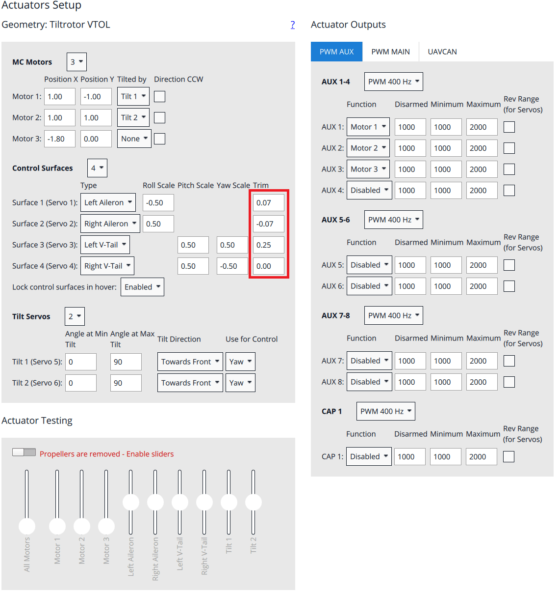

#### Motor Direction and Orientation

Make sure the props are removed!!

- `Motor 1`: Front left motor should spin CW
- `Motor 2`: Front right motor should spin CCW
- `Motor 3`: Rear motor should spin CCW

If the motor spins in the wrong directions two of the three motor wires need to be swapped.
The direction can't be changed in software because the vehicle does not use [DShot ESC](../peripherals/dshot.md).

## First Flight

- Check tilt rotor reactions in [Stabilized mode](../flight_modes_fw/stabilized.md). Keep the throttle stick at the minimum and place the vehicle at the ground. To enable the tilt servos you need to arm the vehicle.
  - Yaw the vehicle to the right (nose to the right) -> left motor should tilt down
  - Yaw the vehicle to the left (nose to the left) -> right motor should tilt down
- Mount the propellers.
- Check center of gravity (GG).
  Switch the vehicle into forward flight mode.
  To check the CG lift the vehicle with two fingers up at the markings underneath the wing.
  The vehicle should balance horizontally.
  If the vehicle tips to either the tail or to the nose then you need to move the battery into the opposite direction.
  If you are not able to balance the vehicle with this method you will need to reposition some components or add weight to balance the vehicle.
- Check actuator orientations and neutral trim
- Check control surface reactions in [Stabilized mode](../flight_modes_fw/stabilized.md). Switch the vehicle into forward flight mode.
  - Roll the vehicle to the right.
    The right aileron should go down. The left aileron should go up.
  - Pitch the vehicle up (nose up).
    Both elevons should go down.
  - Yaw the vehicle to the right (nose to the right).
    Both elevons should go to the left.
- If a [kill-switch](../config/safety.md#kill-switch) is used, make sure it's working properly and will not be activated accidentally in flight!
- Arm in [Stabilized mode](../flight_modes_fw/stabilized.md) and check if motors respond to the commands, e.g. roll left increases throttle on the right motor
- Takeoff in [Stabilized mode](../flight_modes_fw/stabilized.md) and make some basic maneuvers
- If everything went without any issue, takeoff in [Position mode](../flight_modes_fw/position.md) and do a transition at around 50m.
  If something goes wrong switch back to multicopter mode as fast as possible (using the transition switch).
