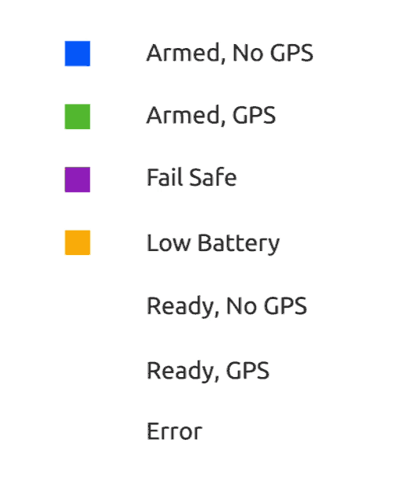
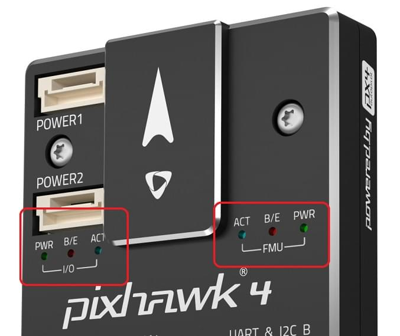

# LED Meanings (Pixhawk Series)

[Pixhawk-series flight controllers](../flight_controller/pixhawk_series.md) use LEDs to indicate the current status of the vehicle.
- The [UI LED](#ui_led) provides user-facing status information related to *readiness for flight*.
- The [Status LEDs](#status_led) provide status for the PX4IO and FMU SoC.
  They indicate power, bootloader mode and activity, and errors.

## UI LED

The RGB *UI LED* indicates the current *readiness for flight* status of the vehicle. 
This is typically a superbright I2C peripheral, which may or may not be mounted on the flight controller board (i.e. FMUv4 does not have one on board, and typically uses an LED mounted on the GPS).

The image below shows the relationship between LED and vehicle status.

:::warning
It is possible to have a GPS lock (Green LED) and still not be able to arm the vehicle because PX4 has not yet [passed preflight checks](../flying/pre_flight_checks.md). **A valid global position estimate is required to takeoff!**
:::

:::tip
In the event of an error (blinking red), or if the vehicle can't achieve GPS lock (change from blue to green),   check for more detailed status information in *QGroundControl* including calibration status, and errors messages reported by the [Preflight Checks (Internal)](../flying/pre_flight_checks.md). 
Also check that the GPS module is properly attached, Pixhawk is reading your GPS properly, and that the GPS is sending a proper GPS position.
:::

* **[Solid Blue] Armed, No GPS Lock:** Indicates vehicle has been armed and has no position lock from a GPS unit.
When vehicle is armed, PX4 will unlock control of the motors, allowing you to fly your drone.
As always, exercise caution when arming, as large propellers can be dangerous at high revolutions.
Vehicle cannot perform guided missions in this mode.

* **[Pulsing Blue] Disarmed, No GPS Lock:** Similar to above, but your vehicle is disarmed.
This means you will not be able to control motors, but all other subsystems are working.

* **[Solid Green] Armed, GPS Lock:** Indicates vehicle has been armed and has a valid position lock from a GPS unit.
When vehicle is armed, PX4 will unlock control of the motors, allowing you to fly your drone.
As always, exercise caution when arming, as large propellers can be dangerous at high revolutions.
In this mode, vehicle can perform guided missions.

* **[Pulsing Green] Disarmed, GPS Lock:** Similar to above, but your vehicle is disarmed.
  This means you will not be able to control motors, but all other subsystems including GPS position lock are working.

* **[Solid Purple] Failsafe Mode:** This mode will activate whenever vehicle encounters an issue during flight,
such as losing manual control, a critically low battery, or an internal error.
During failsafe mode, vehicle will attempt to return to its takeoff location, or may simply descend where it currently is.

* **[Solid Amber] Low Battery Warning:** Indicates your vehicle's battery is running dangerously low.
After a certain point, vehicle will go into failsafe mode. However, this mode should signal caution that it's time to end
this flight.

* **[Blinking Red] Error / Setup Required:** Indicates that your autopilot needs to be configured or calibrated before flying.
Attach your autopilot to a Ground Control Station to verify what the problem is.
If you have completed the setup process and autopilot still appears as red and flashing, there may be another error.

## Status LED

Three *Status LEDs* provide status for the FMU SoC, and three more provide status for the PX4IO (if present). 
They indicate power, bootloader mode and activity, and errors.

From power on, the FMU and PX4IO CPUs first run the bootloader (BL) and then the application (APP).
The table below shows how the Bootloader and then APP use the LEDs to indicate condition.

Color | Label | Bootloader usage | APP usage 
--- | --- | --- | ---
Blue | ACT (Activity) | Flutters when the bootloader is receiving data | Indication of ARM state
Red/Amber | B/E (In Bootloader / Error) | Flutters when in the bootloader | Indication of an ERROR
Green |PWR (Power) | Not used by bootloader | Indication of ARM state

::: info
The LED labels shown above are commonly used, but might differ on some boards.
:::

More detailed information for how to interpret the LEDs is given below (where "x" means "any state")

Red/Amber | Blue |  Green | Meaning
--- | --- | --- | ---
10Hz | x | x | Overload CPU load > 80%, or RAM usage > 98%
OFF | x | x | Overload CPU load <= 80%, or RAM usage <= 98%
NA | OFF | 4 Hz| actuator_armed->armed && failsafe 
NA | ON | 4 Hz | actuator_armed->armed && !failsafe
NA | OFF |1 Hz | !actuator_armed-> armed && actuator_armed->ready_to_arm
NA | OFF |10 Hz | !actuator_armed->armed  && !actuator_armed->ready_to_arm 
