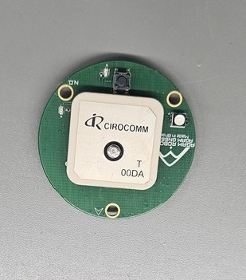

# Agam GNSS Standard

The Agam GNSS Standard is a high-performance GNSS receiver designed for PX4-compatible flight controllers. It uses the u-blox M10 GNSS receiver to provide accurate positioning and navigation for autonomous and manual flight operations. The module supports multiple GNSS constellations simultaneously and integrates an IST8310 digital compass for improved heading estimation. :contentReference[oaicite:1]{index=1}

## Where to Buy

Order this module from:

- [Agam Robotics](https://www.agamrobotics.com/)

## Hardware Specifications

- u-blox M10 GNSS receiver
- Supports up to four concurrent GNSS constellations
- Integrated IST8310 digital compass
- Supports UBX (u-blox) and NMEA output protocols
- JST-GH 10-pin Pixhawk-compatible connector
- 25 × 25 × 4 mm ceramic patch antenna
- Compatible with PX4-based flight controllers

### GNSS Support

- GPS
- Galileo
- GLONASS
- BeiDou
- QZSS

### Electrical Specifications

- GNSS Receiver
  - u-blox M10

- Number of Concurrent GNSS
  - Up to 4

- Compass
  - IST8310

- Input Voltage
  - 4.7 V – 5.2 V

- Communication Interface
  - UART

- Output Protocol
  - UBX (u-blox)
  - NMEA

- Navigation Update Rate
  - Up to 25 Hz (single GNSS)
  - Up to 10 Hz (4 concurrent GNSS)

- Position Accuracy
  - 2.0 m CEP

- Default Baud Rate
  - 115200 bps

- Connector
  - JST-GH 10-pin

- Antenna
  - 25 × 25 × 4 mm ceramic patch antenna

- Power Consumption
  - Less than 200 mA @ 5 V

- Operating Temperature
  - -40 °C to 80 °C

- Dimensions
  - Dimensions
  - Ø46.10 × 14.68 mm

- Weight
  - 32 g

## Hardware Setup

The Agam GNSS Standard should be connected to the GPS port of the flight controller.

1. Connect the JST-GH 10-pin cable to the GPS port.
2. Mount the GNSS module on the vehicle with a clear view of the sky.
3. Keep the module away from high-current power cables and RF interference sources.
4. Secure the cable and verify all connections before powering the system.

## PX4 Configuration

The Agam GNSS Standard is supported by PX4 and is automatically detected when connected to the GPS port.

1. Connect the GNSS module to the flight controller.
2. Power on the flight controller.
3. Open **QGroundControl**.
4. Navigate to **Vehicle Setup > GPS**.
5. Verify that the GNSS receiver is detected.
6. Wait until a valid GNSS fix is obtained before arming the vehicle.

## Connector

The GNSS Standard uses:

- JST-GH 10-pin connector
- UART communication interface

## Features

- u-blox M10 GNSS receiver
- Multi-constellation GNSS support
- Integrated IST8310 digital compass
- High-gain ceramic patch antenna
- Supports UBX and NMEA protocols
- Compatible with PX4 flight controllers

## Applications

- Multirotor UAVs
- Fixed-wing aircraft
- VTOL platforms
- Autonomous navigation
- Industrial drones
- Research and educational UAVs

## See Also

- [Agam Robotics](https://www.agamrobotics.com/)
