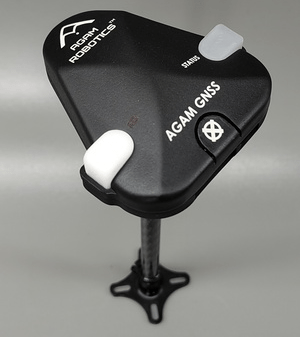

# Agam GNSS01 CAN

The Agam GNSS01 CAN is a Made in India GNSS/GPS module designed for PX4-compatible flight controllers. It integrates the u-blox NEO-M9N GNSS receiver with an onboard IMU, barometer, magnetometer, safety switch, and buzzer. The module communicates over the CAN interface using DroneCAN and provides reliable positioning, navigation, and orientation for autonomous flight applications.

## Where to Buy

Order this module from:

- [Agam GNSS01 CAN](https://www.agamrobotics.com/product-page/agamgnss-can)

## Hardware Specifications

- CAN-based GNSS/GPS module
- Made in India
- Visual orientation indicator
- Integrated Safety Switch
- Integrated Buzzer
- Compatible with PX4-based flight controllers

### Sensors

- u-blox NEO-M9N GNSS Receiver
  - Ultra-robust meter-level GNSS positioning
  - Concurrent reception of up to four GNSS constellations
  - Advanced spoofing and jamming detection
  - Excellent RF interference mitigation

- GNSS Augmentation Systems
  - SBAS
  - WAAS
  - EGNOS
  - MSAS
  - QZSS

- Magnetometer
  - Bosch BMM350

- Barometer
  - Bosch BMP390

- IMU
  - InvenSense ICM-42688-P

### Technical Specifications

- Operating Voltage
  - 5 V

- Communication Interface
  - CAN

- Navigation Update Rate
  - 5 Hz (Default)
  - Up to 10 Hz (Maximum)

- GNSS Constellations
  - GPS
  - Galileo
  - GLONASS
  - BeiDou

- Connectors
  - 4-pin JST-GH Pixhawk Standard CAN Connector
  - 6-pin JST-SH Pixhawk Standard Debug Connector

- Cold Start
  - < 25 s

- Hot Start
  - < 2 s

- Maximum Number of Satellites
  - 32

- Weight
  - 38.2 g (with enclosure)
  - 19.5 g (without enclosure)

## Hardware Setup

The Agam GNSS01 CAN should be connected to the CAN port of the flight controller.

1. Connect the 4-pin JST-GH CAN cable to the flight controller CAN port.
2. Mount the GNSS module with an unobstructed view of the sky.
3. Align the orientation indicator toward the front of the vehicle.
4. Secure the module and cables before powering the system.

## PX4 Configuration

The Agam GNSS01 CAN communicates over DroneCAN and is supported by PX4.

1. Connect the GNSS01 CAN to the CAN port of the flight controller.
2. Open **QGroundControl**.
3. Navigate to **Vehicle Setup > CAN**.
4. Enable **DroneCAN** if it is not already enabled.
5. Reboot the flight controller if required.
6. Verify that the GNSS module is detected.
7. Wait until a valid GNSS fix is obtained before arming the vehicle.

## Connector

The GNSS01 CAN uses:

- 4-pin JST-GH Pixhawk Standard CAN connector
- 6-pin JST-SH Pixhawk Standard Debug connector

## Applications

- Multirotor UAVs
- Fixed-wing aircraft
- VTOL platforms
- Industrial drones
- Autonomous navigation
- Research and educational UAVs

## See Also

- [Agam Robotics](https://www.agamrobotics.com/)
- [Agam GNSS01 CAN Documentation](https://agamrobotics.gitbook.io/docs/gnss-and-rtk-systems/agam-gnss01-can)
