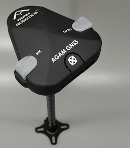

# Agam GNSS02 CAN RTK

The Agam GNSS02 CAN RTK is a Made in India high-precision GNSS/RTK module designed for PX4-compatible flight controllers. It integrates the u-blox NEO-F9P multi-band GNSS receiver with an onboard IMU, barometer, magnetometer, safety switch, and buzzer. The module communicates over the CAN interface using DroneCAN and provides centimeter-level RTK positioning for autonomous flight applications.

## Where to Buy

Order this module from:

- https://www.agamrobotics.com/product-page/agam-gnss02-can-rtk

## Hardware Specifications

- Made in India GNSS/RTK module
- CAN communication interface (DroneCAN)
- Supports NavIC
- Visual orientation indicator
- Integrated Safety Switch
- Integrated Buzzer
- Compatible with PX4-based flight controllers
- Optimized for autonomous UAV applications

### Sensors

- **u-blox NEO-F9P GNSS Receiver**
  - Multi-band RTK GNSS receiver
  - Centimeter-level positioning accuracy
  - Concurrent reception of up to four GNSS constellations
  - Supports RTK positioning

- **Magnetometer**
  - Bosch BMM350

- **Barometer**
  - Bosch BMP390

- **IMU**
  - InvenSense ICM-42688-P

### Technical Specifications

- Operating Voltage
  - 4.75 V – 5.25 V

- Communication Interface
  - DroneCAN

- Connector
  - JST-GH 1.25 mm 4-pin

- GNSS Receiver
  - u-blox NEO-F9P

- Antenna
  - Stacked Dual Patch Antenna (L1 + L5)

- GNSS Constellations
  - GPS
  - GLONASS
  - Galileo
  - BeiDou
  - QZSS
  - IRNSS (NavIC)

- GNSS Bands
  - B1I
  - B2a
  - E1B/C
  - E5a
  - L1C/A
  - L1OF
  - L5

- Navigation Update Rate
  - RTK: Up to 7 Hz
  - PVT: Up to 7 Hz
  - RAW: Up to 10 Hz

- Horizontal Position Accuracy
  - PVT: 1.5 m CEP
  - SBAS: 1.0 m
  - RTK: 0.01 m + 1 ppm

- Vertical Position Accuracy
  - PVT: 2.0 m
  - SBAS: 1.5 m
  - RTK: 0.01 m + 1 ppm

- GNSS Protocols
  - NMEA
  - RTCM 3.3
  - SPARTN 2.0.1
  - UBX Binary

- Cold Start
  - 27 s

- Hot Start
  - 2 s

- Operating Limits
  - Maximum Dynamics: 4 g
  - Maximum Altitude: 80,000 m
  - Maximum Velocity: 500 m/s

- Dynamic Heading Accuracy
  - 0.3°

- LED Indicators
  - GPS Fix
  - RTK Status
  - Safety LED
  - RGB System Status

- Current Consumption
  - Approximately 190 mA

- Operating Temperature
  - -25 °C to 85 °C

- Dimensions
  - Diameter: 61.99 mm
  - Height: 21 mm

- Weight
  - 46.5 g (with enclosure)
  - 28 g (without enclosure)
  - 62 g (with mount)
  - 47 g (without mount)

## Hardware Setup

The Agam GNSS02 CAN RTK connects to the flight controller through the CAN interface using the JST-GH 4-pin connector.

1. Connect the 4-pin JST-GH CAN cable to the CAN port.
2. Mount the GNSS module with an unobstructed view of the sky.
3. Align the orientation indicator toward the front of the vehicle.
4. Keep the module away from high-current power cables and RF interference sources.
5. Verify all connections before powering the system.

## PX4 Configuration

The Agam GNSS02 CAN RTK communicates using DroneCAN and is supported by PX4.

1. Connect the GNSS02 CAN RTK to the CAN port of the flight controller.
2. Open **QGroundControl**.
3. Navigate to **Vehicle Setup > CAN**.
4. Enable **DroneCAN** if it is not already enabled.
5. Reboot the flight controller if required.
6. Verify that the GNSS module is detected.
7. Wait until a valid GNSS fix is obtained before arming the vehicle.
8. For RTK operation, configure a compatible RTK base station or correction source in QGroundControl.

## Connector

The GNSS02 CAN RTK uses:

- JST-GH 1.25 mm 4-pin CAN connector

## Typical Applications

- Precision UAV navigation
- Multirotor UAVs
- Fixed-wing aircraft
- VTOL platforms
- Industrial drones
- Surveying and Mapping
- Precision Agriculture
- Autonomous navigation
- Research and educational UAVs

## See Also

- Agam Robotics: https://www.agamrobotics.com
- Agam GNSS02 CAN RTK Product Page: https://www.agamrobotics.com/product-page/agam-gnss02-can-rtk
- Agam GNSS02 CAN RTK Documentation: https://agamrobotics.gitbook.io/docs/gnss-and-rtk-systems/agam-gnss02-can-rtk
