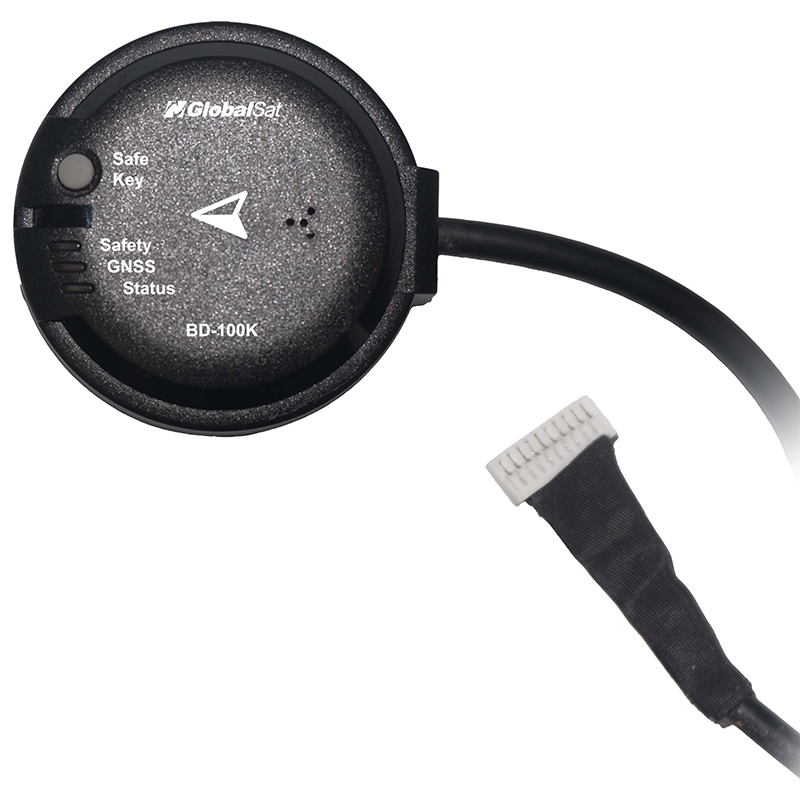
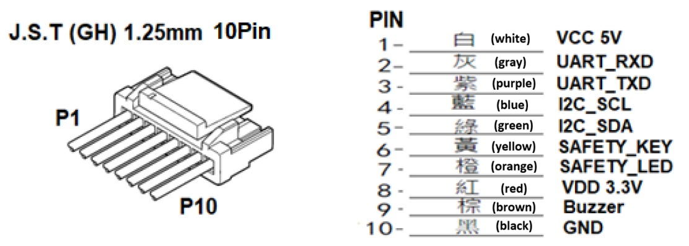

# Globalsat BD-100K RTK GPS/GNSS L1/L5 (UART)
The BD-100K is a high-precision, dual-band RTK GNSS receiver purpose-built for Drone flight-control systems. Powered by an advanced multi-frequency GNSS engine, the BD-100K delivers centimeter-level positioning, fast RTK convergence, and robust tracking in challenging environments such as urban canyons or dense foliage. Its integrated sensors and Pixhawk-compatible interface make it an ideal upgrade for professional UAV platforms requiring higher navigation accuracy and reliability.
- Drone and Auto pilot RTK centimeter-level positioning
- High-precision flight-control positioning
- Robotics and autonomous outdoor systems

## Where to Buy
Order this module from:
- [Globalsat BD-100K](https://www.amazon.com/dp/B0HLH35TNM/ref=sr_1_6?crid=19K2O2ZYR9ELZ&dib=eyJ2IjoiMSJ9.mwBPHNY87NCz7ohCdE1AqK5O1Wl91iaJOsoZRNbXW_X0R7qkKIsdlKgZCXAEIv-HhXW8iWuC9FB1FRn0vtu3EZEqKOVgbst7_YHDb5XmqUk.P-vxpYR4cYpo-Uoik0LFru-7uxZsy86IkZH45divQBw&dib_tag=se&keywords=BD+100K&qid=1790744012&sprefix=bd+100k%2Caps%2C184&sr=8-6) GPS/GNSS

## Features
- Dual-band GNSS (L1 + L5) with RTK centimeter-level positioning
- Multi-constellation, multi-frequency all-in-view tracking
- High tracking sensitivity for operation under weak-signal environments
- Fast RTK fix and strong anti-multipath design
- High tracking sensitivity for operation under weak-signal environments
- Fast TTFF under low signal conditions
- Supports NMEA 0183 V3.01 / V4.1 (GGA, GSA, GSV, RMC, VTG, GLL, ZDA, GRS, GST)
- Support AIROHA PAIR proprietary commands
- Support for SBAS ranging, WASS, EGNOS, MSAS and GAGAN
- UART output via JST-GH-10P connector
- Built-in Electronic compass & Barometer
- Built-in Safety switch, Buzzer & Tri-color LED(Pixhawk-compatible status indicators)
- Built-in backup power for hot-start performance
- Integrated dual-band patch antenna
- Water-resistant enclosure with anti-slip bottom design
- Made in Taiwan

## Hardware Setup
### Wiring 
The Globalsat BD-100K use UART output via JST-GH-10P connector. 
For more information, refer to the [Wiring instructions](https://www.globalsat.com.tw/en/a4-11311/BD-100K.html).

### Mounting
It should be mounted front facing, as far away from the flight controller and other electronics as possible.
For more information see [Mounting instructuions](https://www.globalsat.com.tw/en/a4-11311/BD-100K.html).

## Configuration
Please see [Configuration instructuions](https://www.globalsat.com.tw/en/a4-11311/BD-100K.html).

## LED Meanings
| LED color   | Status indicator       | Description                                                                                                                        |
| ----------- | ---------------------- | ---------------------------------------------------------------------------------------------------------------------------------- |
|Red          |   SAFETY LED           |  Safety switch LED indicator. Drives the internal red LED in coordination with safety key logic.                                   |
|Blue         |   GNSS LED             |  GNSS positioning status indicator                                                                                                 |
|R, G, B      |   System Status LED    |  Used to indicate various UAV flight and system statuses. Controlled via I2C (address 0x54) using the integrated IS31FL3195 driver |

## Pinout

## Dimensions
47.0mm diameter, 17.0mm height ±0.2mm

## See Also
[Globalsat BD-100K](https://www.globalsat.com.tw/en/product-285502/Dual-Band-RTK-Receiver-for-Drone-and-Autopilot-BD-100K.html)

