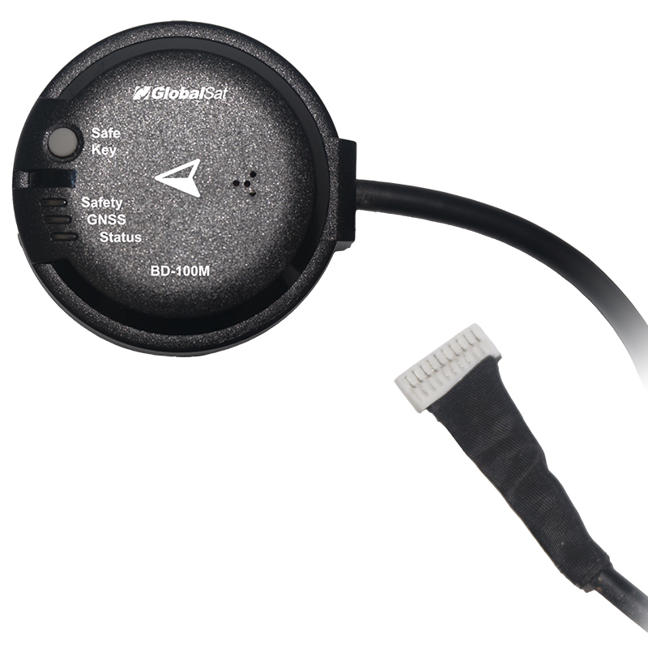

# Globalsat BD-100M GPS/GNSS (UART)
The BD-100M is a compact, dual-band GNSS receiver designed for Drone flight-control applications. It incorporates a high-sensitivity chipset, integrated sensors, and a Pixhawk-compatible interface for system-level integration.
- Drone and Autopilot location
- Flight-controller sensor integration
- Robotics and outdoor autonomous platforms

## Where to Buy
Order this module from:
- [Globalsat BD-100M](https://www.amazon.com/GlobalSat-BD-100M-Receiver-Drone-Taiwan/dp/B0HKZZRKZ9/ref=sr_1_1?crid=1GCK70TT2QQ01&dib=eyJ2IjoiMSJ9.8P1cDZHk0alpVTFNpEt5d1e5uJ0SMhzjjjJGU0uZpVLjCFA1gcmlqRKjG_AldJavN5KvB-EZtkUAtjCED20Y4U2wZGjnibM3Ajpcs9jY32Ui9guj52htUcjtZm-oaQbP.5XNfT__Y491dexhgNYeWF3WztvnlVHHkfv9Wv1X2KNY&dib_tag=se&keywords=BD+100M&qid=1790743978&sprefix=bd+100m%2Caps%2C184&sr=8-1) GPS/GNSS

## Features
- Dual-Band GNSS (L1 + L5) receiver
- Multi-constellation, multi-frequency all-in-view tracking
- High tracking sensitivity for operation under weak-signal environments
- Fast TTFF under low signal conditions
- Supports NMEA 0183 V3.01 / V4.1 (GGA, GSA, GSV, RMC, VTG, GLL, ZDA, GRS, GST)
- Support AIROHA PAIR proprietary commands
- Support for SBAS ranging, WASS, EGNOS, MSAS and GAGAN
- UART output via JST-GH-10P connector
- Built-in Electronic compass & Barometer
- Built-in Safety switch, Buzzer & Tri-color LED(Pixhawk-compatible status indicators)
- Built-in backup power for hot-start performance
- Integrated dual-band patch antenna
- Low-power consumption for UAV applications
- Water-resistant enclosure with anti-slip bottom design
- Made in Taiwan

## Hardware Setup
### Wiring 
The Globalsat BD-100M use UART output via JST-GH-10P connector. 
For more information, refer to the [Wiring instructions](https://www.globalsat.com.tw/en/a4-11312/BD-100M.html).

### Mounting
It should be mounted front facing, as far away from the flight controller and other electronics as possible.
For more information see [Mounting instructuions](https://www.globalsat.com.tw/en/a4-11312/BD-100M.html).

## Configuration
Please see [Configuration instructuions](https://www.globalsat.com.tw/en/a4-11312/BD-100M.html).

## LED Meanings
| LED color   | Status indicator       | Description                                                                                                                        |
| ----------- | ---------------------- | ---------------------------------------------------------------------------------------------------------------------------------- |
|Red          |   SAFETY LED           |  Safety switch LED indicator. Drives the internal red LED in coordination with safety key logic.                                   |
|Blue         |   GNSS LED             |  GNSS positioning status indicator                                                                                                 |
|R, G, B      |   System Status LED    |  Used to indicate various UAV flight and system statuses. Controlled via I2C (address 0x54) using the integrated IS31FL3195 driver |

## Pinout

## Dimensions
47.0mm diameter, 17.0mm height ±0.2mm

## See Also
[Globalsat BD-100M](https://www.globalsat.com.tw/en/product-285501/Dual-Band-GNSS-Receiver-for-Drone-and-Autopilot-BD-100M.html)

