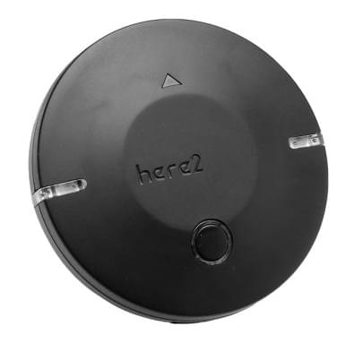

# HEX/ProfiCNC Here2 GPS (Discontinued)

::: warning
This has been superseded by the [Cube Here 3](https://www.cubepilot.com/#/here/here3)
:::

The [Here2 GPS receiver](http://www.proficnc.com/all-products/152-gps-module.html) is an update to the Here GPS module from HEX.

Main features include:

- Concurrent reception of up to 3 GNSS (GPS, Galileo, GLOSNASS, BeiDou)
- Industry Leading -167 dBm navigation sensitivity
- Security and integrity protection
- Supports all satellite augmentation systems
- Advanced jamming and spoofing detection

## Where to Buy

- [ProfiCNC](http://www.proficnc.com/all-products/152-gps-module.html) (Australia)
- [Other resellers](http://www.proficnc.com/stores)

## Configuration

Setup and use on PX4 is largely plug and play.

::: info

- If the GPS is _not detected_ then [update the Here2 firmware](https://docs.cubepilot.org/user-guides/here-2/updating-here-2-firmware).
- If the GPS is detected but does not work, attempt the process outlined in [allocating node uavcan ID](https://docs.cubepilot.org/user-guides/here-2/here-2-can-mode-instruction).
  :::

## Wiring and Connections

The Here2 GPS comes with an 8 pin connector that can be inserted directly into the [Pixhawk 2](http://www.hex.aero/wp-content/uploads/2016/07/DRS_Pixhawk-2-17th-march-2016.pdf) GPS UART port.

The Pixhawk 3 Pro and Pixracer have a 6 pin GPS port connector.
For these controllers you can modify the GPS cable (as shown below) to remove pin 6 and 7.

Pin 6 and 7 are for the safety button - these can be attached as well if needed.

### Pinout

The Here2 GPS pinout is provided below. This can be used to help modify the connector for other autopilot boards.

| pin | Here2 GPS  | pin | Pixhawk 3 Pro GPS |
| --- | ---------- | --- | ----------------- |
| 1   | VCC_5V     | 1   | VCC               |
| 2   | GPS_RX     | 2   | GPS_TX            |
| 3   | GPS_TX     | 3   | GPS_RX            |
| 4   | SCL        | 4   | SCL               |
| 5   | SDA        | 5   | SDA               |
| 6   | BUTTON     | -   | -                 |
| 7   | BUTTON_LED | -   | -                 |
| 8   | GND        | 6   | GND               |

## Specification

- **Processor:** STM32F302
- **Sensor**
  - **Compass, Gyro, Accelerometer:** ICM20948
  - **Barometer:** MS5611
- **Receiver Type:** 72-channel u-blox M8N engine, GPS/QZSS L2 C/A, GLONASS L10F, BeiDou B11, Galileo E1B/C, SBAS L1 C/A: WAAS, EGNOS, MSAS, GAGAN
- **Navigation Update Rate:** Max: 10 Hz
- **Positionaing Accuracy:** 3D Fix
- **Time to first fix:**
  - **Cold start:** 26s
  - **Aided start:** 2s
  - **Reacquisition:** 1s
- **Sensitivity:**
  - **Tracking & Navigation:** -167 dBm
  - **Hot start:** -148 dBm
  - **Cold start:** -157 dBm
- **Assisted GNSS**
  - AssistNow GNSS Online
  - AssistNow GNSS Offline (up to 35 days)
  - AssistNow Autonomous (up to 6 days)
  - OMA SUPL& 3GPP compliant
- **Oscillator:** TCXO (NEO-8MN/Q)
- **RTC crystal:** Build in
- **ROM:** Flash (NEO-8MN)
- **Available Antennas:** Active Antenna & Passive Antenna
- **Signal Integrity:** Signature feature with SHA 256
- **Protocols & Interfaces:**
  - **UART/I2C/CAN:** JST_GH Main interface, Switch internally.
  - **STM32 Main Programming Interface:** JST_SUR
