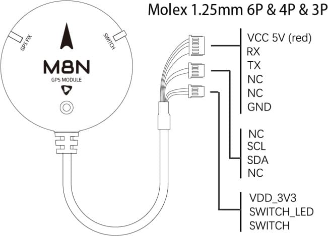

# Holybro M8N & M9N GPS

The GPS includes either a M8N or M9N UBLOX module, IST8310 compass, tri-colored LED indicator, and a safety switch.

There are 3 different connector options, allowing easy connection to flight controllers that are compliant with the Pixhawk-connector standard as either a primary or secondary GPS.
This module ships with a baud rate of 38400 Hz.

The main difference between the modules is that the M8N allows concurrent reception of up to 3 GNSS systems, while M9N can concurrently connect to up to 4.

 

### Features and Specifications

- Ublox Neo-M8N or M9N module
- Industry leading –167 dBm navigation sensitivity
- Cold starts: 26s
- LNA MAX2659ELT+
- 25 x 25 x 4 mm ceramic patch antenna
- Rechargeable Farah capacitance
- Low noise 3.3V regulator
- Current consumption: less than 150mA @ 5V
- Fix indicator LEDs
- Protective case
- 26cm cable included
- Diameter: 50mm total size, 32 grams with case.
- **M8N:** Concurrent reception of up to 3 GNSS (GPS, Galileo, GLONASS, BeiDou)
- **M9N:** Concurrent reception of up to 4 GNSS (GPS, Galileo, GLONASS, BeiDou)

## Where to Buy

- [Holybro](https://holybro.com/collections/gps)

Note that there are variants for both M8N and M9N and also three different connectors.

## Wiring and Connections

Both the M8N and M9N GPS modules come in three variants.
These allow out-of-the box connection to flight controllers that follow the Pixhawk connector standard as either a primary or secondary GPS.

- **SKU12012 Holybro M8N GPS (JST GHR1.25mm 10 pin cable)**.

  This JST GH 10Pin connector can be used on Pixhawk Series 10pin `GPS Module` or `GPS1` input port.

  

- **SKU12014 Holybro M8N 2nd GPS (JST GHR1.25m m 6pin cable)**

  This JST GH 6Pin connector can be used on Pixhawk Series 6pin `UART`, `I2C` or `GPS2` input port as secondary GPS.

  

- **SKU12013 Holybro M8N GPS for Pix32 (Molex 1.25mm 6pin & 4pin & 3pin cable)**

  These Molex 1.25mm 6pin & 4pin & 3pin connectors are for the [Holybro pix32 Flight Controller](../flight_controller/holybro_pix32.md) `Switch`, `GPS`, and `I2C` input ports (not for the Pix32 v5 or v6).

  

## Dimensions

