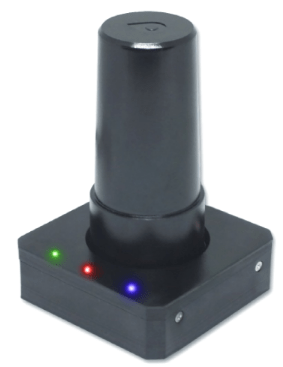
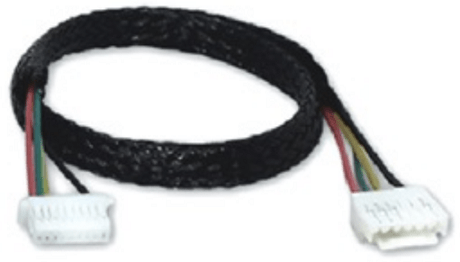
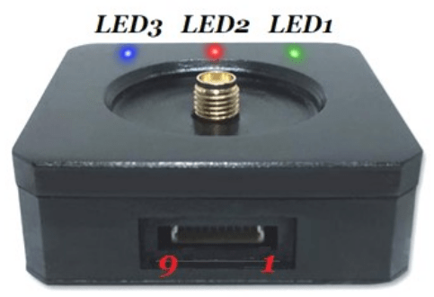

# LOCOSYS Hawk A1 GPS/GNSS

The [LOCOSYS HAWK A1 GPS/GNSS receiver](https://www.locosystech.com/en/product/hawk-a1-LU23031-V2.html) is a dual frequency multi-constellation GNSS/GPS receiver compatible with PX4.

Main features include:

- Concurrent reception of L1 and L5 band signals
- Supports GPS, GLONASS,BEIDOU, GALILEO, QZSS
- Capable of SBAS (WAAS, EGNOS, MSAS, GAGAN)
- Support 135-channel GNSS
- Fast TTFF at low signal level
- Free hybrid ephemeris prediction to achieve faster cold start
- Default 5Hz, up to 10 Hz update rate (SBAS at 5Hz update rate only)
- Built-in super capacitor to reserve system data for rapid satellite acquisition
- Three LED indicator for Power, PPS and Data transmit

## Where to Buy

- [LOCOSYS](https://www.locosystech.com/en/product/hawk-a1-LU23031-V2.html) (Taiwan)

## Configuration

You can use the Hawk A1 as either main (primary) or secondary GPS system.
The PX4 parameters should be set as below for each case.

### Main GNSS

To use the Hawk A1 your main GPS device:

| Parameter                                                                  | Value                                          | Description                                                                             |
| -------------------------------------------------------------------------- | ---------------------------------------------- | --------------------------------------------------------------------------------------- |
| [GPS_1_CONFIG](../advanced_config/parameter_reference.md#GPS_1_CONFIG)     | 102 (Telem 2 or another available serial port) | Configure main GPS port                                                                 |
| [GPS_1_PROTOCOL](../advanced_config/parameter_reference.md#GPS_1_PROTOCOL) | 1 (u-blox)                                     | Configure GPS protocol                                                                  |
| [SER_TEL2_BAUD](../advanced_config/parameter_reference.md#SER_TEL2_BAUD)   | 230400                                         | Configure the serial port baudrate (here the GPS is connected to `TELEM2` for instance) |

### Secondary GNSS

To use the Hawk A1 as an auxiliary GPS device (in addition to the main GPS):

| Parameter                                                                  | Value                                          | Description                                                                           |
| -------------------------------------------------------------------------- | ---------------------------------------------- | ------------------------------------------------------------------------------------- |
| [GPS_2_CONFIG](../advanced_config/parameter_reference.md#GPS_2_CONFIG)     | 102 (Telem 2 or another available serial port) | Configure main GPS port                                                               |
| [GPS_2_PROTOCOL](../advanced_config/parameter_reference.md#GPS_2_PROTOCOL) | 1 (u-blox)                                     | Configure GPS protocol                                                                |
| [SER_TEL2_BAUD](../advanced_config/parameter_reference.md#SER_TEL2_BAUD)   | 230400                                         | Configure the serial port baudrate (here the GPS is connected to TELEM2 for instance) |

## Wiring and Connections

The Locosys GPS comes with an 6-pin JST-GH Pixhawk-standard connector that can be inserted directly into either the GPS1 UART port (or GPS2 UART ports from Pixhawk FMUv5).

### Pinout

The LOCOSYS GPS pinout is provided below.
This can be used to help modify the connector for other autopilot boards.

| pin | Locosys GPS | pin | Pixhawk GPS 2 |
| --- | ----------- | --- | ------------- |
| 1   | VCC_5V      | 1   | VCC           |
| 2   | GPS_RX      | 2   | GPS_TX        |
| 3   | GPS_TX      | 3   | GPS_RX        |
| 4   | NC          | 4   | SDA           |
| 5   | NC          | 5   | SCL           |
| 6   | GND         | 6   | GND           |

## Status LEDs

| Color | Name            | Description                        |
| ----- | --------------- | ---------------------------------- |
| Green | TX Indicator    | GNSS Data transmission             |
| Red   | Power Indicator | Power                              |
| Blue  | PPS             | Precise Positioning Service active |

## Specifications

- **Receiver Type:** 135-channel LOCOSYS MC-1612-V2b engine, GPS/QZSS L1 C/A, L5C, GLONASS L1OF, BeiDou B1I, B2a Galileo:E1, E5a SBAS L1 C/A: WAAS, EGNOS, MSAS, GAGAN
- **Navigation Update Rate:** Max: 5Hz default Max: 10 Hz
- **Positioning Accuracy:** 3D Fix
- **Time to first fix:**
  - **Cold start:** 28s
  - **Aided start:** EASY
- **Sensitivity:**
  - **Tracking & Navigation:** -165 dBm
- **Assisted GNSS:** EASY DGPS
- **Oscillator:** 26Mhz TCXO
- **RTC crystal:** 32.768KHz
- **Available Antennas:** L1+L5 multi frequency antenna
- **Signal Integrity:** L1+L5 GPS GLONASS GALILEO BEIDOU QZSS SBAS
- **Protocols & Interfaces:**
  - **UART/I2C:** JST_GH Main interface, Switch internally.

## Further info

- [LOCOSYS GPS User Manual](https://www.locosystech.com/Templates/att/LU23031-V2%20datasheet_v0.2.pdf?lng=en)
