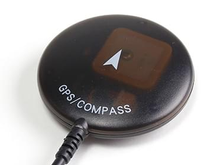
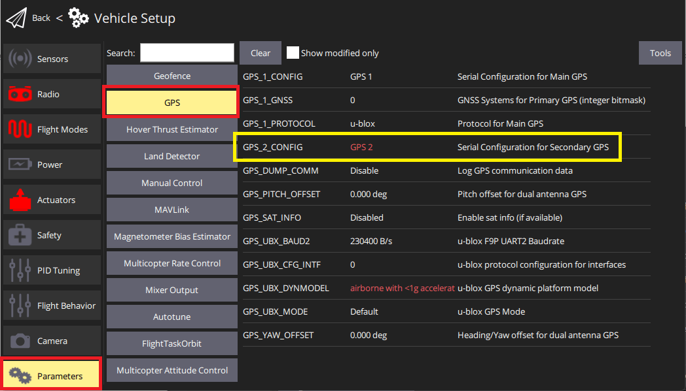
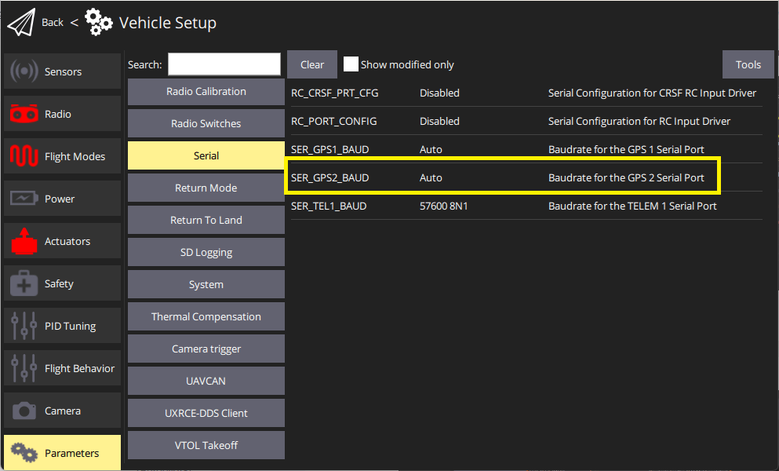

# Global Navigation Satellite Systems (GNSS)

A GNSS system is needed for missions, and some other automatic and manual/assisted modes.
PX4 supports Global Navigation Satellite Systems (GNSS) such as GPS, GLONASS, Galileo, Beidou, QZSS and SBAS, etc. using receivers that communicate via the u-blox, MTK Ashtech or Emlid protocols, or via UAVCAN.

Up to two GPS modules can be connected using either a UART or the CAN bus:

- A primary [GNSS module](../gps_compass/#supported-gnss) that usually also includes a [compass/magnetometer](../gps_compass/magnetometer.md), [buzzer](../getting_started/px4_basic_concepts.md#buzzer), [safety switch](../getting_started/px4_basic_concepts.md#safety-switch), and [UI LED](../getting_started/led_meanings.md#ui-led).
- An optional secondary GNSS/compass module that is used as a fallback.
  This may include a buzzer, safety switch, LEDs, but these are not used by PX4.

::: info
PX4 also supports [Real Time Kinematic (RTK)](../gps_compass/rtk_gps.md) and **Post-Processing Kinematic (PPK)** GNSS Receivers, which extend GNSS systems to centimetre-level precision.
:::

## Supported GNSS

PX4 should work with any unit that communicates via the u-blox, MTK Ashtech or Emlid protocols, or via UAVCAN.

This table contains non-RTK GNSS units (most of which also have a compass).
These have been tested by the PX4 dev team, or which are popular within the PX4 community.

| Device                                                       |     GPS     |          Compass          | [CAN](../dronecan/index.md) | Buzzer / SafeSw / LED | Notes                       |
| :----------------------------------------------------------- | :---------: | :-----------------------: | :-------------------------: | :-------------------: | :-------------------------- |
| [ARK GPS](../dronecan/ark_gps.md)                            |     M9N     |          BMM150           |              ✓              |           ✓           | + Baro, IMU                 |
| [ARK SAM GPS](../gps_compass/ark_sam_gps.md)                 |  SAM-M10Q   |          IIS2MDC          |                             |           ✓           |                             |
| [ARK TESEO GPS](../dronecan/ark_teseo_gps.md)                | Teseo-LIV4F |          BMM150           |              ✓              |           ✓           | + Baro, IMU                 |
| [Avionics Anonymous UAVCAN GNSS/Mag][avionics_anon_can_gnss] |   SAM-M8Q   |         MMC5983MA         |              ✓              |           ✘           |                             |
| [CUAV NEO 3 GPS](../gps_compass/gps_cuav_neo_3.md)           |     M9N     |          IST8310          |                             |           ✓           |                             |
| [CUAV NEO 3 Pro GPS](../gps_compass/gps_cuav_neo_3pro.md)    |     M9N     |          RM3100           |              ✓              |           ✓           | + Baro                      |
| [CUAV NEO 3X GPS](../gps_compass/gps_cuav_neo_3x.md)         |     M9N     |          RM3100           |              ✓              |          ✘✓✓          | + Baro.                     |
| [CubePilot Here2 GNSS GPS (M8N)][CubePilot Here2]            |     M8N     |         ICM20948          |                             |           ✓           | Superseded by HERE3         |
| [Emlid Reach M+](https://emlid.com/reach/)                   |      ✓      |             ✘             |                             |           ✘           | Supports PPK. RTK expected. |
| [Holybro DroneCAN M8N GPS](../dronecan/holybro_m8n_gps.md)   |     M8N     |          BMM150           |              ✓              |           ✘           | + Baro                      |
| [Holybro Micro M8N GPS][Hb Micro M8N]                        |     M8N     |          IST8310          |                             |           ✘           |                             |
| [Holybro Nano Ublox M8 5883 GPS][hb_nano_m8_5883]            |  UBX-M8030  |          QMC5883          |                             |           ✘           |                             |
| [Holybro M8N GPS](../gps_compass/gps_holybro_m8n_m9n.md)     |     M8N     |          IST8310          |                             |           ✓           |                             |
| [Holybro M9N GPS](../gps_compass/gps_holybro_m8n_m9n.md)     |     M9N     |          IST8310          |                             |           ✓           |                             |
| [Holybro DroneCAN M9N GPS][hb_can_m9n]                       |     M9N     |          BMM150           |              ✓              |           ✓           |                             |
| [Holybro M10 GPS][hb_m10]                                    |     M10     |          IST8310          |                             |           ✓           |                             |
| [Hobbyking u-blox Neo-M8N GPS & Compass][hk_ublox_neo_8mn]   |     M8N     |             ✓             |                             |           ✘           |                             |
| [LOCOSYS Hawk A1 GNSS receiver][LOCOSYS Hawk A1]             | MC-1612-V2b |         optional          |                             |          ✘✘✓          |                             |
| [LOCOSYS Hawk R1](../gps_compass/rtk_gps_locosys_r1.md)      | MC-1612-V2b |                           |                             |          ✘✘✓          |                             |
| [LOCOSYS Hawk R2](../gps_compass/rtk_gps_locosys_r2.md)      | MC-1612-V2b |          IST8310          |                             |          ✘✘✓          |                             |
| [mRo GPS u-blox Neo-M8N Dual Compass][mro_neo8mn_dual_mag]   |     M8N     |     LIS3MDL, IST8308      |                             |           ✘           |                             |
| [RaccoonLab L1 GNSS NEO-M8N][RccnLabGNSS250]                 |   NEO-M8N   |          RM3100           |              ✓              |          ✘✘✓          | + Baro                      |
| [Sky-Drones SmartAP GPS](../gps_compass/gps_smartap.md)      |     M8N     | HMC5983, IST8310, LIS3MDL |                             |           ✓           | + Baro                      |
| [Zubax GNSS 2](https://zubax.com/products/gnss_2)            |   MAX-M8Q   |          LIS3MDL          |                             |           ✘           | + Baro                      |

<!-- links to improve layout of table for editing -->

[avionics_anon_can_gnss]: https://www.tindie.com/products/avionicsanonymous/uavcan-gps-magnetometer/
[hk_ublox_neo_8mn]: https://hobbyking.com/en_us/ublox-neo-m8n-gps-with-compass.html
[mro_neo8mn_dual_mag]: https://store.mrobotics.io/product-p/m10034-8308.htm
[hb_nano_m8_5883]: https://holybro.com/products/nano-m8-5883-gps-module
[hb_m10]: https://holybro.com/collections/gps/products/m10-gps
[hb_can_m9n]: https://holybro.com/products/dronecan-m9n-gps
[RccnLabGNSS250]: https://docs.raccoonlab.co/guide/gps_mag_baro/gnss_v250.html
[LOCOSYS Hawk A1]: ../gps_compass/gps_locosys_hawk_a1.md
[Hb Micro M8N]: https://holybro.com/products/micro-m8n-gps
[CubePilot Here2]: ../gps_compass/gps_hex_here2.md

Notes:

- ✓ or a specific part number indicate that a features is supported, while ✘ or empty show that the feature is not supported.
  "?" indicates "unknown".
- Where possible and relevant the part name is used (i.e. ✓ in the GPS column indicates that a GPS module is present but the part is not known).
- The list may omit some discontinued hardware that is still supported (check earlier versions for info about discontinued modules).
  Removed items include:
  - _Here_ GPS
  - Drotek DP0804

## Mounting the GNSS/Compass

Most GNSS modules also contain a [compass/magnetometer](../gps_compass/magnetometer.md) part (see link for calibration/setup information).
Because of this the GNSS module should be mounted as far away from the motor/ESC power supply lines as possible - typically on a pedestal or wing (for fixed-wing).

[Mounting the Compass](../assembly/mount_gps_compass.md) explains how to mount a GNSS module that has a compass.

## Hardware Setup

The hardware setup depends on the flight controller, the GNSS module, and the connection bus it supports - UART/I2C or CAN.

### Pixhawk Standard Connectors

Connecting GNSS/Compass modules is easiest when using a flight controller that supports the [Pixhawk connector standard](https://github.com/pixhawk/Pixhawk-Standards/blob/master/DS-009%20Pixhawk%20Connector%20Standard.pdf).
All flight controllers that follow this standard, including most [Pixhawk Standard](../flight_controller/autopilot_pixhawk_standard.md) controllers (and many others) use the same port connectors and wiring for connecting GNSS modules.
Because of this standardization, many popular GNSS/Compass modules plug directly into the flight controller "out of the box".

If you're using GNSS/Compass modules that connect via generic UARTs and serial protocols like I2C:

- The primary GNSS/Compass module should be connected to the 10-pin port labelled `GPS1`, `GPS&SAFETY`, or `GPS` (this is port described as "Full GPS + Safety Switch Port" in the connector standard).
  The GPS should incorporate a [buzzer](../getting_started/px4_basic_concepts.md#buzzer), [safety switch](../getting_started/px4_basic_concepts.md#safety-switch), and [UI LED](../getting_started/led_meanings.md#ui-led).
- An (optional) secondary module can be connected to the 6-pin `GPS2` port, if present (this is "Basic GPS Port" in the standard).
- The ports are generally plug-n-play for u-blox modules (only).

::: info
The ports include a UART for the GNSS and an I2C port for connecting the Compass.
The "Full GPS + Safety Switch Port" includes additional I2C connectors for LEDs, buzzer and safety switch.
There is nothing to stop you from connecting the GPS pins to any other free UART as a GNSS port, and the compass or buzzer to an I2C port.
However if you do this then you will need to [configure the ports](../peripherals/serial_configuration.md).
:::

For [DroneCAN](../dronecan/index.md#supported-hardware) GNSS/compass modules:

- DroneCan GPS modules are connected to CAN-bus ports, which are 4-pin ports labeled `CAN1` or `CAN2`.

### Other Flight Controllers/GNSS Modules

If you're working with a flight controller and GNSS module combination that does not comply with the Pixhawk connector standard then you will need to pay particular attention to the connector pinouts on the flight controller and the module.
You may need to rewire/solder the connectors.

:::warning
Some flight controllers use ports that are software-compatible but not connector compatible (even if they use the same connector!) because they use different pin orderings.
:::

The pinouts for the connector standard are documented in the standard.
Pinouts for other controllers and the GNSS modules should be included in their manufacturer documentation.

## GNSS Configuration

The default configuration for GPS module connected via the GPS serial port is provided below.
Additional device-specific configuration may be provided in PX4 or manufacturer device documentation (e.g. [Trimble MB-Two > Configuration](../gps_compass/rtk_gps_trimble_mb_two.md#configuration)).

### Primary GPS Configuration (UART)

Primary GPS configuration on Pixhawk is handled transparently for U-Blox GPS modules — simply connect the GPS module to the port labeled `GPS1`, `GPS&SAFETY`, or `GPS` (if there is only one GPS port), and everything should work.

The default [Serial Port Configuration](../peripherals/serial_configuration.md#default_port_mapping) configures `GPS1` as a GPS port using [GPS_1_CONFIG](../advanced_config/parameter_reference.md#GPS_1_CONFIG), sets the protocol to `u-blox` with [GPS_1_PROTOCOL](../advanced_config/parameter_reference.md#GPS_1_PROTOCOL), and a baud rate of `0: Auto` with [SER_GPS1_BAUD](../advanced_config/parameter_reference.md#SER_GPS1_BAUD).

For GPS types like Trimble, Emlid, MTK, you will need to change the `GPS_1_PROTOCOL` appropriately.
For _Trimble MB-Two_ you will also need to modify `SER_GPS1_BAUD` to set the rate to 115200 baud.

### Secondary GPS Configuration (UART)

To use a secondary GPS, you will generally attach it to the port named `GPS2`, if present, and otherwise attach it to any free UART port.
The port may be pre-configured, but unlike the primary port, this is not guaranteed.

To ensure the port is set up correctly perform a [Serial Port Configuration](../peripherals/serial_configuration.md) to assign [GPS_2_CONFIG](../advanced_config/parameter_reference.md#GPS_2_CONFIG) to the selected port.

The following steps show how to configure a secondary GPS on the `GPS 2` port in _QGroundControl_:

1. [Find and set](../advanced_config/parameters.md) the parameter [GPS_2_CONFIG](../advanced_config/parameter_reference.md#GPS_2_CONFIG) to **GPS 2**.

   - Open _QGroundControl_ and navigate to the **Vehicle Setup > Parameters** section.
   - Select the **GPS** tab, then open the [GPS_2_CONFIG](../advanced_config/parameter_reference.md#GPS_2_CONFIG) parameter and select `GPS 2` from the dropdown list.

     

1. Reboot the vehicle in order to make the other parameters visible.
1. Select the **Serial** tab, and open the [SER_GPS2_BAUD](../advanced_config/parameter_reference.md#SER_GPS2_BAUD) parameter (`GPS 2` port baud rate): set it to _Auto_ (or 115200 for the Trimble).

   

After setting up the second GPS port:

1. Configure the ECL/EKF2 estimator to blend data from both GPS systems.
   For detailed instructions see: [Using the ECL EKF > Dual Receivers](../advanced_config/tuning_the_ecl_ekf.md#dual-receivers).

### DroneCAN GNSS Configuration

[DroneCAN](../dronecan/index.md#supported-hardware) GNSS configuration is covered in the linked document (and in the documentation for specific modules).

### Configuring GPS as Yaw/Heading Source

GPS can be used as a source for yaw fusion when using modules where _yaw output is supported by the device_.
This is documented in [RTK GPS > Configuring GPS as Yaw/Heading Source](../gps_compass/rtk_gps.md#configuring-gps-as-yaw-heading-source).

## Compass Configuration

Compass calibration for an included compass part is covered in: [Compass Configuration](../config/compass.md).

## GNSS Data Overview

PX4 uses the subset of information that can be provided by most GNSS modules.
This is written to the [SensorGps](../msg_docs/SensorGps.md) uORB message and used by the estimator as an input to global position estimation.
It is also streamed via MAVLink using messages such as [GPS_RAW_INT](https://mavlink.io/en/messages/common.html#GPS_RAW_INT) and [GPS2_RAW](https://mavlink.io/en/messages/common.html#GPS2_RAW).

Some of GNSS terms that are useful for interpreting the data include:

- `DOP`: Dilution of position (dimensionless).
  This is a measure of the geometric quality of satellite positions and their effect on the precision of the GPS receiver's calculations.
- `EPH`: Standard deviation of horizontal position error (metres).
  This represents the the uncertainty in the GPS fix latitude and longitude.
- `EPV`: Standard deviation of vertical position error (metres).
  This represents the the uncertainty in the GPS fix altitude.

### DOP vs EPH/EPV

DOP is a measure of the potential for high accuracy based on satellite positions.
EPH/EPV are more comprehensive: they are direct estimates of the GPS position error and consider both satellite geometry and other error sources like signal noise and atmospheric effects.
It is possible to have low DOP (good satellite geometry) but still have high EPH/EPV if there is significant signal noise or atmospheric interference.

EPH/EPV values therefore provide a more immediate and practical estimate of the actual GPS accuracy you can expect under current conditions.

## Developer Information

- GPS/RTK-GPS
  - [RTK-GPS](../advanced/rtk_gps.md)
  - [GPS driver](../modules/modules_driver.md#gps)
  - [DroneCAN Example](../dronecan/index.md)
- Compass
  - [Driver source code](https://github.com/PX4/PX4-Autopilot/tree/main/src/drivers/magnetometer) (Compasses)
