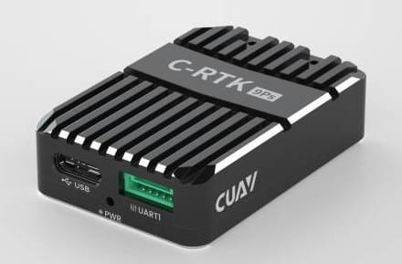
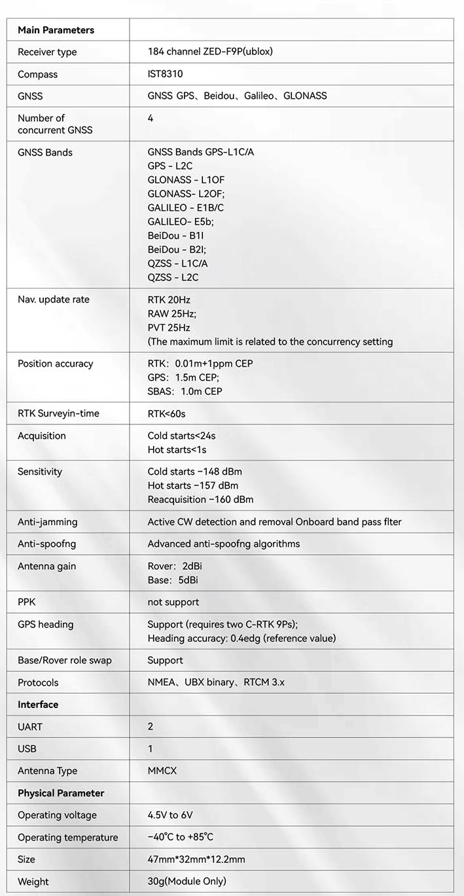
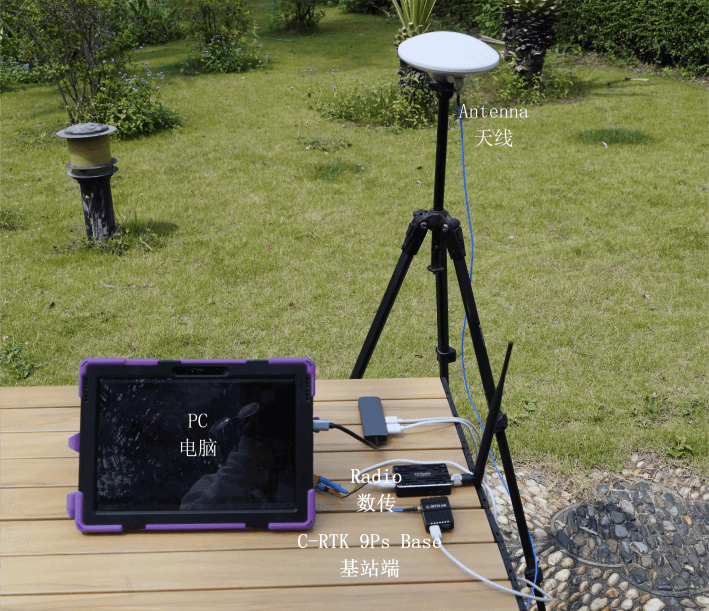
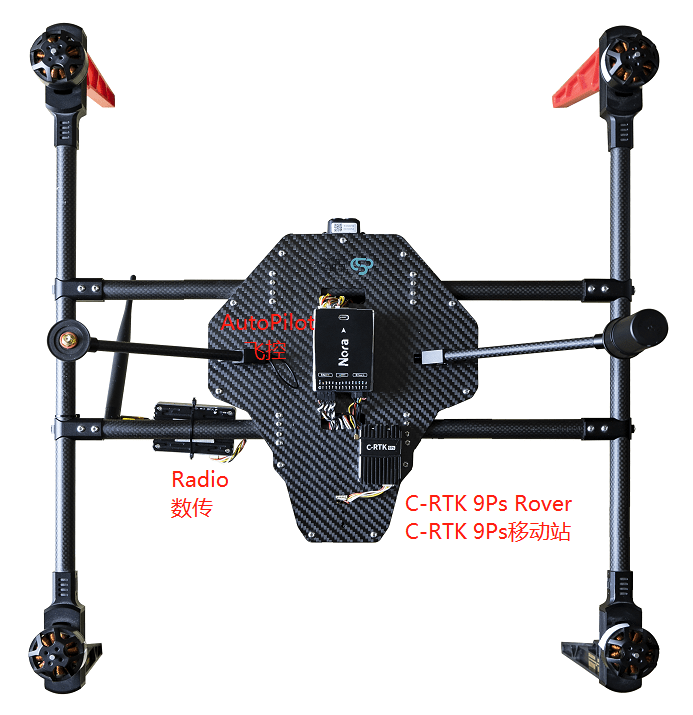
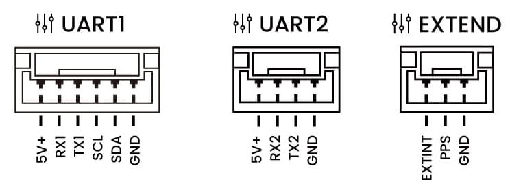
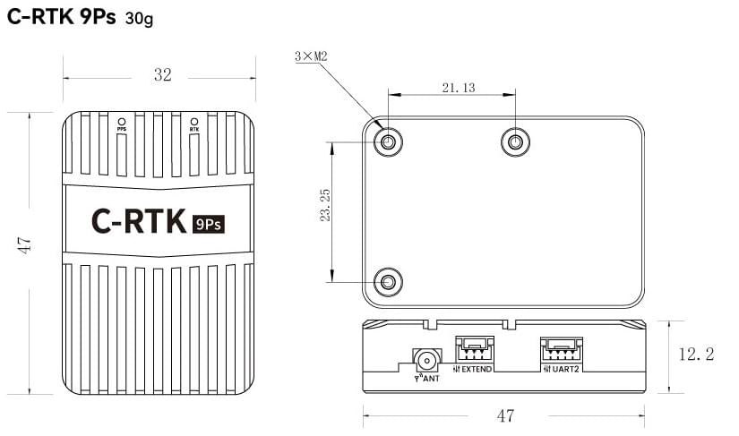
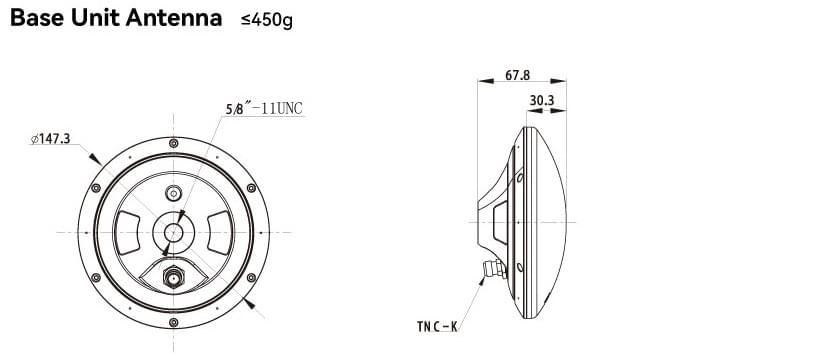
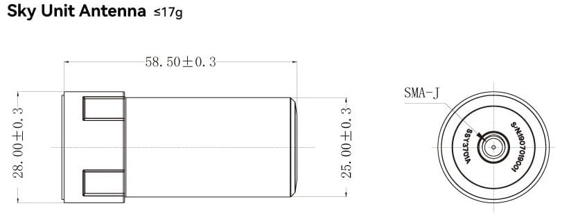
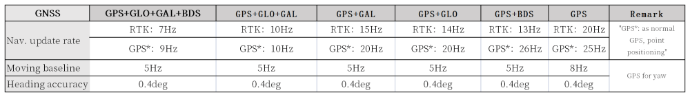

# CUAV C-RTK 9Ps

The CUAV [C-RTK 9Ps](https://www.cuav.net/en/c_rtk_9ps/) is a multi-satellite, multi-band, centimeter-level, RTK GNSS system.

The module simultaneously receives GPS, GLONASS, Galileo and Beidou satellite signals, enabling faster positioning and higher accuracy.
It also supports [RTK GPS Heading](../gps_compass/u-blox_f9p_heading.md) using dual modules.

Using the C-RTK 9Ps gives PX4 centimeter-level positioning precision.
This is ideal for survey drones, agricultural drones and other application scenarios.

## Where to Buy

[cuav Store](https://store.cuav.net/shop/c-rtk-9ps/)

## Specification

## Wiring and Connections

**C-RTK 9Ps (Base)**

- Use a tripod to mount the base station's antenna to the top, and connect the antenna to the base station
- Connect the base station and telemetry to the computer with a usb cable.

**C-RTK 9Ps (Rover)**

- Mount the C-RTK 9Ps (Rover) antenna vertically.
- Connect the antenna to the C-RTK 9Ps (Rover).
- Connect the C-RTK 9Ps (Rover) to the flight controller.
- Connect telemetry to the flight controller `TELEM1`/`TELEM2` interface

::: info
C-RTK 9Ps come with 6-pin and 10-pin connectors compatible with Pixhawk-standard flight controllers.
Connect to `GPS1` or `GPS2`.
Select the appropriate cable for the flight controller.
:::

## Configuration

RTK setup and use on PX4 via _QGroundControl_ is largely plug and play (see [RTK GPS](../gps_compass/rtk_gps.md) for more information).

## Pinouts

## Physical Dimensions

## Navigation update rates

## More information

[CUAV docs](https://doc.cuav.net/gps/c-rtk-series/en/c-rtk-9ps/)
