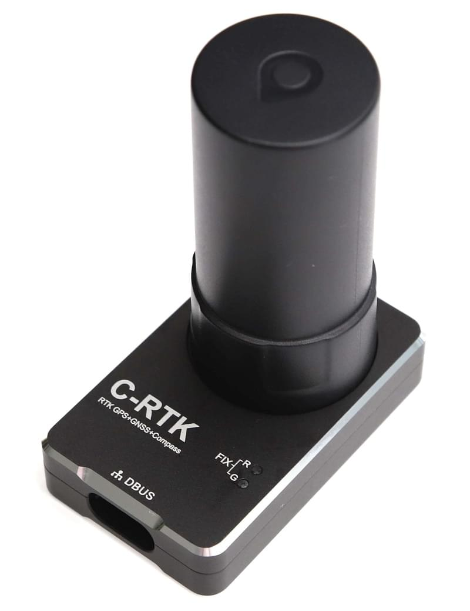

# CUAV C-RTK

The [CUAV C-RTK GPS receiver](https://www.cuav.net/en/c_rtk_9ps/) is an [RTK GPS module](../gps_compass/rtk_gps.md) for the mass market.
A complete RTK system consists of at least two C-RTK modules \(one for the base station and the others for the aircraft\). Using RTK, PX4 can get its position with centimetre-level accuracy, which is much more accurate than can be provided by a normal GPS.

## Where to Buy

- [cuav taobao](https://item.taobao.com/item.htm?id=565380634341&spm=2014.21600712.0.0)
- [cuav aliexpress](https://www.aliexpress.com/store/product/CUAV-NEW-Flight-Controller-GPS-C-RTK-differential-positioning-navigation-module-GPS-for-PIX4-Pixhawk-pixhack/3257035_32853894248.html?spm=2114.12010608.0.0.75592fadQKPPEn)

## Configuration

RTK setup and use on PX4 via _QGroundControl_ is largely plug and play \(see [RTK GPS](../gps_compass/rtk_gps.md) for more information\).

## Wiring and Connections

C-RTK GPS comes with a cable that terminates in a 6-pin connector and 4-pin connector that are compatible with [Pixhack v3](https://doc.cuav.net/flight-controller/pixhack/en/quick-start-pixhack-v3x.html#gps--compass).
The 6-pin connector provides the interface for RTK GPS, and should be connected to the flight controller's GPS port.
The 4-pin connector is an m8n (standard) GPS interface that is intended for (optional) use as a second GPS.

:::tip
At time of writing PX4 does not yet fully support a second GPS. The 4-pin port need not be connected.
:::

The cables/connectors may need to be modified in order to connect to other flight controller boards. The pin mappings for _Pixhawk 3 Pro_ and _Pixracer_ are shown below.

### Pinout

The C-RTK GPS pinout is provided below. This can be used to help modify the connector for other autopilot boards.

| pin | C-RTK GPS 6P | pin | Pixhawk 3 Pro GPS | C-RTK GPS 4P |
| --- | ------------ | --- | ----------------- | ------------ |
| 1   | SDA          | 1   | VCC               |              |
| 2   | SCL          | 2   | GPS_TX            |              |
| 3   | GPS_RX       | 3   | GPS_RX            | GPS_RX       |
| 4   | GPS_TX       | 4   | SCL               | GPS_TX       |
| 5   | VCC_5V       | 5   | SDA               | VCC_5v       |
| 6   | GND          | 6   | GND               | GND          |
