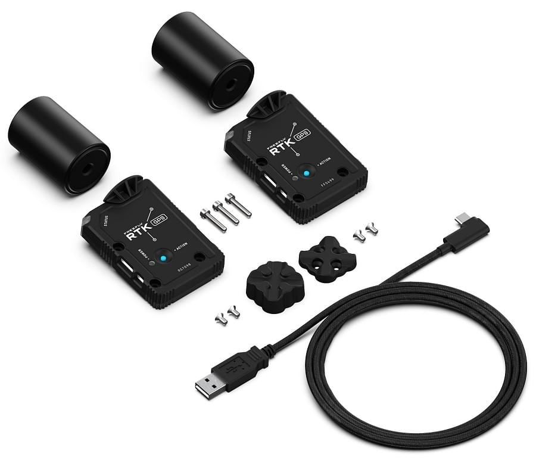

# Freefly Systems RTK GPS

The [Freefly Systems RTK GPS Module](https://store.freeflysystems.com/products/rtk-gps-ground-station) is a multiband [RTK GPS module](../gps_compass/rtk_gps.md) from Freefly Systems that provides highly reliable navigation.
The modules can act as either rovers (when installed on an aircraft) or base stations (when plugged into a computer).

Main features include:

- Multiband (L1/L2) receiver (u-blox ZED-F9P)
- Concurrent reception of all 4 GNSS (GPS, Galileo, GLONASS, BeiDou)
- Built-in magnetometer (IST8310), baro (BMP388), RGB LED, safety switch and safety LED

::: info
This module can be used with PX4 v1.9 or above (support for the u-blox ZED-F9P was added in PX4 v1.9).
:::

## Where to Buy

- [Freefly Store](https://store.freeflysystems.com/products/rtk-gps-ground-station)

## Kit Contents

An RTK GPS kit includes:

- 2x GPS modules with antennas
- 3m USB C to A cable
- Magnetic quick-mount for base station module (1/4-20 thread for tripod mounting)
- Screws to mount onto a Freefly AltaX

## Configuration

RTK setup and use on PX4 via _QGroundControl_ is largely plug and play (see [RTK GPS](../gps_compass/rtk_gps.md) for more information).

For the aircraft, you should set the parameter [SER_GPS1_BAUD](../advanced_config/parameter_reference.md#SER_GPS1_BAUD) to 115200 8N1 to ensure that PX4 configures the correct baudrate.

## Wiring and Connections

The Freefly RTK GPS comes with an 8 pin JST-GH connector that can be plugged into a PixHawk autopilot.
For use as a base station, the module has a USB-C connector

### Pinout

The Freefly GPS pinout is provided below.
For some autopilots, like the [Hex Cube](../flight_controller/pixhawk-2.md) and [PixRacer](../flight_controller/pixracer.md), all that is needed is a 1-1 8-pin JST-GH cable.

| Pin | Freefly GPS |
| --- | ----------- |
| 1   | VCC_5V      |
| 2   | GPS_RX      |
| 3   | GPS_TX      |
| 4   | I2C_SCL     |
| 5   | I2C_SDA     |
| 6   | BUTTON      |
| 7   | BUTTON_LED  |
| 8   | GND         |

## Specification

- u-blox ZED-F9P GPS Receiver
  - Ultracap backup power for fast (hot-start) restarts
  - EMI shield over receiver for improved EMI immunity
- IST8310 Magnetometer
- Safety-switch and safety LED
- RGB LEDs for status indication
  - NCP5623CMUTBG I2C Driver
- BMP388 Baro on I2C bus
- External, active antenna (Maxtena M7HCT)
  - SMA connector
- STM32 MCU for future CAN-based communication
  - FW updates through USB connector
- Connectivity:
  - USB-C
  - 2-way USB Switch to MCU and F9P
  - SMA for active antenna (20mA max)
  - 4-pin JST-GH CAN Bus (dronecode compliant)
  - 8-pin JST-GH UART/I2C
    -\*\* Power:
  - Input from either (diode OR'd):
  - USB (5V)
  - CAN (4.7 to 25.2V)
  - (4.7 to 25.2V)
  - Power consumption <1W

## More Information

More information can be found on [Freefly's Wiki](https://freefly.gitbook.io/freefly-public/products/rtk-gps)
