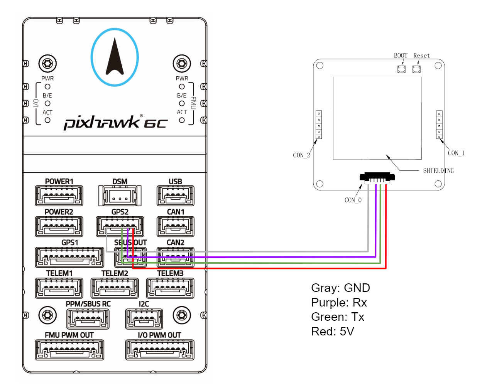

# DATAGNSS GEM1305 RTK Receiver with antenna

GEM1305 is a RTK receiver with antenna designed and manufactured by [DATAGNSS](https://www.datagnss.com/).

GEM1305 is based on the new generation CYNOSURE IV dual-core GNSS SoC.
It supports RTK functionality with a maximum data update rate of 10Hz, and comes with cables for connecting to GPS ports on most Pixhawk devices.

::: info

- GEM1305 RTK doesn't support moving base mode yet.
- GEM1305 RTK does not include a compass.

:::

## Where to Buy

- [GEM1305 RTK receiver with antenna](https://www.datagnss.com/collections/gnss-for-drone/products/gem1305) (www.datagnss.com)

  

- [DGM10 RTK Receiver](https://www.datagnss.com/collections/gnss-for-drone/products/dgm10-rtk-receiver) (same receiver in a casing).

  

## Key Features

- Full constellation, multi-frequency GNSS satellite receiver
- Support RTK with up to 10hz output rate
- Standard UART serial interface
- Lightweight only 50g or 26g(NANO RTK receiver)
- High performance antenna

## Frequencies

- GPS/QZSS: L1 C/A, L5C
- GLONASS: L1OF
- BEIDOU: B1I, B2a
- GALILEO: E1, E5a
- IRNSS: L5

## GNSS

- 128 hardware channels
- 3D accuracy: **1.5m** CEP
- RTK accuracy: **2cm** +1PPM(H), 3cm+1PPM(V)

## Interface

- UART: 230400bps default
- SMA connector for antenna
- Output rate 5Hz default, up to 10Hz
- Main power supply: 4.7~5.2V

## Protocol

- NMEA-0183 output
- RTCMv3 input/output

## Environment

- Operating temp. -20~85°C

## Dimension and Weight

- 55x55x12mm
- 50g (GEM1305) 26g (NANO with Helix)

## Pinout

The board is connected to the autopilot via UART interface.

The 1.25mm pitch 6P connector (from left: PIN1 to PIN6):

- 1: GND
- 2: NC
- 3: PPS
- 4: Rx
- 5: Tx
- 6: 5V

The board does not include a compass and so does not require connections for a compass part.

## Hardware Setup

RTK requires a base RTK module attached to the ground station, and a rover RTK module on the vehicle.
The data from the base needs to be transmitted to the drone via telemetry radio and inputed into the RTK receiver on the rover.

The setup/connections for base and rover modules are shown below.

### Base Setup (GCS)

The base station connections are shown in the diagram below, along with the connection to a telemetry radio.

Note that for the base we recommend the [NANO RTK Receiver](https://www.datagnss.com/collections/gnss-for-drone/products/multi-band-rtk-receiver-package) because it is easier to setup.

See to [How to setup Base station](https://wiki.datagnss.com/index.php/GEM1305-autopilot#Base_station_setup) for information on how to configure the module for use as a base station (not including step 6 and later, for which you would QGroundControl instead of Mission Planner).

### Rover Setup (PX4)

The rover setup showing connections to a GPS port and the (required) connection to a telemetry radio are shown in the diagram below.

The diagram below shows the wiring from the `GPS2` port on the Pixhawk 6c flight controller.
Note that an appropriate cable is supplied for this purpose.

GPS and RTK configuration on PX4 via _QGroundControl_ is plug and play (see [RTK GPS](../gps_compass/rtk_gps.md) for more information).

## Package List

- GEM1305 RTK Receiver
- DG-6P-C01, GH-1.25mm-6P cable

## Resources

- [GEM1305 2D drawing file](https://wiki.datagnss.com/index.php/GEM1305)
- [NANO RTK Receiver 2D drawing file](https://wiki.datagnss.com/images/3/31/EVK-DG-1206_V.2.0.pdf)
- [GEM1305 Wiki](https://wiki.datagnss.com/index.php/GEM1305) (DATAGNSS WiKi)
- [HED-10L Heading RTK Receiver](https://wiki.datagnss.com/index.php/HED-10L)

## More information

- [NANO RTK Receiver](https://www.datagnss.com/collections/evk/products/tau951m-1312-tiny-evk)
- [HELIX Antenna for RTK](https://www.datagnss.com/collections/rtk-antenna/products/smart-helix-antenna)
- [RTK Antenna AGR6302G](https://www.datagnss.com/collections/rtk-antenna/products/antenna-agr6302g)
- [AT400 RTK Antenna](https://www.datagnss.com/collections/rtk-antenna/products/at400-multi-band-antenna-for-rtk)
