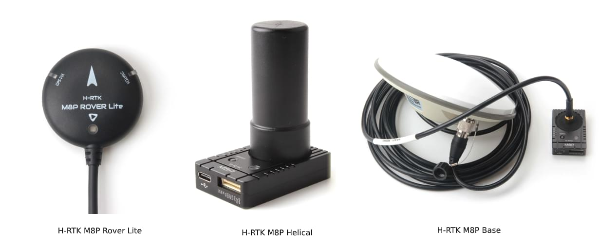
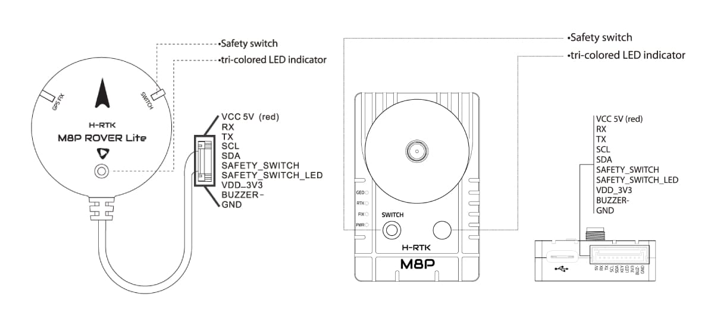
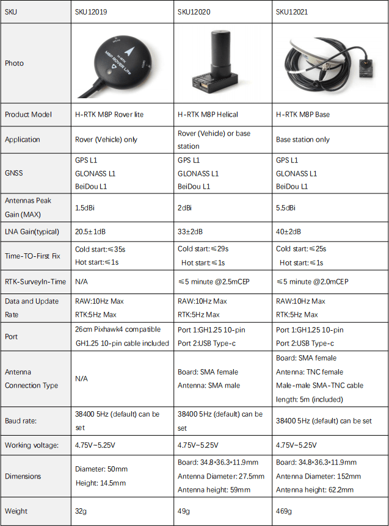

# Holybro H-RTK M8P GNSS (Discontinued)

:::warning
This GNSS has been discontinued, and is no longer commercially available.
:::

The [Holybro H-RTK M8P GNSS](https://holybro.com/collections/standard-h-rtk-series/products/h-rtk-m8p-gnss-series) is an [RTK GNSS module](../gps_compass/rtk_gps.md) series for the mass market.
This family is similar to the [H-RTK M9P](../gps_compass/rtk_gps_holybro_h-rtk-f9p.md) series but uses the smaller, lighter, and less expensive M8P u-blox RTK GNSS module (which still provides far superior position resolution than previous generations\_.

There are three models of Holybro H-RTK M8P to choose from, each with different antenna design to meet different needs.
Refer to the [Specification and Model Comparison section](#specification-and-model-comparison) for more details.

Using RTK allows PX4 to get its position with centimeter-level accuracy, which is much more accurate than can be provided by a normal GPS.

## Where to Buy

- [H-RTK M8P (GPS RTK Mounts)](https://holybro.com/products/vertical-mount-for-h-rtk-helical)

## Configuration

RTK setup and use on PX4 via _QGroundControl_ is largely plug and play \(see [RTK GPS](../gps_compass/rtk_gps.md) for more information\).

## Wiring and Connections

All H-RTK GNSS models come with a GH 10-pin connector/cable that is compatible with [Pixhawk 4](../flight_controller/pixhawk4.md).

::: info
The cables/connectors may need to be modified in order to connect to other flight controller boards (see [pin map](#pin_map)below).
:::

## Pin Map

## Specification and Model Comparison

## GPS Accessories

[GPS Accessories (Holybro Website)](https://holybro.com/collections/gps-accessories)

