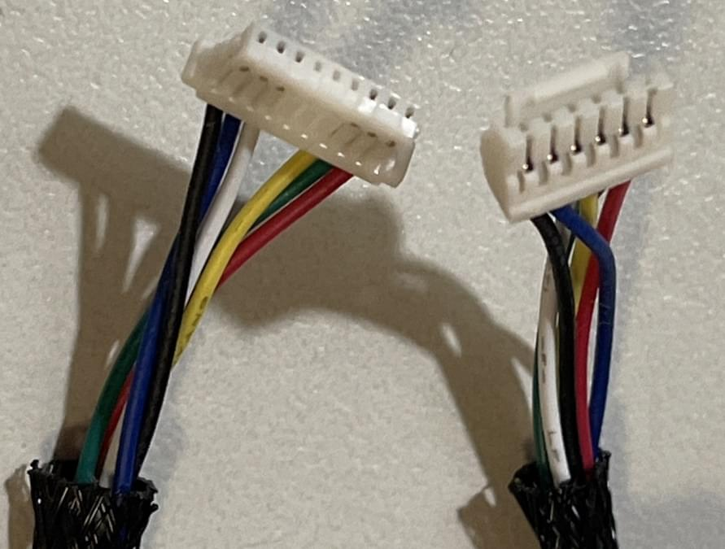

# LOCOSYS Hawk R2 RTK-Compass GPS

<Badge type="tip" text="PX4 v1.13" />

The [LOCOSYS Hawk R2](https://www.locosystech.com/en/product/hawk-r2.html) is a dual-frequency [RTK GPS module](../gps_compass/rtk_gps.md) receiver designed for compatibility with Pixhawk. The only difference between this module and the [LOCOSYS Hawk R1](rtk_gps_locosys_r1.md) is the presence of a magnetometer on Hawk R2.

The module can act as an RTK GPS rover when installed on the aircraft.

The receiver is capable of concurrently tracking all global civil navigation systems, including GPS, GLONASS, GALILEO, BEIDOU and QZSS.
It acquires both L1 and L5 signals at the same time while providing the centimeter-level RTK positioning accuracy.

The built-in lightweight helical antenna enhances RTK positioning stability. Additionally, it is equipped with a compass.
The fast time-to-first-fix, RTK convergence, superior sensitivity, low power consumption make it a better choice for Pixhawk-based platform UAVs.

## Main Features

- Centimeter-level RTK high position accuracy+ integrated 3-axis magnetometer
- Concurrent reception of L1 and L5 band signals
- Support GPS, GLONASS, BEIDOU, GALILEO, QZSS
- Capable of SBAS (WAAS, EGNOS, MSAS, GAGAN)
- Support 135-channel GNSS
- Fast TTFF at low signal level
- Free hybrid ephemeris prediction to achieve faster cold start
- Default 5Hz, up to 10 Hz update rate (SBAS support 5Hz only)
- Build-in super capacitor to reserve system data for rapid satellite acquisition
- Build-in 3 axis compass function
- Three LED indicator for Power, PPS and Data transmit

## Where to Buy

- [LOCOSYS Hawk R2](https://www.locosystech.com/en/product/hawk-r2.html)

## Kit Contents

An RTK GPS kit includes:

- 1x GPS Module
- 1x Helix antenna
- 1x 6-pin JST-ready cable

## Wiring and Connections

Hawk R2 RTK GPS comes with an 6 pin JST connector that can be plugged into the GPS2 port on Pixhawk-standard autopilots.

It can also be used on other UART ports, but you would need to connect and configure the port used.
The pinout below is provided in case you need to create a custom cable.

### Pinout

LOCOSYS GPS pinout is provided below.

| Pin | Hawk R2 GPS |
| --- | ----------- |
| 1   | VCC_5V      |
| 2   | GPS_RX      |
| 3   | GPS_TX      |
| 4   | GNSS_PPS    |
| 5   | Null        |
| 6   | Null        |
| 7   | I2C_CLK     |
| 8   | I2C_DAT     |
| 9   | GND         |

## PX4 Configuration

After connecting your Hawk R2 to the `GPS2` port on compatible Pixhawk boards, RTK setup and use on PX4 via _QGroundControl_ is largely plug and play.
For more information see: [RTK GPS](../gps_compass/rtk_gps.md#positioning-setup-configuration).

You should also configure the serial port you are using to the correct baud rate.
If you're using GPS2, set the parameter [SER_GPS2_BAUD](../advanced_config/parameter_reference.md#SER_GPS2_BAUD) to 230400 8N1.

The compass only requires the usual [Compass Calibration](../config/compass.md).

## Status LEDs

| Color | Name            | Description                        |
| ----- | --------------- | ---------------------------------- |
| Green | TX Indicator    | GNSS Data transmission             |
| Red   | Power Indicator | Power                              |
| Blue  | PPS             | Precise Positioning Service active |

## Specification

- Frequency
  - GPS/QZSS: L1 C/A, L5C
  - GLONASS: L1OF
  - BEIDOU: B1I, B2a
  - GALILEO: E1, E5a
- 135 Channels support
- Up to 10 Hz update rate (default to 5Hz)
- Acquisition Time
  - Hot start (Open Sky) in 2 seconds
  - Cold Start (Open Sky) in 28 seconds without AGPS
- PPS with 100ms pulse width, 1.8Vdc
- External, active Helix antenna
  - SMA connector
- UBlox Protocol Support
  - U5Hz:UBX-NAV-PVT,UBX-NAV-DOP
  - 1Hz: UBX-NAV-TIMEGPS
- Connectivity:
  - 6-pin JST-GH UART/I2C (Pixhawk compatible)
- Power:
  - DC supply voltage 3.3V ~ 5.0V input
  - Power consumption <1W

## More Information

More information can be found on [LOCOSYS Hawk R2](https://www.locosystech.com/en/product/hawk-r2.html)
