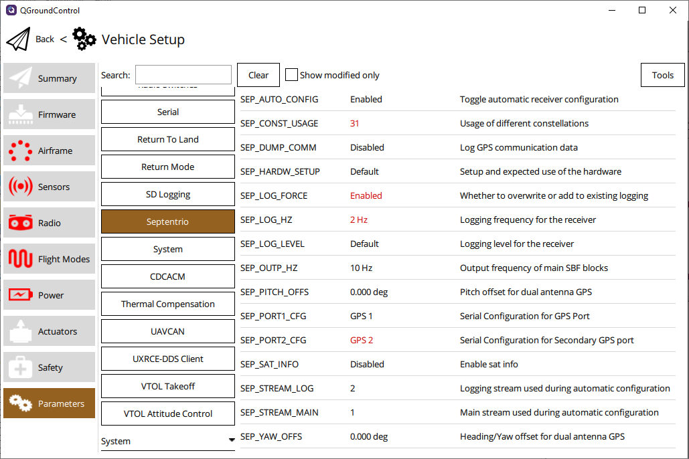

# Septentrio GNSS Receivers

PX4 supports Septentrio GNSS receivers based on the mosaic-X5 and mosaic-H receiver modules.
It has [parameterized](../advanced_config/parameter_reference.md#septentrio) automatic configuration to fit different use cases.
The output is processed by the Septentrio driver in PX4 and made available to the rest of the system like the MAVLink and EKF modules.

Certain receivers are recommended for autopilot applications because of their physical or technical properties, including:

- [AsteRx-m3 Pro](../gps_compass/septentrio_asterx-rib.md)

  Dual-antenna, ultra-low-power GNSS rover receiver with support for heading.

- [AsteRx-m3 Pro+](https://www.septentrio.com/en/products/gps/gnss-boards/asterx-m3-pro-plus)

  Dual-antenna, ultra-low-power versatile GNSS rover and base receiver with support for heading.

- [mosaic-go](../gps_compass/septentrio_mosaic-go.md)

  Single-antenna evaluation kit with support for L5 frequency band, based on the mosaic-X5 GNSS
  receiver module.

- [mosaic-go heading](https://www.septentrio.com/en/products/gps/gnss-receiver-modules/mosaic-h-evaluation-kit)

  Dual-antenna evaluation kit with support for heading, based on the mosaic-H GNSS receiver module.

## Supported Features

- RTK positioning using corrections over MAVLink from a ground control station
- Dual-antenna heading with mosaic-H-based receivers
- Moving base heading with two single-antenna receivers
- SBF logging to internal storage on the receiver
- Logging of all communication with the receiver to internal storage on the flight controller
- Automatic baud rate and port detection
- Automatic, parameterized configuration for all features
- Status and health monitoring from a MAVLink console

## Quick Start

For the physical connection between Septentrio GNSS receivers and flight controllers, have a look at the hardware-specific guides for [mosaic-go receivers](septentrio_mosaic-go.md) and [AsteRx-m3 receivers with a robotics interface board](../gps_compass/septentrio_asterx-rib.md).

A few things are required for PX4 to support Septentrio receivers.
First of all, the firmware you load on your flight controller needs to contain the Septentrio driver.
This should be the case for most flight controller boards from PX4 v1.15.

You can confirm this by opening _QGroundControl_, connecting to the flight controller running the firmware you want to use, and checking whether the `Septentrio` parameter group is available in the parameter configuration screen.



::: tip
If you don't see the `Septentrio` parameter group, then you will need to set `CONFIG_DRIVERS_GNSS_SEPTENTRIO=y` in your [PX4 Board Configuration (Kconfig)](../hardware/porting_guide_config.md).
:::

Next you need to tell PX4 which serial port the receiver is connected to.
The serial port name is usually indicated by a label above the port on the flight controller.
If you plugged in the receiver into the port labeled `GPS 1` or `GPS & SAFETY`, you need to set the [SEP_PORT1_CFG](../advanced_config/parameter_reference.md#SEP_PORT1_CFG) parameter to `GPS 1`.
You also need to make sure no other driver is [configured to use this serial port](../peripherals/serial_configuration.md).

::: warning
By default, the `GPS` module will be configured to use the `GPS 1` port.
Make sure to set `GPS_1_CONFIG` to `Disabled`.
:::

PX4 should then automatically configure the connected receiver(s), after which the position will become visible in _QGroundControl_ and its GPS icon will display general status information.

Note that you can also use a secondary Septentrio GNSS module, which is configured in a similar way.
It is common to connect a second module to the port labeled `GPS 2`
The port is configured using the [SEP_PORT2_CFG](../advanced_config/parameter_reference.md#SEP_PORT2_CFG) parameter.

## Serial Configuration

Septentrio GNSS receivers make use of a serial connection to the autopilot.
There are two types of parameters available to configure this connection.
First there are the parameters under the `Septentrio` group in QGC, which can be used to select the physical port the receiver is connected to.
If for example one receiver is connected to the port labelled "GPS 2", then you need to set `SEP_PORT1_CFG` to `GPS 2`, meaning the main receiver (hence the 1 in `SEP_PORT1_CFG`) is connected to the secondary GPS port (`GPS 2`).

The baud rate used for the serial connection is also configurable.
It can be set to any of baud rates supported by Septentrio GNSS receivers.
The driver will always detect the baud rate of the receiver and if a baud rate is set, it will configure the receiver to use this one.
If none is set, the driver will use the current baud rate of the receiver.
Higher values make for a faster connection, but may fail if there is lots of interference or the cabling is of poor quality.
Using other baud rates will not work and the driver will fall back to a default of `230400`.
When using RTK positioning or higher receiver output rates, values above `460800` are recommended.

The recommended rates are:

- `57600`
- `115200`
- `230400`
- `460800`
- `921600`

::: info
Baud rates of `500000`, `576000`, `1000000`,`1500000` are also supported by the driver, but are non-standard and should be avoided.
:::

## Automatic Configuration

Normally the driver automatically configures the connected receivers as long as the ports have been set correctly.
Some users may wish to perform additional changes to their configuration, in which case you will need to change the [SEP_AUTO_CONFIG](../advanced_config/parameter_reference.md#SEP_AUTO_CONFIG) parameter to disable automatic configuration.
Note that the driver always detects the baud rate and receiver port to ensure correct operation, and will do so regardless of whether automatic configuration is disabled.

Many [other parameters](../advanced_config/parameter_reference.md#septentrio) are available to change how the receiver is configured. [SEP_CONST_USAGE](../advanced_config/parameter_reference.md#SEP_CONST_USAGE) can be used to choose which constellations to include/exclude from PVT computation. [SEP_OUTP_HZ](../advanced_config/parameter_reference.md#SEP_OUTP_HZ) changes the frequency of PVT data output to the flight controller.

[SEP_STREAM_MAIN](../advanced_config/parameter_reference.md#SEP_STREAM_MAIN) and [SEP_STREAM_LOG](../advanced_config/parameter_reference.md#SEP_STREAM_LOG) change which streams are used for the main and logging output from the receiver.
These can be changed when you already use the default streams for other purposes.
Make sure to use two different streams. Using the same one for both will prevent logging from starting correctly.

## GNSS-Based Heading

Heading determines the orientation of the vehicle. GNSS-based heading allows for heading without relying on an internal compass, which might encounter interference from the motors and other factors on a vehicle.

There are two ways to use Septentrio GNSS receivers for GNSS-based heading.
The first is to use a receiver based on the mosaic-H receiver module, like the mosaic-go heading, AsteRx-m3 Pro and AsteRx-m3 Pro+.
Heading will work automatically when one of these is connected and has two antennas attached.

The other is to use two separate receivers attached to two ports, each with one antenna.
In that case the [SEP_HARDW_SETUP](../advanced_config/parameter_reference.md#SEP_HARDW_SETUP) parameter has to be set to `Moving base` and the main receiver (set by `SEP_PORT1_CFG`) will act as the rover.
To switch rover and base in the moving base setup, switch `SEP_PORT1_CFG` and `SEP_PORT2_CFG` or physically swap the connected receivers.

It is important that the antennas are positioned at least 30 cm apart for a stable heading result.
In a normal setup, the main antenna is behind the auxiliary one.
If another setup is used, the [SEP_YAW_OFFS](../advanced_config/parameter_reference.md#SEP_YAW_OFFS) value needs to be changed accordingly.
If the antennas are not at the same height, the [SEP_PITCH_OFFS](../advanced_config/parameter_reference.md#SEP_PITCH_OFFS) value needs to be changed.

## Logging

There are two ways to log data for Septentrio GNSS receivers.
The first is to log certain SBF (Septentrio Binary Format) blocks internally on the receiver.
The second is to log incoming, outgoing, or all communication between the flight controller and receiver on the internal storage in the flight controller.

### Internal Receiver Logging

The driver can configure the receivers to log their data to internal storage, which can be valuable for troubleshooting if something goes wrong.
There are three parameters to change the logging configuration.

- [SEP_LOG_HZ](../advanced_config/parameter_reference.md#SEP_LOG_HZ) sets the frequency of the internal logging and can also be used to disable logging.
- [SEP_LOG_FORCE](../advanced_config/parameter_reference.md#SEP_LOG_FORCE) sets whether the driver overwrites existing messages on the logging stream (`Enabled`) or appends to them (`Disabled`).
- [SEP_LOG_LEVEL](../advanced_config/parameter_reference.md#SEP_LOG_LEVEL) sets the verbosity of the internal logging.
  There are four levels:

  | Level   | Blocks                                                     |
  | ------- | ---------------------------------------------------------- |
  | Lite    | Comment+ReceiverStatus                                     |
  | Basic   | Comment+ReceiverStatus+PostProcess+Event                   |
  | Default | Comment+ReceiverStatus+PostProcess+Event+Support           |
  | Full    | Comment+ReceiverStatus+PostProcess+Event+Support+BBSamples |

### Flight Controller Logging

The driver can also log all communication from and to the receiver.
That can be configured using the `SEP_DUMP_COMM` parameter.
See [the logging guide](../dev_log/logging.md) for more information about reading those files.

## MAVLink Console Usage

The [Septentrio driver](../modules/modules_driver.md#septentrio) can be controlled from the [MAVLink console](../debug/mavlink_shell.md#qgroundcontrol-mavlink-console).
This allows for driver startup and shutdown, receiver resets, status monitoring and parameter changes.
It may also help when encountering problems as the console may print related error messages, pointing to the source of the problem.
**Error messages are only displayed when the driver has been started from the console.**

```sh
# See help
septentrio -h
```

```sh
# Get current health and statistics
septentrio status
```

```sh
# Start the driver with a receiver connected on port `/dev/ttyS0` and
# automatically configure it to baud rate 115200. Also use a receiver on
# port `/dev/ttyS7` and use its current baud rate.
septentrio start -d /dev/ttyS0 -b 115200 -e /dev/ttyS7
```

Three reset types are supported:

- `hot`: Reset the receiver firmware but preserve the current configuration
- `warm`: Reset the receiver firmware, preserve the current configuration but remove cached PVT data
- `cold`: Reset the receiver firmware and use boot configuration, also remove satellite data like
  ephemerides

```sh
# Perform a hot reset on the connected receivers
septentrio reset hot
```
