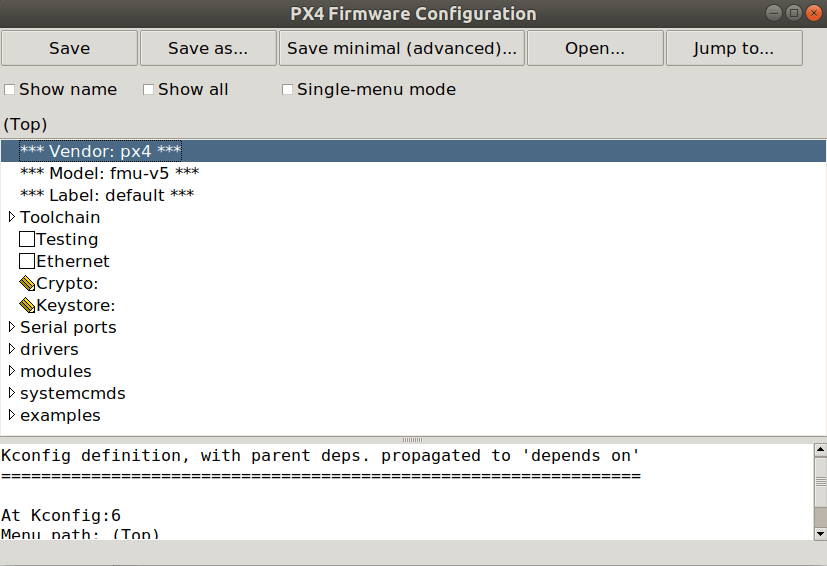
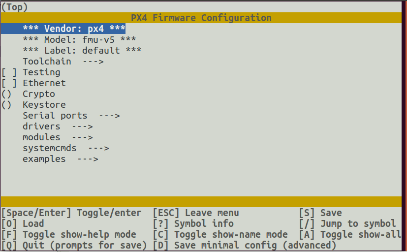

# PX4 Board Configuration (Kconfig)

The PX4 Autopilot firmware can be configured at build time to adapt it for specialized applications (fixed-wing, multicopter, rover or more), to enable new and experimental features (such as Cyphal) or to save flash & RAM usage by disabling some drivers and subsystems.
This configuration is handled through _Kconfig_, which is the same [configuration system used by NuttX](../hardware/porting_guide_nuttx.md#nuttx-menuconfig-setup).

The configuration options (often referred as "symbols" by the _kconfig_ language) are defined in `Kconfig` files under the **/src** directory.

## PX4 Kconfig Symbol Naming Convention

By convention, symbols for modules/drivers are named based on the module folder path.
For example, the symbol for the ADC driver at `src/drivers/adc/board_adc` must be named `DRIVERS_ADC_BOARD_ADC`.

To add symbols for driver/module specific options, the naming convention is the module name followed by the option name.
For example `UAVCAN_V1_GNSS_PUBLISHER` which is an option `GNSS_PUBLISHER` for the `UAVCAN_V1` module.
The options have to be guarded behind an `if` statement to ensure that the options are only visible when the module itself is enabled.

Full example:

```
menuconfig DRIVERS_UAVCAN_V1
    bool "UAVCANv1"
    default n
    ---help---
        Enable support for UAVCANv1

if DRIVERS_UAVCAN_V1
    config UAVCAN_V1_GNSS_PUBLISHER
        bool "GNSS Publisher"
        default n
endif #DRIVERS_UAVCAN_V1
```

::: info
Builds will silently ignore any missing or miss-spelled modules in the `*.px4board` configuration file.
:::

## PX4 Board Configuration Files

A board's Kconfig configuration is split across several `*.px4board` files that are merged, in order, to compose a buildable target (each layer overrides the previous):

1. `base.px4board` — the board hardware foundation: toolchain and architecture, serial port mapping, on-board drivers, and the common modules shared by every vehicle. It contains no vehicle controllers or airframes and is **not buildable on its own**. Every board must provide it. An optional `bootloader.px4board` sits alongside it.
2. `target_classes/<class>.px4board` (in the repository-root [`target_classes/`](https://github.com/PX4/PX4-Autopilot/tree/main/target_classes) directory) — the **target class** definition. It sets `CONFIG_TARGET_CLASS_<CLASS>=y` and enables that class's controllers (for example `vtol` enables the multicopter, fixed-wing and VTOL controllers). Classes are shared by all boards.
3. `boards/<vendor>/<model>/<class>.px4board` — the board's overlay for that class: the `CONFIG_AIRFRAMES_<CLASS>=y` set the target ships, plus any board-specific deltas (for example dropping a controller the class enables with `# CONFIG_MODULES_X is not set`).
4. `boards/<vendor>/<model>/<class>.<variant>.px4board` — an optional variant that stores only the delta versus the composed `<class>` target (for example `vtol.cyphal.px4board`).

For example, the `px4_fmu-v5_vtol` target is composed from `boards/px4/fmu-v5/base.px4board` + [`target_classes/vtol.px4board`](https://github.com/PX4/PX4-Autopilot/blob/main/target_classes/vtol.px4board) + `boards/px4/fmu-v5/vtol.px4board`. The target name follows the pattern `<vendor>_<model>_<class>[_<variant>]`.

::: info
Because each label only stores its delta versus the layer below, changing a key in a lower layer (such as `base.px4board`) propagates to every target of that board that did not already override it.
:::

## PX4 Menuconfig Setup

The [menuconfig](https://pypi.org/project/kconfiglib/#menuconfig-interfaces) tool is used to modify the PX4 board configuration, adding/removing modules, drivers, and other features.

There are command line and GUI variants, both of which can be launched using the PX4 build shortcuts:

```
make px4_fmu-v5_vtol boardconfig
make px4_fmu-v5_vtol boardguiconfig
```

::: info
_Kconfiglib_ and _menuconfig_ come with the _kconfiglib_ python package, which is installed by the normal [ubuntu.sh](https://github.com/PX4/PX4-Autopilot/blob/main/Tools/setup/ubuntu.sh) installation script.
If _kconfiglib_ is not installed, you can do so using the command: `pip3 install kconfiglib`
:::

The command line and GUI interfaces are shown below.

### menuconfig GUI Interface



### menuconfig Command Line Interface



## Fortified Toolchain Compatibility

Some toolchains define `_FORTIFY_SOURCE` by default. Those toolchains generally require some optimization, which means PX4 configurations that use `-O0` may fail.

PX4 keeps the default debug optimization unchanged unless you explicitly opt in. To switch `PX4_DEBUG_OPT_LEVEL` from `-O0` to `-Og`, enable:

- `Toolchain > Fortified toolchain support`

This is the Kconfig symbol:

```sh
CONFIG_BOARD_SUPPORT_FORTIFIED_TOOLCHAIN=y
```

You can set it either in `boardconfig`/`boardguiconfig` or directly in your board's `*.px4board` file.
