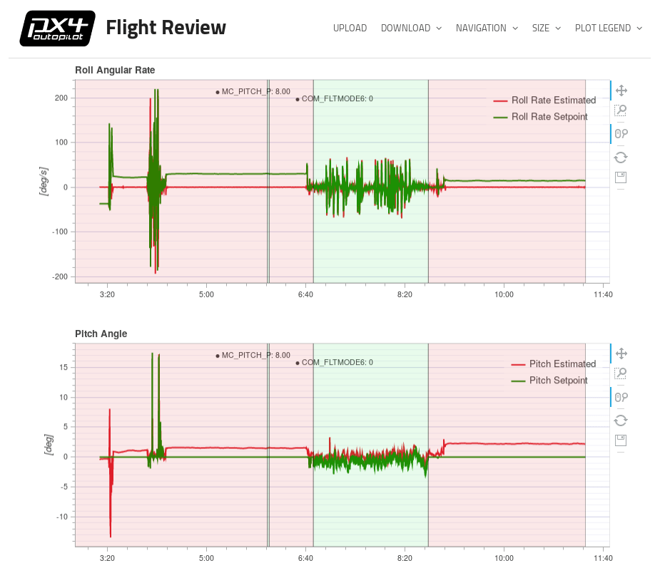
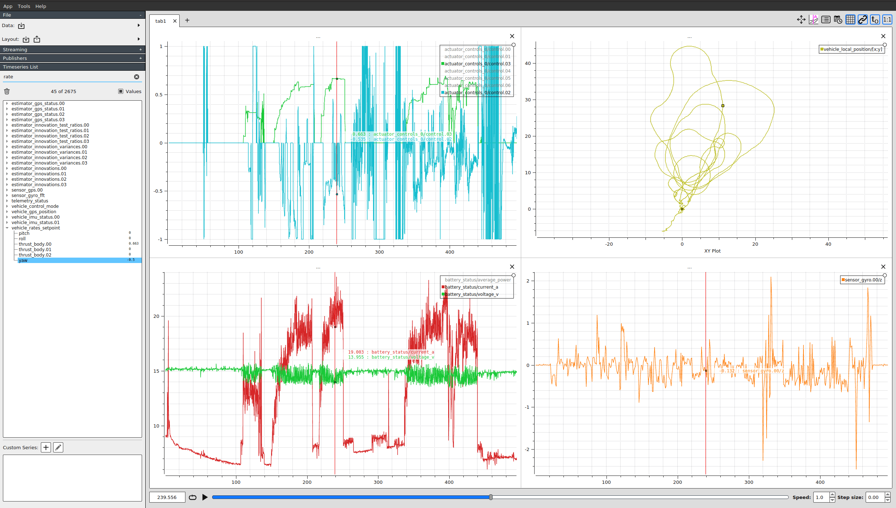
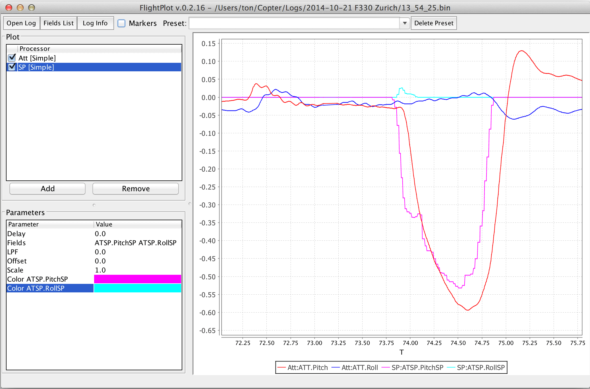
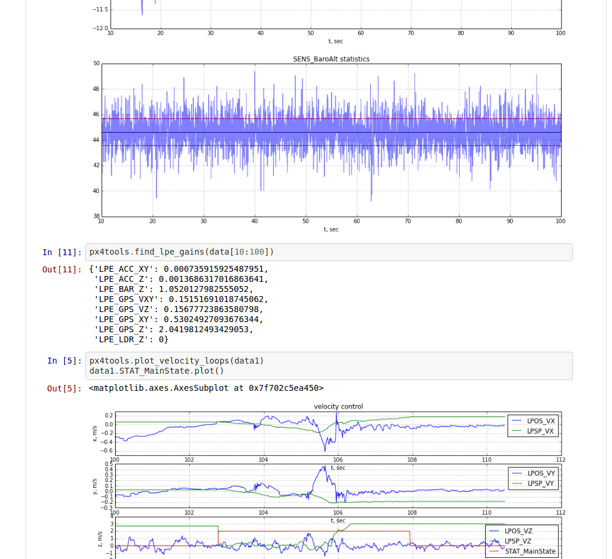
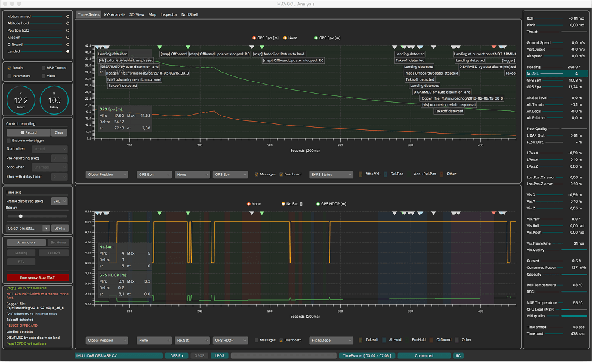

# Flight Log Analysis

This topic provide an overview of the tools and methods that can be used to analyze PX4 flight logs (more detailed topics are linked below in some cases).

::: info INFO
[Flight Reporting](../getting_started/flight_reporting.md) explains how to download a log and report/discuss issues about a flight with the development team.
:::

## Structured Analysis

Before analyzing a flight log it is important to establish its context:

- If the analysis is done after a malfunction, did the log capture the crash or did it stop mid-air?
- Did all controllers track their references?
  The easiest way to establish this is to compare attitude roll and pitch rates to their set points.
- Does the sensor data look valid? Was there very strong vibration (a reasonable threshold for strong vibration is anything with a peak-to-peak of more than 2-3 m/s/s).
- If the root cause is not specific to the vehicle make sure to report it with a link to the log file (and video if one exists) on the [PX4 issue tracker](https://github.com/PX4/PX4-Autopilot/issues/new).

## Ruling Out Power Failures

If a log file ends mid-air, two main causes are possible: a power failure _or_ a hard fault of the operating system.

On autopilots based on the [STM32 series](http://www.st.com/en/microcontrollers/stm32-32-bit-arm-cortex-mcus.html), hard faults are logged to the SD card.
These are located on the top level of the SD card and named _fault_date.log_, e.g. **fault_2017_04_03_00_26_05.log**.
You should check for the presence of this file if a flight log ends abruptly.

## Analysis Tools

### Flight Review (Online Tool)

[Flight Review](http://logs.px4.io) is the successor of _Log Muncher_.
It is used in combination with the new [ULog](../dev_log/ulog_file_format.md) logging format.

Key features:

- Web based, great for end-users.
- Users can upload logs through the web interface, and then share report with others (bulk upload is supported using the [upload_log.py](https://github.com/PX4/PX4-Autopilot/blob/main/Tools/upload_log.py) script)
- Interactive plots.



See [Log Analysis using Flight Review](../log/flight_review.md) for an introduction.

### PlotJuggler

[PlotJuggler](https://github.com/facontidavide/PlotJuggler) is a desktop application that allows users to easily visualize and analyze data expressed in the form of time series.
This is one of the best ULog analysis tools as it exposes all information in the log ([Flight Review](#flight-review-online-tool), by comparison, only shows a small subset of the data).

It supports ULog files (.ulg) since version 2.1.4.

Key features:

- Intuitive drag & drop interface.
- Arrange your data in multiple plots, tabs or windows.
- All uORB topics are shown and can be graphed.
- Once you arranged your data, save it into a "Layout" file and reload it multiple times.
- Process your data inside _PlotJuggler_ itself, using custom "data transformations".

Source code and downloads are available on [Github](https://github.com/facontidavide/PlotJuggler).



See [Log Analysis using Plot Juggler](../log/plotjuggler_log_analysis.md) for an introduction.

### pyulog

[pyulog](https://github.com/PX4/pyulog) is a python package to parse ULog files, along with a set of command-line scripts to extract/display ULog information and convert them to other file formats.

Key features:

- Python library for parsing ULog files. Base library used by a number of other ULog analysis and visualisation tools.
- Scripts to extract/display ULog information:
  - _ulog_info_: display information from an ULog file.
  - _ulog_messages_: display logged messages from an ULog file.
  - _ulog_params_: extract parameters from an ULog file.
- Scripts to convert ULog files to other formats:
  - _ulog2csv_: convert ULog to (several) CSV files.
  - _ulog2kml_: convert ULog to (several) KML files.

All scripts are installed as system-wide applications (i.e. they be called on the command line - provided Python is installed), and support the `-h` flag for getting usage instructions. For example:

```sh
$ ulog_info -h
usage: ulog_info [-h] [-v] file.ulg

Display information from an ULog file

positional arguments:
  file.ulg       ULog input file

optional arguments:
  -h, --help     show this help message and exit
  -v, --verbose  Verbose output
```

Below we see the kind of information exported from a sample file using _ulog_info_.

```sh
$ ulog_info sample.ulg
Logging start time: 0:01:52, duration: 0:01:08
Dropouts: count: 4, total duration: 0.1 s, max: 62 ms, mean: 29 ms
Info Messages:
 sys_name: PX4
 time_ref_utc: 0
 ver_hw: AUAV_X21
 ver_sw: fd483321a5cf50ead91164356d15aa474643aa73

Name (multi id, message size in bytes)    number of data points, total bytes
 actuator_controls_0 (0, 48)                 3269     156912
 actuator_outputs (0, 76)                    1311      99636
 commander_state (0, 9)                       678       6102
 control_state (0, 122)                      3268     398696
 cpuload (0, 16)                               69       1104
 ekf2_innovations (0, 140)                   3271     457940
 estimator_status (0, 309)                   1311     405099
 sensor_combined (0, 72)                    17070    1229040
 sensor_preflight (0, 16)                   17072     273152
 telemetry_status (0, 36)                      70       2520
 vehicle_attitude (0, 36)                    6461     232596
 vehicle_attitude_setpoint (0, 55)           3272     179960
 vehicle_local_position (0, 123)              678      83394
 vehicle_rates_setpoint (0, 24)              6448     154752
 vehicle_status (0, 45)                       294      13230
```

### FlightPlot

[FlightPlot](https://github.com/PX4/FlightPlot) is a desktop based tool for log analysis. It can be downloaded from [FlightPlot Downloads](https://github.com/PX4/FlightPlot/releases) (Linux, MacOS, Windows).

Key features:

- Java based, cross-platform.
- Intuitive GUI, no programming knowledge required.
- Supports both new and old PX4 log formats (.ulg, .px4log, .bin)
- Allows saving plots as images.



### PX4Tools

[PX4Tools](https://github.com/dronecrew/px4tools) is a log analysis toolbox for the PX4 autopilot written in Python.
The recommended installation procedure is to use [anaconda3](https://conda.io/docs/index.html). See [px4tools github page](https://github.com/dronecrew/px4tools) for details.

Key features:

- Easy to share, users can view notebooks on Github (e.g. [15-09-30 Kabir Log.ipynb](https://github.com/jgoppert/lpe-analysis/blob/master/15-09-30%20Kabir%20Log.ipynb))
- Python based, cross platform, works with anaconda 2 and anaconda3
- iPython/ jupyter notebooks can be used to share analysis easily
- Advanced plotting capabilities to allow detailed analysis



### MAVGCL

[MAVGCL](https://github.com/ecmnet/MAVGCL) is an in-flight log analyzer for PX4.
It can also be used in offline mode with downloaded uLog files.

Key features:

- Realtime data acquisition (50ms sampling, 100ms rolling display) based on MAVLink messages or ULOG data over MAVLink
- Timechart annotated by messages (MAVLink and ULog) and parameter changes (MAVLink only)
- XY Analysis for selected key-figures
- 3D View (vehicle and observer perspective)
- MAVLink inspector (reporting raw MAVLink messages)
- Offline-mode: Import of key-figures from PX4Log/ULog (file or last log from device via WiFi)
- Java based. Known to work on macOS and Ubuntu.
- And many more ...



### Data Comets

[Data Comets](https://github.com/dsaffo/DataComets) is a interactive PX4 flight log analysis tool that allows you to encode flight data onto the flight path, filter and brush the data by time - and much more!

You can use the online version of the tool for small log files (< 32Mb), or run it locally in order to analyze longer flights.


