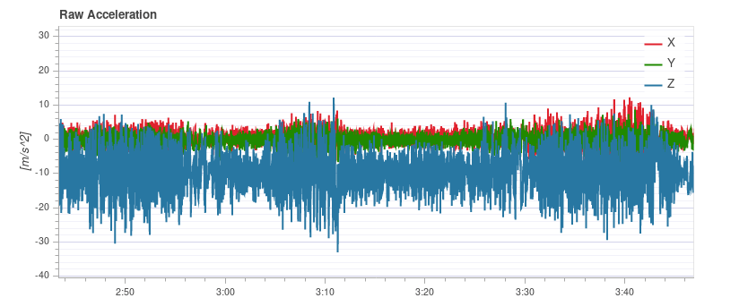
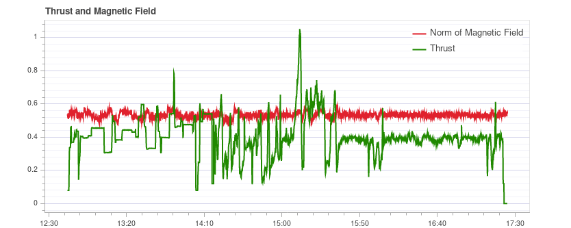
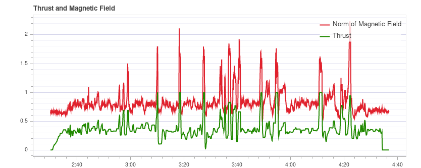
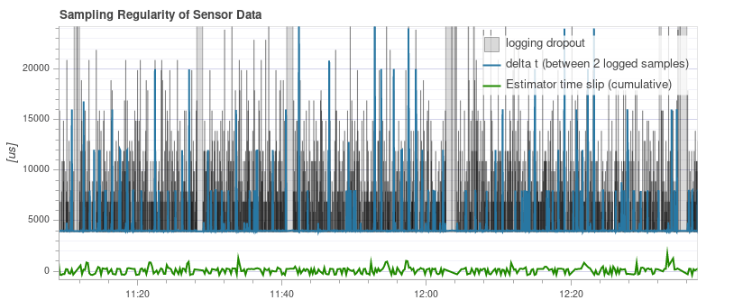

# Log Analysis using Flight Review

The [Flight Review](http://logs.px4.io) plots for a flight can be used to analyze general vehicle condition.

The plots are meant to be self-explanatory, but it takes some experience to know what ranges are acceptable and what a plot should look like.
This page explains how to interpret the plots and identify common problems.

## General Usage

Features that are common to many plots:

- Plot background color is used to indicate flight mode during recording (where graphs depend on mode):
  
  - **Flight mode:** Background colour on the body of the plot indicates flight mode.
    Hovering with the mouse over a plot shows the flight mode labels.
  - **VTOL flight mode:** VTOL vehicles additionally show the VTOL mode as background colour in the bottom part of the plot (blue for multicopter, yellow for fixed-wing, and red for transition).
- Mouse scrolling on a particular plot axis zooms that axis (horizontally or vertically).
- Mouse scrolling inside the plot zooms both axes.

## PID Tracking Performance

Depending on the flight mode, the vehicle controllers may attempt to track position, velocity, altitude or rate setpoints (the tracked setpoints depend on the mode, e.g.: in Stabilized mode there is no velocity setpoint).

The **Estimated** line (red) should closely match with the **Setpoint** (green).
If they do not, in most cases the PID gains of that controller need to be tuned.

The [Multicopter PID Tuning Guide](../config_mc/pid_tuning_guide_multicopter.md) contains example plots and information about analysing tracking performance.

:::tip
For the rate controller in particular, it is useful to enable the high-rate logging profile ([SDLOG_PROFILE](../advanced_config/parameter_reference.md#SDLOG_PROFILE)) to get more details when zooming in.
:::

## Vibration

Vibration is one of the most common problems for multirotor vehicles.
High vibration levels can lead to:
- less efficient flight and reduced flight time
- the motors can heat up
- increased material wearout
- inability to tune the vehicle tightly, resulting in degraded flight performance.
- sensor clipping
- position estimation failures, potentially resulting in fly-aways.

It is therefore important to keep an eye on the vibration levels and improve the setup if needed.

There is a point where vibration levels are clearly too high, and generally lower vibration levels are better. 
However there is a broad range between 'everything is ok' and 'the levels are too high'.
This range depends on a number of factors, including vehicle size - as larger vehicles have higher inertia, allowing for more software filtering (at the same time the vibrations on larger vehicles are of lower frequency).

The following paragraphs and sections provide information about what plots to use for checking vibration levels, and how to analyse them.

:::tip
It is worth looking at multiple charts when analyzing vibration (different charts can better highlight some issues).
:::

### Actuator Controls FFT

::: info
You need to enable the high-rate logging profile ([SDLOG_PROFILE](../advanced_config/parameter_reference.md#SDLOG_PROFILE)) to see this plot.
:::

This graph shows a frequency plot for the roll, pitch and yaw axis based on the actuator controls signal (the PID output from the rate controller). 
It helps to identify frequency peaks and configuring the software filters.
There should only be a single peak at the lowest end (below around 20 Hz), the rest should be low and flat.

Note that the y-axis scaling is different for different vehicles, but logs from the same vehicle can be directly compared to each other.

#### Examples: Good Vibration

[QAV-R 5" Racer](../frames_multicopter/qav_r_5_kiss_esc_racer.md) frame (excellent vibration).

::: info
The excellent vibration characteristics of the above frame mean that we can considerably increase the cutoff frequency of the [software filters](../config_mc/filter_tuning.md) (reducing control latency).
:::

DJI F450 frame (good vibration).

S500 frame:

::: info
While the plot above looks good, the [Raw Acceleration graph for the same flight](#raw_acc_s500) shows that the vibration levels are a bit high for x and y.
This is a good example of why it is worth checking several graphs!
:::

#### Examples: Bad Vibration

This example shows a peak in frequency close to 50 Hz (in this case due to "loose" landing gear).

### Acceleration Power Spectral Density

This is a 2D frequency plot showing the frequency response of the raw accelerometer data over time (it displays the sum for the x, y and z axis).
The more yellow an area is, the higher the frequency response at that time and frequency.

Ideally only the lowest part up to a few Hz is yellow, and the rest is mostly green or blue.

#### Examples: Good Vibration

[QAV-R 5" Racer](../frames_multicopter/qav_r_5_kiss_esc_racer.md) frame (excellent vibration).

<!-- https://logs.px4.io/plot_app?log=cd88b091-ec89-457c-85f6-e63e4fa0f51d -->

DJI F450 frame (good vibration).

::: info
Above you can see the blade passing frequency of the propellers at around 100 Hz.
:::

S500 frame:

#### Examples: Bad Vibration

The strong yellow lines at around 100Hz indicate a potential issue that requires further investigation (starting with a review of the other charts).

This plot below shows a peak in frequency close to 50 Hz (in this case due to "loose" landing gear).

:::tip
This indicates a possible problem because it is a strong single low frequency that is close to the vehicle dynamics.
With the default filter settings of 80 Hz vibrations at 50 Hz will not be filtered.
:::

Extremely high (unsafe) vibration! Note that the graph is almost completely yellow.

:::warning
You should not fly with such high vibration levels.
:::

### Raw Acceleration

This graph shows the raw accelerometer measurements for the x, y and z axis. 
Ideally each line is thin and clearly shows the vehicle's accelerations.

As a rule of thumb if the z-axis graph is touching the x/y-axis graph during hover or slow flight, the vibration levels are too high. 

:::tip
The best way to use this graph is to zoom in a bit to a part where the vehicle is hovering.
:::

#### Examples: Good Vibration

[QAV-R 5" Racer](../frames_multicopter/qav_r_5_kiss_esc_racer.md) frame (excellent vibration).

DJI F450 frame (good vibration).

<!-- https://logs.px4.io/plot_app?log=cd88b091-ec89-457c-85f6-e63e4fa0f51d -->

#### Examples: Bad Vibration

S500 frame. Borderline vibration levels - a bit high for x and y (which is typical for an S500 airframe).
This is at the limit where it starts to negatively affect flight performance.

Vibration too high. Note how the graph of the z-axis overlaps with the x/y-axis graph:

Vibration levels are too high. Note how the graph of the z-axis overlaps with the x/y-axis graph:

Very high (unsafe) vibration levels. 

:::warning
You should not fly with such high vibration levels.
:::

### Raw High-rate IMU Data Plots

For an in-depth analysis there is an option to log the raw IMU data at full rate (several kHz, depending on the IMU).
This allows inspection of much higher frequencies than with normal logging, which can help when selecting vibration mounts or configuring low-pass and notch filters appropriately.

To use it, some parameters need to be changed:
- Set [IMU_GYRO_RATEMAX](../advanced_config/parameter_reference.md#IMU_GYRO_RATEMAX) to 400.
  This ensures that the raw sensor data is more efficiently packed when sent from the sensor to the rest of the system, and reduces the log size (without reducing useful data). 
  <!-- Explanation in https://github.com/PX4/PX4-user_guide/pull/751/files#r440509688
  Data is sent in a fixed size array that will largely empty if sent at higher rate. The "empty data" is also logged.-->
- Use a good SD card, as the IMU data requires a high logging bandwidth (Flight Review will show dropouts if the logging rate gets too high).
  
  :::tip
  See [Logging > SD Cards](../dev_log/logging.md#sd-cards) for a comparison of popular SD card.
  :::
  
- Enable either the gyro or accel high-rate FIFO profile in [SDLOG_PROFILE](../advanced_config/parameter_reference.md#SDLOG_PROFILE) and disable the rest of the entries.
  If you are using a really good SD card (seeing few/no dropouts), you can:
  - either enable both accel and gyro profiles
  - or enable accel/gyro plus the default logging profile

Example plot:

::: info
Data of the first IMU is logged, which is not necessarily the same as the one used for flying.
This is mostly only important in cases where IMU's are mounted differently (e.g. hard-mounted vs. soft-mounted).
:::

::: info
Do not forget to restore the parameters after testing.
:::

### Fixing Vibration Problems

Often a source of vibration (or combination of multiple sources) cannot be identified from logs alone.

In this case the vehicle should be inspected.
[Vibration Isolation](../assembly/vibration_isolation.md) explains some basic things you can check (and do) to reduce vibration levels.

## Actuator Outputs

The *Actuator Outputs* graph shows the signals that are sent to the individual actuators (motors/servos).
Generally it is in the range between the minimum and maximum configured PWM values (e.g. from 1000 to 2000).

This is an example for a quadrotor where everything is OK (all of the signals are within the range, approximately overlap each other, and are not too noisy):

The plot can help to identify different problems:
- If one or more of the signals is at the maximum over a longer time, it means the controller runs into **saturation**.
  It is not necessarily a problem, for example when flying at full throttle this is expected.
  But if it happens for example during a mission, it's an indication that the vehicle is overweight for the amount of thrust that it can provide.
- For a multicopter the plot can be a good indication if the vehicle is **imbalanced**.
  It shows in the plot that one or more neighboring motors (two in case of a quadrotor) need to run at higher thrust on average.
  Note that this can also be the case if some motors provide more thrust than others or the ESCs are not calibrated.
  An imbalanced vehicle is generally not a big problem as the autopilot will automatically account for it.
  However it reduces the maximum achievable thrust and puts more strain on some motors, so it is better to balance the vehicle.
- An imbalance can also come from the yaw axis.
  The plot will look similar as in the previous case, but opposite motors will run higher or lower respectively.
  The cause is likely that one or more motors are tilted.

  This is an example from a hexarotor: motors 1, 3 and 6 run at higher thrust:
  
  <!-- https://logs.px4.io/plot_app?log=9eca6934-b657-4976-a32f-b2e56535f05f -->
- If the signals look very **noisy** (with high amplitudes), it can have two causes: sensor noise or vibrations passing through the controller (this shows up in other plots as well, see previous section) or too high PID gains.
  This is an extreme example:
  

## GPS Uncertainty

The *GPS Uncertainty* plot shows information from the GPS device:
- Number of used satellites (should be around 12 or higher)
- Horizontal position accuracy (should be below 1 meter)
- Vertical position accuracy (should be below 2 meters)
- GPS fix: this is 3 for a 3D GPS fix, 4 for GPS + Dead Reckoning, 5 for RTK float and 6 for RTK fixed type

## GPS Noise & Jamming

The GPS Noise & Jamming plot is useful to check for GPS signal interferences and jamming.
The GPS signal is very weak and thus it can easily be disturbed/jammed by components transmitting (via cable) or radiating in a frequency used by the GPS.

:::tip
USB 3 is [known to be](https://www.usb.org/sites/default/files/327216.pdf) an effective GPS jamming source.
:::

The **jamming indicator** should be around or below 40.
Values around 80 or higher are too high and the setup must be inspected.
Signal interference is also noticeable as reduced accuracy and lower number of satellites up to the point where no GPS fix is possible.

This is an example without any interference:

## Thrust and Magnetic Field

The *Thrust and Magnetic Field* plot shows the thrust and the norm of the magnetic sensor measurement vector.

The norm should be constant over the whole flight and uncorrelated with the thrust.
This is a good example where the norm is very close to constant:

*If it is correlated*, it means that the current drawn by the motors (or other consumers) is influencing the magnetic field.
This must be avoided as it leads to incorrect yaw estimation.
The following plot shows a strong correlation between the thrust and the norm of the magnetometer:

Solutions to this are:
- Use an external magnetometer (avoid using the internal magnetometer)
- If using an external magnetometer, move it further away from strong currents (i.e. by using a (longer) GPS mast).

If the norm is uncorrelated but not constant, most likely it is not properly calibrated.
However it could also be due to external disturbances (for example when flying close to metal constructs).

This example shows that the norm is non-constant, but it does not correlate with the thrust:

## Estimator Watchdog

The *Estimator Watchdog* plot shows the health report of the estimator.
It should be constant zero.

This is what it should look like if there are no problems:

If one of the flags is non-zero, the estimator detected a problem that needs to be further investigated.
Most of the time it is an issue with a sensor, for example magnetometer interferences.
It usually helps to look at the plots of the corresponding sensor.
<!-- TODO: separate page for estimator issues? -->

Here is an example with magnetometer problems:

## Sampling Regularity of Sensor Data

The sampling regularity plot provides insights into problems with the logging system and scheduling.

The amount of **logging dropouts** start to increase if the log buffer is too small, the logging rate is too high or a low-quality SD card is used.

::: info
Occasional dropouts can be expected on medium quality cards.
:::

The **delta t** shows the time difference between two logged IMU samples.
It should be close to 4 ms because the data publishing rate is 250Hz.
If there are spikes that are a multiple of that (and the estimator time slip does not increase), it means the logger skipped some samples.
Occasionally this can happen because the logger runs at lower priority.
If there are spikes that are not a multiple, it indicates an irregular sensor driver scheduling, which needs to be investigated.

The **estimator timeslip** shows the difference between the current time and the time of the integrated sensor intervals up to that time.
If it changes it means either the estimator missed sensor data or the driver publishes incorrect integration intervals.
It should stay at zero, but it can increase slightly for in-flight parameter changes, which is generally not an issue.

This is a good example:

The following example contains too many dropouts, the quality of the used SD card was too low in that case
(see [here](../dev_log/logging.md#sd-cards) for good SD cards):

## Logged Messages

This is a table with system error and warning messages. 
For example they show when a task becomes low on stack size.

The messages need to be examined individually, and not all of them indicate a problem.
For example the following shows a kill-switch test:

## Flight/Frame Log Review Examples

It is often worth looking at multiple charts for a particular flight when analyzing vehicle condition (different charts can better highlight some issues).
This is particularly important when reviewing for possible vibration problems.

The section below groups a few (previously presented) charts by flight/vehicle.

### QAV-R 5" Racer

These charts are all from the same flight of a [QAV-R 5" Racer](../frames_multicopter/qav_r_5_kiss_esc_racer.md).
<!-- https://logs.px4.io/plot_app?log=cd88b091-ec89-457c-85f6-e63e4fa0f51d -->

They show a vehicle that has very low vibration:
- Actuator Controls FFT shows only a single peak at the lowest end, with the rest low and flat.
- Spectral density is mostly green, with only a little yellow at the low frequencies.
- Raw Acceleration has z-axis trace well separated from the x/y-axis traces.

### DJI F450

These charts are all from the same flight of a *DJI F450*.
<!-- https://logs.px4.io/plot_app?log=cd88b091-ec89-457c-85f6-e63e4fa0f51d -->

They show a vehicle that has low vibration (but not as low as the QAV-R above!):
- Actuator Controls FFT shows a peak at the lowest end. 
  Most of the rest is flat, except for a bump at around 100Hz (this is the blade passing frequency of the propellers).
- Spectral density is mostly green. The blade passing frequency is again visible.
- Raw Acceleration has z-axis trace well separated from the x/y-axis traces.

### S500

These charts are all from the same flight of an S500.

They show a vehicle that has borderline-acceptable vibration:
- Actuator Controls FFT shows a peak at the lowest end. 
  Most of the rest is flat, except for a bump at around 100Hz.
- Spectral density is mostly green, but more yellow than for the DJI F450 at 100Hz.
- Raw Acceleration has z-axis trace fairly close to the x/y-axis traces. 
  This is at the limit where it starts to negatively affect flight performance.

