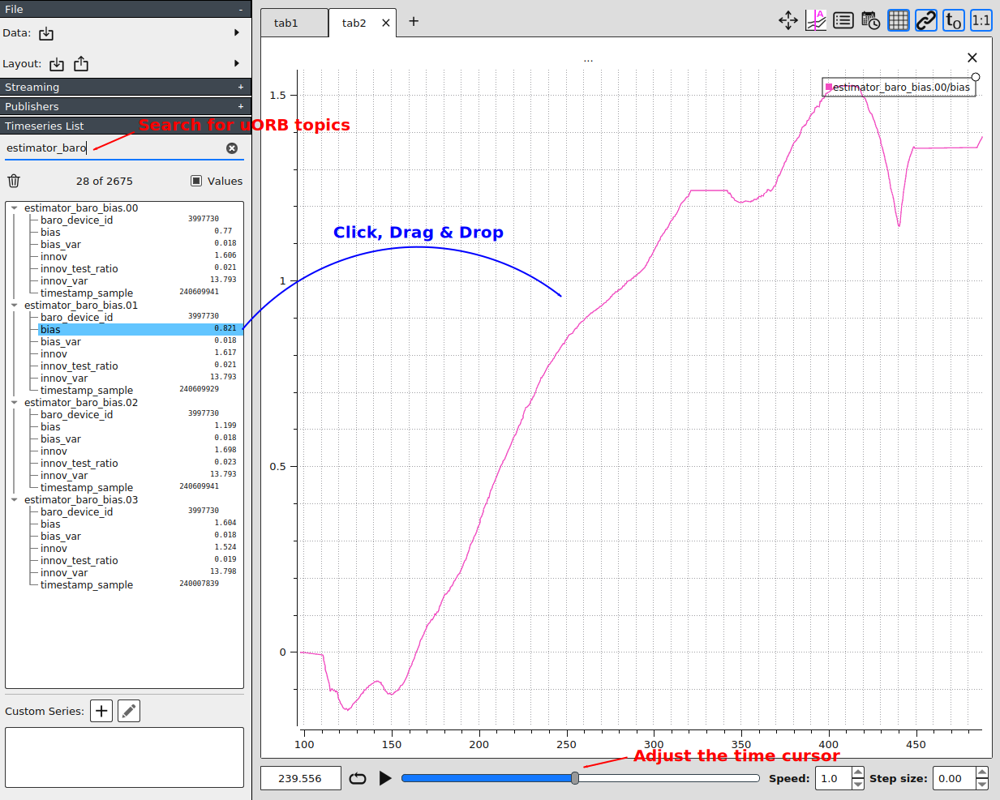
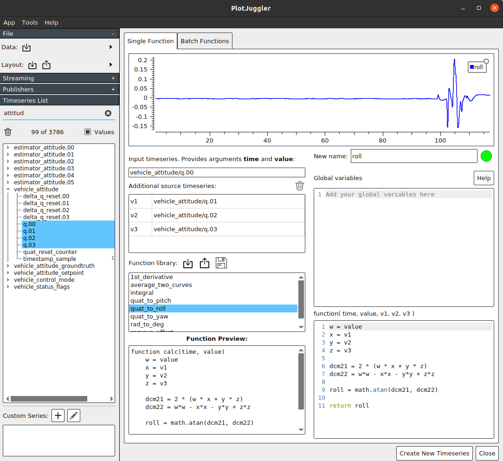
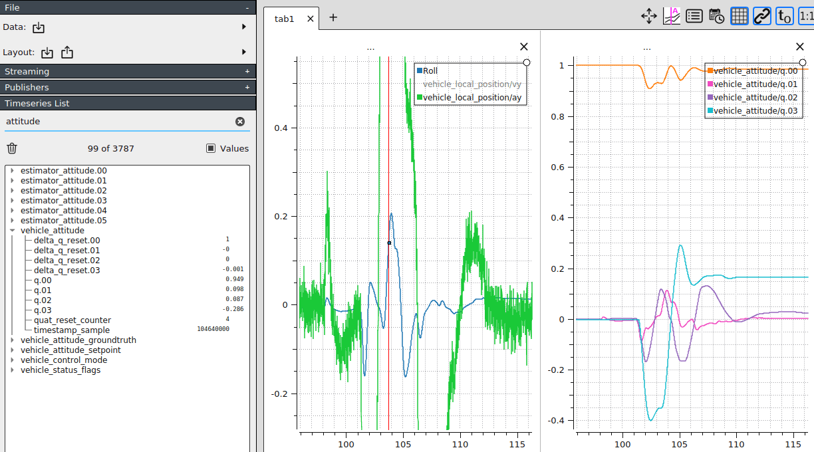

# Log Analysis using PlotJuggler

[PlotJuggler](https://github.com/facontidavide/PlotJuggler) can be used to analyze ULogs for in-depth, development purposes.
It is incredibly useful as every uORB topic is exposed / can be graphed, as well as having custom functions to modify the data (e.g. from Quaternion values to Roll / Pitch / Yaw).

## Installation

You can find the latest releases of the Plot Juggler [here](https://github.com/facontidavide/PlotJuggler/releases).

#### Notes on Windows distribution

The latest version of PlotJuggler for Windows may not work.
In this case fallback to [v2.8.4 here](https://github.com/facontidavide/PlotJuggler/releases/tag/2.8.4) (this is known to work with Windows).

#### Notes on AppImage for Linux distributions

If the downloaded AppImage does not open, you may need to change its access settings.
This is done in the terminal using the following command:

```sh
chmod 777 <Path-To-PlotJuggler-AppImage>
```

## General Usage

Two most common tasks are "Searching" for the logged uORB topic, and "Drag and Dropping" a field in a specific topic onto the graph view.
These are demonstrated in the diagram below.



### Splitting Horizontally / Vertically : Multi Panel

One of the most powerful feature is splitting the screen in either horizontal/vertical orientation and displaying different graphs at the same time ( with a synchronized time-bar on top, as you move the time cursor in the bottom).

This is demonstrated in an animation below:


In this example, `vehicle_local_position` topic's `ax`, `ay` and `az` (Acceleration estimate) components were graphed first by splitting the screen in 3 sections.
Then, the `vz` (Velocity estimate) component was added under right pane, and finally `battery_status` topic's `current_a` (Battery current) was graphed in the lower-mid pane.

Although not obvious in the beginning you can observe that whenever the vehicle starts moving (battery current value goes high), the acceleration and velocity values start to move around as well.
This is because all the data is displayed as a time-series, which shows each value at on a specific timestamp.

This is useful for providing a broad view of what happened and why.
It is often hard to troubleshoot a problem just by looking at one graph, but by having multiple graphs displayed, it is much easier to figure out what was going on in the system.

### Displaying Data in 2D

Another powerful feature is the ability to display 2D data on a XY plane (each data on X, Y axis) in a scatter-plot manner.
This is done by selecting two data points by holding `Ctrl` key while selecting each of them (e.g. `vehicle_local_position` topic's `x` and `y` components), and drag & dropping it with the `Right mouse cursor` pressed.


In this example, the estimated vehicle's position in local coordinate frame is graphed onto a XY-plane which shows a 2D view of the estimated position, and the `vx` and `vy` components (Velocity estimate) are graphed on the right, with the `vz` (Vertical velocity estimate) graphed underneath it in a split view.

This in turn shows the relationship between position and the velocity of the vehicle intuitively.
For example, note how when the vehicle moves in the X-axis direction, the `vx` value goes high, and as the vehicle turns to the Y-axis direction, the `vy` value starts to change as well.

#### Using the 'Play' button

Here the **Play** button is used to play the recorded data in real time (speed factor can be adjusted in the lower-right corner).
This shows the position / velocity relationship described above in detail.


::: info
Try out the boat testing log analysis yourself by downloading the ULog and Layout file used above!
- [Boat testing ULog](https://github.com/PX4/PX4-user_guide/raw/main/assets/flight_log_analysis/plot_juggler/sample_log_boat_testing_2022-7-28-13-31-16.ulg)
- [Boat testing Analysis Layout](https://raw.githubusercontent.com/PX4/PX4-user_guide/main/assets/flight_log_analysis/plot_juggler/sample_log_boat_testing_layout.xml)
:::

### Layout Templates

There are a number of PlotJuggler layout files shared by PX4 Developers.
Each can be used for a specific purpose (Multicopter tuning, VTOL tuning, Boat debugging, etc.):

* [Sample View layout](https://github.com/PX4/PX4-user_guide/blob/main/assets/flight_log_analysis/plot_juggler/plotjuggler_sample_view.xml) : Template used in the [Multi-panel example](#splitting-horizontally-vertically-multi-panel) above.


## Advanced Usage

### Creating custom time series using LUA script

Plot Juggler supports having LUA scripts to process and display data.
This is a powerful feature that can do things like integrating the curve, averaging two curves, removing offsets, etc.

#### Calculating Roll/Pitch/Yaw from Quaternion



To know vehicle's attitude, PX4 logs the estimated attitude's quaternion in the `vehicle_attitude` topic in an array of floating point values (q[4]).
Since these values don't give contextual information (e.g. `roll`), it needs a transformation involving trigonometric functions.

1. Search for `vehicle_attitude` topic in Timeseries List panel on the left
2. Select 4 quaternion members (`q.00, q.01, q.02, q.03`) by clicking `q.00` first, then holding Shift + clicking `q.03`. They should all be selected
3. Click the '+' symbol in the lower-left 'Custom Series' section to create new series
4. Select 4 quaternion members again, and drag them to 'Input timeseries + Additional source timeseries' tab on upper-left corner
5. Double click on the `quat_to_roll` from the Function Library. Now you should have the plot on upper section
6. Assign the name for the plot (e.g. `roll`) in the text box in upper-right corner
7. Click 'Create New Timeseries'. You should now have the plot in 'Custom Series'

Here the custom series `Roll` is displayed along with other timeseries, including it's original form in Quaternion on the right, which is not human-readable (using PlotJuggler 3.5.0):



The `quat_to_roll` function looks like this:
```lua
w = value
x = v1
y = v2
z = v3

dcm21 = 2 * (w * x + y * z)
dcm22 = w*w - x*x - y*y + z*z

roll = math.atan(dcm21, dcm22)

return roll
```
