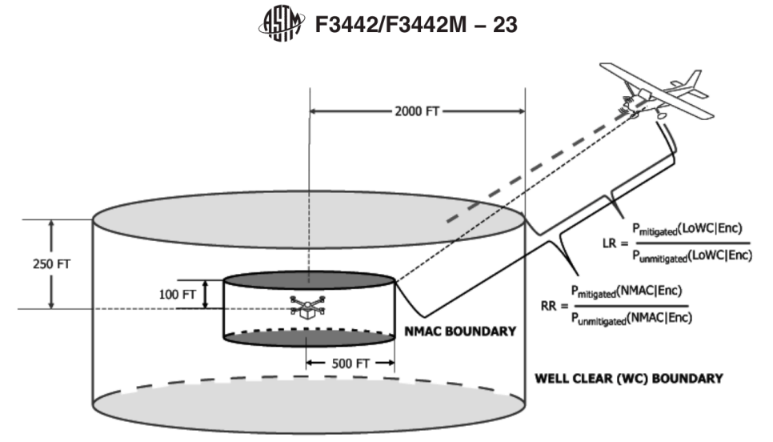

# ADS-B/FLARM/UTM Receivers: Air Traffic Avoidance

PX4 can monitor cooperative air traffic reported by [ADS-B](https://en.wikipedia.org/wiki/Automatic_dependent_surveillance_%E2%80%93_broadcast), [FLARM](https://en.wikipedia.org/wiki/FLARM), or [UTM](https://www.faa.gov/uas/advanced_operations/traffic_management) receivers and respond when a potential conflict is detected, warning the operator or triggering an automatic action such as Hold, Return, Land, or Terminate.

This page covers how to connect a supported receiver and configure basic traffic avoidance behaviour.
It is most relevant for operations in shared airspace, particularly beyond visual line of sight (BVLOS), where the vehicle must maintain safe separation from manned aviation without an onboard pilot.

::: info
PX4 can only assess _cooperative_ traffic: aircraft that actively broadcast their position via ADS-B, FLARM, UTM, or a compatible integration.
If your operation does not involve that kind of traffic data, this page is unlikely to apply.

For details on conflict-detection logic, alert volumes, notifications, testing, and extension points, see [Detect and Avoid](../advanced_features/detect_and_avoid.md).
:::

## Supported Hardware

PX4 traffic avoidance currently works with ADS-B, FLARM, and UTM products that supply compatible traffic data over MAVLink.

It has been tested with the following devices:

- [PingRX ADS-B Receiver](https://uavionix.com/product/pingrx-pro/) (uAvionix)
- [FLARM](https://www.flarm.com/en/drones/)

## Hardware Setup

Any of the devices can be connected to any free/unused serial port on the flight controller.
Most commonly they are connected to `TELEM2` (if this is not being used for some other purpose).

### PingRX Pro

The PingRX MAVLink port uses a JST ZHR-4 mating connector with pinout as shown below.

| Pin     | Signal   | Volt         |
| ------- | -------- | ------------ |
| 1 (red) | RX (IN)  | +5V tolerant |
| 2 (blk) | TX (OUT) |              |
| 3 (blk) | Power    | +4 to 6V     |
| 4 (blk) | GND      | GND          |

The PingRX comes with connector cable that can be attached directly to the `TELEM2` port (DF13-6P) on an [mRo Pixhawk](../flight_controller/mro_pixhawk.md).
For other ports or boards, you will need to obtain your own cable.

The recommended port configuration for this receiver is:

| Parameter                                                                    | Recommended Value |
| ---------------------------------------------------------------------------- | ----------------- |
| [MAV_X_CONFIG](../advanced_config/parameter_reference.md#MAV_1_CONFIG)       | `TELEM 2`         |
| [MAV_X_MODE](../advanced_config/parameter_reference.md#MAV_1_MODE)           | uAvionix          |
| [MAV_X_RADIO_CTL](../advanced_config/parameter_reference.md#MAV_1_RADIO_CTL) | Disabled          |

## FLARM

FLARM has an on-board DF-13 6 Pin connector that has an identical pinout to the [mRo Pixhawk](../flight_controller/mro_pixhawk.md).

| Pin     | Signal   | Volt        |
| ------- | -------- | ----------- |
| 1 (red) | VCC      | +4V to +36V |
| 2 (blk) | TX (OUT) | +3.3V       |
| 3 (blk) | RX (IN)  | +3.3V       |
| 4 (blk) | -        | +3.3V       |
| 5 (blk) | -        | +3.3V       |
| 6 (blk) | GND      | GND         |

::: info
The TX and RX on the flight controller must be connected to the RX and TX on the FLARM, respectively.
:::

## PX4 Configuration

### Port Configuration

The receivers are configured in the same way as any other [MAVLink Peripheral](../peripherals/mavlink_peripherals.md).
The recommended configuration for most devices (unless they have device-specific configuration like PingRX) is to connect to `TELEM 2` and [set the parameters](../advanced_config/parameters.md) as shown:

| Parameter                                                                | Recommended Value                 |
| ------------------------------------------------------------------------ | --------------------------------- |
| [MAV_X_CONFIG](../advanced_config/parameter_reference.md#MAV_1_CONFIG)   | `TELEM 2`                         |
| [MAV_X_MODE](../advanced_config/parameter_reference.md#MAV_1_MODE)       | Normal                            |
| [MAV_X_RATE](../advanced_config/parameter_reference.md#MAV_1_RATE)       | 0 (default sending rate for port) |
| [MAV_X_FORWARD](../advanced_config/parameter_reference.md#MAV_1_FORWARD) | Enabled                           |

Then reboot the vehicle.

You will now find a new parameter called [SER_TEL2_BAUD](../advanced_config/parameter_reference.md#SER_TEL2_BAUD), which must be set to 57600.

### Configure Traffic Avoidance

PX4 supports two distinct detect-and-avoidance modes:

- **Crosstrack mode** raises one conflict level and action when the current vehicle is close to the traffic's predicted track, vertically close, and within a configured collision-time threshold.
  This is the avoidance mode historically supported by PX4.
- **F3442 mode** evaluates traffic against four alert volumes with corresponding distinct actions.
  It provides avoidance management that complies with the _ASTM F3442 standard_.

For the detailed behavior of each conflict model, see [Detect and Avoid > Conflict Standards](../advanced_features/detect_and_avoid.md#conflict-standards) and [Detect and Avoid > Automated Actions](../advanced_features/detect_and_avoid.md#automated-actions).

#### Enable Avoidance

Start by setting these parameters:

| Parameter                               | Description                                             |
| --------------------------------------- | ------------------------------------------------------- |
| [DAA_EN]             | Enables or disables DAA.                                |
| [DAA_STANDARD] | Select the DAA mode: `0` = `Crosstrack`, `1` = `F3442`. |

[DAA_EN]: ../advanced_config/parameter_reference.md#DAA_EN
[DAA_STANDARD]: ../advanced_config/parameter_reference.md#DAA_STANDARD

#### Crosstrack

Set `DAA_STANDARD = 0` if you want the single-threshold traffic avoidance behavior.

| Parameter                                       | Description                                                                                                                                   |
| ----------------------------------------------- | --------------------------------------------------------------------------------------------------------------------------------------------- |
| [NAV_TRAFF_AVOID]   | Action requested when the crosstrack threshold is breached. `0`: Disabled, `1`: Warn only, `2`: Return, `3`: Land, `4`: Hold, `5`: Terminate. |
| [NAV_TRAFF_A_HOR]   | Maximum signed crosstrack distance from the projected traffic track.                                                                          |
| [NAV_TRAFF_A_VER]   | Maximum vertical separation from the traffic aircraft.                                                                                        |
| [NAV_TRAFF_COLL_T] | Maximum conservative time-to-collision estimate. A conflict is raised only if the horizontal, vertical, and time conditions are all met.      |

[NAV_TRAFF_AVOID]: ../advanced_config/parameter_reference.md#NAV_TRAFF_AVOID
[NAV_TRAFF_A_HOR]: ../advanced_config/parameter_reference.md#NAV_TRAFF_A_HOR
[NAV_TRAFF_A_VER]: ../advanced_config/parameter_reference.md#NAV_TRAFF_A_VER
[NAV_TRAFF_COLL_T]: ../advanced_config/parameter_reference.md#NAV_TRAFF_COLL_T

#### F3442

<Badge type="tip" text="PX4 v1.18" />

Use `DAA_STANDARD = 1` if you want staged alerting based on ASTM F3442/F3442M-23 volumes.

<!--

_Figure 1: Illustration from the ASTM F3442/F3442M − 23 standard showing the near mid-air collision (NMAC) and well clear (WC) safety zones, the NMAC Risk Ratio (RR), and the LoWC risk ratio (LR)._
-->

PX4 evaluates four conflict levels and maps each level to an action:

| Parameter                                       | Description                                       |
| ----------------------------------------------- | ------------------------------------------------- |
| [DAA_LVL_LOW_ACT]   | Action for the augmented well clear alert volume. |
| [DAA_LVL_MED_ACT]   | Action for the augmented NMAC alert volume.       |
| [DAA_LVL_HIGH_ACT] | Action for Loss of Well Clear (LoWC).             |
| [DAA_LVL_CRIT_ACT] | Action for Near Mid-Air Collision (NMAC).         |

[DAA_LVL_LOW_ACT]: ../advanced_config/parameter_reference.md#DAA_LVL_LOW_ACT
[DAA_LVL_MED_ACT]: ../advanced_config/parameter_reference.md#DAA_LVL_MED_ACT
[DAA_LVL_HIGH_ACT]: ../advanced_config/parameter_reference.md#DAA_LVL_HIGH_ACT
[DAA_LVL_CRIT_ACT]: ../advanced_config/parameter_reference.md#DAA_LVL_CRIT_ACT

F3442 uses four nested cylindrical alert volumes.
A conflict level is breached when both the horizontal and vertical separation are inside the combined ownship (the current vehicle) plus traffic volume.

| Item           | Parameters                             | Meaning                                                                                                 |
| -------------- | -------------------------------------- | ------------------------------------------------------------------------------------------------------- |
| `CRITICAL`     | [F34_LVL_CRIT_RAD], [F34_LVL_CRIT_HGT] | Per-aircraft NMAC base radius and vertical bound.                                                       |
| `HIGH`         | [F34_LVL_HIGH_RAD], [F34_LVL_HIGH_HGT] | Per-aircraft Well Clear base radius and vertical bound.                                                 |
| `MEDIUM`       | [F34_LVL_MED_TIME]                     | Expands the NMAC base volume using aircraft speed and the configured time margin.                       |
| `LOW`          | [F34_LVL_LOW_TIME]                     | Expands the Well Clear base volume using aircraft speed and the configured time margin.                 |
| Velocity input | [DAA_EN_DFLT_VEL], [DAA_DFLT_VEL]      | Optional fallback vertical speed used by F3442 if traffic velocity is missing or should not be trusted. |

[F34_LVL_CRIT_RAD]: ../advanced_config/parameter_reference.md#F34_LVL_CRIT_RAD
[F34_LVL_CRIT_HGT]: ../advanced_config/parameter_reference.md#F34_LVL_CRIT_HGT
[F34_LVL_HIGH_RAD]: ../advanced_config/parameter_reference.md#F34_LVL_HIGH_RAD
[F34_LVL_HIGH_HGT]: ../advanced_config/parameter_reference.md#F34_LVL_HIGH_HGT
[F34_LVL_MED_TIME]: ../advanced_config/parameter_reference.md#F34_LVL_MED_TIME
[F34_LVL_LOW_TIME]: ../advanced_config/parameter_reference.md#F34_LVL_LOW_TIME
[DAA_EN_DFLT_VEL]: ../advanced_config/parameter_reference.md#DAA_EN_DFLT_VEL
[DAA_DFLT_VEL]: ../advanced_config/parameter_reference.md#DAA_DFLT_VEL

Changing `NAV_TRAFF_AVOID` or `DAA_LVL_*_ACT` at runtime does not re-evaluate already buffered conflicts.
The updated setting is used on later conflict transitions, and automatic mode changes are only issued on escalation.

These parameters use the same action scale:
`0`: Disabled, `1`: Warn only, `2`: Return, `3`: Land, `4`: Hold, `5`: Terminate.

Most users can start with the default F3442 volume parameters and tune them only if needed.
See [Detect and Avoid > F3442 Mode](../advanced_features/detect_and_avoid.md#f3442-mode) and [Detect and Avoid > F3442 Volume Appendix](../advanced_features/detect_and_avoid.md#f3442-volume-appendix).

### Arming Check

PX4 can be configured to check for the presence of a traffic avoidance system (for example an ADS-B or FLARM receiver) before arming.
This ensures that a traffic avoidance system is connected and functioning before flight.

This check only verifies that a traffic source is present. It is separate from DAA rejecting arming because active traffic already requires an automatic action; that behavior is described in [Detect and Avoid > Arming, Preflight, and Ground Behavior](../advanced_features/detect_and_avoid.md#arming-preflight-and-ground-behavior).

The check is configured using the [COM_ARM_TRAFF](../advanced_config/parameter_reference.md#COM_ARM_TRAFF) parameter:

| Value | Description                                                                                                                |
| ----- | -------------------------------------------------------------------------------------------------------------------------- |
| 0     | Disabled (default). No check is performed.                                                                                 |
| 1     | Warning only. A warning is issued if no traffic avoidance system is detected, but arming is allowed.                       |
| 2     | Enforce for all modes. Arming is denied if no traffic avoidance system is detected, regardless of flight mode.             |
| 3     | Enforce for mission modes only. Arming is denied if no traffic avoidance system is detected and a mission mode is planned. |

When a traffic avoidance system is detected, the system tracks its presence with a 3-second timeout.
If the system is lost or regained, corresponding events are logged ("Traffic avoidance system lost" / "Traffic avoidance system regained").

## Testing

To test your DAA configuration using simulated traffic, see [Detect and Avoid > Testing and Simulation](../advanced_features/detect_and_avoid.md#testing-and-simulation).

<!-- See also implementation PR: https://github.com/PX4/PX4-Autopilot/pull/21283 -->
<!-- See also bug to make this work without uncommenting: https://github.com/PX4/PX4-Autopilot/issues/21810 -->

## Further Information

- [Detect and Avoid](../advanced_features/detect_and_avoid.md)
- [MAVLink Peripherals](../peripherals/mavlink_peripherals.md)
- [Serial Port Configuration](../peripherals/serial_configuration.md)
