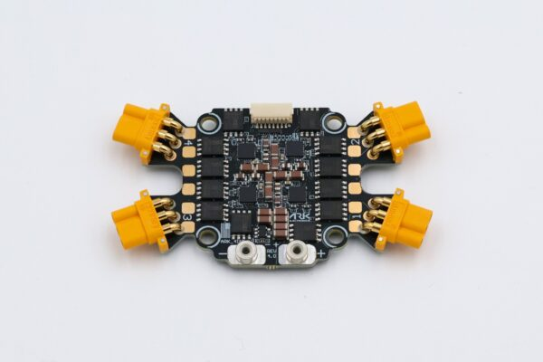

#ARK 4IN1 ESC CONS

NDAA compliant, made in the USA, DIU Blue Framework listed, 4 in 1 electronic speed controller running open source AM32 firmware. No soldering required with built in motor and battery connectors.

## Where to Buy

Order this module from:

- [ARK Electronics](https://arkelectron.com/product/ark-4in1-esc-cons/) (US)

## Hardware Specifications

- Battery Voltage: 3-8s
    - 6V Minimum
    - 65V Absolute Maximum
- Current Rating: 50A Continuous, 75A Burst Per Motor
- MR30 Connector Limit Per Motor: 30A Continuous, 40A Burst
- [STM32F0](https://www.st.com/en/microcontrollers-microprocessors/stm32f0-series.html)
- [AM32 Firmware](https://github.com/am32-firmware/AM32/pull/27)
- Onboard Current Sensor, Serial Telemetry
    - 100V/A
- Input Protocols
    - Dshot (300, 600)
	- Bi-directional Dshot
	- KISS Serial Telemetry
    - PWM
- Four MR30 Motor Connectors
- 8 Pin JST-SH Input/Output
- 10 Pin JST-SH Debug

- Made in the USA
    - Dshot (300, 600)
    - [DIU Blue Framework Listed](https://www.diu.mil/blue-uas/framework)

- Dimensions
    - Size: 77.00mm x 42.00mm x 9.43mm
    - Mounting Pattern: 30.5mm
    - Weight: 24g

## See Also

- [ARK 4IN1 ESC CONS](https://docs.arkelectron.com/electronic-speed-controller/ark-4in1-esc) (ARK Docs)
