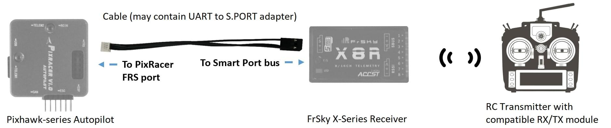
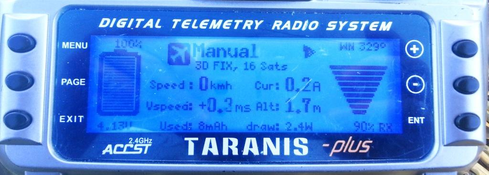
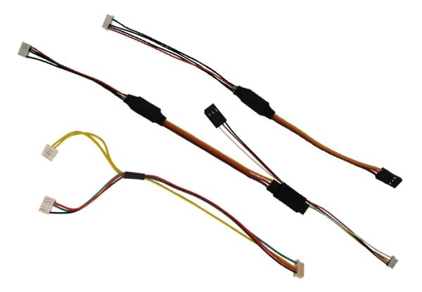

# FrSky Telemetry

FrSky telemetry allows you to access vehicle [telemetry/status](#messages) information on a compatible RC transmitter.

Available [telemetry is listed here](#messages), and includes: flight mode, battery level, RC signal strength, speed, altitude etc.
Some transmitters can additionally provide audible and vibration feedback, which is particularly useful for low battery and other failsafe warnings.

PX4 supports both [S.Port](#s_port) (new) and D (old) FrSky telemetry ports.

## Hardware Setup

FrSky telemetry requires:

- An [FrSky-compatible RC transmitter](#transmitters) like the FrSky Taranis X9D Plus.
- An [FrSky telemetry-capable receiver](#receivers) like the XSR and X8R.
- A cable to connect the FrSky receiver Smart Port (SPort) to a flight controller UART.

First [connect the receiver for RC channels](../getting_started/rc_transmitter_receiver.md#connecting-receivers), e.g. connect the S.Bus ports on the receiver and the flight controller.

Then set up FrSky telemetry by separately connecting the SPort on the receiver to any free UART on the flight controller, and then [configure PX4 to run FrSky telemetry on that UART](#configure).

This is done slightly differently, depending on whether the SPort receiver has a pin for an uninverted output, and/or the Pixhawk version.

### Pixhawk FMUv4 (and prior)

For Pixhawk FMUv4 and earlier, UART ports and receiver telemetry ports are typically incompatible (with the exception of [Pixracer](../flight_controller/pixracer.md)).

Generally SPort receivers have an _inverted_ S.Port signal and you have to use a converter cable to split the S.Port into uninverted TX and RX for connecting to the Pixhawk UART.
An example is shown below.



:::tip
When connecting to an inverted S.Port it is usually cheaper and easier to buy a [ready made cable](#ready_made_cable) that contains this adapter and has the appropriate connectors for the autopilot and receiver.
Creating a [DIY cable](#diy_cables) requires electronics assembly expertise.
:::

If using an S.Port receiver with a pin for _uninverted output_ you can simply attach one of the UART's TX pins.

<!-- FYI only: The uninverted output can be used in single-wire mode so you don't need both RX and TX wires.
Discussion of that here: https://github.com/PX4/PX4-user_guide/pull/755#pullrequestreview-464046128 -->

Then [configure PX4](#configure).

### Pixhawk FMUv5/STM32F7 and later

For Pixhawk FMUv5 and later PX4 can read either inverted (or uninverted) S.Port signals directly - no special cable is required.

::: info
More generally this is true on autopilots with STM32F7 or later (e.g. [Durandal](../flight_controller/durandal.md) has a STM32H7 and can read inverted or uninverted S.Port signals directly).
:::

Simply attach one of the UART's TX pins to the SPort inverted or uninverted pin (PX4 will auto-detect and handle either type).
Then [configure PX4](#configure).

<a id="configure"></a>

## PX4 Configuration

[Configure the serial port](../peripherals/serial_configuration.md) on which FrSky will run using [TEL_FRSKY_CONFIG](../advanced_config/parameter_reference.md#TEL_FRSKY_CONFIG).
There is no need to set the baud rate for the port, as this is configured by the driver.

::: info
You can use any free UART, but typically `TELEM 2` is used for FrSky telemetry (except for [Pixracer](../flight_controller/pixracer.md), which is pre-configured to use the _FrSky_ port by default).
:::

:::tip
If the configuration parameter is not available in _QGroundControl_ then you may need to [add the driver to the firmware](../peripherals/serial_configuration.md#parameter_not_in_firmware):

```
drivers/telemetry/frsky_telemetry
```

:::

No further configuration is required; FrSky telemetry auto-starts when connected and detects D or S mode.

<a id="transmitters"></a>

## Compatible RC Transmitters

You will need an RC transmitter that can receive the telemetry stream (and that is bound to the FrSky receiver).

Popular alternatives include:

- FrSky Taranis X9D Plus (recommended)
- FrSky Taranis X9D
- FrSky Taranis X9E
- FrSky Taranis Q X7
- Turnigy 9XR Pro

The above transmitters can display telemetry data without any further configuration. The following section(s) explain how you can customise telemetry display (for example, to create a better UI/UX).

### Taranis - LuaPilot Setup

Compatible Taranis receivers (e.g. X9D Plus) running OpenTX 2.1.6 or newer can use the LuaPilot script to modify the displayed telemetry (as shown in the screenshot below).



Instructions for installing the script can be found here: [LuaPilot Taranis Telemetry script > Taranis Setup OpenTX 2.1.6 or newer](http://ilihack.github.io/LuaPilot_Taranis_Telemetry/)

If you open the `LuaPil.lua` script with a text editor, you can edit the configuration. Suggested modifications include:

- `local BattLevelmAh = -1` - Use the battery level calculation from the vehicle
- `local SayFlightMode = 0` - There are no WAV files for the PX4 flight modes

<a id="messages"></a>

## Telemetry Messages

FrySky Telemetry can transmit most of the more useful status information from PX4.
S-Port and D-Port receivers transmit different sets of messages, as listed in the following sections.

<a id="s_port"></a>

### S-Port

S-Port receivers transmit the following messages from PX4 (from [here](https://github.com/iNavFlight/inav/blob/master/docs/Telemetry.md#available-smartport-sport-sensors)):

- **AccX, AccY, AccZ:** Accelerometer values.
- **Alt:** Barometer based altitude, relative to home location.
- **Curr:** Actual current consumption (Amps).
- **Fuel:** Remaining battery percentage if `battery_capacity` variable set and variable `smartport_fuel_percent = ON`, mAh drawn otherwise.
- **GAlt:** GPS altitude, sea level is zero.
- **GPS:** GPS coordinates.
- **GSpd:** Current horizontal ground speed, calculated by GPS.
- **Hdg:** Heading (degrees - North is 0°).
- **VFAS:** Actual battery voltage value (Voltage FrSky Ampere Sensor).
- **VSpd:** Vertical speed (cm/s).
- **Tmp1:** [Flight mode](../flight_modes/index.md#flight-modes), sent as an integer: 18 - Manual, 23 - Altitude, 22 - Position, 27 - Mission, 26 - Hold, 28 - Return, 19 - Acro, 24 0 Offboard, 20 - Stabilized, 25 - Takeoff, 29 - Land, 30 - Follow Me.
- **Tmp2:** GPS information. Right-most digit is GPS fix type (0 = none, 2 = 2D, 3 = 3D). Other digits are number of satellites.

::: info
The following "standard" S-Port messages are not supported by PX4: **ASpd**, **A4**.
:::

<!-- FYI:
Values of FRSKY_ID_TEMP1 and FRSKY_ID_TEMP1 set:
- https://github.com/PX4/PX4-Autopilot/blob/main/src/drivers/telemetry/frsky_telemetry/frsky_telemetry.cpp#L85  (get_telemetry_flight_mode)
- https://github.com/PX4/PX4-Autopilot/blob/main/src/drivers/telemetry/frsky_telemetry/frsky_data.cpp#L234-L237
Lua map of flight modes:
- https://github.com/ilihack/LuaPilot_Taranis_Telemetry/blob/master/SCRIPTS/TELEMETRY/LuaPil.lua#L790
-->

### D-port

D-Port receivers transmit the following messages (from [here](https://github.com/cleanflight/cleanflight/blob/master/docs/Telemetry.md)):

- **AccX, AccY, AccZ:** Accelerometer values.
- **Alt:** Barometer based altitude, init level is zero.
- **Cels:** Average cell voltage value (battery voltage divided by cell number).
- **Curr:** Actual current consumption (Amps).
- **Fuel:** Remaining battery percentage if capacity is set, mAh drawn otherwise.
- **Date:** Time since powered.
- **GAlt:** GPS altitude, sea level is zero.
- **GPS:** GPS coordinates.
- **GSpd:** Current speed, calculated by GPS.
- **Hdg:** Heading (degrees - North is 0°).
- **RPM:** Throttle value if armed, otherwise battery capacity. Note that blade number needs to be set to 12 in Taranis.
- **Tmp1:** Flight mode (as for S-Port).
- **Tmp2:** GPS information (as for S-Port).
- **VFAS:** Actual battery voltage value (Voltage FrSky Ampere Sensor).
- **Vspd:** Vertical speed (cm/s).

<a id="receivers"></a>

## FrSky Telemetry Receivers

Pixhawk/PX4 supports D (old) and S (new) FrSky telemetry. The table belows all FrSky receivers that support telemetry via a D/S.PORT (in theory all of these should work).

:::tip
Note that the X series receivers listed below are recommended (e.g. XSR, X8R). The R and G series have not been tested/validated by the test team, but should work.
:::

| Receiver    | Range | Combined output       | Digital telemetry input       | Dimensions            | Weight |
| ----------- | ----- | --------------------- | ----------------------------- | --------------------- | ------ |
| D4R-II      | 1.5km | CPPM (8)              | D.Port                        | 40x22.5x6mm           | 5.8g   |
| D8R-XP      | 1.5km | CPPM (8)              | D.Port                        | 55x25x14mm            | 12.4g  |
| D8R-II Plus | 1.5km | no                    | D.Port                        | 55x25x14mm            | 12.4g  |
| X4R         | 1.5km | CPPM (8)              | Smart Port                    | 40x22.5x6mm           | 5.8g   |
| X4R-SB      | 1.5km | S.Bus (16)            | Smart Port                    | 40x22.5x6mm           | 5.8g   |
| X6R / S6R   | 1.5km | S.Bus (16)            | Smart Port                    | 47.42×23.84×14.7mm    | 15.4g  |
| X8R / S8R   | 1.5km | S.Bus (16)            | Smart Port                    | 46.25 x 26.6 x 14.2mm | 16.6g  |
| XSR / XSR-M | 1.5km | S.Bus (16) / CPPM (8) | Smart Port                    | 26x19.2x5mm           | 3.8g   |
| RX8R        | 1.5km | S.Bus (16)            | Smart Port                    | 46.25x26.6x14.2mm     | 12.1g  |
| RX8R PRO    | 1.5km | S.Bus (16)            | Smart Port                    | 46.25x26.6x14.2mm     | 12.1g  |
| R-XSR       | 1.5km | S.Bus (16) / CPPM (8) | Smart Port                    | 16x11x5.4mm           | 1.5g   |
| G-RX8       | 1.5km | S.Bus (16)            | Smart Port + integrated vario | 55.26*17*8mm          | 5.8g   |
| R9          | 10km  | S.Bus (16)            | Smart Port                    | 43.3x26.8x13.9mm      | 15.8g  |
| R9 slim     | 10km  | S.Bus (16)            | Smart Port                    | 43.3x26.8x13.9mm      | 15.8g  |

::: info
The above table originates from http://www.redsilico.com/frsky-receiver-chart and FrSky [product documentation](https://www.frsky-rc.com/product-category/receivers/).
:::

<a id="ready_made_cable"></a>

## Ready-Made Cables

Ready-made cables for use with Pixhawk FMUv4 and earlier (except for Pixracer) are available from:

- [Craft and Theory](http://www.craftandtheoryllc.com/telemetry-cable). Versions are available with DF-13 compatible _PicoBlade connectors_ (for FMUv2/3DR Pixhawk, FMUv2/HKPilot32) and _JST-GH connectors_ (for FMUv3/Pixhawk 2 "The Cube" and FMUv4/PixRacer v1).

  <a href="http://www.craftandtheoryllc.com/telemetry-cable"></a>

<a id="diy_cables"></a>

## DIY Cables

It is possible to create your own adapter cables.
You will need connectors that are appropriate for your autopilot (e.g. _JST-GH connectors_ for FMUv3/Pixhawk 2 "The Cube" and FMUv4/PixRacer v1, and DF-13 compatible _PicoBlade connectors_ for older autopilots).

The Pixracer includes electronics for converting between S.PORT and UART signals, but for other boards you will need a UART to S.PORT adapter.
These can be sourced from:

- [FrSky FUL-1](https://www.frsky-rc.com/product/ful-1/): [unmannedtech.co.uk](https://www.unmannedtechshop.co.uk/frsky-transmitter-receiver-upgrade-adapter-ful-1/)
- SPC: [getfpv.com](http://www.getfpv.com/frsky-smart-port-converter-cable.html), [unmannedtechshop.co.uk](https://www.unmannedtechshop.co.uk/frsky-smart-port-converter-spc/)

More information about the connections for different boards is given below.

### Pixracer to S-port Receivers

Connect the Pixracer FrSky TX and RX lines together (solder the wires together) to the X series receiver's S.port pin.
GND need not be attached as this will have been done when attaching to S.Bus (normal RC connection).

The S-port connection is shown below (using the provided I/O Connector).


### Pixracer to D-port Receivers

:::tip
The vast majority of users now prefer to use S.PORT.
:::

Connect the Pixracer FrSky TX line (FS out) to the receiver's RX line.
Connect the Pixracer FrSky RX line (FS in) to the receivers TX line.
GND need not be connected as this will have been done when attaching to RC/SBus (for normal RC).

<!-- Image would be nice -->

### Pixhawk Pro

[Pixhawk 3 Pro](../flight_controller/pixhawk3_pro.md) can be connected to TELEM4 (no additional software configuration is needed).
You will need to connect via a UART to S.PORT adapter board, or a [ready-made cable](#ready_made_cable).

### Pixhawk FMUv5 and later

Simply attach one of the UART's TX pins to the SPort inverted or uninverted pin (PX4 will auto-detect and handle either type).

### Other Boards

Most other boards connect to the receiver for FrSky telemetry via the TELEM2 UART.
This includes, for example: [Pixhawk 1](../flight_controller/pixhawk.md), [mRo Pixhawk](../flight_controller/mro_pixhawk.md), Pixhawk2.

You will need to connect via a UART to S.PORT adapter board, or a [ready-made cable](#ready_made_cable).

<!-- ideally add diagram here -->

## Additional Information

For additional information, see the following links:

- [FrSky Taranis Telemetry](https://github.com/Clooney82/MavLink_FrSkySPort/wiki/1.2.-FrSky-Taranis-Telemetry)
- [Taranis X9D: Setting Up Telemetry](https://www.youtube.com/watch?v=x14DyvOU0Vc) (Video Tutorial)
- [Px4 FrSky Telemetry Setup with Pixhawk2 and X8R Receiver](https://discuss.px4.io//t/px4-frsky-telemetry-setup-with-pixhawk2-and-x8r-receiver/6362) (DIY Cables)
