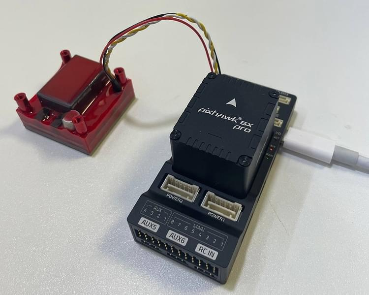

# Electro-Permanent Magnet (EPM)

<Badge type="tip" text="PX4 v1.18" />

An electro-permanent magnet (EPM) uses a short electrical pulse to switch its magnetic state, and does not consume power continuously while holding a payload.

This topic explains how to connect and configure a [Zubax FluxGrip FG40](https://shop.zubax.com/products/zubax-epm) EPM as a DroneCAN gripper.
The gripper can then be operated from a [payload delivery mission](../flying/package_delivery_mission.md), a joystick, or a MAVLink command.



::: info
This setup was tested with a Holybro Pixhawk 6X Pro and FluxGrip firmware `502e1f5`.
See the [FluxGrip documentation](https://fluxgrip.zubax.com/chapters/hardware/fg40.html#interface-and-power-supply) for product-specific setup and operating limits.
:::

## PX4 Firmware Support

DroneCAN EPM operation is supported from PX4 v1.18 — the first PX4 version that supports gripper command forwarding using the DroneCAN hardpoint message ([uavcan.equipment.hardpoint](https://dronecan.github.io/Specification/7._List_of_standard_data_types/#uavcanequipmenthardpoint)).

The flight controller firmware must include both of the following modules (and of course the board must support CAN):

```ini
CONFIG_DRIVERS_UAVCAN=y
CONFIG_MODULES_PAYLOAD_DELIVERER=y
```

You can check or add these settings in the board's `default.px4board` file under `boards/<vendor>/<board>/`, or use the [PX4 board configuration tool](../hardware/porting_guide_config.md#px4-menuconfig-setup).

Then [build PX4 and upload the firmware](../dev_setup/building_px4.md).
For an FMUv6X flight controller this would be done as follows (replace `px4_fmu-v6x_default` with the build target for your flight controller):

```sh
git submodule update --init --recursive
make px4_fmu-v6x_default
make px4_fmu-v6x_default upload
```

## Hardware Setup

::: warning
FluxGrip can briefly draw a high current when switching.
FluxGrip can be powered from the flight controller power rail for testing purposes, provided that the rail meets its voltage and current requirements.
For normal operation, use a suitable separate power supply for the EPM to reduce the load on the flight controller power rail and improve switching performance.
Follow the voltage, current, and wiring requirements in the [FluxGrip documentation](https://fluxgrip.zubax.com/chapters/hardware/fg40.html#interface-and-power-supply).
:::

1. Connect FluxGrip to the flight controller's `CAN1` port.
2. Connect FluxGrip to its power supply.
3. Check that the CAN bus is wired and terminated as described in [CAN Wiring](../can/index.md#wiring).
4. Power the flight controller and FluxGrip.

When communication is working, the left CAN LED on FluxGrip is solid and the adjacent CAN LED blinks.

## PX4 Configuration

Set the following parameters in QGroundControl, and then reboot the flight controller:

| Parameter                                                                    | Value                            | Description                                                                                           |
| ---------------------------------------------------------------------------- | -------------------------------- | ----------------------------------------------------------------------------------------------------- |
| [UAVCAN_ENABLE](../advanced_config/parameter_reference.md#UAVCAN_ENABLE)     | `Sensors Automatic Config` (`2`) | Enables DroneCAN and dynamic node allocation. Use `3` instead if the vehicle also uses DroneCAN ESCs. |
| [UAVCAN_BITRATE](../advanced_config/parameter_reference.md#UAVCAN_BITRATE)   | `1000000`                        | Sets the CAN bus bitrate to 1 Mbit/s.                                                                 |
| [PD_GRIPPER_TYPE](../advanced_config/parameter_reference.md#PD_GRIPPER_TYPE) | `Binary Grab/Release` (`0`)      | Enables the binary grab/release gripper interface used by the EPM.                                    |

::: info
You do not need to map a flight controller actuator output when controlling the EPM over DroneCAN.
No DroneCAN subscription or publication parameters (`UAVCAN_SUB_*`, `UAVCAN_PUB_*`, `CANNODE_SUB_*`, or `CANNODE_PUB_*`) are required.
PX4 automatically publishes the hardpoint command when DroneCAN is enabled.
:::

## Test the Gripper

::: warning
Remove the propellers and secure the vehicle before testing.
The payload deliverer commands the gripper to the grab state when the module starts, so the EPM will magnetize during startup.
:::

Open the QGroundControl [MAVLink Shell](../debug/mavlink_shell.md), then verify that the DroneCAN driver and payload deliverer are running:

```sh
uavcan status
payload_deliverer status
```

Test both gripper states:

```sh
# Release the payload (magnet off)
payload_deliverer gripper_open

# Grab the payload (magnet on)
payload_deliverer gripper_close
```

PX4 sends these as `MAV_CMD_DO_GRIPPER` commands for hardpoint ID `0`.
The release command has action `0`, and the grab command has action `1`.

After testing, the EPM can be operated using any of the methods described in [Grippers > Using a Gripper](gripper.md#using-a-gripper).

## LED Status

The Magnet LED, located to the right of the CAN LEDs, indicates the EPM state:

| State          | Meaning                                              |
| -------------- | ---------------------------------------------------- |
| Detect/Unknown | Initial state after FluxGrip is powered on.          |
| On             | The EPM is magnetized and holding the payload.       |
| Off            | The EPM is demagnetized and the payload is released. |
| Fade-in        | FluxGrip is switching to the magnetized state.       |
| Fade-out       | FluxGrip is switching to the demagnetized state.     |

If the Magnet LED blinks rapidly, FluxGrip failed to magnetize.
Check the power supply and wiring, and contact [Zubax support](mailto:support@zubax.com) if the problem persists.

## Troubleshooting

If FluxGrip does not respond:

1. Run `uavcan status` and confirm that the DroneCAN driver is running and FluxGrip is visible on the bus.
2. Check that `UAVCAN_ENABLE` and `UAVCAN_BITRATE` are set as described above.
3. Check CAN wiring, bus termination, and the EPM power supply.
4. Run `payload_deliverer status` and confirm that the gripper is valid.
5. If `payload_deliverer` is not available, rebuild the firmware with `CONFIG_MODULES_PAYLOAD_DELIVERER=y`.

## See Also

- [FluxGrip: Integration with PX4](https://forum.zubax.com/t/fluxgrip-integration-with-px4/2863) (Zubax Forum)
- [FluxGrip Quickstart Guide](https://forum.zubax.com/t/fluxgrip-quickstart-guide/2335) (Zubax Forum)
- [DroneCAN](../dronecan/index.md)
- [Grippers](gripper.md)
