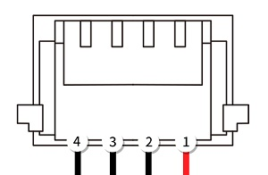
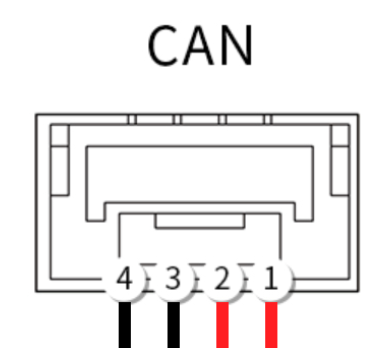

# Remote ID (Open Drone ID)

<Badge type="tip" text="PX4 v1.14" /><Badge type="warning" text="Experimental" />

:::warning Experimental
Remote ID support is experimental.
:::

Remote ID is a government mandated technology for UAVs in Japan, the United States of America and the European Union, designed to enable safe sharing of airspace between UAVs and other aircraft.
The specification requires that UAVs broadcast data such as: real-time location/altitude, serial number, operator ID/location, status, etc.

PX4 works with Remote ID modules that target the FAA [standard Remote ID rules](https://www.faa.gov/uas/getting_started/remote_id).
These are designed to be integrated into the vehicle, and broadcast Open Drone ID messages (Open Drone ID is an open source implementation of Remote ID) using id, position, and other information that is supplied by an autopilot.
The "standard rules" modules enable less restrictive operation than "broadcast rules" modules, which are standalone modules with an integrated GPS that do not have any communication with the autopilot.

## Supported Hardware

::: warning
Remote ID hardware can only be connected via DroneCAN on `main` branch builds (builds _after_ PX4 v1.15).
:::

PX4 integrates with Remote ID hardware that supports:

- [Open Drone ID](https://mavlink.io/en/services/opendroneid.html) MAVLink protocol<Badge type="tip" text="PX4 v1.14" />
- Remote ID over CAN<Badge type="tip" text="PX4 main (v1.16)" />

It has been tested with the following devices:

- [Cube ID](https://docs.cubepilot.org/user-guides/cube-id/cube-id) (CubePilot)
- [Db201](https://dronescout.co/dronebeacon-mavlink-remote-id-transponder/) (BlueMark) - Tested via serial port. Not tested via CAN port.
- [Db202mav](https://dronescout.co/dronebeacon-mavlink-remote-id-transponder/) (BlueMark) - Less expensive variant without CAN port.
- [Holybro RemoteID Module](https://holybro.com/products/remote-id) (Holybro)

Other devices that support the Open Drone ID protocol and DroneCAN should also work (but have not been tested).

## Hardware Setup

Remote ID devices can be connected to any free/unused serial port on the flight controller, or CAN.
Most commonly they are connected directly to the `TELEM2` port (if it is not being use for some other purpose) as this is already configured for MAVLink "by default".

### Cube ID

[Cube ID](https://docs.cubepilot.org/user-guides/cube-id/cube-id) can be connected using a serial or CAN port.

It comes with 6-pin and 4-pin JST-GH 1.25mm cables that can be connected directly to the `TELEM` serial port and `CAN` ports, respectively, on most recent Pixhawk flight controllers.

#### Cube ID Serial Port

If using a different port, or a flight controller that has different connector, you may need to modify the cable.
The pinout of the serial port is shown below.
The TX and RX on the flight controller must be connected to the RX and TX on the Remote ID, respectively.



| Pin     | Signal   | Volt |
| ------- | -------- | ---- |
| 1 (red) | VCC_5V   | 5V   |
| 2 (blk) | TX (OUT) |      |
| 3 (blk) | RX (IN)  |      |
| 4 (blk) | GND      | 0    |

#### Cube ID CAN Port



| Pin     | Signal | Volt |
| ------- | ------ | ---- |
| 1 (red) | VCC_5V | 5V   |
| 2 (red) | CAN_H  |      |
| 3 (blk) | CAN_L  |      |
| 4 (blk) | GND    | 0    |

#### Cube ID Firmware

The Cube ID uses proprietary firmware (not [ArduRemoteID](https://github.com/ArduPilot/ArduRemoteID) like some other remote id beacons).

For firmware update instructions see [Cube ID > Updating](https://docs.cubepilot.org/user-guides/cube-id/cube-id#updating).

### BlueMark Db201/Db202mav

[Db201](https://dronescout.co/dronebeacon-mavlink-remote-id-transponder/) or [Db202mav](https://dronescout.co/dronebeacon-mavlink-remote-id-transponder/) can be connected using their serial port.

::: info
The `Db201` also has a CAN port that should work on PX4 `main` builds.
However this has not yet been tested.
:::

They come with a 6-pin JST-GH 1.25mm cable that can be connected directly to the `TELEM` ports on most recent Pixhawk flight controllers.

If using a different serial port (i.e. with fewer pins), or a flight controller that has different connector, you may need to modify the cable.
Information on the port pinout can be found in the [User Guide](https://download.bluemark.io/db200.pdf).

The beacons come preinstalled with recent [ArduRemoteID](https://github.com/ArduPilot/ArduRemoteID) firmware.
The [User Guide](https://download.bluemark.io/db200.pdf) explains how you can update firmware via the web interface, if needed.

More general setup, including how to mount the beacon, is also covered in the [User Guide](https://download.bluemark.io/db200.pdf).

### Holybro Remote ID Module

The [Holybro Remote ID Module](https://holybro.com/products/remote-id) can be connected using a serial or CAN port.

It comes with a 6-pin JST-GH 1.25mm cable that can be connected directly to the `TELEM` ports on most recent Pixhawk flight controllers such as the Pixhawk 6C/6X or Cube Orange.

The module comes preinstalled with recent [ArduRemoteID](https://github.com/ArduPilot/ArduRemoteID) firmware.

The [User Guide](https://docs.holybro.com/radio/remote-id) explains how you can config and update firmware via the web interface, if needed.

#### Holybro Pinouts


## PX4 Configuration

### MAVLink Port Configuration

Remote ID hardware connected to a serial port is configured in the same way as any other [MAVLink Peripheral](../peripherals/mavlink_peripherals.md).

Assuming you have connected the device to the `TELEM2` port, [set the parameters](../advanced_config/parameters.md) as shown:

- [MAV_1_CONFIG](../advanced_config/parameter_reference.md#MAV_1_CONFIG) = `TELEM 2`
- [MAV_1_MODE](../advanced_config/parameter_reference.md#MAV_1_MODE) = Normal
- [MAV_1_RATE](../advanced_config/parameter_reference.md#MAV_1_RATE) = 0 (default sending rate for port).
- [MAV_1_FORWARD](../advanced_config/parameter_reference.md#MAV_1_FORWARD) = Enabled

Then reboot the vehicle.

You will now find a new parameter called [SER_TEL2_BAUD](../advanced_config/parameter_reference.md#SER_TEL2_BAUD).
The required baud rate depends on the remote ID used (for Cube ID it must be set to 57600).

<!-- In theory, a Remote ID (or other MAVLink peripheral) that supports WiFi or wired Ethernet network could also be connected over those links. -->

### DroneCAN Configuration

Remote ID hardware connected to a CAN is configured in the same way as any other [DroneCAN Hardware](../dronecan/index.md#px4-configuration).

Specifically, you will have to [enable DroneCAN](../dronecan/index.md#enabling-dronecan) by setting the value of [`UAVCAN_ENABLE`](../advanced_config/parameter_reference.md#UAVCAN_ENABLE) to a non-zero value.

::: tip
The [CAN Remote ID Not Working](../peripherals/remote_id.md#can-remote-id-not-working) explains how you can test the setup, and adjust Remote ID settings if necessary.
:::

### Enable Remote ID

There is no need to explicitly enable Remote ID (supported Remote ID messages are either streamed by default or must be requested in the current implementation, even if no remote ID is connected).

### Prevent Arming based on Remote ID

To only allow arming when a Remote ID is ready, [set](../advanced_config/parameters.md#conditional-parameters) the parameter [COM_ARM_ODID](#COM_ARM_ODID) to `2` (it is disabled by default).

| Parameter                                                                                       | Description                                                                                                                                                                            |
| ----------------------------------------------------------------------------------------------- | -------------------------------------------------------------------------------------------------------------------------------------------------------------------------------------- |
| <a id="COM_ARM_ODID"></a>[COM_ARM_ODID](../advanced_config/parameter_reference.md#COM_ARM_ODID) | Enable Drone ID system detection and health check. `0`: Disable (default), `1`: Warn if Remote ID not detected but still allow arming, `2`: Only allow arming if Remote ID is present. |

## Module Broadcast Testing

Integrators should test than the remote ID module is broadcasting the correct information, such as UAV location, ID, operator ID and so on.
This is most easily done using a 3rd party application on your mobile device:

- [Drone Scanner](https://github.com/dronetag/drone-scanner) (Google Play or Apple App store)
- [OpenDroneID OSM](https://play.google.com/store/apps/details?id=org.opendroneid.android_osm&hl=en&gl=US) (Google Play)

## Implementation

PX4 v1.14 streams these messages by default (in streaming modes: normal, onboard, usb, onboard low bandwidth):

- [OPEN_DRONE_ID_LOCATION](https://mavlink.io/en/messages/common.html#OPEN_DRONE_ID_LOCATION) (1 Hz) - UAV location, altitude, direction, and speed.
- [OPEN_DRONE_ID_SYSTEM](https://mavlink.io/en/messages/common.html#OPEN_DRONE_ID_SYSTEM) (1 Hz) Operator location/altitude, multiple aircraft information (group/swarm, if applicable), full timestamp and possible category/class information.

  - Implementation assumes operator is located at vehicle home position (does not yet support getting operator position from GCS).
    This is believed to be compliant for broadcast-only Remote IDs.

The following message can be streamed on request (using [MAV_CMD_SET_MESSAGE_INTERVAL](https://mavlink.io/en/messages/common.html#MAV_CMD_SET_MESSAGE_INTERVAL)):

- [OPEN_DRONE_ID_BASIC_ID](https://mavlink.io/en/messages/common.html#OPEN_DRONE_ID_BASIC_ID) - UAV identity information (essentially a serial number)
  - PX4 v1.14 specifies a serial number ([MAV_ODID_ID_TYPE_SERIAL_NUMBER](https://mavlink.io/en/messages/common.html#MAV_ODID_ID_TYPE_SERIAL_NUMBER)) but does not use the required format (ANSI/CTA-2063 format).

PX4 prevents arming based on Remote ID health if parameter [COM_ARM_ODID](../advanced_config/parameter_reference.md#COM_ARM_ODID) is set to `2`.
The UAV will then require `HEARTBEAT` messages from the Remote ID as a precondition for arming the UAV.
You can also set the parameter to `1` to warn but still allow arming when Remote ID `HEARTBEAT` messages are not detected.

The following Open Drone ID MAVLink messages are not supported in PX4 v1.14 (to be added by [PX4#21647](https://github.com/PX4/PX4-Autopilot/pull/21647)):

- [OPEN_DRONE_ID_AUTHENTICATION](https://mavlink.io/en/messages/common.html#OPEN_DRONE_ID_AUTHENTICATION) - Provides authentication data for the UAV.
- [OPEN_DRONE_ID_SELF_ID](https://mavlink.io/en/messages/common.html#OPEN_DRONE_ID_SELF_ID) - Operator identity (plain text).
- [OPEN_DRONE_ID_OPERATOR_ID](https://mavlink.io/en/messages/common.html#OPEN_DRONE_ID_OPERATOR_ID) - Operator identity.
- [OPEN_DRONE_ID_ARM_STATUS](https://mavlink.io/en/messages/common.html#OPEN_DRONE_ID_ARM_STATUS) - Status of Remote ID hardware.
  Use as condition for vehicle arming, and for Remote ID health check.
- [OPEN_DRONE_ID_SYSTEM_UPDATE](https://mavlink.io/en/messages/common.html#OPEN_DRONE_ID_SYSTEM_UPDATE) - Subset of `OPEN_DRONE_ID_SYSTEM` that can be sent with information at higher rate.

## Compliance

PX4 may not be compliant with the relevant specifications in version 1.14 (which is why this feature is currently experimental).
A working group has been established to evaluate the gaps.

Some known issues are:

- Vehicles must arm conditional on receiving the Remote ID [OPEN_DRONE_ID_ARM_STATUS](https://mavlink.io/en/messages/common.html#OPEN_DRONE_ID_ARM_STATUS) message, with a status that indicates the Remote ID hardware is ready to broadcast.
  - PX4 v1.14 does not process `OPEN_DRONE_ID_ARM_STATUS`, and arming is only conditional on the Remote ID device `HEARTBEAT`.
- Health of the Remote ID depends on both receiving a `HEARTBEAT` and the `OPEN_DRONE_ID_ARM_STATUS`.
  When flying, a non-armed status for the Remote ID must be published in [OPEN_DRONE_ID_LOCATION.status](https://mavlink.io/en/messages/common.html#OPEN_DRONE_ID_LOCATION) as a Remote ID malfunction.
  - PX4 v1.14 does not yet receive `OPEN_DRONE_ID_ARM_STATUS`.
- `OPEN_DRONE_ID_ARM_STATUS` must be forwarded to the GCS, if present for additional error reporting.
- [OPEN_DRONE_ID_BASIC_ID](https://mavlink.io/en/messages/common.html#OPEN_DRONE_ID_BASIC_ID) specifies a serial number in an invalid format (not ANSI/CTA-2063 format).
- The vehicle ID is expected to be tamper resistant.

[PX4-Autopilot/21647](https://github.com/PX4/PX4-Autopilot/pull/21647) is intended to address the known issues.

## Troubleshooting

### CAN Remote ID Not Working

::: info
This information was tested with the CAN Cube ID from CubePilot.
It _should_ also apply to CAN Remote ID modules from other vendors.
:::

To confirm that the Remote ID is working:

- Check that the `OPEN_DRONE_ID_BASIC_ID` and `OPEN_DRONE_ID_LOCATION` messages appear in the QGroundControl [MAVLink Inspector](https://docs.qgroundcontrol.com/master/en/qgc-user-guide/analyze_view/mavlink_inspector.html) (QGC **Analyze Tools > MAVLink Inspector**).

- If those messages are not present, check that the Remote_ID node appears on the UAVCAN list.

  Run the following command in the [QGroundControl MAVLink Console](../debug/mavlink_shell.md#qgroundcontrol-mavlink-console):

  ```sh
  uavcan status
  ```

  The connected CAN nodes should appear in the list.
  If you only have one CAN component on your system (the remote ID) the list might look like this:

  ```plain
  Online nodes (Node ID, Health, Mode):
     125 OK         OPERAT
  ```

  The nodes aren't "named" so if you have more than one CAN node you can compare the number of nodes shown with the number expected on your system to see if they match.
  Alternatively you can run the `uavcan status` with the Remote ID connected and disconnected and difference the result (which has the benefit that you will then known the Remote ID module's node ID).

If the Remote ID CAN node is present and the messages are not being received, then the Remote ID itself may need to be configured:

1. Open QGroundControl
2. Navigate to the [Application settings](https://docs.qgroundcontrol.com/master/en/qgc-user-guide/settings_view/general.html): **Application Settings > General > Miscellaneous**.
3. Select `Enable Remote ID`.
   The Remote ID tab should appear.
 
   ::: info
   If this option is not present you may be in a very recent version of QGC.
   In that case, open the view at: **Application Settings > Remote ID**.
   :::

4. Enter the information for Basic, Operator, and Self ID.

Once configured, check the MAVLink Inspector again and check that the `OPEN_DRONE_ID_BASIC_ID` and `OPEN_DRONE_ID_LOCATION` messages are now present.

## See Also

- [Remote Identification of Drones](https://www.faa.gov/uas/getting_started/remote_id) (FAA)
