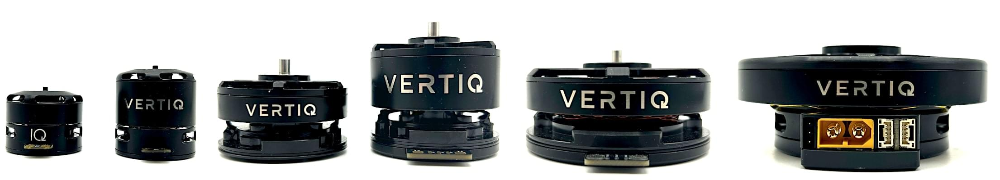

# Vertiq All-In-One Motor/ESC Modules

Vertiq makes high performance propulsion systems for commercial and defense UAS.
The core design consists of a lightweight, tightly integrated motor and ESC with an embedded position sensor.
With closed loop velocity control for the fastest response times available, class leading efficiency, no startup and reverse jitter allowing low speed control and smooth reversibility, and a built in "stow" controller for smoothly placing idle propellers in a preferred direction, Vertiq's modules have significant advantages over other ESCs.

All Vertiq modules support traditional [PWM input, DShot, OneShot, and Multishot communication protocols](https://iqmotion.readthedocs.io/en/latest/communication_protocols/hobby_protocol.html). Vertiq's larger modules also support [DroneCAN control](https://iqmotion.readthedocs.io/en/latest/communication_protocols/dronecan_protocol.html).

## Where to Buy

Purchasing information can be found on the [Vertiq website](https://www.vertiq.co/).

## Hardware Setup

### Wiring

Connecting your Vertiq module to a PWM output from your flight controller or DroneCAN bus will vary depending on your model.
Please see the product data sheets for wiring information.

All Vertiq datasheets can be found at [vertiq.co](https://www.vertiq.co/).

## Firmware Setup

The best tool to configure your Vertiq module is Vertiq's IQ Control Center application.
You can find instructions for installation in [Getting Started with Speed Modules Using IQ Control Center](https://iqmotion.readthedocs.io/en/latest/control_center_docs/speed_module_getting_started.html).

To get started with traditional PWM input or DShot with your flight controller, please see [PWM and DSHOT Control with a Flight Controller](https://iqmotion.readthedocs.io/en/latest/tutorials/pwm_control_flight_controller.html).

To get started with DroneCAN with your flight controller, please see [DroneCAN Integration with a PX4 Flight Controller](https://iqmotion.readthedocs.io/en/latest/tutorials/dronecan_flight_controller.html).

## Flight Controller Setup

### DroneCAN Configuration

Instructions for integrating the motor/ESC using with DroneCAN can be found in [Flight Controller Configuration](https://iqmotion.readthedocs.io/en/latest/tutorials/dronecan_flight_controller.html#dronecan-integration-with-a-px4-flight-controller) (in _DroneCAN Integration with a PX4 Flight Controller_).

These instructions walk you through setting the correct parameters for enabling the flight controller's DroneCAN drivers, setting the correct configuration parameters for communication with Vertiq modules on the DroneCAN bus, ESC configuration, and testing that your flight controller can properly control your modules over DroneCAN.

### DShot/PWM Configuration

Instructions for integrating the motor/ESC using PWM and DShot can be found in [PWM and DShot Control with a Flight Controller](https://iqmotion.readthedocs.io/en/latest/tutorials/pwm_control_flight_controller.html).
DShot is recommended.

## Further Information

- <https://www.vertiq.co/> — Learn more about Vertiq modules
- [Vertiq Documentation](https://iqmotion.readthedocs.io/en/latest/index.html) — Additional information about configuring your Vertiq module
