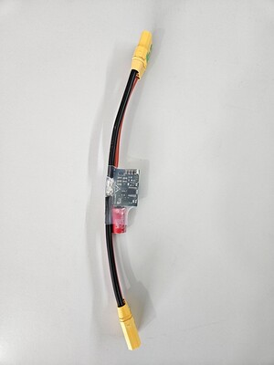

# Agam DPM01 Power Module

The Agam DPM01 is a digital power module designed for PX4-compatible flight controllers. It provides regulated 5 V power to the flight controller while measuring battery voltage and current through an I2C interface for battery monitoring and power management.

## Where to Buy

Order this module from:

- [Agam DPM01 Power Module](https://www.agamrobotics.com/product-page/digital-power-module-dpm01)

## Hardware Specifications

- Regulated 5 V power output
- Digital voltage and current measurement
- I2C communication interface
- XT60 battery connectors
- Molex interface connector
- Compatible with PX4-based flight controllers
- Compact and lightweight design

### Electrical Specifications

- Input Voltage
  - DPM01-6S: 2S–6S LiPo battery
  - DPM01-12S: 2S–12S LiPo battery

- Maximum Input Voltage
  - 36 V

- Output Voltage
  - 5 V regulated output

- Maximum Output Current
  - 3 A

- Rated Current
  - 60 A

- Communication Interface
  - I2C

- Capacitor
  - 270 µF, 63 V electrolytic capacitor

- Weight
  - 33 g

## Hardware Setup

The DPM01 should be installed between the battery and the flight controller.

1. Connect the battery to the XT60 input connector.
2. Connect the XT60 output connector to the ESC or power distribution board.
3. Connect the Molex interface cable to the flight controller power port.
4. Verify all connections before powering the system.

The module should be securely mounted to minimize vibration and cable strain.

## PX4 Configuration

Agam Autopilot V6X-RT supports Digital Power Modules such as the DPM01.

In PX4 v1.15 or later, the module is automatically detected.

Enable the following parameter:

- `SENS_EN_INA226` (enabled by default)

No current divider or voltage divider configuration is required in the Battery Configuration settings, unlike analog power modules.

The default calibration values provide measurement accuracy within ±5%.
1. Open QGroundControl.
2. Navigate to **Vehicle Setup > Power**.
3. Verify the battery voltage and current measurements.
4. Confirm that the `SENS_EN_INA226` parameter is enabled.

## Connector

The DPM01 uses:

- XT60 battery connectors
- Molex interface connector

The Molex connector provides power and monitoring signals between the power module and the flight controller.

## Package Contents

- DPM01 Power Module
- XT60 connectors
- Molex interface cable
- 270 µF capacitor

## Applications

- Multirotor UAVs
- Fixed-wing aircraft
- VTOL platforms
- Industrial drones
- Research and educational UAVs

## See Also

- [Agam Robotics](https://www.agamrobotics.com/)
- [Agam DPM01 Documentation](https://agamrobotics.gitbook.io/docs/digital-power-modules-dpm/dpm01-6s)
