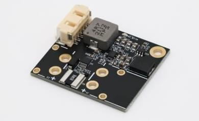

# ARK PAB Power Module No Connector

The [ARK PAB Power Module No Connector](https://arkelectron.gitbook.io/ark-documentation/power/ark-pab-power-module) is a 5V 6A power supply and digital power monitor designed for the Pixhawk Autopilot Bus Carrier boards.

## Where to Buy

Order this module from:

- [ARK Electronics](https://arkelectron.com/product/ark-pab-power-module-no-connector/) (US)

## Hardware Specifications

- **TI INA226 Digital Power Monitor**
  - 0.0005 Ohm Shunt
  - I2C Interface

- **5.2V 6A Step-Down Regulator**
  - 33V Maximum Input Voltage
  - 5.8V Minimum Input Voltage at 6A Out
  - Output Over-Voltage Protection
  - Output Over-Current Protection

- **Connections**
  - Solder Pad Battery Input
  - Solder Pad Battery Output
  - 6 Pin Molex CLIK-Mate Output
    - [Matches ARK PAB Carrier Power Pinout](https://arkelectron.gitbook.io/ark-documentation/flight-controllers/ark-pixhawk-autopilot-bus-carrier/pinout)

- **Other**
  - USA Built
  - FCC Compliant
  - Includes 6 Pin Molex CLIK-Mate Cable

- **Additional Information**
  - Weight: 9.5 g
  - Dimensions: 4.75 cm x 3.43 cm x 0.86 cm

## PX4 Setup

- Enable the [SENS_EN_INA226](../advanced_config/parameter_reference.md#SENS_EN_INA226) parameter if it not enabled.
- Reboot the flight controller.

## See Also

- [ARK PAB Power Module No Connector Documentation](https://arkelectron.gitbook.io/ark-documentation/power/ark-pab-power-module) (ARK Docs)
