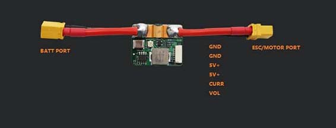

# CUAV HV PM (High-Voltage Power Module)

The CUAV&reg; *HV_PM* power module is a "high voltage" power module independently developed by CUAV.

:::tip
The *HV_PM* is included in the CUAV V5+/V5 nano kit, but is also be sold separately.
There are different cables depending on the flight controller (Pixhack v3, V5+/V5 nano, Pixhawk).
It can be used with other flight controllers, but you may need to modify the cable pin.
:::

## Specifications

- **Higher voltage input:** 10V-60V (3s~14s battery)
- **Accurate battery monitor:**
  - **Voltage detection accuracy:** +-0.1v; 
  - **Current detection accuracy:** +-0.2A
- **BEC (5v) max current:** 5A
- **Max (detection) current:** 60A
- **Max output current (ESC/MOTOR PORT):** 60A

## Where to Buy

[CUAV aliexpress store](https://www.aliexpress.com/item/32841805115.html?spm=2114.12010615.8148356.1.64165998hPvTKQ)

## Pinouts

## Enable HV PM

[Battery Estimation Tuning](../config/battery.md) describes how to configure the battery and power module.

The key configuration settings for `HV_PM` are:
- **Voltage divider:** 18
- **Amps per volt:** 24 A/V
