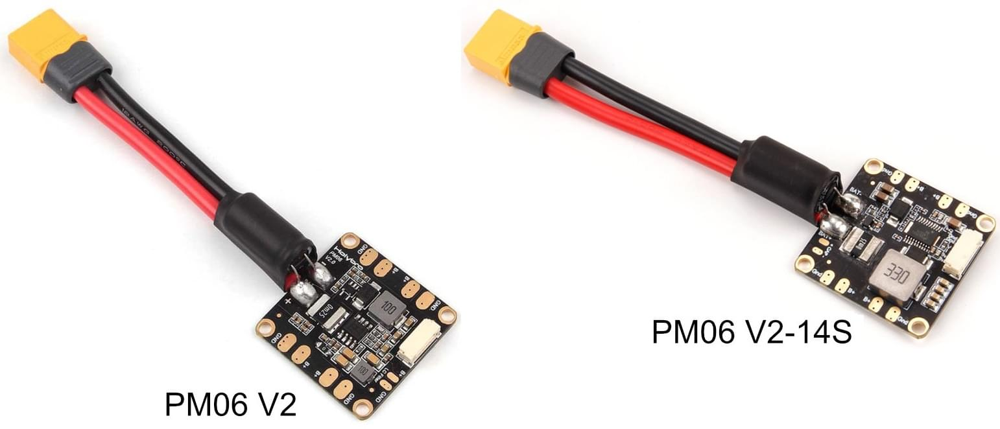
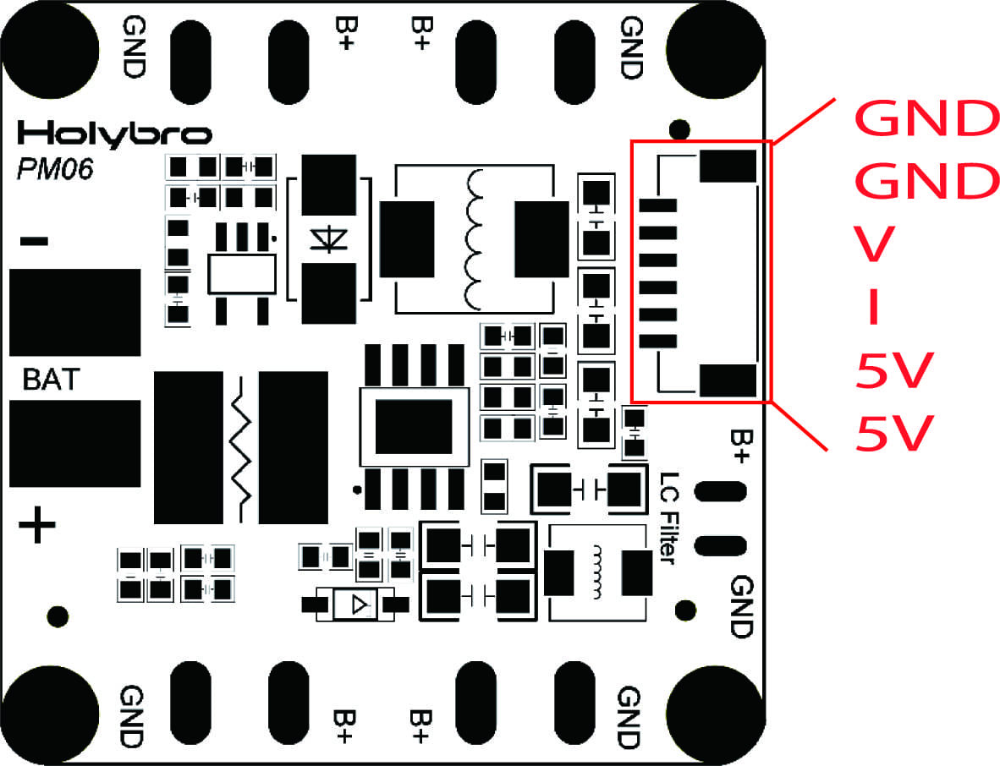
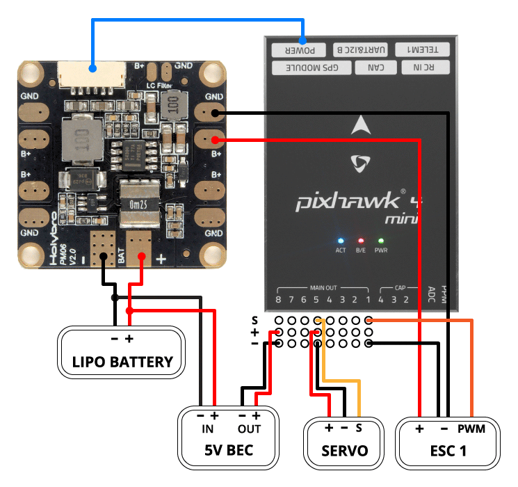

# Holybro Micro Power Module (PM06)

This power module has integrated power distribution board and provides regulated power for a flight controller and ESCs, and sends information to the autopilot about the battery’s voltage and current draw.

## Specifications

- **PCB Current:** 120A continued
- **UBEC Current:** 3A Max
- **Power input:** 2S~10S (standard version)
- **Power input:** 2S~14S (14S version)
- **Power output:** DC 5.1V~5.3V
- **Voltage Divider:** 18.182
- **Amperes per Volt:** 36.364

## Mechanical Specifications

- **Dimensions:** 35x35x5mm
- **Mounting hole:** 30.5mm\*30.5mm
- **Weight:** 24g

## Where to Buy

[PM06 V2 Power Module](https://holybro.com/collections/power-modules-pdbs/products/micro-power-module-pm06-v2)

## Wiring/Connections

This image shows the wiring and connections for the [Pixhawk 4 Mini](https://docs.px4.io/v1.16/en/assembly/quick_start_pixhawk4_mini#power) (discontinued).

