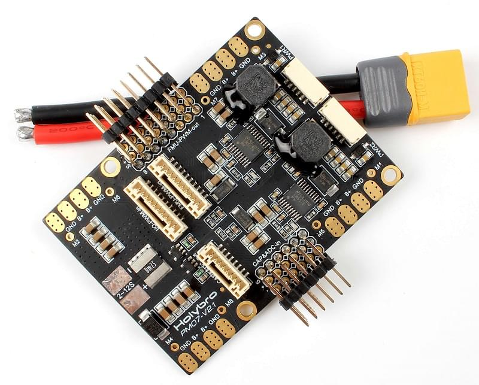
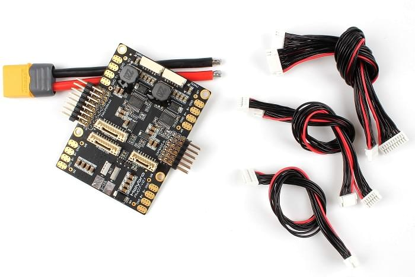

# Holybro Pixhawk 4 Power Module (PM07)

The Power Management Board (PM Board) serves the purpose of a Power Module as well as a Power Distribution Board.
In addition to providing regulated power to Pixhawk 4 and the ESCs, it sends information to the autopilot about battery’s voltage and current supplied to the flight controller and the motors.

::: info
This module can be purchased as bundle with [Pixhawk 4](../assembly/quick_start_pixhawk4.md), but can also be used with other flight controllers.
:::

## Specifications

- **PCB Current:** total 120A outputs (MAX)
- **UBEC 5v output current:** 3A
- **UBEC input voltage:** 2~12s LiPo
- **Dimensions:** 68 x 50 x 8 mm
- **Mounting Holes:** 45 x 45 mm
- **Weight:** 36g

## Package Contents

- PM07 board
- 80mm XT60 connector wire (installed)
- Electrolytic capacitor: 220uF 63V (installed)
- 2x JST GH 10P Cable
- JST GH 8P Cable
- 2x JST GH 6P Cable

## Where to Buy

[Pixhawk 4 Power Module (PM07)](https://holybro.com/collections/power-modules-pdbs/products/pixhawk-4-power-module-pm07)

## Wiring/Connections

Wiring and connection information can be found in: [Pixhawk 4 > Power](../assembly/quick_start_pixhawk4.md#power).

## Further Information

[Quick Start Guide](https://docs.holybro.com/power-module-and-pdb/power-module/pm07-quick-start-guide) (Holybro)
