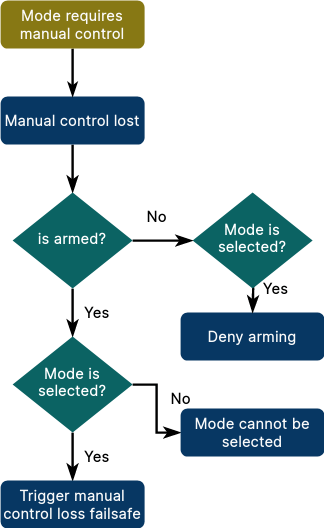

# PX4 ROS 2 Control Interface

<Badge type="tip" text="PX4 v1.15" /> <Badge type="warning" text="Experimental" />

:::warning Experimental
At the time of writing, parts of the PX4 ROS 2 Control Interface are experimental, and hence subject to change:

- The architecture and core interfaces for defining modes in ROS 2 modes are largely stable, and are tested in CI.
  The library offers significant benefits over using offboard mode in its current state.
- Only a few setpoint types have settled (the others are still under development).
  You may need to use internal PX4 topics which may not remain backwards-compatible over time.
- The API is not fully documented.

:::

The [PX4 ROS 2 Interface Library](../ros2/px4_ros2_interface_lib.md) is a C++ library that simplifies controlling PX4 from ROS 2.

Developers use the library to create and dynamically register modes written using ROS 2.
These modes are dynamically registered with PX4, and appear to be part of PX4 to a ground station or other external system.
They can even replace the default modes in PX4 with enhanced ROS 2 versions, falling back to the original version if the ROS2 mode fails.

The library also provides classes for sending different types of setpoints, ranging from high-level navigation tasks all the way down to direct actuator controls.
These classes abstract the internal setpoints used by PX4, and that can therefore be used to provide a consistent ROS 2 interface for future PX4 and ROS releases.

PX4 ROS 2 modes are easier to implement and maintain than PX4 internal modes, and provide more resources for developers in terms of processing power and pre-existing libraries.
Unless the mode is safety-critical, requires strict timing or very high update rates, or your vehicle doesn't have a companion computer, you should [consider using PX4 ROS 2 modes in preference to PX4 internal modes](../concept/flight_modes.md#internal-vs-external-modes).

## Overview

This diagram provides a conceptual overview of how the control interface modes and mode executors interact with PX4.


<!-- Source: https://docs.google.com/drawings/d/1WByCfgcytnaow7r41VhYJL8OGrw1RjFO51GoPMQBCNA/edit -->

The following sections define and explain the terms used in the diagram.

### Definitions

#### Mode

A mode defined using the interface library has the following properties:

- A mode is a component that can send setpoints to the vehicle in order to control its motion (such as velocity or direct actuator commands).
- A mode selects a setpoint type and sends it while it is active.
  It can switch between multiple setpoint types.
- A mode can't activate other modes, and must be activated by the user (through RC/GCS), the flight controller in a failsafe situation, a _mode executor_, or some other external system.
- Has a name displayed by the GCS.
- Can configure its mode requirements (for example that it requires a valid position estimate).
- A mode can perform different tasks, such as flying to a target, lowering a winch, releasing a payload and then fly back.
- A mode can replace a mode defined in PX4.

#### Mode Executor

A mode executor is an optional component for scheduling modes.
For example, the mode executor for a custom payload delivery or survey mode might first trigger a take-off, then switch to the custom mode, and when that completes trigger an RTL.

Specifically, it has the following properties:

- A mode executor is an optional component one level higher than a mode.
  It is a state machine that can activate modes, and wait for their completion.
- It can only do so while it is in charge.
  For that, an executor has exactly one _owned mode_ (and a mode can be owned by at most one executor).
  This mode serves as activation for the executor: when the user selects the mode, the owning executor gets activated and can select any mode.
  It stays in charge until the user switches modes (by RC or from a GCS), or a failsafe triggers a mode switch.
  Should the failsafe clear, the executor gets reactivated.
- This allows multiple executors to coexist.
- Executors cannot activate other executors.
- Within the library, a mode executor is always implemented in combination with a custom mode.

::: info

- These definitions guarantee that a user can take away control from a custom mode or executor at any point in time by commanding a mode switch through RC or a GCS.
- A mode executor is transparent to the user.
  It gets indirectly selected and activated through the owning mode, and thus the mode should be named accordingly.

:::

#### Configuration Overrides

Both modes and executors can define configuration overrides, allowing customisation of certain behaviors while the mode or executor is active.

These are currently implemented:

- _Disabling auto-disarm_.
  This permits landing and then taking off again (e.g. to release a payload).
- _Ability to defer non-essential failsafes_.
  This allows an executor to run an action without being interrupted by non-critical failsafe.
  For example, ignoring a low-battery failsafe so that a winch operation can complete.

### Comparison to Offboard Control

The above concepts provide a number of advantages over traditional [offboard control](../ros/offboard_control.md):

- Multiple nodes or applications can coexist and even run at the same time.
  But only one node can _control the vehicle_ at a given time, and this node is well defined.
- Modes have a distinct name and be displayed/selected in the GCS.
- Modes are integrated with the failsafe state machine and arming checks.
- The setpoint types that can be sent are well defined.
- ROS 2 modes can replace flight controller internal modes (such as [Return mode](../flight_modes/return.md)).

## Installation and First Test

The following steps are required to get started:

1. Make sure you have a working [ROS 2 setup](../ros2/user_guide.md), with [`px4_msgs`](https://github.com/PX4/px4_msgs) in the ROS 2 workspace.
2. Clone the repository into the workspace:

   ```sh
   cd $ros_workspace/src
   git clone --recursive https://github.com/Auterion/px4-ros2-interface-lib
   ```

   ::: info
   To ensure compatibility, use the latest _main_ branches for PX4, _px4_msgs_ and the library.
   See also [here](https://github.com/Auterion/px4-ros2-interface-lib#compatibility-with-px4).
   :::

3. Build the workspace:

   ```sh
   cd ..
   colcon build
   source install/setup.bash
   ```

4. In a different shell, start PX4 SITL:

   ```sh
   cd $px4-autopilot
   make px4_sitl gazebo-classic
   ```

   (here we use Gazebo-Classic, but you can use any model or simulator)

5. Run the micro XRCE agent in a new shell (you can keep it running afterward):

   ```sh
   MicroXRCEAgent udp4 -p 8888
   ```

6. Start QGroundControl.

   ::: info
   Use QGroundControl Daily, which supports dynamically updating the list of modes.
   :::

7. Back in the ROS 2 terminal, run one of the example modes:

   ```sh
   ros2 run example_mode_manual_cpp example_mode_manual
   ```

   You should get an output like this showing 'My Manual Mode' mode being registered:

   ```sh
   [DEBUG] [example_mode_manual]: Checking message compatibility...
   [DEBUG] [example_mode_manual]: Subscriber found, continuing
   [DEBUG] [example_mode_manual]: Publisher found, continuing
   [DEBUG] [example_mode_manual]: Registering 'My Manual Mode' (arming check: 1, mode: 1, mode executor: 0)
   [DEBUG] [example_mode_manual]: Subscriber found, continuing
   [DEBUG] [example_mode_manual]: Publisher found, continuing
   [DEBUG] [example_mode_manual]: Got RegisterExtComponentReply
   [DEBUG] [example_mode_manual]: Arming check request (id=1, only printed once)
   ```

8. On the PX4 shell, you can check that PX4 registered the new mode:

   ```sh
   commander status
   ```

   The output should contain:

   ```plain
   INFO  [commander] Disarmed
   INFO  [commander] navigation mode: Position
   INFO  [commander] user intended navigation mode: Position
   INFO  [commander] in failsafe: no
   INFO  [commander] External Mode 1: nav_state: 23, name: My Manual Mode
   ```

9. At this point you should be able to see the mode in QGroundControl as well:

   

10. Select the mode, make sure you have a manual control source (physical or virtual joystick), and arm the vehicle.
    The mode will then activate, and it should print the following output:

    ```sh
    [DEBUG] [example_mode_manual]: Mode 'My Manual Mode' activated
    ```

11. Now you are ready to create your own mode.

## How to use the Library

The following sections describe specific functionality provided by this library.
In addition, any other PX4 topic can be subscribed or published.

### Mode Class Definition

This section steps through an example of how to create a class for a custom mode.

For a complete application, check out the [examples in the `Auterion/px4-ros2-interface-lib` repository](https://github.com/Auterion/px4-ros2-interface-lib/tree/main/examples/cpp), such as [examples/cpp/modes/manual](https://github.com/Auterion/px4-ros2-interface-lib/blob/main/examples/cpp/modes/manual/include/mode.hpp).

```cpp{1,5,7-9,24-31}
class MyMode : public px4_ros2::ModeBase // [1]
{
public:
  explicit MyMode(rclcpp::Node & node)
  : ModeBase(node, Settings{"My Mode"}) // [2]
  {
    // [3]
    _manual_control_input = std::make_shared<px4_ros2::ManualControlInput>(*this);
    _rates_setpoint = std::make_shared<px4_ros2::RatesSetpointType>(*this);
  }

  void onActivate() override
  {
    // Called whenever our mode gets selected
  }

  void onDeactivate() override
  {
    // Called when our mode gets deactivated
  }

  void updateSetpoint(const rclcpp::Duration & dt) override
  {
    // [4]
    const Eigen::Vector3f thrust_sp{0.F, 0.F, -_manual_control_input->throttle()};
    const Eigen::Vector3f rates_sp{
      _manual_control_input->roll() * 150.F * M_PI / 180.F,
      -_manual_control_input->pitch() * 150.F * M_PI / 180.F,
      _manual_control_input->yaw() * 100.F * M_PI / 180.F
    };
    _rates_setpoint->update(rates_sp, thrust_sp);
  }

private:
  std::shared_ptr<px4_ros2::ManualControlInput> _manual_control_input;
  std::shared_ptr<px4_ros2::RatesSetpointType> _rates_setpoint;
};
```

- `[1]`: First we create a class that inherits from [`px4_ros2::ModeBase`](https://auterion.github.io/px4-ros2-interface-lib/classpx4__ros2_1_1ModeBase.html).
- `[2]`: In the constructor, we pass the mode name. This also allows us to configure some other things, like replacing a flight controller internal mode.
- `[3]`: This is where we create all objects that we want to use later on.
  This can be RC input, setpoint type(s), or telemetry. `*this` is passed as a `Context` to each object, which associates the object with the mode.
- `[4]`: Whenever the mode is active, this method gets called regularly (the update rate depends on the setpoint type).
  Here is where we can do our work and generate a new setpoint.

After creating an instance of that mode, `mode->doRegister()` must be called which does the actual registration with the flight controller and returns `false` if it fails.
In case a mode executor is used, `doRegister()` must be called on the mode executor, instead of for the mode.

### Mode Executor Class Definition

This section steps through an example of how to create a mode executor class.

```cpp{1,4-5,9-16,20,33-57}
class MyModeExecutor : public px4_ros2::ModeExecutorBase // [1]
{
public:
  MyModeExecutor(rclcpp::Node & node, px4_ros2::ModeBase & owned_mode) // [2]
  : ModeExecutorBase(node, px4_ros2::ModeExecutorBase::Settings{}, owned_mode),
    _node(node)
  { }

  enum class State // [3]
  {
    Reset,
    TakingOff,
    MyMode,
    RTL,
    WaitUntilDisarmed,
  };

  void onActivate() override
  {
    runState(State::TakingOff, px4_ros2::Result::Success); // [4]
  }

  void onDeactivate(DeactivateReason reason) override { }

  void runState(State state, px4_ros2::Result previous_result)
  {
    if (previous_result != px4_ros2::Result::Success) {
      RCLCPP_ERROR(_node.get_logger(), "State %i: previous state failed: %s", (int)state,
        resultToString(previous_result));
      return;
    }

    switch (state) { // [5]
      case State::Reset:
        break;

      case State::TakingOff:
        takeoff([this](px4_ros2::Result result) {runState(State::MyMode, result);});
        break;

      case State::MyMode: // [6]
        scheduleMode(
          ownedMode().id(), [this](px4_ros2::Result result) {
            runState(State::RTL, result);
          });
        break;

      case State::RTL:
        rtl([this](px4_ros2::Result result) {runState(State::WaitUntilDisarmed, result);});
        break;

      case State::WaitUntilDisarmed:
        waitUntilDisarmed([this](px4_ros2::Result result) {
            RCLCPP_INFO(_node.get_logger(), "All states complete (%s)", resultToString(result));
          });
        break;
    }
  }

private:
  rclcpp::Node & _node;
};
```

- `[1]`: First we create a class that inherits from [`px4_ros2::ModeExecutorBase`](https://auterion.github.io/px4-ros2-interface-lib/classpx4__ros2_1_1ModeExecutorBase.html).
- `[2]`: The constructor takes our custom mode that is associated with the executor and passes it to the constructor of `ModeExecutorBase`.
- `[3]`: We define an enum for the states we want to run through.
- `[4]`: `onActivate` gets called when the executor becomes active. At this point we can start to run through our states.
  How you do this is up to you, in this example a method `runState` is used to execute the next state.
- `[5]`: On switching to a state we call an asynchronous method from `ModeExecutorBase` to start the desired mode: `run`, `takeoff`, `rtl`, and so on.
  These methods are passed a function that is called on completion; the callback provides a `Result` argument that tells you whether the operation succeeded or not.
  The callback runs the next state on success.
- `[6]`: We use the `scheduleMode()` method to start the executor's "owned mode", following the same pattern as the other state handlers.

### Setpoint Types

A mode can choose its setpoint type(s) it wants to use to control the vehicle.
The used types also define the compatibility with different vehicle types.

The following sections provide a list of supported setpoint types:

- [GotoSetpointType](#go-to-setpoint-gotosetpointtype): Smooth position and (optionally) heading control
- [DirectActuatorsSetpointType](#direct-actuator-control-setpoint-directactuatorssetpointtype): Direct control of motors and flight surface servo setpoints

:::tip
The other setpoint types are currently experimental, and can be found in: [px4_ros2/control/setpoint_types/experimental](https://github.com/Auterion/px4-ros2-interface-lib/tree/main/px4_ros2_cpp/include/px4_ros2/control/setpoint_types/experimental).

You can add your own setpoint types by adding a class that inherits from `px4_ros2::SetpointBase`, sets the configuration flags according to what the setpoint requires, and then publishes any topic containing a setpoint.
:::

#### Go-to Setpoint (GotoSetpointType)

::: info
This setpoint type is currently only supported for multicopters.
:::

Smoothly control position and (optionally) heading setpoints with the [px4_ros2::GotoSetpointType](https://github.com/Auterion/px4-ros2-interface-lib/blob/main/px4_ros2_cpp/include/px4_ros2/control/setpoint_types/goto.hpp) setpoint type.
The setpoint type is streamed to FMU based position and heading smoothers formulated with time-optimal, maximum-jerk trajectories, with velocity and acceleration constraints.

The most trivial use is simply inputting a 3D position into the update method:

```cpp
const Eigen::Vector3f target_position_m{-10.F, 0.F, 3.F};
_goto_setpoint->update(target_position_m);
```

In this case, heading will remain _uncontrolled_.
To additionally control heading, specify it as the second input argument:

```cpp
const Eigen::Vector3f target_position_m{-10.F, 0.F, 3.F};
const float heading_rad = 3.14F;
_goto_setpoint->update(
  target_position_m,
  heading_rad);
```

An additional feature of the go-to setpoint is dynamic control on the underlying smoothers' speed limits (i.e. maximum horizontal and vertical translational velocities as well as heading rate).
If, as above, left unspecified, the smoothers will default to the vehicle's default maximums (typically set to the physical limitations).
The smoothers will _only_ decrease speed limits, never increase.

```cpp
_goto_setpoint->update(
  target_position_m,
  heading_rad,
  max_horizontal_velocity_m_s,
  max_vertical_velocity_m_s,
  max_heading_rate_rad_s);
```

All arguments in the update method except the position are templated as `std::optional<float>`, meaning that if one desires constraining the heading rate, but not the translating velocities, this is possible using a `std::nullopt`:

```cpp
_goto_setpoint->update(
  target_position_m,
  heading_rad,
  std::nullopt,
  std::nullopt,
  max_heading_rate_rad_s);
```

#### Direct Actuator Control Setpoint (DirectActuatorsSetpointType)

Actuators can be directly controlled using the [px4_ros2::DirectActuatorsSetpointType](https://auterion.github.io/px4-ros2-interface-lib/classpx4__ros2_1_1DirectActuatorsSetpointType.html) setpoint type.
Motors and servos can be set independently.
Be aware that the assignment is vehicle and setup-specific.
For example to control a quadrotor, you need to set the first 4 motors according to its [output configuration](../concept/control_allocation.md).

::: info
If you want to control an actuator that does not control the vehicle's motion, but for example a payload servo, see [below](#controlling-an-independent-actuator-servo).
:::

### Controlling an Independent Actuator/Servo

If you want to control an independent actuator (a servo), follow these steps:

1. [Configure the output](../payloads/generic_actuator_control.md#generic-actuator-control-with-mavlink)
2. Create an instance of [px4_ros2::PeripheralActuatorControls](https://auterion.github.io/px4-ros2-interface-lib/classpx4__ros2_1_1PeripheralActuatorControls.html) in the constructor of your mode.
3. Call the `set()` method to control the actuator(s).
   This can be done independently of any active setpoints.

### Telemetry

You can access PX4 telemetry topics directly via the following classes:

- [OdometryGlobalPosition](https://auterion.github.io/px4-ros2-interface-lib/classpx4__ros2_1_1OdometryGlobalPosition.html): Global position
- [OdometryLocalPosition](https://auterion.github.io/px4-ros2-interface-lib/classpx4__ros2_1_1OdometryLocalPosition.html): Local position, velocity, acceleration, and heading
- [OdometryAttitude](https://auterion.github.io/px4-ros2-interface-lib/classpx4__ros2_1_1OdometryAttitude.html): Vehicle attitude

For example, you can query the vehicle's current position estimate as follows:

```cpp
std::shared_ptr<px4_ros2::OdometryLocalPosition> _vehicle_local_position;
...

// Get vehicle's last local position
_vehicle_local_position->positionNed();

// Check last horizontal position is valid
_vehicle_local_position->positionXYValid();
```

::: info
These topics provide a wrapper around the internal PX4 topics, allowing the library to maintain compatibility if the internal topics change.
Check [px4_ros2/odometry](https://github.com/Auterion/px4-ros2-interface-lib/tree/main/px4_ros2_cpp/include/px4_ros2/odometry) for new topics, and of course you can use any ROS 2 topic published from PX4.
:::

### Failsafes and Mode Requirements

Each mode has a set of requirement flags.
These are generally automatically set, depending on which objects are used within the context of a mode.
For example when adding manual control input with the code below the requirement flag for manual control gets set:

```cpp
_manual_control_input = std::make_shared<px4_ros2::ManualControlInput>(*this);
```

Specifically, setting a flag has the following consequences in PX4, if the condition is not met:

- arming is not allowed, while the mode is selected
- when already armed, the mode cannot be selected
- when armed and the mode is selected, the relevant failsafe is triggered (e.g. RC loss for the manual control requirement).
  Check the [safety page](../config/safety.md) for how to configure failsafe behavior.
  A failsafe is also triggered when the mode crashes or becomes unresponsive while it is selected.

This is the corresponding flow diagram for the manual control flag:



<!-- source: https://drive.google.com/file/d/1g_NlQlw7ROLP_mAi9YY2nDwP0zTNsFlB/view -->

It is possible to manually update any mode requirement after the mode is registered.
For example to add home position as requirement:

```cpp
modeRequirements().home_position = true;
```

The full list of flags can be found in [requirement_flags.hpp](https://github.com/Auterion/px4-ros2-interface-lib/blob/main/px4_ros2_cpp/include/px4_ros2/common/requirement_flags.hpp).

#### Deferring Failsafes

A mode or mode executor can temporarily defer non-essential failsafes by calling the method [`deferFailsafesSync()`](https://auterion.github.io/px4-ros2-interface-lib/classpx4__ros2_1_1ModeExecutorBase.html#a16ec5be6ebe70e1d0625bf696c3e29ae).
To get notified when a failsafe would be triggered, override the method [`void onFailsafeDeferred()`](https://auterion.github.io/px4-ros2-interface-lib/classpx4__ros2_1_1ModeExecutorBase.html#ad80a234c8cb2f4c186fa2b7bffd1a1dd).

Check the [integration test](https://github.com/Auterion/px4-ros2-interface-lib/blob/main/px4_ros2_cpp/test/integration/overrides.cpp) for an example.

### Assigning a Mode to an RC Switch or Joystick Action

External modes can be assigned to [RC switches](../config/flight_mode.md) or joystick actions.
When assigning a mode to an RC switch, you need to know the index (because the parameter metadata does not contain the dynamic mode name).
Use `commander status` while the mode is running to get that information.

For example:

```plain
   INFO  [commander] External Mode 1: nav_state: 23, name: My Manual Mode
```

means you would select **External Mode 1** in QGC:


::: info
PX4 ensures a given mode is always assigned to the same index by storing a hash of the mode name.
This makes it independent of startup ordering in case of multiple external modes.
:::

### Replacing an Internal Mode

An external mode can replace an existing internal mode, such as [Return](../flight_modes/return.md) mode (RTL).
By doing so, whenever RTL gets selected (through the user or a failsafe situation), the external mode is used instead of the internal one.
The internal one is only used as a fallback when the external one becomes unresponsive or crashes.

The replacement mode can be set in the settings of the `ModeBase` constructor:

```cpp
Settings{kName, false, ModeBase::kModeIDRtl}
```
