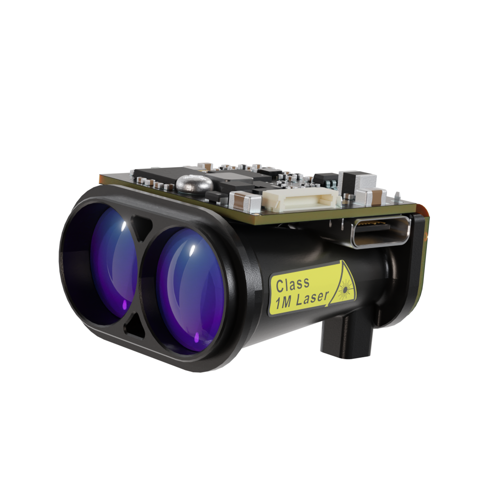

# Lightware GRF250/GRF500 Gimbal Lidar

LightWare [GRF250](https://lightwarelidar.com/shop/grf-250/) and  [GRF500](https://lightwarelidar.com/shop/grf-500/) is a small and light Lidar with a range of 250m and 500m respectively.

:::info
The lidar driver is not included in the default build of PX4.
You will need to [create and use a custom build](#add-the-driver-to-the-px4-build).
:::

## Hardware Setup

The rangefinder can be connected to any unused serial port, such as `TELEM2`.
[Parameter Configuration](#parameter-configuration) explains how to configure the port to use and the other properties of the rangefinder.

## PX4 Setup

### Add the Driver to the PX4 Build

The driver for this LiDar is not included in PX4 firmware by default.

You will need to:

1. Add the [lightware_grf_serial](../modules/modules_driver_distance_sensor.md#lightware-grf-serial) driver to firmware:
   - Install and open [menuconfig](../hardware/porting_guide_config.md#px4-menuconfig-setup)
   - In [menuconfig](../hardware/porting_guide_config.md#px4-menuconfig-setup), navigate to **Drivers > Distance sensors**
   - Select/Enable `lightware_grf_serial`
2. [Build PX4](../dev_setup/building_px4.md) for your flight controller target and then upload the new firmware.

### Parameter Configuration

You will need to configure PX4 to indicate the serial port to which the sensor is connected (as per [Serial Port Configuration](../peripherals/serial_configuration.md)) and also the orientation and other properties of the sensor.

The [parameters to change](../advanced_config/parameters.md) are listed in the table.

| Parameter                                                                                                   | Description                                              |
| ----------------------------------------------------------------------------------------------------------- | -------------------------------------------------------- |
| [SENS_EN_GRF_CFG](../advanced_config/parameter_reference.md#SENS_EN_GRF_CFG) | Set to the serial port you have the sensor connected to. |
| [GRF_UPDATE_CFG](../advanced_config/parameter_reference.md#GRF_UPDATE_CFG)    | Set the update rate                                      |

## Testing

You can confirm that the sensor is correctly configured by connecting QGroundControl, and observing that [DISTANCE_SENSOR](https://mavlink.io/en/messages/common.html#DISTANCE_SENSOR) is present in the [MAVLink Inspector](https://docs.qgroundcontrol.com/master/en/qgc-user-guide/analyze_view/mavlink_inspector.html).

Moving the sensor around at various distances from a surface will have the current_distance value change.
